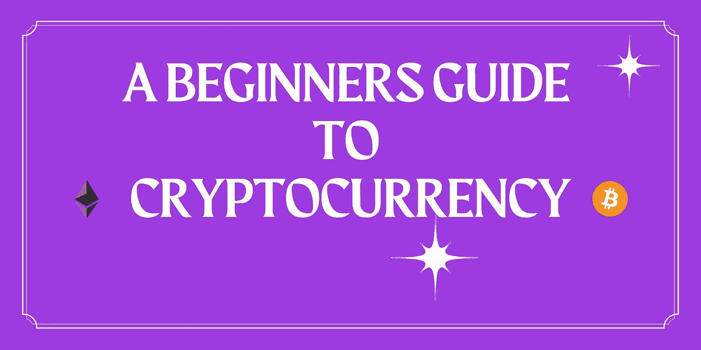

# 加密货币(比特币和以太坊)入门指南

> 原文：<https://medium.com/coinmonks/a-beginners-guide-to-cryptocurrency-72d02ea535bd?source=collection_archive---------4----------------------->

加密货币是数字货币的一种形式。你可以和其他人交换它们，也可以利用它们来达到它们被创造出来的目的。了解它们可能是一项艰巨的任务，因为有一些信息指南。所以，这里是你需要知道的关于加密货币的事情，它们来自哪里，为什么存在。简单的方法。

> “我记得有一段时间，很长一段时间，我知道自己在某种意义上有点不正常。”
> - [**维塔利科·布特林**](https://twitter.com/VitalikButerin?ref_src=twsrc%5Egoogle%7Ctwcamp%5Eserp%7Ctwgr%5Eauthor)

# 加密货币的故事

加密货币来源于两个词；密码学和货币。[密码术](https://economictimes.indiatimes.com/definition/cryptography)被定义为保护数据不被窃取的加密技术。我们大多数人所理解的货币最简单的形式是金钱。我们用它作为购买食品杂货、支付房租和几乎所有我们需要或想要的东西的交换媒介。货币已经从通过物物交换系统交易(交换商品作为支付媒介)发展到交易黄金和白银，以及今天的纸币。

比特币和以太坊等加密货币的存在有多种原因。它们允许人们利用它们来购物、投资、进行点对点(P2P)转账；以及我们今天用钱可以做的所有事情。

那么，我们为什么需要加密货币呢？

在 2008 年金融危机的混乱之后不久，第一种由化名为中本聪的个人或团体创造的加密货币发布了一份白皮书，详细介绍了比特币是什么以及它打算解决什么问题。白皮书解释说，比特币旨在被用作“电子现金的点对点版本”，无需通过银行等中间实体来促进人与人之间的交易。

# 比特币的流行

比特币通过消除生态系统中的中央权力机构或监管机构，实现了去中心化的经济。这意味着，没有一个人或机构可以“拔掉”比特币的插头，并控制其运营。创造者使用了一种比比特币早几年发明的基础技术。区块链。

虽然“区块链”这个术语是在比特币白皮书发布后几年才出现的，但白皮书中提到的术语是“*区块链*”，指的是 20 世纪 90 年代[斯图尔特·哈伯和斯科特·斯托纳塔的工作方式](https://www.icaew.com/technical/technology/blockchain/blockchain-articles/what-is-blockchain/history)。

是的，你没看错。

世界上大部分人仍然认为中本聪通过比特币的发行发明了区块链。然而，支撑比特币透明性和不变性的底层[技术在比特币问世前已经存在了近 20 年。](/@ozierkhan/blockchain-technology-the-future-of-finance-beginner-18117b5aefc5)

此外，为了将交易添加到比特币区块链，它需要通过比特币的共识算法(你会经常听到这个词)。本质上，这意味着它要求参与的计算机证明它们完成并提交的工作使它们有资格通过使用最常见的共识算法[工作证明](https://levelup.gitconnected.com/bitcoin-proof-of-work-the-only-article-you-will-ever-have-to-read-4a1fcd76a294) (PoW)来接收向区块链添加新事务的权利。

在比特币的早期，对其了解甚多的比特币先驱是世界上的“书呆子和技术人员”。他们中的大多数人是通过论坛和在线聊天群知道比特币的；而且真的只是为了好玩才开采比特币，很像《生活大爆炸》 [*中的一集:比特币的纠结*](https://bigbangtheory.fandom.com/wiki/The_Bitcoin_Entanglement) *。*

***趣闻*:**2010 年，拉兹洛·汉耶茨(Laszlo Hanyecz)首次创造了比特币的商业交易记录，他用 10，000 个比特币从[棒约翰(Papa John's)购买了两个披萨(价格为 30 美元)](https://cryptopotato.com/10-years-ago-2-pizzas-for-90-million-worth-of-bitcoin/),价值约为今天的 3.8 亿美元。

Laszla’s 10,000 Bitcoin Purchase

# 以太坊的分散经济

以太坊通常被称为市值排名第二的加密货币，仅次于比特币。然而，与比特币不同的是，以太坊不仅仅是一种交易媒介。相反，以太坊称自己是一个基于区块链技术的分散式计算网络。

让我们解开这是什么意思。

以太坊本身是一个完全不同的庞然大物，它是数字货币、全球支付和应用的代表。相比比特币，我们其实更知道以太坊的创始人和创造者是谁。加密行业最广为人知的以太坊联合创始人是[维塔利克·布特林](https://vitalik.ca/)。他在 2013 年以一个想法开始了以太坊，后来得到了当今加密社区中其他几位有影响力的个人的帮助。2016 年以太坊终于找到了它的生产版本，并展示了一个新的关于区块链功能的“[前沿](https://www.coindesk.com/ethereum-decentralized-app-network-launch)”。

以太坊受到了 Vitalik 的想法的影响，即区块链不仅可以用来促进和监控点对点交易。

和比特币一样，以太坊的风气是开源和去中心化。它的平台是志同道合的人聚集在一起达成共识的地方。[共识](https://ethereum.org/en/developers/docs/consensus-mechanisms/#:~:text=Consensus%20mechanisms%20(also%20known%20as,work%20together%20and%20stay%20secure.&text=In%20recent%20years%2C%20new%20consensus,the%20state%20of%20the%20network.)是以太坊生态系统中的人们之间达成的证明或否定的协议；并同意或不同意即将到来的升级，如最近的一次， [EIP-1559 伦敦 hard fork](https://www.coindesk.com/ethereum-hotly-anticipated-london-hard-fork-is-now-live)；在以后的文章中会有更多的介绍。

以太坊和比特币有什么不同？

以太坊是独一无二的，从某种意义上说，任何有以太坊开发语言经验的人都可以在以太坊区块链的基础上用智能契约构建一个去中心化的应用。简而言之，智能合约是在区块链上运行的预定条件，当这些预定条件得到满足时，可以自动执行任何流程。去中心化的应用有很多形式，比如游戏、NFT(不可替代的代币)和支付系统等等。

*感谢收听，任何观点的表达(可能随时更改，恕不另行通知)都是我(作者)个人的，我(作者)不保证所提供的任何信息或分析的准确性或完整性。*

**在 Twitter 上关注我:** [0x_idkCrypto](https://twitter.com/0x_idkcrypto)

> 加入 [Coinmonks 电报频道](https://t.me/coincodecap)，了解加密交易和投资

## 也阅读

 [## 最佳加密交易所| 2021 年十大加密货币交易所

### 加密货币交易所的加密交易需要了解市场，这可以帮助你获得利润…

blog.coincodecap.com](https://blog.coincodecap.com/crypto-exchange)  [## 2021 年 9 大最佳加密借贷平台

### 当谈到加密货币贷款时，大量因素等同于良好的收入状况。此外，借款的一部分…

blog.coincodecap.com](https://blog.coincodecap.com/crypto-lending)