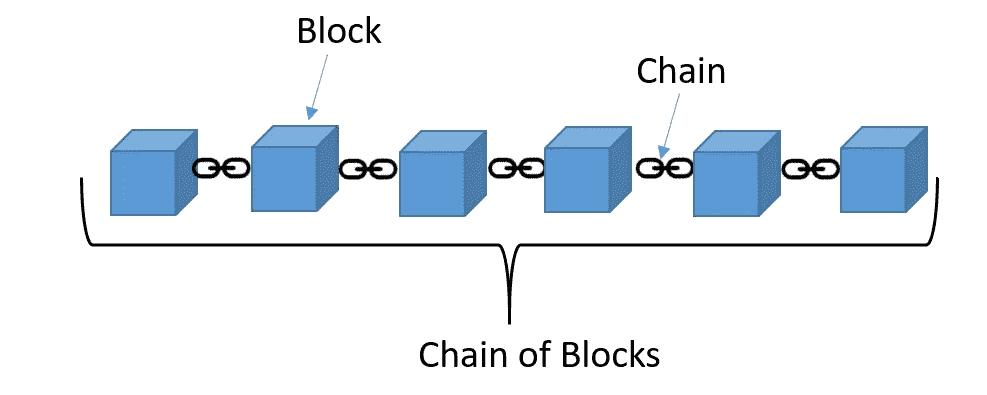
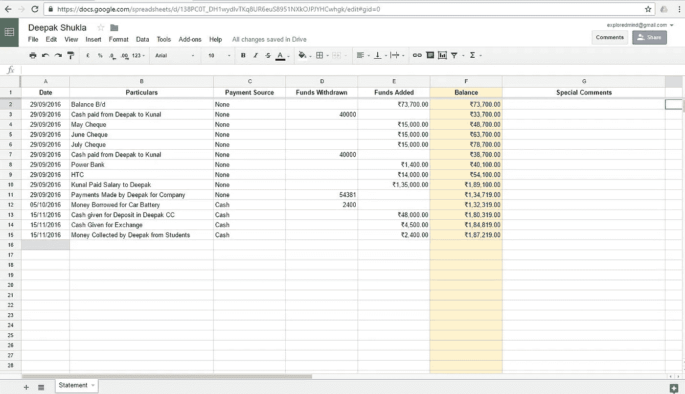
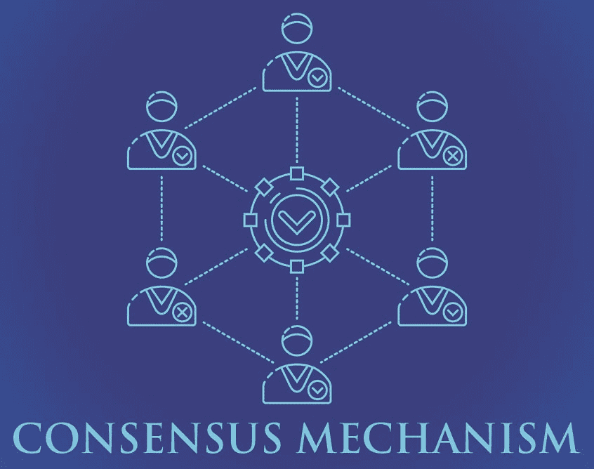
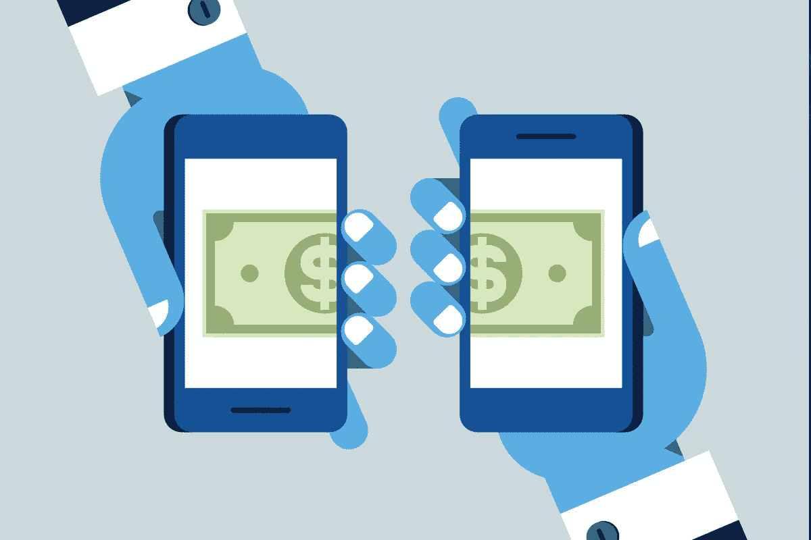

# 理解区块链的初学者指南(第 1 部分:区块链技术介绍)

> 原文：<https://medium.com/coinmonks/a-beginners-guide-to-investing-in-crypto-74781455645?source=collection_archive---------6----------------------->

本着先了解你(想)投资什么再投资的精神，我现在将尝试以一种非常适合初学者的方式帮助你更好地了解区块链。

## **T3【区块链】概述 **

简单来说，区块链是一种存储事务或数据的数据结构。链中的每个块都包含一条独特的数据或信息。这些模块组合成一个完整的链，就像一个巨大的数字分类账(记录交易的账户集合)。

在更高的层面上，区块链是由一个计算机网络(或者我们称之为节点)组成的，本质上是交易的公共数据库，每个人都可以在任何时候添加或查看。数据不是驻留在单一的中央服务器上，而是在全球成千上万的节点上复制，允许每个节点访问这个事务数据库。

这从本质上赋予了区块链去中心化的本性。

在较低的层次上，在每个区块链中，交易被汇编成称为“块”的数据保存工具。曾经执行过的每个块的连续字符串构成了一个区块链:一个按时间顺序排序的分布式事务数据库。

This is what a blockchain would look like. Source: coinmonks

如果你在这一点上很困惑，不要放弃——我将在接下来的段落中画出一些与现实世界的类比，以帮助你更好地理解区块链到底是什么，所以请继续阅读！

## ***揭秘区块链***

为了帮助你更好地理解区块链到底是怎么一回事，**把区块链想象成一个** **巨人，共享谷歌 Excel 表格**(想想你在谷歌表格中参与的所有合作项目！)每个人都可以获得读权限。这意味着互联网上的任何人都可以*查看*这张表上记录的所有交易，因为它没有读取访问的访问要求。

The blockchain can be thought of as a giant Google Sheet of multiple transactions. Source: [https://stackoverflow.com/](https://stackoverflow.com/)

然而，对于文档的*编辑-访问*(如果您想在文档上添加事务，而不仅仅是查看)，将需要一个更复杂的过程。因为*每个人*和*任何人*都可以访问该文档，所以如果没有适当的系统来阻止恶意行为者，他们所有人*都获得编辑访问将是不安全的。*

如果是这种情况，任何人都可以为了个人利益编辑文档，和/或引起混乱和困惑，因为任何给定的更改都会在连接到该文档的所有计算机上反映出来。

那么，我们如何**在一个系统中培养信任呢？在这个系统中，用户不能互相信任**,因为任何人和每个人都可以访问它。

任何添加到谷歌表单上的交易都必须首先得到*网络中所有*用户(在文档上)的同意。换句话说，整个网络的用户必须首先达成*共识*，才能将任何交易添加到文档中。只有在网络上的每个人都首先*检查过*所有提议的新交易之后，它们才能被添加到文档中，当然前提是每个人都*批准*。

所以现在你可能想知道——如果没有一个中心或中介方在网络中的用户之间进行协商和联络，我们究竟如何做到这一点？

这是通过一个叫做*共识机制*的东西来完成的，所有的区块链都会有。这种“共识机制”是我将在下一篇文章中深入探讨的内容(您可以在此处查看)，因此现在对这一概念有一个大致的了解就足够了:所有区块链都有一个内置的机制来帮助他们的用户网络对添加到文档中的新交易进行验证并达成共识(通过投票)。

Visual representation of a consensus mechanism. Source: [www.linkedin.com/pulse/](https://www.linkedin.com/pulse/unraveling-consensus-mechanisms-luis-wester/)

## ***区块链的特点***

综上所述，我们意识到也不需要一个中央实体来帮助任何事情，因为区块链在功能上是自给自足的，这在很大程度上要归功于共识机制。

我们也意识到没有一个单独的团体可以控制或审查这个谷歌表单，因为没有人能够从每一台可以访问这个表单的电脑上删除这个共享的文档。

假设有人成功地从 1000 台计算机中删除了这个 excel 表格，那么将会有 1000 多台计算机仍然可以访问它！几乎不可能删除这份文件，以你想要的方式控制这份文件，或者以某种方式阻止人们访问它。

因此，区块链可以解释为 ***分权*** 或分布式账本，其中权力*分布和扩散在各个实体*中，而不是*集中在少数*手中。随之，它们也变成了*。*

*谷歌资产负债表还确保了没有人能够在其他人不知道的情况下篡改交易历史，因为再次强调——每个人都可以访问同一份文件将意味着完全 ***透明*** 。如果有人改变了纸上的某个数字，每个人都能看到。如果这种改变是恶意的，其他人可以通过简单的*控制来拒绝这种改变。**

*外推至区块链的想法，这揭示了区块链的两个关键特征:*和 ***不变性*** (你不能随心所欲地改变上面的东西，因为其他人会知道，他们可能会拒绝)。**

**综上所述——我们了解到大多数区块链将拥有 **5 个关键属性**来防止他们被权力中心控制或滥用。它们是:**

1.  ***分散式***
2.  ***防审查***
3.  ***透明***
4.  ***显窃启***
5.  ***不可变***

## *****为什么需要区块链(或分布式系统)？*****

**一个分散的谷歌表单(区块链)与一个只有一个中央实体可以访问的集中的谷歌表单形成了鲜明的对比。**

**例如，所有银行都有一个分类账，或谷歌表，在上面他们跟踪和记录交易。这里的区别在于，银行是唯一对 excel 表有编辑权限的*方。*其他任何人*都不能访问这个 Google Sheet 文档——即使是“查看”或“编辑”权限也不行(不包括您自己事务的查看权限，它只代表整个文档的一小部分)！***

*让我们通过两个努力工作的工薪阶层爱丽丝和鲍勃的故事，来看看这样一个中央集权的系统是如何运作的。*

*如果 Alice 想通过银行给 Bob 汇钱，银行是唯一一个从 Alice 的账户中取钱，把钱存入 Bob 的账户，然后更新 excel 表的银行。我们也无法看到整个 excel 表格，只有一小部分与我们有关(我们自己的银行账户)。*

*如果银行想做任何恶意的事情，比如把爱丽丝的钱转给自己，骗取爱丽丝和鲍勃的血汗钱，没有人能够阻止他们这样做。见鬼，可能没有人甚至*知道*这个恶意行为，或者能够证明它！*

*或者说，银行因为某种原因不喜欢鲍勃。他们想阻止他拿到钱。他们可以——不管他们能想出什么样的理由——冻结这笔交易，这样它就不会到达 Bob 的账户。没有人能比银行对此有更大的发言权！只有他们拥有最终的否决权。*

*如果愿意，他们甚至可以冻结 Bob 的整个账户，这样 Bob 甚至不能动用他的剩余资金。这是中央集权制度的问题，也是区块链试图对抗和颠覆的。*

## ****加密货币****

*回顾一下上一篇文章(如果你还没有读过，你可以在这里访问它):另一方面，加密货币指的是**数字价值商店**，可以用来买卖商品、服务或财产——就像你对现实世界的货币所做的那样！把它们想象成你的新加坡元、美元等。，只是他们的一个数字和不受监管的版本。*

*比如你想从商店买一杯咖啡，你会用你的新币或者美元去*兑换*来换。你将拿出你的纸币或硬币(货币)，并把它们递给柜台的收银员，以换取你的一杯咖啡。这就是货币的功能——**价值储存，可以兑换成你想要得到或消费的东西。***

*这也正是加密货币，只是现在，这种货币不再有物理表现形式。不再有实物纸币和硬币；加密货币是纯数字的，只存在于虚拟世界中，在虚拟世界中，你必须使用应用程序来交换商品或服务。然而，它们作为价值储存手段的主要目的并没有改变。*

**

*Cryptocurrencies as digital currencies. Source: [www.cio.com](http://www.cio.com)*

*这些数字货币受到密码保护(我将在未来的文章中进一步阐述这一点)以防止欺诈行为，并且通常**不由任何中央权威机构**发行或控制，因为加密货币世界的最终目标是去中心化、隐私和安全。*

*总之，加密货币有三个关键属性**将它们与我们习以为常的普通货币区分开来。加密货币包括:***

1.  **权力下放**
2.  **私人(化名)**
3.  **安全**

## ****区块链 VS 加密货币****

*在这个节骨眼上，加密货币和区块链之间的本质差异对你来说应该是非常明显的，直觉上也是如此。*

*如果不是，请这样想:**区块链是美国联邦银行，而加密货币是美元。***

*它们是完全不同的实体，永远不应该混为一谈！*

*区块链是允许加密货币成为*去中心化、私有(化名)*和*安全*的底层技术，而这两者**存在于生态系统的非常不同的层面**(把区块链想象成各种加密货币的温床)。*

*当然，关于区块链还有很多需要了解的地方，为什么人们会想在这里投资，所以请继续阅读，了解更多！*

**上一页:* [*加密入门:到底什么是‘加密’*](https://derekklim.medium.com/a-beginners-guide-to-investing-in-crypto-70b2fb10fdff)*

**接下来:* [理解区块链的入门指南(第二部分:区块链共识机制)](https://derekklim.medium.com/a-beginners-guide-to-understanding-the-blockchain-part-2-blockchain-consensus-mechanisms-f2900b967b69)*

> *加入 [Coinmonks 电报频道](https://t.me/coincodecap)，了解加密交易和投资*

## *另外，阅读*

*   *[什么是保证金交易](https://blog.coincodecap.com/margin-trading) | [美元成本平均法](https://blog.coincodecap.com/dca)*
*   *[3 商业评论](/coinmonks/3commas-review-an-excellent-crypto-trading-bot-2020-1313a58bec92) | [Pionex 评论](/coinmonks/pionex-review-exchange-with-crypto-trading-bot-1e459d0191ea) | [Coinrule 评论](/coinmonks/coinrule-review-2021-a-beginner-friendly-crypto-trading-bot-daf0504848ba)*
*   *[莱杰 vs n rave](/coinmonks/ledger-vs-ngrave-zero-7e40f0c1d694)|[莱杰 nano s vs x](/coinmonks/ledger-nano-s-vs-x-battery-hardware-price-storage-59a6663fe3b0) | [币安评论](/coinmonks/binance-review-ee10d3bf3b6e)*
*   *[Bybit Exchange 审查](/coinmonks/bybit-exchange-review-dbd570019b71) | [Bityard 审查](/coinmonks/bityard-review-7d104239be35) | [CoinSpot 审查](https://blog.coincodecap.com/coinspot-review)*
*   *[3 commas vs Cryptohopper](/coinmonks/3commas-vs-pionex-vs-cryptohopper-best-crypto-bot-6a98d2baa203)|[赚取加密利息](/coinmonks/earn-crypto-interest-b10b810fdda3) | [网格交易机器人](https://blog.coincodecap.com/grid-trading)*
*   *最好的比特币[硬件钱包](/coinmonks/the-best-cryptocurrency-hardware-wallets-of-2020-e28b1c124069?source=friends_link&sk=324dd9ff8556ab578d71e7ad7658ad7c) | [BitBox02 回顾](/coinmonks/bitbox02-review-your-swiss-bitcoin-hardware-wallet-c36c88fff29)*
*   *[block fi vs Celsius](/coinmonks/blockfi-vs-celsius-vs-hodlnaut-8a1cc8c26630)|[Hodlnaut 审核](/coinmonks/hodlnaut-review-best-way-to-hodl-is-to-earn-interest-on-your-bitcoin-6658a8c19edf) | [KuCoin 审核](https://blog.coincodecap.com/kucoin-review)*
*   *[Bitsgap 审查](/coinmonks/bitsgap-review-a-crypto-trading-bot-that-makes-easy-money-a5d88a336df2) | [Quadency 审查](/coinmonks/quadency-review-a-crypto-trading-automation-platform-3068eaa374e1) | [Bitbns 审查](/coinmonks/bitbns-review-38256a07e161)*
*   *[加密复制交易平台](/coinmonks/top-10-crypto-copy-trading-platforms-for-beginners-d0c37c7d698c) | [Coinmama 评论](/coinmonks/coinmama-review-ace5641bde6e)*
*   *[印度比特币交易所](/coinmonks/bitcoin-exchange-in-india-7f1fe79715c9) | [比特币储蓄账户](/coinmonks/bitcoin-savings-account-e65b13f92451)*
*   *[CoinDCX 评论](/coinmonks/coindcx-review-8444db3621a2) | [加密保证金交易交易所](https://blog.coincodecap.com/crypto-margin-trading-exchanges)*
*   *[CoinLoan 审核](/coinmonks/coinloan-review-18128b9badc4) | [YouHodler 审核](/coinmonks/youhodler-4-easy-ways-to-make-money-98969b9689f2) | [BlockFi 审核](/coinmonks/blockfi-review-53096053c097)*
*   *最好的[加密税务软件](/coinmonks/best-crypto-tax-tool-for-my-money-72d4b430816b) | [硬币追踪评论](/coinmonks/cointracking-review-a-reliable-cryptocurrency-tax-software-5114e3eb5737)*
*   *最佳[加密借贷平台](/coinmonks/top-5-crypto-lending-platforms-in-2020-that-you-need-to-know-a1b675cec3fa) | [杠杆令牌](/coinmonks/leveraged-token-3f5257808b22)*
*   *最佳[加密制图工具](/coinmonks/what-are-the-best-charting-platforms-for-cryptocurrency-trading-85aade584d80) | [最佳加密交易所](/coinmonks/crypto-exchange-dd2f9d6f3769)*
*   *[如何在印度购买比特币？](/coinmonks/buy-bitcoin-in-india-feb50ddfef94) | [WazirX 审核](/coinmonks/wazirx-review-5c811b074f5b) | [HitBTC 审核](/coinmonks/hitbtc-review-c5143c5d53c2)*