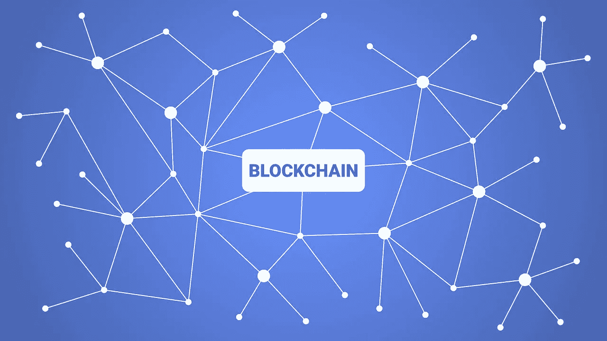
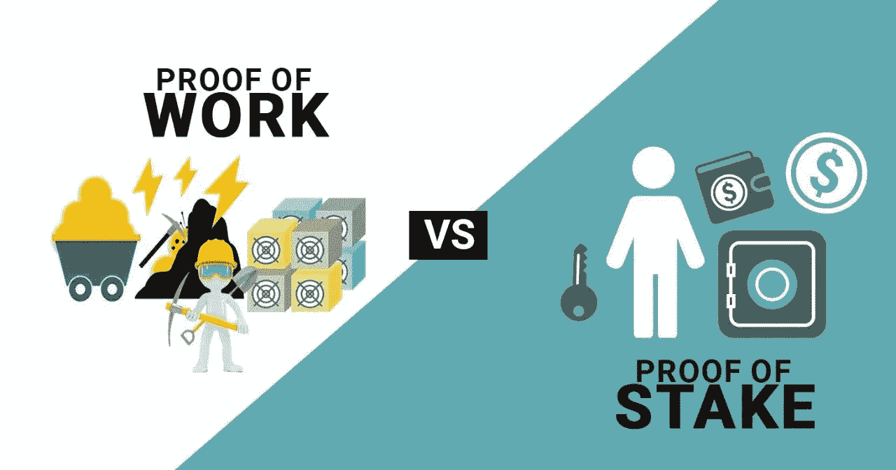
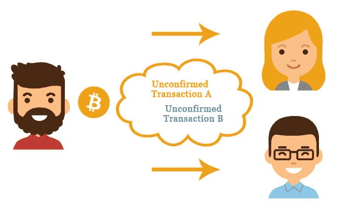

# 理解区块链的初学者指南(第 2 部分:区块链共识机制)

> 原文：<https://medium.com/coinmonks/a-beginners-guide-to-understanding-the-blockchain-part-2-blockchain-consensus-mechanisms-f2900b967b69?source=collection_archive---------0----------------------->

Source: [https://www.logicsolutions.com/](https://www.logicsolutions.com/)

## ***和区块链*的共识**

正如上一篇关于区块链的文章中提到的(如果你还没有的话，在这里访问它),共识是任何区块链或分布式系统的核心概念。

## 为什么会这样呢？

请这样想:在一个正常的中央集权组织中，所有的决策都是由一个领导者、一群领导者或一个决策者委员会做出的。在这种情况下，不需要在整个组织中的*所有各方*之间达成一致，因为决策权属于高层领导。权威人士将为每个人做出最终决定。

相比之下，区块链是分散的系统，完全点对点，没有中央权威人物或第三方来做决定。虽然这种系统有其优点，即它们不容易被单一来源破坏，并且有更多的冗余来防止单点故障，但它们也有其问题。

在这样一个系统中，没有对进入和离开系统的的*类型和*数量的限制，任何人和每个人都可以在他们喜欢的时候进入和离开这个网络，那么用户怎么能作为一个集体做出任何决定呢？没有人能够信任彼此，因为他们对彼此的背景一无所知！**

## 那么，他们怎么可能完成任何事情呢？

这就是共识概念最重要的地方——只有通过这样的*群体决策过程*,群体成员发展并同意支持符合整体最佳利益的决定，区块链的任何事情才能完成。

但是，如果没有一个专门的、核心的第三方来监督这样一个脆弱的行动，如何能够达成这样的共识呢？我们在这里谈论的是**帮助无限数量的不信任用户达成共识**——如果没有人监督一切，肯定不可能做到这一点？

实际上有一种方法，是的，你猜对了——我们可以通过共识机制来做到这一点！

*在这一点上，如果你还没有读过我以前写的关于区块链的文章，请在继续下一节之前点击* [*链接*](https://derekklim.medium.com/a-beginners-guide-to-investing-in-crypto-74781455645) *阅读，否则你肯定会迷失在下一节中！*

## ***信任与不信任区块链:共识机制***

用最简单的话来解释，区块链的共识机制是一个群体中不同的各方(他们不知道，也不信任彼此)在没有任何第三方参与的情况下达成协议的方法。

在区块链世界，有许多不同的共识机制。主要包括但不限于:

1.  *工作证明*
2.  *股权证明*
3.  *活动证明*
4.  *空间验证*
5.  *经过时间证明*
6.  *授权证明*
7.  *视角验证*

尽管它们听起来截然不同，但所有这些机制都服务于相同的最终目的:**确保区块链上的交易记录是真实和诚实的，其中所有参与者都同意交易历史。**

他们之间的区别在于达成这种共识的方式。

为了不使您负担过多的信息，本文将只关注 ***工作证明* (POW)** 和 ***利益证明* (POS)** 共识机制。

Source: [https://timestampmag.com/](https://timestampmag.com/)

## *工作证明*

*在利用 POW 机制的区块链中，建立了提议者和投票者系统，以确保没有一个用户或一组用户可以自己做出任何决定。这种孤立的决策永远不会对网络有益，因为它们可能符合所述用户/用户组的自身利益。*

*取而代之的是，对分类帐(或谷歌工作表，如前一篇文章所述)的更新是由一个用户一次提出的，网络中的其他用户将投票决定是否接受该提议。*

*任何想要在这个区块链上进行交易的用户将交易发送给整个网络中的每个人，而不仅仅是交易的接收者。然后，网络上的每个人都根据他们看到的交易是否有效来投票。只有收到一定数量的投票，比如说*多数票*，交易才会被保存。*

*这保护了集体免受任何恶意行为，因为每个人都将在将交易记入分类帐之前验证交易。看来我们的共识问题已经解决了！*

**

*What a double spend looks like. Source: [https://www.chowles.com/](https://www.chowles.com/)*

*唉，有一个我们忽略了的致命缺陷:如果一个恶意用户用他创建的多个身份涌入区块链网络，以投票支持他的恶意交易(通常是一个[双重消费攻击](https://www.investopedia.com/terms/d/doublespending.asp))呢？这将从根本上摧毁区块链。*

*例如，想象一下，如果一个网络中 51%或更多的用户(因此是网络的大多数)都由同一个实体控制，这将意味着所述实体提出的任何交易，无论是恶意的还是诚实的，都将*总是*被区块链接受，从而破坏网络的完整性。*

*这种通过用多个身份淹没网络来压倒投票系统的方法被称为*Sybil 攻击，是分布式系统上更常见的攻击媒介之一。**

**Sybil 攻击只可能发生在几乎没有投票成本的网络中。在这种情况下，投票不再有任何价值，因为任何有空闲时间的人都可以想做多少身份就做多少身份。在这样的网络中，永远无法达成真正的共识。**

**这就是 POW 中的'*工作*发挥作用的地方。**

**为了解决这个问题，我们必须让投票变得昂贵。我们必须使任何试图投票的人都拥有与其他人同等的投票权，不管他们有多少不同的身份。**

**因此，每一票都必须用资源——稀缺、宝贵、有形的资产——来投。让我们以比特币为例(因为它利用了 POW 共识)来更好地理解这一点。**

**在他的白皮书中，中本聪(比特币的创始人)设想了一个“1 CPU 1 投票”的网络，而不是传统的“1 身份 1 投票”系统，以防止 Sybil 攻击在比特币网络中蔓延。**

**为了做到这一点，Satoshi 将计算能力定义为用户必须提供的稀缺、有价值且有形的资源，以换取投票。**

**每当有人想向比特币网络的其他人提出建议时，他们首先必须解决一个计算上的难题。这个问题是基于所提议的块内的信息而唯一产生的，因此其解决方案无法预先预测。**

**相反，这类似于强行输入密码:你所能做的就是试错。你的计算机将尝试大量的输入，直到它找到问题的解决方案，这时它将把成功的输入连同建议的块一起提交给网络的其余部分。**

**这些把他们的计算能力借给网络的人(这样做，有助于验证网络上的交易)被称为矿工。**

**正确输入形式的不可预测性确保了矿工没有办法欺骗系统，防止他们作弊。通过让每个用户解决这个不可战胜的暴力问题，你有一个合理的期望，他们已经做了很多(计算)工作来解决这个问题。**

**通过将投票权与如此巨大的计算能力相结合，Satoshi 确保了所有用户都拥有稀缺的投票权。**

**正是这种投票和产生共识的方法使比特币成为第一种成功的加密货币。它还启发了随后几乎所有其他加密货币的投票机制(甚至是 POW 的替代品)。**

***尽管 POW 系统被许多项目采用，包括——如前所述——最受欢迎的加密货币比特币，但它仍有许多缺点。***

***例如，为了解决所有矿工在向网络添加块之前所需的计算难题，需要消耗大量的能量。这对环境造成了可怕的影响，也使得只有那些买得起强大而昂贵的电脑的人才能成为矿工(这与整个*去中心化*的说辞不符！).***

***为了解决其中的一些问题，引入了利害关系证明。***

***利益证明是一种共识机制，其中投票权与锁定在网络中的经济利益成正比，而不是计算能力和资源。每个参与者下注一定数量的本地货币(通过锁定在网络中)，每个节点被给予被选择为下一个验证者的概率，根据赌注/锁定的多少来加权。一旦选择了验证者，他们就可以提出一个有效的区块并获得奖励。***

***在这个方案中，**参与者在网络中拥有的权力受限于他们愿意下注的金额**。利害关系证明依赖于*惩罚*，而不是依赖于安全奖励(就像战俘系统所做的那样)。如果一个参与者把赌注放在不诚实的区块，他们将受到惩罚，并失去他们投入的赌注。在这种情况下，恶意行为受到的惩罚比诚实行为的收益要重得多。***

***由于恶意行为的明显后果，网络上的用户现在更加不愿意恶意行为。这种安全感来自于长期锁定资本(股权先决条件)。***

***让我们把这个应用到现实生活中。***

***想象一群寻宝者争夺一个箱子。公益金的奖励基于抽签制度。为了参与，每个猎人必须从公益金中购买彩票。***

***猎人从箱子中购买彩票的行为代表了将验证者的货币押入/锁定到网络中。每个猎人买的越多，赢的几率就越高。相应地，参与者在网络赌注中使用的本地货币越多，他/她就有越大的机会来验证新的区块，并在这样做时获得奖励。***

***总之，利益证明是一种特殊类型的共识机制，它假定所有投票权都与财务资源相关联。***

***从根本上说，这个想法是:一个参与者在一个利益相关系统中持有的代币或货币越多，他们成为这个系统的好管家的动机就越强；如果系统增长，演员变得越富有。***

***因此，在利害关系证明中，我们给予这些个人作为验证者的最大权力，因为我们相信他们不希望网络受到任何伤害。***

***Prev: [理解区块链的初学者指南(第一部分:区块链是如何工作的？)](https://derekklim.medium.com/a-beginners-guide-to-investing-in-crypto-74781455645)***

***接下来:[理解区块链的入门指南(第三部分:智能合约)](https://derekklim.medium.com/a-beginners-guide-to-understanding-the-blockchain-part-3-smart-contracts-39166dbe7577)***

> ***加入 [Coinmonks 电报频道](https://t.me/coincodecap)，了解加密交易和投资***

## ***另外，阅读***

*   ***[尤霍德勒 vs 科恩洛 vs 霍德诺特](/coinmonks/youhodler-vs-coinloan-vs-hodlnaut-b1050acde55a) | [Cryptohopper vs 哈斯博特](https://blog.coincodecap.com/cryptohopper-vs-haasbot)***
*   ***[币安 vs 北海巨妖](https://blog.coincodecap.com/binance-vs-kraken) | [美元成本平均交易机器人](https://blog.coincodecap.com/pionex-dca-bot)***
*   ***[如何在印度购买比特币？](/coinmonks/buy-bitcoin-in-india-feb50ddfef94) | [WazirX 审核](/coinmonks/wazirx-review-5c811b074f5b) | [BitMEX 审核](https://blog.coincodecap.com/bitmex-review)***
*   ***[比特币主根](https://blog.coincodecap.com/bitcoin-taproot) | [Bitso 评论](https://blog.coincodecap.com/bitso-review) | [排名前 6 的比特币信用卡](/coinmonks/bitcoin-credit-card-bc8ab6f377c6)***
*   ***[双子座 vs 比特币基地](https://blog.coincodecap.com/gemini-vs-coinbase) | [比特币基地 vs 北海巨妖](https://blog.coincodecap.com/kraken-vs-coinbase) | [硬币罐 vs 硬币点](https://blog.coincodecap.com/coinspot-vs-coinjar)***
*   ***[印度比特币交易所](/coinmonks/bitcoin-exchange-in-india-7f1fe79715c9) | [比特币储蓄账户](/coinmonks/bitcoin-savings-account-e65b13f92451) | [Paxful 点评](/coinmonks/paxful-review-4daf2354ab70)***
*   ***[杠杆令牌](/coinmonks/leveraged-token-3f5257808b22) | [最佳密码交易所](/coinmonks/crypto-exchange-dd2f9d6f3769) | [密码交易机器人](https://blog.coincodecap.com/best-crypto-trading-bots)***