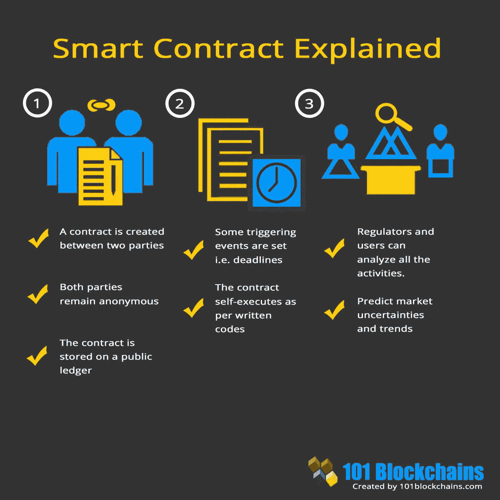
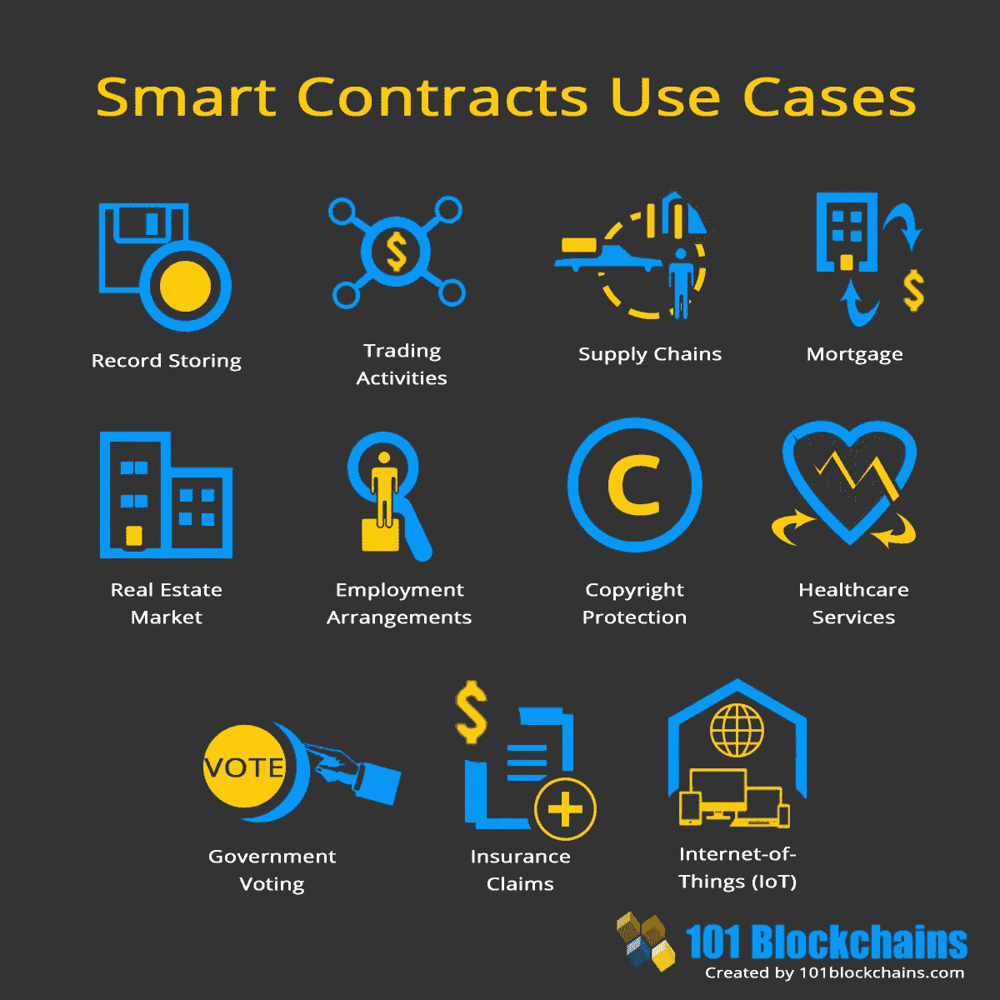

# 理解区块链的初学者指南(第 3 部分:智能合同)

> 原文：<https://medium.com/coinmonks/a-beginners-guide-to-understanding-the-blockchain-part-3-smart-contracts-39166dbe7577?source=collection_archive---------6----------------------->

A quick summary of Smart Contracts. Source: [www.academy.shrimpy.io](http://www.academy.shrimpy.io)

现在，你应该对区块链的主要特征和区块链的工作方式有了更好的了解(*如果你不了解，请通读我的区块链指南*的 [*第一部分*](https://derekklim.medium.com/a-beginners-guide-to-investing-in-crypto-74781455645) *和* [*第二部分*](https://derekklim.medium.com/a-beginners-guide-to-understanding-the-blockchain-part-2-blockchain-consensus-mechanisms-f2900b967b69) *)，我将更深入地了解你在区块链/加密之旅中经常遇到的某些概念。*

如果你还记得我以前对区块链技术的讨论，我主要用比特币作为类比来阐述区块链的某些属性和结构。

正因为如此，你可能会认为区块链只是用来在一个分散的分布式账本上记录个人之间的加密货币交易，这个账本是不可变的，完全透明的。

虽然区块链分散的、不变的和完全透明的特征在大多数情况下可能成立，但在其他一些情况下(私人的或许可的区块链，我将在第四部分讨论)它们并不成立。

同样，虽然关注个人之间的交易在许多情况下也是正确的，但在许多其他情况下却不是。有许多区块链允许用户与另一个实体完全交互:智能合同。

换句话说，区块链不仅可以在不可信的环境中验证交易，还可以执行智能合约。

***什么是合同？***

为了理解什么是智能合同，我们首先必须从最开始说起——传统的、约定的合同。

我确信你们都非常熟悉“合同”这个术语，它的意思是“旨在通过法律手段强制执行的书面或口头协议”。

在现实世界中，我们无时无刻不在与合同打交道。当我们想买车时，我们必须签合同。当我们想租房或买房时，必须签订合同。当我们签约就业时，必须签订另一份合同。

这些合同中规定的条款和条件通常由一方起草，然后由另一方阅读、核实和同意。这些条款和条件将被一方或双方遵守。如果任何人违反了合同中的规则，另一方可以通过法律途径寻求惩罚，并通过聘请中介对违法者执行法律。

为了维护这些合同，将需要大量资源(文书工作、聘请法律代表的资金、作为中介的人力资源)。这可能是一个极其耗费时间和金钱的过程。

Visual representation of a traditional contract being executed. Source: [https://dzone.com/](https://dzone.com/)

而且，怎么能确定知道什么时候毁约呢？有时没有办法发现，直到为时已晚。

在这里，我们看到传统合同的两个主要问题:

1.  *时间和资源密集型*
2.  *任何人都无法正确核实合同是否得到履行*

这就是智能合约的用武之地。

***什么是智能合约？***

简单来说，智能合约是存储在区块链上的程序，当某些预先确定的条件得到满足时，它们会自动执行。

如果你还记得，在比特币区块链中，*网络上的所有*节点将在向分类账发布任何更新之前验证传入的交易(只有最快解决计算上困难的工作证明问题的节点才能发布该更新)。

类似地，在支持智能合同的区块链上，*一旦满足预定条件，网络中的所有节点将执行智能合同中规定的动作。这些行动可以包括向适当的团体发放资金、登记房屋、发送通知或购买门票等。—所有这些都可以归类为*交易*。*

然后，当这些事务完成时，更新区块链(同样，只有最快解决计算上困难的工作证明问题的节点才能发布该更新)。从此以后，交易将不再被更改(*不可变*)，所有相关方也将能够看到自己的交易记录(*完全透明*)。

Summary of how Smart Contracts work. Source: [https://101blockchains.com/](https://101blockchains.com/)

智能合约通常用于自动执行协议，这样所有参与者都可以立即确定结果，而无需任何中介的参与或时间损失。他们还可以自动化工作流程，在条件满足时触发下一个动作以确保效率。

让我们看看所有这些在现实世界的场景中是如何进行的。

假设约翰想把房子卖给瑞秋，但不确定瑞秋是否会付钱给他。他可以在支持智能合约的区块链(例如以太坊)上与 Rachel 建立智能合约，列出一些条款和条件，确保他总能获得报酬。

例如，约翰可以通过编写一些简单的代码，在智能合同中创建一个条款，规定象征所有权的房屋地契只能在瑞秋通过区块链支付给他之后才发放给她。

这也有利于雷切尔，她也会放心地向约翰支付这笔钱，因为智能合同中规定的这些行为一旦达成一致就不能改变或撤销(这意味着一旦雷切尔支付，房契将 100%发放给她)。

***智能合约的好处***

从这个小场景中，我们可以看到智能合同如何带来比传统合同更多的额外价值。

1.  **时间:**它为相关各方节省了大量时间，因为它减少了对中间人(中间人/妇女)和文书工作的需求。这些通常会分别花费大量的时间来协商、协调和填写。
2.  **成本:**同样，由于省去这些中介和文书工作，成本也大幅降低。
3.  高效:**由于它们是以代码形式编写的，一旦条件得到满足，这些合同几乎会立即执行，没有传统合同中必然会发生的延迟，而是由人类参与。**
4.  **准确:**因为这些合同是由代码和算法执行的，而不是由人工执行的(这可能会出错)，所以这确保了协议会被不折不扣地执行，并且没有错误。
5.  **绑定:**它保证了任何人都不能对协议违约，因为一旦达成协议，无论预先决定的条件在什么时刻得到满足，代码算法都会执行。
6.  **透明:**由于交易记录(在执行智能合同后)将被发布到区块链总账，供所有相关方查看，因此整个过程完全透明。
7.  **安全:**由于区块链上发生的所有交易都经过密码加密，它们很难被黑客攻击或追踪。此外，区块链分类账分布在如此多的不同节点上，这使得记录几乎不可能被更改。

***智能合约用例***

现在您应该很清楚，智能合约在许多不同的情况下非常有用。

下面是一个简明的信息图(非详尽),列出了这些情况:

Source: [https://101blockchains.com/](https://101blockchains.com/)

如果你能想到更多的使用案例，欢迎在下面开始讨论！

Prev: [理解区块链的初学者指南(第 2 部分:区块链共识机制)](https://derekklim.medium.com/a-beginners-guide-to-understanding-the-blockchain-part-2-blockchain-consensus-mechanisms-f2900b967b69)

接下来: