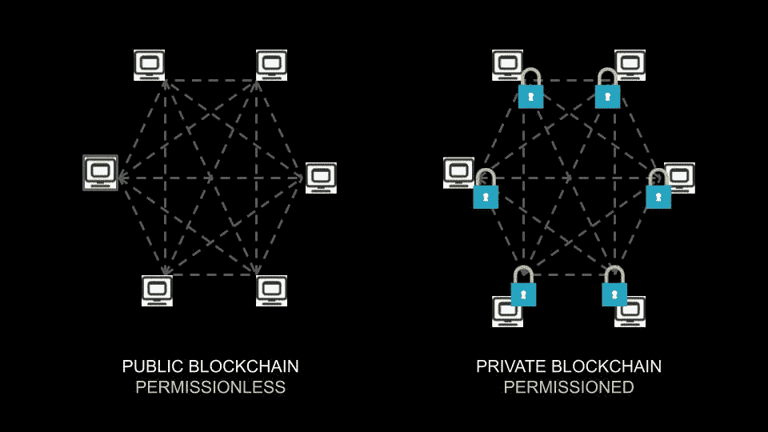
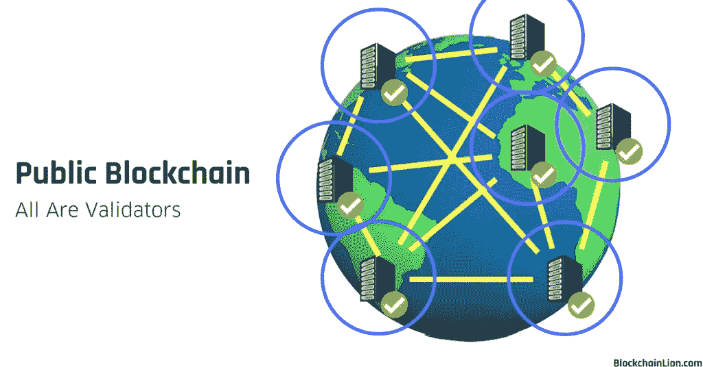
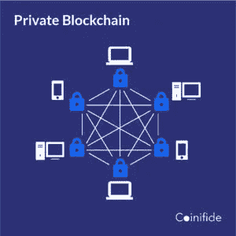
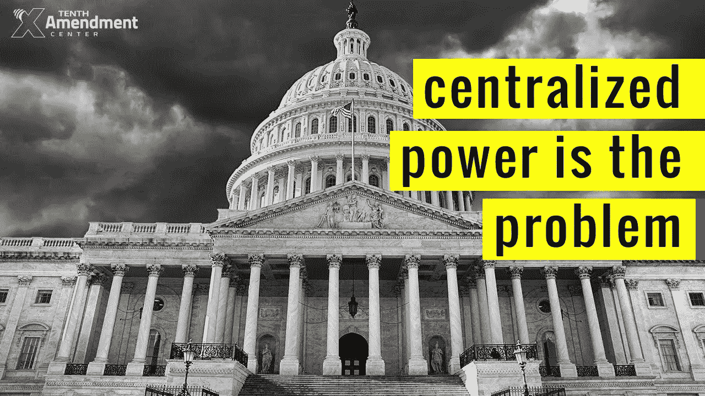

# 理解区块链的初学者指南(第 4 部分:公共与私人区块链)

> 原文：<https://medium.com/coinmonks/a-beginners-guide-to-understanding-the-blockchain-part-4-public-vs-private-blockchains-37ff950ccb47?source=collection_archive---------8----------------------->

Public VS Private blockchains, visualized. Source: [https://articonf.eu/](https://articonf.eu/)

为了简洁起见，我在以前的文章中把区块链解释为一个无形的、单一的实体。

然而现实远非如此——实际上区块链所依赖的原型和类型有一个完整的*光谱*。

这篇文章将关注你最常遇到的两种主要的区块链:*公立*和*私立*区块链。

***大众区块链***

公共区块链是您可能会遇到的最常见的区块链类型，因为顾名思义，它是公共的，因此更容易被普通公众所理解。

简单来说，公共区块链是一个没有权限的区块链网络，任何人都可以随时加入。

他们通常有 4 个关键特征:

1.  公共区块链是完全分散的，没有中央权力负责网络内的任何活动。因此，在参与上述活动时也没有任何限制。
2.  任何人都可以通过区块链账本看到这个网络中发生的所有交易。这确保了网络中发生的所有交易的完全透明。
3.  **任何人和每个人都可以不受限制地与网络中的同伴和/或其他用户进行交易。**
4.  任何人都可以参与共识过程，如果他们愿意并且有能力的话(如果你不确定什么是共识过程，请参考我的理解区块链系列的第二部分)。
5.  你将能够在完全保密的情况下进行网上交易，而不用担心任何第三方会得到你的个人信息。这是因为公共区块链网络是无许可的，所以任何验证过程都不需要你的身份，允许你保持匿名。

Source: [https://blockchainlion.com/](https://blockchainlion.com/)

***公开区块链的好处***

公共区块链的好处不言而喻，所以我不会对它们逐一进行深入研究:

1.  区块链公共网络中的每个参与者都将拥有平等的网络访问权
2.  因为每个人都能看到账本，所以这也是一个完全透明的网络
3.  这种透明性也导致网络上的交易记录不可改变

***公区块链的缺点***

然而，公开区块链也有其缺点:

*效率低下(较慢的交易速率和较低的可扩展性)*

因为任何人和每个人(无信任的参与者)都可以加入一个公共区块链网络，这个网络变成了一个信任必须被人为强制的网络。

需要集体共识，网络中的每个人都被适当地激励为共同利益而工作，而不是自私地为自己的利益而工作。这意味着一个共识机制(如果你不知道这是什么，请参考[了解区块链第二部分](https://derekklim.medium.com/a-beginners-guide-to-understanding-the-blockchain-part-2-blockchain-consensus-mechanisms-f2900b967b69))必须到位，以推动网络向前发展。

**这将降低网络上的交易速率，并导致整体效率低下，因为区块链共识机制**带来了更多的冗余，其中每个交易块在被添加到分类账之前都必须由网络上的每个节点同时进行处理和验证，而不是每个节点分别处理和验证一个块(这样效率更高)。

这里，每个新块都要做大量额外的工作，这一切都是为了保证不可信网络的安全。

这也将对公共区块链的可伸缩性产生负面影响，因为每一个事务都要耗费如此多的能量和精力。

*恶意行为者盛行*

前面提到的匿名和隐私，你可以从使用区块链公共网络中得到，实际上，这是一把双刃剑。

**这种隐私和匿名将不可避免地吸引恶意用户，他们的最终目标永远不会与集体的**一致。匿名性使得他们可以私下进行恶意行为，这使得追踪他们变得更加困难，甚至是不可能的。

当然，大多数受欢迎的公众区块链将在他们的共识机制中内置重重防御工事，以抵御这些行为者。这并不意味着他们是坚不可摧的！

Source: [https://cryptoslate.com/](https://cryptoslate.com/)

更受欢迎的公共区块链之一以太坊在 2017 年被[以高达 55，000，000 美元的价格开发。这样一个受到错综复杂保护的公共区块链能够被黑客攻击的事实确实告诉我们一件事:只要有人愿意尝试，防御工事*就能*被拆除。](https://www.coindesk.com/55m-hack-ethereum-down)

因为我们知道，永远不会缺少恶意的演员，他们为了自己的利益而利用他人，公共区块链将永远是众所周知的光源，吸引他们成群结队。

公共区块链的这些缺点使得公司和机构有必要使用另一种形式的区块链，这种形式可以为用户提供更多的保护和安全，使其免受不良行为者的侵害。

进入二等兵区块链。

Source: [www.coinifide.com/](http://www.coinifide.com/)

***私人区块链***

与公共的区块链形成鲜明对比的是，私人的区块链是完全被允许的。

只有经过网络运营实体验证和批准的少数用户才能参与其中。可以看出，对于这种区块链网络来说，有一种对 [*外围安全*](https://www.datacenterknowledge.com/archives/2017/05/12/perimeter-security-strategies-data-center-protection) 的公开关注，这在公共网络中是不存在的。

请注意，二等兵区块链也可能被称为企业区块链。这是因为企业需要确保高水平的安全性、隐私性、合规性、性能以及许多只有私人区块链才能提供的属性。

在这样的区块链中，有一个集中的机构或组织来管理网络。这个中央实体将指挥区块链网络内的所有活动。

这些活动包括但不限于:谁能与谁交易，谁能查看分类帐中的记录，谁能在分类帐中添加交易块，谁能验证交易，谁甚至能在网络上*等。*

因此，私立区块链有三个主要原则:

1.  完全允许
2.  拥有中央集权的权力
3.  在访问和网络活动方面受到严格控制

Source: [https://thriveglobal.com/](https://thriveglobal.com/)

这些特点使得私人区块链非常适合商业和/或企业。所述商业/企业将能够享受区块链技术带来的益处(透明性、不变性和隐私/匿名性)，同时仍然能够控制这些益处的体验程度。

例如，如果一家经营供应链业务的公司希望看到供应链中每个利益相关者的交易记录(透明度)，但不希望这些利益相关者可以访问这些信息(不希望透明度成为所有人都享有的功能)，他们将能够在私人区块链中对其进行管理。

***私人区块链的好处***

除了为商业和企业提供良好的服务之外，私立区块链的特殊架构还带来了其他更普遍的好处:

*效率(更快的交易速率和更大的可扩展性)*

因为私有区块链是允许的，所以任何进入网络的人都是可信的。由于网络不再在所有用户都不可信(不可信)的前提下运行，因此不需要任何共识机制来支撑网络。

不是有许多冗余，其中网络上的每个节点将对每个新的事务块进行验证，专用区块链网络可以将一个节点或一组特定的节点分配给每个块。

这代表了一种更有效的分工，工作不再重复，而是以更有条理、更平均的方式分散开来。因此，交易速度将比公共区块链快得多。

这样的区块链网络也将更加*可扩展*。资源不会像公共区块链那样被占用(将会有更多的空闲节点)，它们将可用于分配以扩展整个网络。

*降低恶意行为者的概率*

与区块链公共网络中几乎任何人都可以成为参与者不同，私有网络中的所有参与者在进入之前都要经过仔细的审查和验证。

这意味着用户的身份(或至少某种形式的身份)将被控制网络的中央机构所知，从而减少了恶意行为者试图从内部利用网络的机会，因为这将严重破坏他们的声誉。

***列兵区块链的缺点***

当然，和所有事情一样，二等兵区块链也有自己的缺点。

我认为这些缺点是不言自明的，所以我不会对每个缺点进行过多的描述。

1.  它们违背了区块链技术赖以建立的原则——去中心化和中央权力的分散。
2.  大多数人都无法接触到它们，而且往往非常排外
3.  由于控制点集中，与公共区块链的许多故障点相比，大多数私有区块链都只有一个故障点。这构成了网络的整体[容错](https://static1.squarespace.com/static/59b80e154c0dbfd18f2fe92d/t/5bae720ff4e1fc4c51de81c5/1538159124018/The+Role+of+Fault+Tolerance+for+Blockchain.pdf)的降低。

Private blockchains go against the very principles of blockchain technology: Decentralization

上一篇:[理解区块链的入门指南(第三部分:智能合约)](https://derekklim.medium.com/a-beginners-guide-to-understanding-the-blockchain-part-3-smart-contracts-39166dbe7577)

接下来: