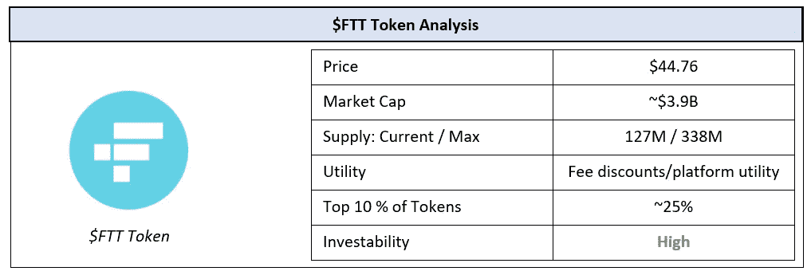
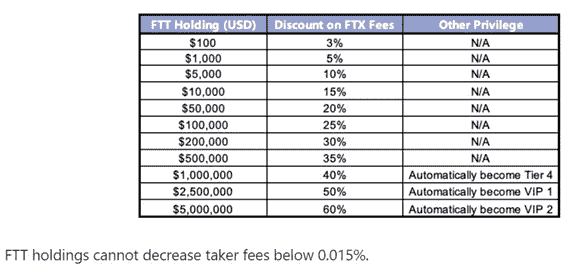
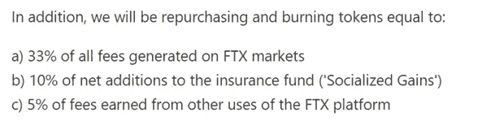
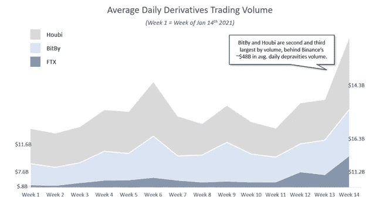
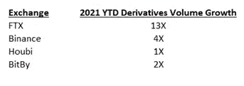
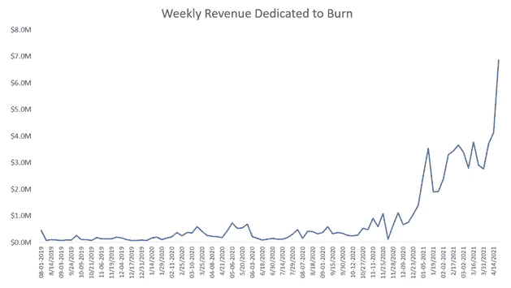
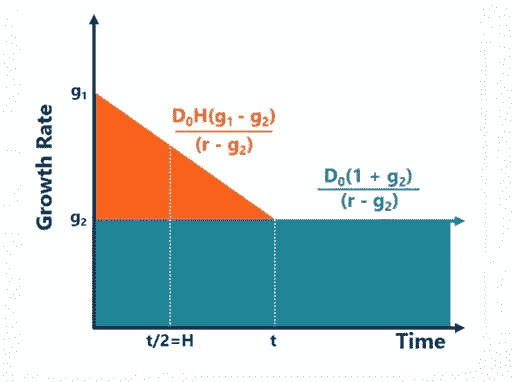
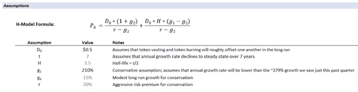
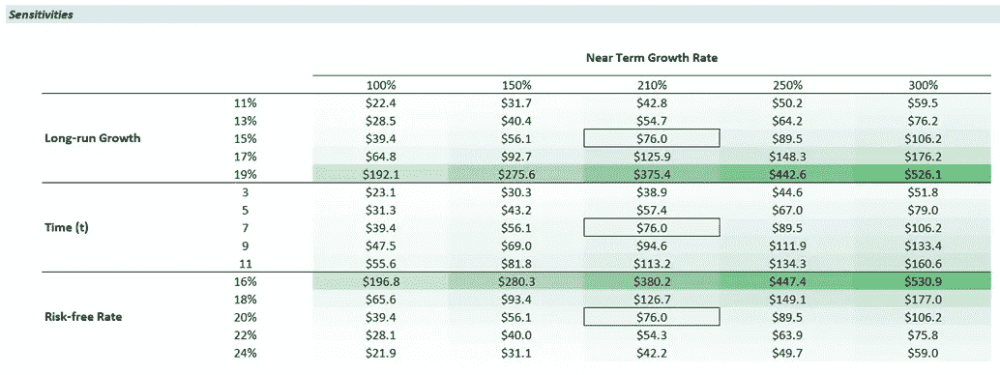

# 对未来的赌注:评估 FTX 和$FTT 代币

> 原文：<https://medium.com/coinmonks/a-bet-on-the-future-s-evaluating-ftx-and-the-ftt-token-d2a0196b4d4b?source=collection_archive---------4----------------------->

# **总结**

——FTX 以“交易者对交易者”的营销方式，迅速成为加密市场中最大的期货和衍生品交易所之一

—由于其广泛的产品范围和强大的交易所流动性，它也成为机构的首选(仅在过去四个月中，日均衍生品交易量就增长了约 13 倍)

— FTX 的$FTT 代币是一种公用事业代币，在 FTX 平台上为交易者提供折扣，以及其他平台优势

——FTX 通过使用平台费的一部分收益，每周在公开市场上购买和燃烧$FTT 代币，来奖励$持有者，这很像股权回购

—使用 H 模型(高增长公司的股息贴现模型)，**我们对 FTT 股票内在价值的保守估计是大约 76 美元(即大约 2 倍的当前交易价格)**

完整的模型可以在这里找到:【https://bit.ly/3sPxX7O 

# **概述**

随着加密货币市场的繁荣，对衍生品的需求也大幅增加。机构交易者和散户交易者都在寻找最方便、最安全的方式来对各种加密资产的价格进行杠杆化押注。2019 年，前 Jane Street 交易员和 crypto quant 交易员 Sam Bankman-Fried 正在寻找一家在流动性、产品广度和服务方面达到机构级的期货交易所。没有找到，他创造了 FTX，这个产品现在被打上了“交易者为交易者”的商标由于 Bankman-Fried 的 quant fund Alameda Research 提供的产品广度和交易所流动性，FTX 正迅速成为大多数交易者的首选平台。

像其他集中交易所(如币安)一样，FTX 创造了自己的公用事业令牌$FTT。代币允许持有人在平台上获得各种额外津贴，并通过回购平台产生的利润百分比奖励持有人。在这篇文章中，我们评估了该平台在竞争中的表现，并根据回购-烧录计划估算了$FTT 代币的内在价值。

# FTX 是如何工作的？

FTX 的产品可以分为四个关键部分:1)定期和永久期货，2)杠杆代币，3)波动性产品，4)场外交易平台。让我们深入探讨这些问题:

## **1。** **定期和永续期货**

FTX 的主要产品是定期和永久期货。交易员可以押注主要加密货币在固定时间范围内的价格走势，或者通过 FTX 的永久期货无限期滚动合约，利用 3 倍至 100 倍的杠杆。FTX 的这一产品的主要创新是它的三步清算解决方案，它在不同的价格水平调整抵押品，以避免大量的一次性收回。交易者可以押注或做空的资产包括 BTC、瑞士联邦理工学院、长期资本、EOS、XRP、ADA、LINK 等。

## **2。** **杠杆代币**

[杠杆代币](/coinmonks/leveraged-token-3f5257808b22)是 ERC-20 代币，代表对某些资产的押注或做空。通过杠杆代币，抵押品余额是自动平衡的，并且没有保证金追缴的概念，使得交易者的交易管理更加容易。

## **3。** **波动产品**

FTX 的移动合约允许交易者接触 BTC 等资产价格的波动，而不是价格本身。

## **4。** **OTC 平台**

最后，场外交易平台嵌入了 Bankman-Fried 的阿拉米达研究，允许交易者全天候访问多达 25 种加密货币。

作为提供这些服务的交换，FTX 向顾客收取一系列相对小额的交易费用。这些费用的结构如下:

—在现货和期货市场，做市商费用为 2bp，收单商费用为 7bps 随着交易商 30 天交易量的增加，制造商和接受者的这一费用分别降至 0 个基点和 4 个基点

—杠杆式令牌的创建/赎回费用为 10 个基点，每日管理费为 3 个基点

—采用 50 倍或 100 倍的杠杆可能会使这些费用分别增加 2bp 和 3bp

在 FTX 平台内，$FTT 代币持有者可以获得一系列费用折扣，并从平台收取的总费用中抽取一部分作为回购奖励。代币持有者也可以在一定程度上参与平台的治理。

# **$FTT 代币奖励**

—所有$FTT 持有者在现货和期货交易中获得费用折扣，如下所示

Source: FTX

—除此之外，选择下注 FTT 美元的持有者还有资格获得以下额外待遇

o 增加推荐回扣

o 制造商费用超额和回扣

o 奖励票

o 增加空投奖励

o 免除区块链费用(与杠杆式 ERC-20 代币互动时)

# **回购烧伤**

—除了这些平台奖励，FTX 还使用一部分费用，按照以下比例在公开市场上回购$FTT 代币并烧掉。这减少了公开市场上$FTT 的供应量，并对价格运动提供了上行压力。

Source: FTT

—每周都会购买和焚烧代币。大约 1100 万代币已经被烧掉，到目前为止，这个项目已经投入了大约 7800 万美元。

# **评估 FTX 平台和$FTT 代币**

FTX 以拥有最广泛的产品和最强的流动性而闻名。鉴于阿拉梅达的机构支持，FTX 也成为金融机构在加密领域进行杠杆押注的首选供应商。然而，最终，只有当这种声誉转化为强大的平台利用率时，$FTT 令牌才是有价值的。

在这方面，FTX 一直在与现有的参与者进行斗争，从 2021 年初处理日均衍生品交易量的 10%到本文撰写时的 78%。在衍生品交易量方面，FTX 现在很快接近第三名，仅次于比特比、侯比和币安，后者目前日衍生品交易量约为 480 亿美元。

Source: Nomics

从这个背景来看，在包括币安在内的全球四大衍生品交易商中，FTT 的日均衍生品交易量增长最为强劲。

Source: Nomics

最后，FTT 似乎看到了有机需求，前 10 大钱包占总流通供应量的 25%。这通常是需求的良好代表；顶级钱包的低集中度意味着有足够的流通供给需求来分配。

FTT 代币的有趣之处在于，持有者不会获得直接股息。相反，FTX 用部分收费在公开市场上回购代币，然后烧掉。这个想法是，这将减少流通供应量，推高现有代币的价格。自 2019 年以来，FTX 每周都完成一次代币燃烧，每周投入高达约 690 万美元，每周燃烧多达约 20 万枚代币。

Source: FTX

鉴于这些回购的规律性，用于回购的收入可以作为股息的替代。这使得我们可以使用一个股息贴现模型来估计$FTT 代币的内在价值，假设代币被烧毁，并且随着时间的推移，被投入流通的代币大致相互抵消。

与任何高增长的股息发放企业一样，估计内在价值的股息贴现模型的最审慎版本是 H 模型。H 模型背后的概念很简单:它假设高增长、发放股息的企业最终将稳定在一个适度的同比增长率上，从长期来看，大多数企业都是如此。然而，在短期内，它将继续显示高增长的股息发放，其利率将随着时间的推移线性下降，直到它定在长期增长率。这个概念看起来是这样的，其中 D0 是最近一段时间发放的股息，g1 是短期增长率，g2 是长期增长率，r 是无风险率，t 是 g1 收敛到 g2 的持续时间。

以下是我们的假设:

基于这些假设，**我们估计$FTT 代币的内在价值约为每枚 76 美元(当前交易价格的两倍)。**

重要的是要记住，H-模型是内在价值的代表，基础假设的变化会产生一系列的价值。鉴于我们的假设非常保守，基于以下敏感性分析，我们认为上行潜力远远大于下行潜力。FTX 目前在美国不受监管，不能在美国使用；如果/当它变得更容易进入美国市场，我们预计增长将相应增加。

完整的模型可以在这里找到:[https://bit.ly/3sPxX7O](https://bit.ly/3sPxX7O)

# **结论**

FTX 围绕一个平台开发了一个强大的商业模式，该平台的利用率开始出现近乎抛物线的增长。除此之外，其$FTT 代币还有一系列有价值的使用案例，这产生了有意义的需求，代币在流通中的分布就是证明。FTX 还一直使用产生的费用中有意义的份额回购和焚烧$FTT 代币，并奖励现有的$FTT 代币持有者。最后，我们的股息贴现模型表明，在极端保守的假设下，FTT 股票的内在价值约为 76 美元(约为当前交易价值的 2 倍)。基于所有这些因素，我们认为$FTT 代币是与集中交易相关的最强代币之一，并且有很大的增长空间。

在推特上关注我们 [@ClearChainCap](https://twitter.com/ClearChainCap)