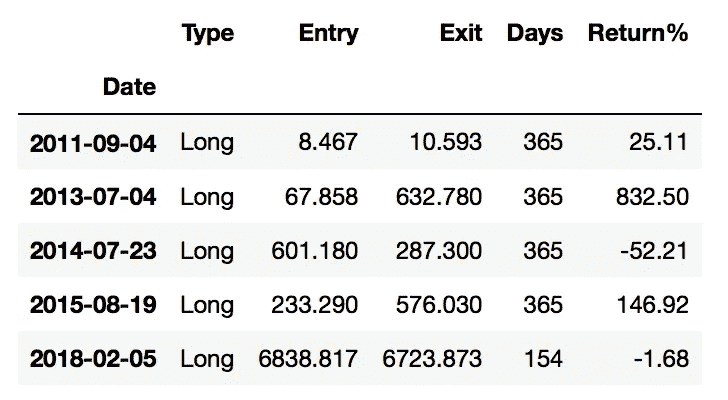
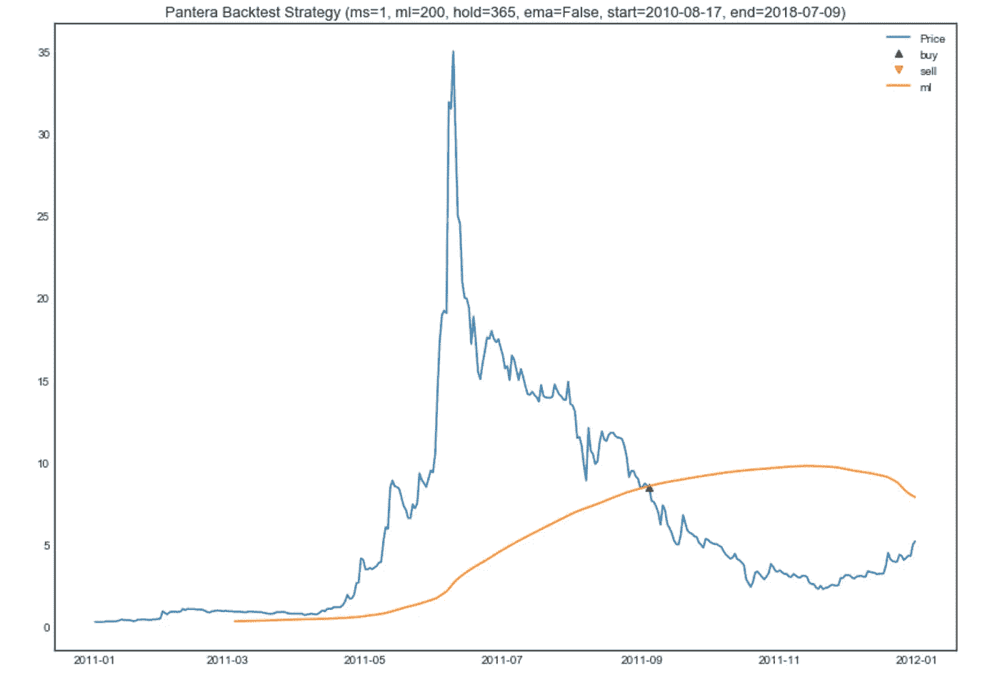
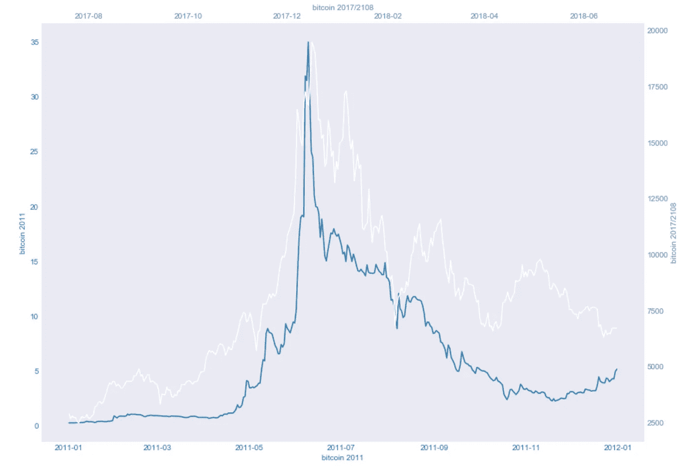
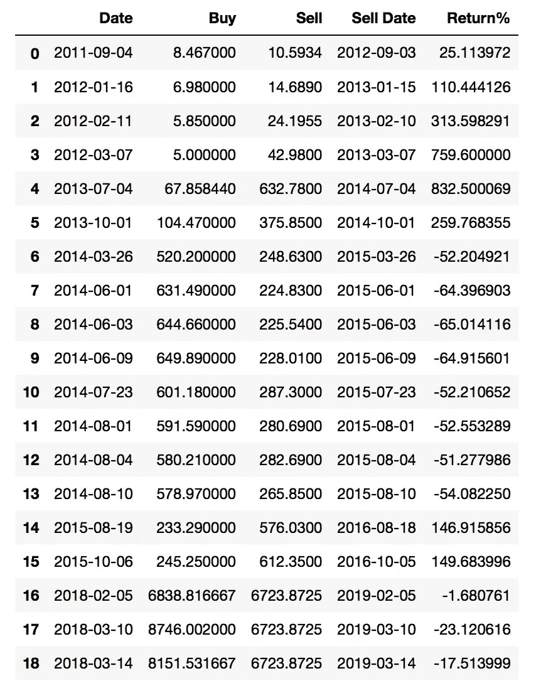
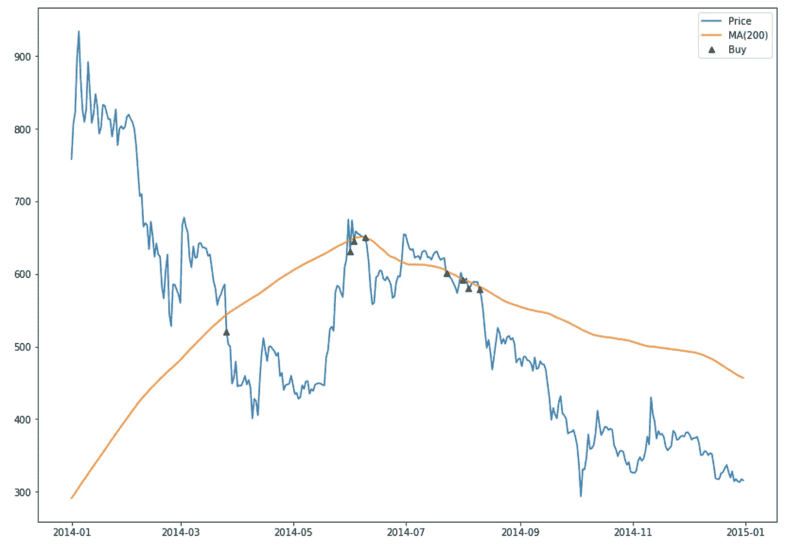
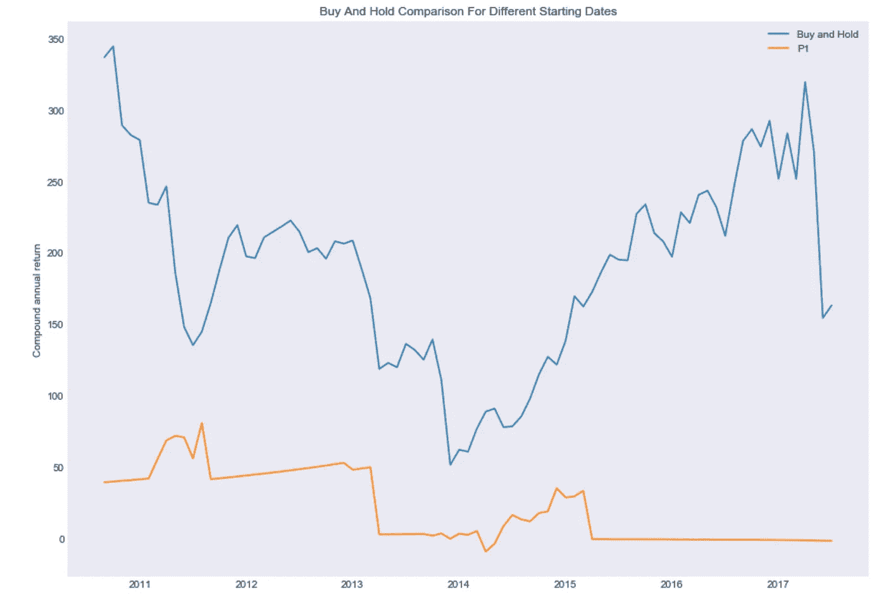
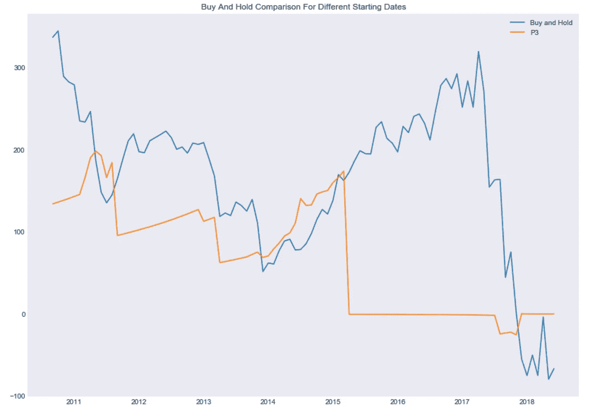

# 一个比特币投资者对击败买入并持有的探索:第一部分

> 原文：<https://medium.com/coinmonks/a-bitcoin-investors-quest-to-beat-buy-and-hold-part-1-936cb7fe8ca5?source=collection_archive---------6----------------------->


```
(The code for this article is available on Github in the [pantera Jupyter Notebook)](https://github.com/dcimring/crypto-price-analysis/blob/master/pantera.ipynb)
```

我认为自己是一个比特币投资者。一些非常聪明的人(比如沃伦·巴菲特)可能会反驳说，投资比特币是不存在的，充其量你只是在投机。尽管如此，我认为比特币是一种投资，因为我相信你可以对它的未来价值进行推理，并对未来可能的结果给出大致的概率。对我来说，这似乎与投资者对一家公司的未来价值以及未来结果和大致概率进行推理的方式没有太大区别。在这两种情况下，如果你发现概率调整后的价值在未来可能比你今天能买到的要高得多，那么这可以被认为是投资。

还有一个更私人的原因，我投资比特币。我相信有比特币的世界比没有比特币的世界更美好。我们对货币的垄断已经太久了，所以看到一种新的(在我看来更好的)货币形式有机地出现是令人温暖的，它是基于自由个人的自愿合作，而不是基于武力的使用。我认为比特币发展到今天是一个奇迹，我希望看到它继续发展。人们当然可以自己决定他们觉得什么钱最好，以及什么钱对他们有用。毕竟，金钱是一种社会工具。

我从一个已经决定投资比特币的人的角度写这篇文章，并希望探索如何随着时间的推移进行投资的不同战术和策略。对于那些还没有决定的人，我建议你从阅读看好比特币的理由开始你的研究。如果你想用截然相反的观点来平衡这一点，那么就去读一读由 [Josph Stiglitz](https://www.express.co.uk/finance/city/985964/Bitcoin-price-ripple-cryptocurrency-ethereum-BTC-to-USD-XRP-Joseph-Stiglitz) 写的关于比特币的任何东西(一位与比特币无关的专制经济学家，他担心允许人们自由选择货币会对社会有害，所以想用武力阻止它)。

我写这一系列文章的目的是确定我是否能找到提高比特币买入并持有回报的策略。这是一个很高的标准，因为买入并持有的回报令人难以置信。首先，我将通过观察过去的价格和测试不同的策略来尝试证明这在理论上是否可行，然后我将尝试在实践中这样做。我之前写过[为什么持有比特币会让你痛苦(但还是要这么做)](/@danielcimring/why-hodling-bitcoin-will-make-you-miserable-but-do-it-anyway-f0d167dd406b)和[比特币价格探索(第一部分)为什么大多数人不应该交易它](/@danielcimring/bitcoin-price-analysis-part-1-d6e961249b40)。我也一直在研究一个[交易 ETH 以获得更多 BTC 的策略。](/coinmonks/a-strategy-for-trading-eth-to-make-more-btc-3985c3c93c04)

在本系列的第一部分中，我将介绍一个由潘迪拉资本公司的丹·莫尔黑德提出的策略[(丹和我同名，所以我只能假设他是一个非常棒的人)。策略大概是这样的。](https://www.cnbc.com/2018/04/18/bitcoin-is-flashing-a-rare-buy-signal-crypto-hedge-fund-manager-says.html)

```
Bitcoin almost never trades lower than it's 200 day moving average. When it does if you buy and hold for the next 365 days you will do very well.
```

这种策略属于“回归均值”类型。当比特币交易低于其 200 天移动平均线时，这被认为是不寻常的，你应该预计它会恢复到高于其 200 天平均线的通常情况。从直觉上来说，这有点像价值投资，你在某样东西处于历史低位时买入，因为你预计它以后会变得更加合理。

首先让我们来看看这样一个例子，当比特币跌破 200 天移动平均线时，你买入比特币，然后持有 365 天。如果在 365 天的持有期内，它再次跌破 200 天移动平均线，你就不要再买了。只有在 365 天结束后，你才会寻找下一个买入机会。让我们称这个版本的策略为“P1”。

我使用的是 Quandl 的比特币价格系列 BCHAIN/MKPRU，其中包含了 2010 年以来的每日收盘价。这是你可能会做的交易清单。最后一笔交易还没有完成它的 365 天持有期，所以现在我用 7 月 9 日的收盘价来评分。在 200 天左右，我需要回来更新这个。



Trades For P1 Strategy

这是 2011 年的图表，显示了 200 天移动平均线和 2011 年 9 月发生的第一次买入。



Chart for 2011 Showing 200 Day Moving Average

在 2017/2018 年泡沫和崩溃的背景下看到 2011 年的泡沫和崩溃很有趣。这促使我做了一个快速的并排比较，如下图所示。蓝线表示 2011 年，白线表示 2017/2018 年。这两个价格系列都涵盖了 1 年的时间。



2011 Crash Compared To 2017/2018 Crash

很难说 2017/2018 熊市是否已经结束，但对比确实清楚地表明，我们在 2017/2018 年看到的涨跌类型之前已经发生过[，并且不是那么不寻常](/@danielcimring/a-study-of-bitcoin-price-crashes-c61051ee5f20)。

最后，这里总结了与买入并持有相比的总体结果

```
P1 Strategy
5 buys, 4 sells so far
Arithmetic average return 190.1%
Geometric average return 68.4%
Strategy return for the period 1,253.6%
Buy and Hold return for the period 79,312.7%
```

因此，尽管个人回报率的算术平均值为 190%听起来非常好，但这种策略的表现会比同期买入并持有差几个数量级(大约只有 1%的回报率，而回报率为 7.9 万%)。对于买入并持有的比较，我假设你在策略进行第一笔交易的同一天开始买入并持有。

现在让我们改变规则，这样每次价格穿过 200 日均线时你就买入，即使你在上次买入的持有期内。使用这些规则，总共会有 19 笔交易，而不是下面列出的 5 笔。我们姑且称这个版本的策略为“P2”。



Trades For P2 Strategy

大多数个人回报看起来相当不错，但你会注意到 2014 年期间进行的一系列交易效果不佳。365 天的持有期不足以让你度过残酷的 2014 年熊市。下面的图表显示了 2014 年发生的情况，当时价格在 200 天移动平均线上下波动了几次，导致了 8 个不同的买入点，这些价格在 365 天的持有期内没有恢复。



2014 Price Moved Below 200 Day Moving Avg. Multiple Times

最后，这里有一个总结的结果，比较他们购买和持有。

```
P2 Strategy
19 buys, 16 sells so far
Arithmetic average return 110.5%
Geometric average return 14.4%
Strategy return for the period 1,179.0%
Buy and Hold return for the period 79,312.7%
```

P2 的总体结果比 P1 差，而且在同一时期比买入并持有还要差几个数量级。

到目前为止，我们已经做了分析，假设你在 2010 年开始投资。现在让我们更进一步，看看一系列不同的开始日期。下图显示了 P1 的复合年回报率和从开始日期开始买入并持有的回报率。蓝线是买入并持有，橙线是 P1。



如你所见，无论起始日期是什么，买入并持有总是更好。原因之一是 P1 策略只持续 365 天，然后等待下一个买入机会。所以它不是一直在市场上，错过了很多价格上涨的机会。让我们创建第三个版本，叫做 P3，当价格低于 200 天移动平均线时买入，然后永不卖出。所以就像买入并持有一样，它只做一次交易，但它不是现在买入，而是等到下一次价格低于 200 日均线时买入。下图比较了 P3 在不同起始日期买入并持有的复合年回报率。



如你所见，买入并持有在大多数时候更好，但有 3 次 P3 会更好。2011 年年中，2014 年全年，2018 年至今。原因很清楚，这是价格第三次大幅上涨，然后暴跌。因此，在这些特殊时期，如果你等待价格跌破 200 天移动平均线，你会过得更好。但问题是，你当时会知道吗？

将所有这些放在一起，这是我对第 1 部分的总结:

*   等待跌破 200 日均线，然后持有 365 天，总是比买入并持有更糟糕。365 天的持有期太短，退出市场会让你错过很多价格上涨的机会。例如，这种策略会阻止你在 2017 年 12 月的高点买入(这是好事)，但也会阻止你参与 2017 年的牛市(这抵消了好的部分和更多)。
*   如果你正在寻找一个买入并持有的好时机，“现在”几乎总是最好的答案。唯一的例外是大泡沫和崩溃之前的时间点。事后看来，这些很容易发现，但在当时很难识别。如果你错了，你可能永远也不会进入市场，或者错过比随后的崩盘更大的价格上涨。
*   由于在撰写本文时(2018 年 7 月 9 日)，我们目前位于 200 日移动平均线下方，因此“立即”买入或“等待跌破 200 日”没有区别。从历史上看，这似乎是一个买入并持有的投资者的好切入点，从这个意义上说，我同意丹的“比特币目前是一个令人尖叫的买入”的说法。但如果你只打算持有 365 天，那么从历史上看，这可能不够长。

在第二部分中，我将研究各种动量策略，看看它们如何对抗买入并持有。与均值回归策略不同，动量策略在价格上涨时买入，在价格下跌时卖出。直觉上，它们就像成长型投资，你买的东西今天看起来可能不便宜，但你认为将来会更值钱。对我来说，这更适合比特币，它涨了很多，也跌了很多。

我希望你喜欢这篇文章。如果你得到了什么好处，请点击**拍手**按钮，让其他人也能发现。

*请注意，本文中的任何内容都不应被视为投资建议。比特币的波动性极大。投资前，请做自己的研究。永远不要买你输不起的密码。*