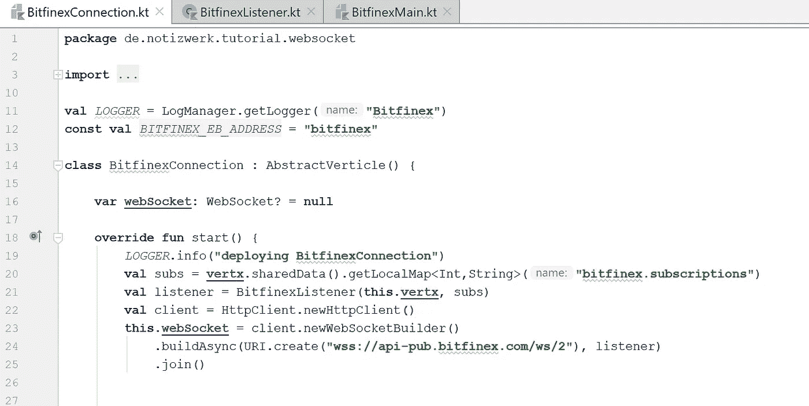

# 使用 Java 11 WebSocket API 的 Websocket 客户端

> 原文：<https://medium.com/coinmonks/a-bitfinex-websocket-client-with-the-java-net-http-websocket-api-3fa873224996?source=collection_archive---------0----------------------->

对于一个小型加密项目，我想使用 Bitfinex WebSocket API 实时获取市场数据。github 上有完整的代码。



从 Java SE 11 开始，JDK 包含了一个[客户端 WebSocket API](https://docs.oracle.com/en/java/javase/11/docs/api/java.net.http/java/net/http/package-summary.html) 。javadoc 包含一些代码示例，但是您不能开箱即用这些示例。在网上搜索“java websocket client ”,会发现大部分旧的 JSR 352 websocket 的例子和指南。设置好一切来完成工作并不像预期的那么简单，所以我写了这个小教程。

只要合适，我就在我的项目中使用 vert.x，还有一个 websocket 客户端 API。但遗憾的是，vert.x websocket 客户端有一个小缺点，它不能与重定向☹一起工作，尽管我们不使用 vert.x websocket 客户端，但我们使用 vert.x 作为我们的小应用程序的基础。

足够的话，我们开始编码。要构建并连接到 websocket 服务器，构建器需要一个侦听器，它将侦听传入的数据包:

```
**class** BitfinexListener(**val vertx**: Vertx) : WebSocket.Listener {

    **override fun** onOpen(webSocket: WebSocket?) {
        **super**.onOpen(webSocket)
        *LOGGER*.info(**"websocket opened"**)
        **this**.**vertx**.periodicStream(60000).toObservable()
          .subscribe **{** i **->
            val** pingTxt = JsonObject().put(**"event"**, **"ping"**)
                           .put(**"cid"**, *Random*(2020).nextInt())
                           .encode()
            webSocket?.sendText(pingTxt, **true**)?
             .thenRun **{->** *LOGGER*.info(**"sent ping {}"**, pingTxt)**}
          }** }

    **var parts**: MutableList<CharSequence?> = 
            *MutableList*(0) **{** index: Int **-> "" }
    var accumulatedMessage**: CompletableFuture<*> =
            CompletableFuture<Any>()

    **override fun** onText(webSocket: WebSocket,
                         message: CharSequence?,
                         last: Boolean): CompletionStage<*>? {
        **parts**.add(message)
        webSocket.request(1)
        **if** (last) {
            **val** completeMessage = **parts**.*joinToString*(separator = **""**) 
                   **{** charSequence **->** charSequence ?: **"" }
            parts**.clear()
            **accumulatedMessage**.complete(**null**)
            **val** cf: CompletionStage<*> = **accumulatedMessage
            accumulatedMessage** = CompletableFuture<Any>()
            onMessage(completeMessage)
            **return** cf
        }
        **return accumulatedMessage** }

    **fun** onMessage(message: String) {
        **val** bitfinexMessage = Json.decodeValue(message)
        // ... see repo at github for full code
    }
}
```

我们覆盖 onOpen 方法来建立对 bitfinex 的周期性 ping。重要的一点是，当您**覆盖 onOpen 时，您必须调用 super.onOpen** ，否则客户端不会向服务器发送任何数据。

我花了很多时间才找到这个错误。因为监听器是一个接口，所以我不习惯调用接口的超方法。但在这种情况下这很重要。Java 8 中引入的接口中默认方法的概念还没有成为我的第二天性。

onText 消息收集所有传输的文本数据，直到一个文本完成(这通常是对 inText 的一次调用)。在文本完成时，文本通过 onMessage 方法中的 vert.x eventbus 发送。

现在，我们可以使用这个监听器设置一个 verticle 来表示到 bitfinex 的连接:

```
**class** BitfinexConnection : AbstractVerticle() {

    **var webSocket**: WebSocket? = **null

    override fun** start() {
        *LOGGER*.info(**"deploying BitfinexConnection"**)
        **val** subs = **vertx**.sharedData()
                .getLocalMap<Int,String>(**"bitfinex.subscriptions"**)
        **val** listener = BitfinexListener(**this**.**vertx**, subs)
        **val** client = HttpClient.newHttpClient()
        **val** uri = URI.create(**"wss://api-pub.bitfinex.com/ws/2")**
        **this**.**webSocket** = client.newWebSocketBuilder()
                     .buildAsync(uri), listener).join() **vertx**.eventBus()
             .consumer<JsonObject(*BITFINEX_EB_ADDRESS*)
             .handler **{** jsonMsg **->

          if** ( **webSocket**==**null** || **webSocket**?.isOutputClosed()!!) {
              jsonMsg.reply(JsonObject()
                            .put(**"message"**, **"websocket closed"**)
                            .put(**"statusCode"**,503))
                **return**@handler
          }
          **val** bitfinexMessage = jsonMsg.body().encode()
          **this**.**webSocket**?.sendText(bitfinexMessage,**true**)?
           .thenRun**{** *LOGGER*.debug(**"delivered {} "**, bitfinexMessage)**}
        }** }
}
```

该类简单明了，在 verticle 的 start 方法中，初始化并启动了到公共 bitfinex api 的 websocket 连接。通过 vert.x eventbus 消息应该被直接发送到 websocket，因此我们在地址 BITFINEX_EB_ADDRESS 上启动一个消费者。

最后一步，我们将所有东西放在一起，并尝试订阅 tBTCUSD 股票:

```
**fun** main() {
  **val** vertx = Vertx.vertx()
  **val** symbol = **"tBTCUSD"** vertx.rxDeployVerticle(BitfinexConnection::**class**.*java*.*name*)
    .subscribe(
        **{** id **->** *LOGGER*.info(**"deployed bitfinex connection {}"**, id)
            **val** address = **"ticker."** + symbol
            vertx.eventBus()
               .consumer<JsonArray>(address)
               .handler **{** jsonMsg **->** *LOGGER*.info(**"received {} {}"**, address,
                        jsonMsg.body().encodePrettily())
               **}
**            **val** subscribeMessage = JsonObject()
                  .*bfxSubscribeTickerMessage*(symbol)vertx.eventBus()
                .send(*BITFINEX_EB_ADDRESS*, subscribeMessage)

       **}**,
       **{** t: Throwable? **->** *LOGGER*.error(**"deployment failed"**, t) **}** )
}
```

main 方法启动 Vertx 并部署 bitfinex websocket verticle。当部署完成时，我们向 websocket verticle 发送一条带有订阅负载的消息，并在一个特殊的 eventbus 地址上启动一个消费者。

你可以在 github 上找到所有代码，克隆它，确保你已经安装了 Java 11 或更高版本，并运行它:

```
.**/gradlew run**
```

我希望本教程能让您在项目中快速启动 websocket 客户端代码。