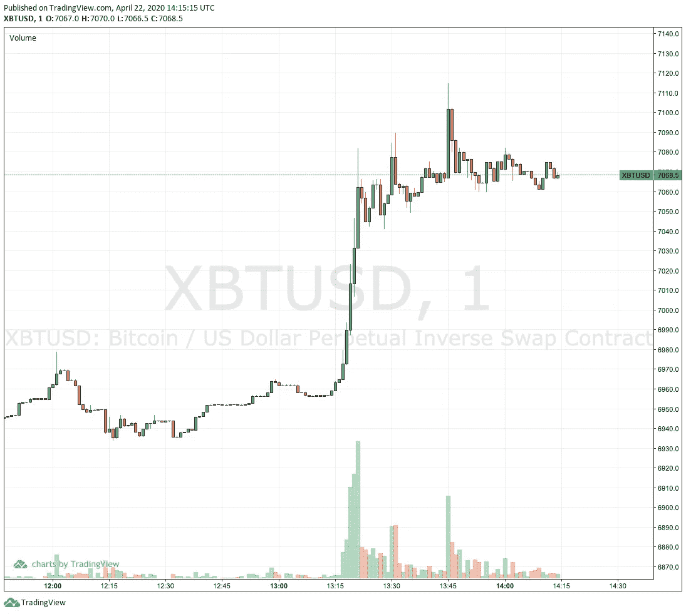

# Bitmex Python 教程

> 原文：<https://medium.com/coinmonks/a-bitmex-python-tutorial-5f3cdf2491a7?source=collection_archive---------0----------------------->

[BitMEX](https://blog.coincodecap.com/go/bitmex) 是一个[加密货币交易](https://blog.coincodecap.com/tag/crypto-trading/)平台，除了杠杆交易之外，它还提供全面的 API 和支持工具，根据产品的不同杠杆大小也有所不同。Bitmex 还提供了一个平台，可以在进行任何真正的投资之前，在没有资金风险的情况下模拟交易。



在本教程中，我们将学习如何利用 Bitmex 的公共 API 来获取市场数据，获取头寸数据，设置卖出/买入订单，并最终更新杠杆。

首先确保你已经登录了 [**Bitmex**](https://www.bitmex.com/register/kOHufx) 和 [**Bitmex Testnet**](https://testnet.bitmex.com/) 。然后你可以为 Bitmex 生成你的 [**API**](https://www.bitmex.com/app/apiKeys) 和 [**测试 API**](https://testnet.bitmex.com/app/apiKeys) key。

## 装置

```
$ pip install bitmex
```

## 导入库并获取客户端实例

在本教程中，我们将继续使用 Bitmex Testnet 的 API 来获取客户端实例。

```
import bitmex
import time, requests, jsonbitmex_api_key = <API_KEY>  # Enter your own API-key here
bitmex_api_secret = <API_SECRET>  # Enter your own API-secret hereclient = bitmex.bitmex(test = True, api_key=bitmex_api_key_test, api_secret=bitmex_api_secret_test) 
```

## 执行市价单

要执行订单，我们首先必须填写一些参数。第一笔订单将按当前市价做多 10 份 XBTUSD 合约，第二笔订单将按当前市价做空 10 份 XBTUSD 合约。

```
symbol = 'XBTUSD'
ordType = 'Market'
orderQty_Buy = 10 # Positive value to long
orderQty_Sell = -10 # Negative value to shortclient.Order.Order_new(symbol=symbol, ordType=ordType, orderQty=orderQty_Buy).result() # Longclient.Order.Order_new(symbol=symbol, ordType=ordType, orderQty=orderQty_Sell).result() # Short
```

## 更新杠杆

由于 Bitmex 提供杠杆交易，我们将能够使用以下工具更新我们的头寸杠杆:

```
leverage = 5client.Position.Position_updateLeverage(symbol=symbol, leverage=leverage).result()
```

## 平仓

某个符号的所有未平仓头寸可以通过以下方式平仓:

```
client.Order.Order_closePosition(symbol=symbol).result()
```

## 检查订单历史

为了获取最新的订单历史，我们首先设置`reverse=true`来获取最新的订单。

```
orders = client.Order.Order_getOrders(symbol=symbol, reverse=True).result()
```

要从订单中获取特定数据，我们可以使用以下方法清理订单:

```
new_order = orders[0][0] # Get the last order
processed_order = {}
timestamp_minute = str(new_order["timestamp"]).split(':')[0] + ":" + 
                   str(new_order["timestamp"]).split(':')[1] + ":00"

processed_order["symbol"] = new_order["symbol"]
processed_order["timestamp"] = timestamp_minute
processed_order["amount"] = str(new_order["orderQty"]).split("L")[0]
processed_order["price"] = new_order["price"]
processed_order["side"] = new_order["side"]
```

## 检查未结头寸

检查某个符号的未平仓位置，然后使用以下选项选择特定数据:

```
positions = client.Position.Position_get(filter=json.dumps({"symbol": symbol})).result()[0][0]processed_position = {}
timestamp_minute = str(positions["timestamp"]).split(':')[0] + ":" + \
                   str(positions["timestamp"]).split(':')[1] + ":00"

processed_position["symbol"] = positions["symbol"]
processed_position["timestamp"] = timestamp_minute
processed_position["isOpen"] = positions["isOpen"]
processed_position["currentQty"] = positions["currentQty"]
processed_position["leverage"] = positions["leverage"]
processed_position["liquidationPrice"] = positions["liquidationPrice"]
```

## 获取过去一分钟的数据

获取某个符号过去一分钟的数据，并使用以下选项选择特定数据:

```
binSize='1m' # You can change the bin size as neededpast_minute_data = \
    client.Trade.Trade_getBucketed(binSize=binSize, count=1, symbol=symbol, reverse=True).result()[0][0]

processed_min_data = {}
timestamp_minute = str(past_minute_data["timestamp"]).split(':')[0] + ":" + \
                   str(past_minute_data["timestamp"]).split(':')[1] + ":00"

processed_min_data["symbol"] = past_minute_data["symbol"]
processed_min_data["Date"] = timestamp_minute
processed_min_data["Open"] = past_minute_data["open"]
processed_min_data["Close"] = past_minute_data["close"]
processed_min_data["Volume"] = past_minute_data["volume"]
processed_min_data["High"] = past_minute_data["high"]
processed_min_data["Low"] = past_minute_data["low"]
```

如果需要，您也可以使用以下方式获得最后几分钟:

```
number_of_minutes_needed = 20
past_minutes_data_list = []past_minutes_data = client.Trade.Trade_getBucketed(binSize='1m', count=number_of_minutes_needed, symbol=symbol, reverse=True).result()[0]past_minutes_data = reversed(past_minutes_data)
for past_minute_data in past_minutes_data:
    processed_min_data = {}
    timestamp_minute = str(past_minute_data["timestamp"]).split(':')[0] + ":" + str(past_minute_data["timestamp"]).split(':')[1] + ":00"

    processed_min_data["symbol"] = past_minute_data["symbol"]
    processed_min_data["Date"] = timestamp_minute
    processed_min_data["Open"] = past_minute_data["open"]
    processed_min_data["Close"] = past_minute_data["close"]
    processed_min_data["Volume"] = past_minute_data["volume"]
    processed_min_data["High"] = past_minute_data["high"]
    processed_min_data["Low"] = past_minute_data["low"]
    past_minutes_data_list.append(processed_min_data)
```

## 另外，阅读

*   [最佳加密交易机器人](/coinmonks/whats-the-best-crypto-trading-bot-in-2020-top-8-bitcoin-trading-bot-c16adeb13317)
*   [Deribit 审查](/coinmonks/deribit-review-options-fees-apis-and-testnet-2ca16c4bbdb2) |选项、费用、API 和 Testnet
*   [FTX 密码交易所评论](/coinmonks/ftx-crypto-exchange-review-53664ac1198f)
*   最好的比特币[硬件钱包](/coinmonks/the-best-cryptocurrency-hardware-wallets-of-2020-e28b1c124069?source=friends_link&sk=324dd9ff8556ab578d71e7ad7658ad7c)
*   [密码本交易平台](/coinmonks/top-10-crypto-copy-trading-platforms-for-beginners-d0c37c7d698c)
*   最好的[加密税务软件](/coinmonks/best-crypto-tax-tool-for-my-money-72d4b430816b)
*   [最佳加密交易平台](/coinmonks/the-best-crypto-trading-platforms-in-2020-the-definitive-guide-updated-c72f8b874555)
*   最佳[加密贷款平台](/coinmonks/top-5-crypto-lending-platforms-in-2020-that-you-need-to-know-a1b675cec3fa)
*   [莱杰 vs 特雷佐](/coinmonks/ledger-vs-trezor-best-hardware-wallet-to-secure-cryptocurrency-22c7a3fd391e)
*   [bits gap review](/coinmonks/bitsgap-review-a-crypto-trading-bot-that-makes-easy-money-a5d88a336df2)——一个轻松赚钱的加密交易机器人
*   为专业人士设计的加密交易机器人
*   [PrimeXBT 审查](/coinmonks/primexbt-review-88e0815be858) |杠杆交易、费用和交易
*   HaasOnline 评论享受九折优惠
*   Bitmex 保证金交易的白痴指南
*   [eToro 评论](/coinmonks/etoro-review-78807ddeb33c) |交易股票、密码、交易所交易基金、差价合约和商品
*   [Bitmex 高级保证金交易指南](/coinmonks/bitmex-advanced-margin-trading-guide-2270c195ce25?source=friends_link&sk=1d986cca731f5084b9a2db4a4bc4a7ad)
*   开发人员的最佳加密 API
*   [加密套利](/coinmonks/crypto-arbitrage-guide-how-to-make-money-as-a-beginner-62bfe5c868f6)指南:新手如何赚钱
*   顶级[比特币节点](https://blog.coincodecap.com/bitcoin-node-solutions)提供商
*   最佳[加密制图工具](/coinmonks/what-are-the-best-charting-platforms-for-cryptocurrency-trading-85aade584d80)
*   了解比特币最好的[书籍有哪些？](/coinmonks/what-are-the-best-books-to-learn-bitcoin-409aeb9aff4b)

> [在您的收件箱中直接获得最佳软件交易](https://coincodecap.com?utm_source=coinmonks)

[](https://coincodecap.com?utm_source=coinmonks)