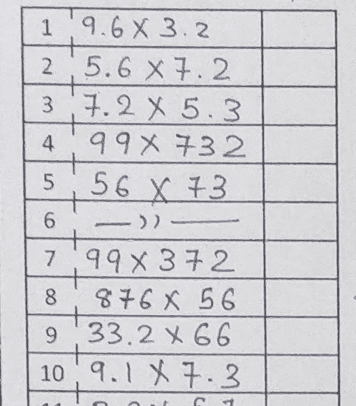
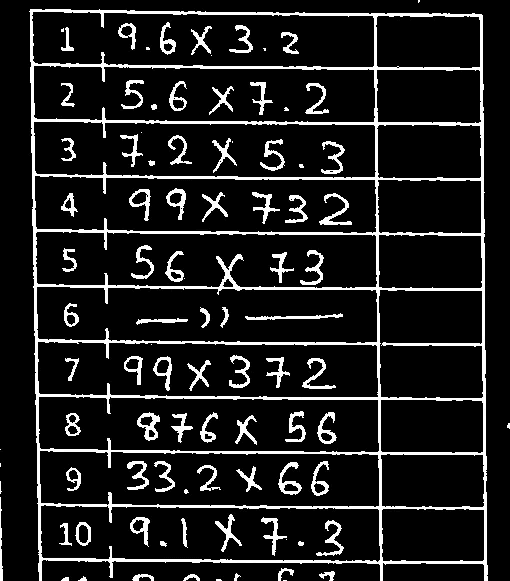
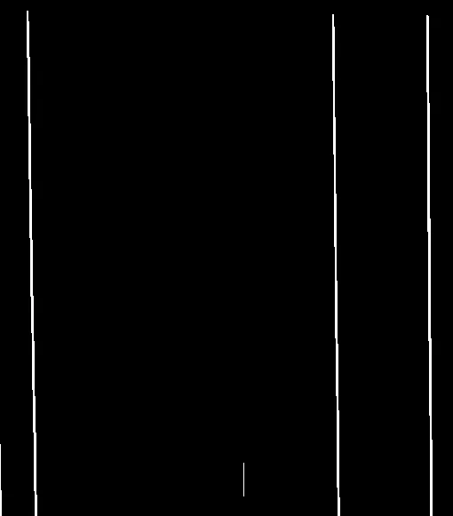
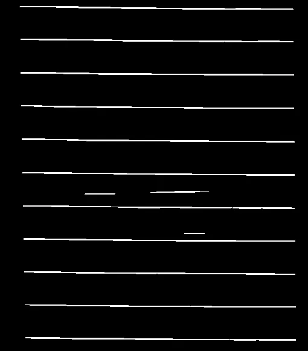
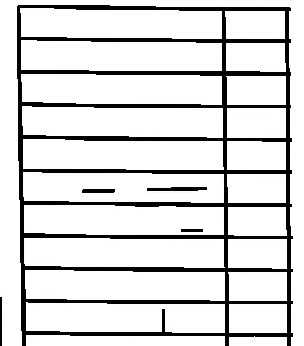
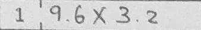
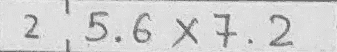
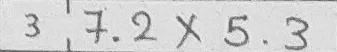

# 一种适用于任何包含盒子的图像的盒子检测算法。

> 原文：<https://medium.com/coinmonks/a-box-detection-algorithm-for-any-image-containing-boxes-756c15d7ed26?source=collection_archive---------0----------------------->

当您处理光学字符识别(OCR)或任何数据或对象识别问题时，首先要做的是预处理。这里的预处理是指提取我们的信息所在的位置。提取位置后，任何机器算法都将在该图像上执行。

当您必须检测位于任何表格/框或行列格式中的对象时，问题就出现了。如果图像是这样的，那么你必须检测盒子并一个接一个地提取它们。现在，应该对所有图像进行精确处理。例如，请参见下图:



Example of an image for extracting information.

在这张图片中，我想对所有的等式进行光学字符识别。我想提取每个细胞一个接一个(不是任何空白)来检测数字。提取每个细胞后，我将对所有的数字进行分割，并应用我的 ML 模型进行识别。对于这个算法，我们将通过使用 opencv 和 numpy 来使用 python 语言。让我们开始一个一个地提取每个细胞:

首先导入一些库:

```
import cv2
import numpy as np
```

现在读取图像，将其转换为灰度，进行阈值处理并反转图像。

```
# Read the image
img = cv2.imread(img_for_box_extraction_path, 0)

# Thresholding the image
(thresh, img_bin) = cv2.threshold(img, 128, 255,cv2.THRESH_BINARY|     cv2.THRESH_OTSU)# Invert the image
img_bin = 255-img_bin 
cv2.imwrite("Image_bin.jpg",img_bin)
```

所以我们的图像看起来像这样:



image_bin.jpg

现在我们需要检测盒子。为此，我们将使用形态学运算。为此，我们将根据图像的宽度来定义矩形核的长度。我们将定义两个内核。1)内核检测水平线。2)内核检测垂直线。

```
# Defining a kernel length
kernel_length = np.array(img).shape[1]//80

# A verticle kernel of (1 X kernel_length), which will detect all the verticle lines from the image.
verticle_kernel = cv2.getStructuringElement(cv2.MORPH_RECT, (1, kernel_length))# A horizontal kernel of (kernel_length X 1), which will help to detect all the horizontal line from the image.
hori_kernel = cv2.getStructuringElement(cv2.MORPH_RECT, (kernel_length, 1))# A kernel of (3 X 3) ones.
kernel = cv2.getStructuringElement(cv2.MORPH_RECT, (3, 3))
```

现在，在定义了内核之后，我们将进行形态学操作来检测垂直线和水平线。下面的代码显示了包含垂直线的图像。

```
# Morphological operation to detect vertical lines from an image
img_temp1 = cv2.erode(img_bin, verticle_kernel, iterations=3)
verticle_lines_img = cv2.dilate(img_temp1, verticle_kernel, iterations=3)
cv2.imwrite("verticle_lines.jpg",verticle_lines_img)# Morphological operation to detect horizontal lines from an image
img_temp2 = cv2.erode(img_bin, hori_kernel, iterations=3)
horizontal_lines_img = cv2.dilate(img_temp2, hori_kernel, iterations=3)
cv2.imwrite("horizontal_lines.jpg",horizontal_lines_img)
```



Image containing vertical lines



Image containing horizontal lines

现在我们将添加这两个图像。这将只有盒子，写在盒子里的信息将被删除。因此，我们可以准确地检测到盒子，并且不会出现错误的盒子提取噪声。

```
# Weighting parameters, this will decide the quantity of an image to be added to make a new image.
alpha = 0.5
beta = 1.0 - alpha# This function helps to add two image with specific weight parameter to get a third image as summation of two image.
img_final_bin = cv2.addWeighted(verticle_lines_img, alpha, horizontal_lines_img, beta, 0.0)
img_final_bin = cv2.erode(~img_final_bin, kernel, iterations=2)
(thresh, img_final_bin) = cv2.threshold(img_final_bin, 128,255, cv2.THRESH_BINARY | cv2.THRESH_OTSU)
cv2.imwrite("img_final_bin.jpg",img_final_bin)Thank
```



Final image containing only boxes

现在我们将应用 findContours()方法到这个图像。这将找到所有的盒子，我们将从上到下对它们进行排序。为了对轮廓进行排序，我们将使用[https://www . pyimagesearch . com/2015/04/20/sorting-contours-using-python-and-opencv/](https://www.pyimagesearch.com/2015/04/20/sorting-contours-using-python-and-opencv/)提供的函数。我们将使用自上而下的方法。

```
# Find contours for image, which will detect all the boxes
im2, contours, hierarchy = cv2.findContours(img_final_bin, cv2.RETR_TREE, cv2.CHAIN_APPROX_SIMPLE)# Sort all the contours by top to bottom.
(contours, boundingBoxes) = sort_contours(contours, method="top-to-bottom")
```

现在循环所有的轮廓，找到所有盒子的位置，裁剪出有矩形的部分，保存到一个文件夹中。

```
idx = 0
    for c in contours:
        # Returns the location and width,height for every contour
        x, y, w, h = cv2.boundingRect(c)
        if (w > 80 and h > 20) and w > 3*h:
            idx += 1
            new_img = img[y:y+h, x:x+w]
            cv2.imwrite(cropped_dir_path+str(idx) + '.png', new_img)# If the box height is greater then 20, widht is >80, then only save it as a box in "cropped/" folder.
        if (w > 80 and h > 20) and w > 3*h:
            idx += 1
            new_img = img[y:y+h, x:x+w]
            cv2.imwrite(cropped_dir_path+str(idx) + '.png', new_img)
```

现在完成了！。检查你的文件夹，你会看到包含每个提取框的图像。像这样:



Extracted images

因此，现在您可以使用这些图像进行进一步的实现。您可以通过增加来更改 kernel_length 参数，以便在非常大的图像中获得良好的输出。

***注:*** 该方法适用于任何地方，检测从 OMR 表到任何 excel 表的数据。这种方法使用正常的形态学操作，并且它擦除了所有的内部信息，因此不会有噪声进入盒子的错误检测。您可以使用下面的方法作为预处理，并获得良好的输出。:)

盒子检测的完整代码在这里:

```
import cv2
import numpy as npThankdef box_extraction(img_for_box_extraction_path, cropped_dir_path):img = cv2.imread(img_for_box_extraction_path, 0)  # Read the image
    (thresh, img_bin) = cv2.threshold(img, 128, 255,
                                      cv2.THRESH_BINARY | cv2.THRESH_OTSU)  # Thresholding the image
    img_bin = 255-img_bin  # Invert the imagecv2.imwrite("Image_bin.jpg",img_bin)

    # Defining a kernel length
    kernel_length = np.array(img).shape[1]//40

    # A verticle kernel of (1 X kernel_length), which will detect all the verticle lines from the image.
    verticle_kernel = cv2.getStructuringElement(cv2.MORPH_RECT, (1, kernel_length))
    # A horizontal kernel of (kernel_length X 1), which will help to detect all the horizontal line from the image.
    hori_kernel = cv2.getStructuringElement(cv2.MORPH_RECT, (kernel_length, 1))
    # A kernel of (3 X 3) ones.
    kernel = cv2.getStructuringElement(cv2.MORPH_RECT, (3, 3))# Morphological operation to detect verticle lines from an image
    img_temp1 = cv2.erode(img_bin, verticle_kernel, iterations=3)
    verticle_lines_img = cv2.dilate(img_temp1, verticle_kernel, iterations=3)
    cv2.imwrite("verticle_lines.jpg",verticle_lines_img)# Morphological operation to detect horizontal lines from an image
    img_temp2 = cv2.erode(img_bin, hori_kernel, iterations=3)
    horizontal_lines_img = cv2.dilate(img_temp2, hori_kernel, iterations=3)
    cv2.imwrite("horizontal_lines.jpg",horizontal_lines_img)# Weighting parameters, this will decide the quantity of an image to be added to make a new image.
    alpha = 0.5
    beta = 1.0 - alpha
    # This function helps to add two image with specific weight parameter to get a third image as summation of two image.
    img_final_bin = cv2.addWeighted(verticle_lines_img, alpha, horizontal_lines_img, beta, 0.0)
    img_final_bin = cv2.erode(~img_final_bin, kernel, iterations=2)
    (thresh, img_final_bin) = cv2.threshold(img_final_bin, 128, 255, cv2.THRESH_BINARY | cv2.THRESH_OTSU)# For Debugging
    # Enable this line to see verticle and horizontal lines in the image which is used to find boxes
    cv2.imwrite("img_final_bin.jpg",img_final_bin)
    # Find contours for image, which will detect all the boxes
    im2, contours, hierarchy = cv2.findContours(
        img_final_bin, cv2.RETR_TREE, cv2.CHAIN_APPROX_SIMPLE)
    # Sort all the contours by top to bottom.
    (contours, boundingBoxes) = sort_contours(contours, method="top-to-bottom")idx = 0
    for c in contours:
        # Returns the location and width,height for every contour
        x, y, w, h = cv2.boundingRect(c)# If the box height is greater then 20, widht is >80, then only save it as a box in "cropped/" folder.
        if (w > 80 and h > 20) and w > 3*h:
            idx += 1
            new_img = img[y:y+h, x:x+w]
            cv2.imwrite(cropped_dir_path+str(idx) + '.png', new_img)box_extraction("41.jpg", "./Cropped/")
```

你可以在这里看到完整的源代码:

[](https://github.com/KananVyas/BoxDetection) [## KananVyas/BoxDetection

### 一个用于任何包含盒子的图像的盒子检测算法。

github.com](https://github.com/KananVyas/BoxDetection) 

谢谢大家！

> 加入 Coinmonks [电报频道](https://t.me/coincodecap)和 [Youtube 频道](https://www.youtube.com/c/coinmonks/videos)获取每日[加密新闻](http://coincodecap.com/)

## 另外，阅读

*   [密码电报信号](http://Top 4 Telegram Channels for Crypto Traders) | [密码交易机器人](/coinmonks/crypto-trading-bot-c2ffce8acb2a)
*   [复制交易](/coinmonks/top-10-crypto-copy-trading-platforms-for-beginners-d0c37c7d698c) | [加密税务软件](/coinmonks/crypto-tax-software-ed4b4810e338)
*   [网格交易](https://coincodecap.com/grid-trading) | [加密硬件钱包](/coinmonks/the-best-cryptocurrency-hardware-wallets-of-2020-e28b1c124069)
*   [加密交换](/coinmonks/crypto-exchange-dd2f9d6f3769) | [印度的加密应用](/coinmonks/buy-bitcoin-in-india-feb50ddfef94)
*   开发人员的最佳加密 API
*   最佳[加密贷款平台](/coinmonks/top-5-crypto-lending-platforms-in-2020-that-you-need-to-know-a1b675cec3fa)