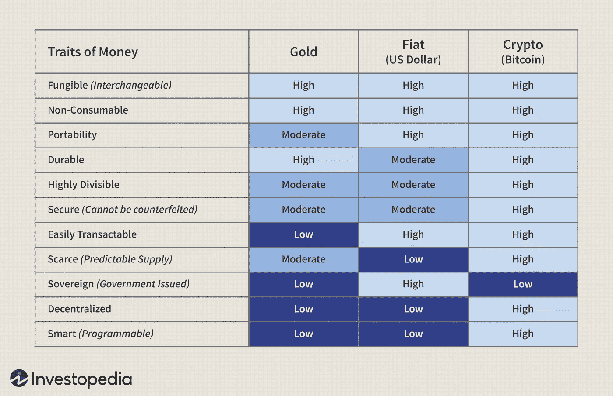
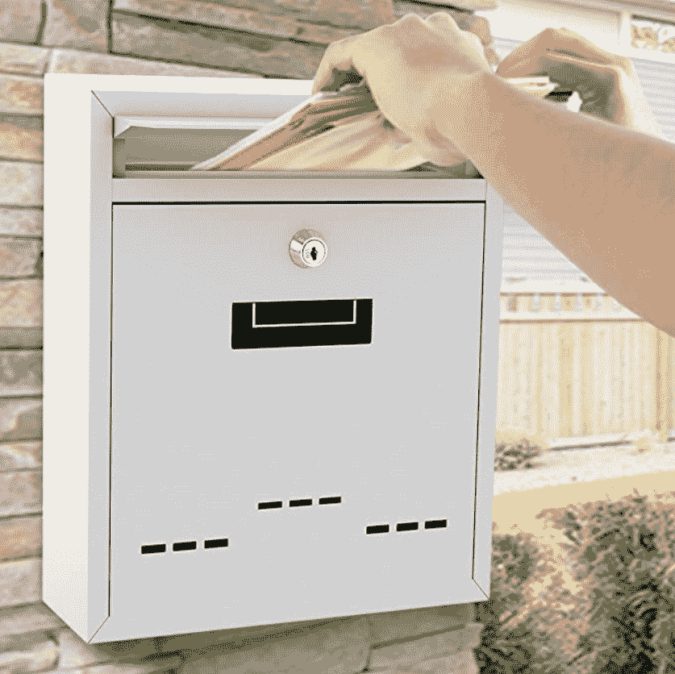
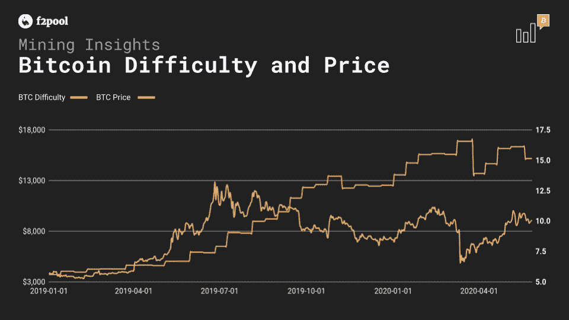

# 给初学者的比特币简要指南

> 原文：<https://medium.com/coinmonks/a-brief-guide-to-bitcoin-for-beginners-48908c0c8265?source=collection_archive---------9----------------------->

除非你过去十年一直生活在岩石下，否则你肯定听说过比特币——市场上最大、最受欢迎的数字货币。但是如果你像我一样，你从来没有真正了解它到底是如何工作的，或者所有的宣传是关于什么的。你很幸运，我做了所有的实质性研究，并为完全的初学者写了这篇文章，以更好地理解比特币！

在本文中，我将解释:

*   比特币的基础知识
*   什么是区块链，它是如何让比特币运作的
*   如何将块添加到链中
*   区块链是如何被验证的
*   2021 年比特币挖矿 vs .投资

请随意滚动到底部查看 TL；summary 博士，如果你喜欢这篇文章，请给它一些掌声！

# **比特币基础知识**

比特币通过使用区块链来工作。我将很快更详细地解释区块链是什么以及它是如何操作的，但简单地说，它是一个通过网络完成的所有交易的分散和匿名数据库，按执行时间的顺序列出。用户通过**节点**连接到这个网络，这些节点是任何拥有区块链副本的计算机或设备。这使得所有用户可以实时看到不断添加到区块链(或分散数据库)中的新交易，防止欺诈性交易，并留下所有通过网络进行的交易的详细日志。它还实现了交易自动化，消除了对银行和其他金融机构等中间人的需求，并允许创建**智能合约**。

上图比较了比特币和其他两种流行的货币形式；黄金和纸币。与这些更过时的货币形式相比，比特币或任何加密货币的优势显而易见。如此多的资源和我们生活的方方面面都被数字化了，令人惊讶的是我们的货币没有跟着数字化。但是，随着比特币和其他加密货币继续流行，随着年轻一代在经济上独立，世界可能会进行这种转变，加密货币可能很快成为新常态。

除了最受欢迎的加密货币应用之外，区块链还可以用于[跟踪产品生命周期](https://www.sdxcentral.com/articles/news/ibm-bets-big-on-blockchain-to-fight-climate-change/2021/01/)、[民主化互联网接入](https://www.thetatoken.org/)、[防止选民欺诈](https://horizonstate.com/)、[检测假药](https://www.insurancejournal.com/news/national/2020/02/21/559057.htm)等等，还有无数区块链的创新应用正在开发中。它有可能彻底改变技术，但它首先必须克服一些巨大的障碍。正如《哈佛商业评论》中所说:

> “我们认为，真正由区块链领导的企业和政府转型，仍需多年时间。这是因为它不是一种“颠覆性”技术，这种技术可以用更低成本的解决方案攻击传统商业模式，并迅速超越现有企业。区块链是一项基础技术:它有可能为我们的经济和社会系统创造新的基础。虽然影响是巨大的，但区块链需要几十年才能渗透到我们的经济和社会基础设施中。随着技术和制度变革的浪潮获得动力，采用的过程将是渐进和稳定的，而不是突然的。”

这可能是区块链没有得到像人工智能那样多关注的部分原因，人工智能更明显、更迅速地革新了技术。然而，我认为，从长远来看，区块链将更有影响力，现在绝对值得谈论，尽管它还处于早期发展阶段。

# **比特币如何通过区块链运作**

区块链平台上的每个用户都有自己唯一的**私钥**(或者有些人可能有多个私钥)，本质上只是一个解码后的字符串。私钥可能看起来像这样，例如:

*e 9873d 79 c 6d 87 DC 0 FB 6a 5778633389 f 4453213303 da 61 f 20 BD 67 fc 233 aa 33262*

当与区块链进行交易时，关于交易的所有数据(例如付款人和收款人、金额等。)与用户的私人密钥相结合，以产生所谓的**数字签名**。这到底是怎么产生的？一些非常有趣的数学。我不会在这篇文章中深入讨论它的细节，但是如果你对它感兴趣，我强烈推荐阅读[这个](https://learnmeabitcoin.com/beginners/digital_signatures_signing_verifying)资源。对于进行比特币交易的用户来说，他们的交易数据、数字签名和**公钥**首先被添加到所谓的**交易池**中作为一个块。与私钥一样，公钥也是一个字符串，但它对于事务本身是唯一的，并且不标识用户。您可以将私钥视为邮箱的密钥:只有所有者拥有该密钥，因此只有他们可以打开邮箱并访问里面的内容。公钥就像邮箱插槽:其他人可以向它添加内容并查看插槽本身，但他们看不到里面的内容或访问里面的内容。

数字签名的目的是证明邮箱实际上属于所有者，而不让其他任何人看到邮箱内的内容。换句话说，数字签名证明您是与您尝试进行的交易相关联的*公钥*的所有者，而不会泄露与您的身份相关联的*私钥*。

一旦块被添加到事务池，它还没有被添加到区块链。在此之前，必须验证该块。在区块链有许多不同的验证方法，但比特币使用一种叫做“**工作证明**的特殊方法。

# **工作证明**

你可能听说过“**比特币矿工**”这个词。比特币矿工对于用于比特币交易的工作证明验证方法至关重要。为了将新的区块添加到区块链，它们必须被“开采”。开采一个区块需要工作，一旦为一个待开采的区块做了足够的工作，该区块就被认为是有效的，并被添加到区块链中。换句话说，这意味着事务从事务池中被批准，并被添加到分布式数据库(区块链)的所有事务链中。如果这一切似乎仍然有点不清楚，不要担心——我将解释比特币挖掘的过程实际上是什么，以及工作证明如何验证块。

一旦用户的交易数据、数字签名和公钥作为一个块被添加到交易池，比特币矿工将挖掘它们以获得奖励，目前相当于 6.25 比特币。可以开采的比特币数量是有限的，准确地说是 2100 万个比特币，随着区块链网络中增加更多的节点和更多的人开始开采，这有限数量的比特币以越来越快的速度被开采出来。为了控制这一点，挖掘比特币的奖励价值每 4 年减半。比特币刚推出时，奖励设定为 50 比特币，但截至 2020 年 5 月仅为 6.25 比特币。

比特币挖掘过程中使用的一个至关重要的工具是**加密哈希函数**。加密哈希函数是一种数学算法，它接受任意长度的输入并产生固定长度的输出，这(令人惊讶)被称为**哈希**。为了挖掘一个块，挖掘器必须从该块包含的数据中创建一个散列，该散列还链接到已经被验证并且在区块链中的前一个块的散列。这样做就像解决一个极其复杂的数学问题，但解决它的唯一方法是通过猜测和检查，大约有 40 亿个可能的答案！这个过程需要特殊的软件和巨大的计算能力。

这道数学题的难度可以通过设置一个目标来调整，哈希必须低于这个目标。目标越低，可能的哈希组合就越少，生成正确的哈希就越难。这意味着哈希将以长串零开始，例如:

*000000000000000004 DD 3426129639082239 EFD 583 b 5273 B1 BD 75 e 8d 78 ff 2e 8d*

为了确保生成的散列低于目标值，挖掘者将向块数据中输入一个名为 **nonce** 的整数。然后，由矿工的计算机来解决复杂的数学问题，即找到生成目标之下的散列的随机数。目标被故意调整，使得计算机总是需要大约 10 分钟来解决这个问题。多名矿工同时工作开采区块，谁有幸先开采区块，谁就能获得比特币奖励。当我说幸运的时候，我真的是指幸运——由于你的计算机试图解决的数学问题的猜测和检查性质，成功地开采一个区块就像赢得彩票一样。但一旦区块被开采出来，矿工会收到比特币作为奖励，然后区块会被添加到区块链，中央数据库也会更新，这意味着新区块现在可以在区块链的所有节点上看到。然后，所有挖掘器继续尝试从事务池中挖掘其他块。

# **工作证明如何确保安全性？**

由于区块链中每个块的散列在数学上与最后一个块的散列相关联，所以为了篡改区块链中的块，需要重新挖掘它之后的所有块。因此，一个街区在区块链越靠后，就越难被篡改。此外，如果有多个不同版本的区块链(由于大量比特币矿工同时采矿，这种情况经常发生)，新开采的区块只会被添加到最长的链中，这就是在区块链公开可见的链。这使得任何人都不可能篡改区块链的区块，因为一旦他们篡改了一个区块，他们将不得不重新开采它，然后重新开采所有已经开采的新区块，并将其添加到区块链中。因此，本质上，这需要他们以极快的速度采矿，以赶上所有其他矿工，从而使他们的区块链版本成为最长的版本，但如前所述，这在数学和计算上都是不可行的。这将要求他们控制整个网络一半以上的计算能力——因此超过 51%的巨大区块链网络将需要作为黑客相互合作！这是非常不可行的，而且网络越大可能性越小。这就是区块链的魅力所在——它基本上消除了任何攻击、篡改数据或欺诈的可能性。

# **跳上比特币列车**

既然你对区块链和比特币的运作方式有了更好的了解，或许你也想参与其中。自 2011 年首次爆发以来，比特币总体表现非常好。如果有人在奖励为 50 比特币的时候开采了一个区块，并从 2010 年开始持有，那么现在他将拥有价值超过 45 万美元的比特币。然而，总的来说，加密货币仍然是一种高度**波动**的资产(意味着它会受到价值突然大幅波动的影响)，在跳上比特币列车之前，有几件事你应该考虑。

如果你想开始挖掘比特币，你应该认真考虑所有相关因素，以及你对它的认真程度。在今天的市场上，作为一个独立的在家采矿者，从比特币采矿中获利是不可能的。为了挖掘比特币，必须解决的数学问题比比特币刚推出时困难了 16 万亿倍。这是由于近年来计算能力的指数级发展，以及大型比特币挖掘中心的发展，这些中心的唯一目的是托管大量计算能力，以从比特币挖掘中获利。为了将开采一个区块的时间保持在至少 10 分钟左右，数学问题必须变得如此复杂，以至于即使是这些巨大的采矿中心也要花那么多时间来解决它们。所以想自己挖矿比特币，不能只用笔记本电脑。你需要投资更强大的硬件，根据效率的高低，价格从几百美元到几万美元不等。即使有更强大的硬件，为了成功开采任何区块，你可能需要加入一个**矿池**，这是由个体矿工组成的团体，他们结合自己的计算能力并分享回报。因为你们分享奖励，所以你不能从开采每个区块中获得同样多的利润，但是在一个团队中，你可以开采更多的区块，至少有机会从中获利。

另外要考虑的是挖矿比特币的奖励。由于从开采一个区块中获得的金额每四年减半，并且计算机的能力继续增加，数学问题的难度在增加，同时解决这些问题的回报在减少，因此开采比特币越来越没有意义。下图说明了这个问题:

我要提到的最后一个因素对你是否能从开采比特币中获利有很大影响，那就是你居住的地方的电费。如前所述，挖掘比特币需要大量的计算能力，因此需要大量的电力。由于开采过程而产生的电费很有可能会大于你获得的任何利润，所以如果你真的想开采比特币，请确保你考虑了你所居住的地方的电费。如果你正试图做一个更深入的分析，看看你是否能从挖掘比特币中获利，看看这个在线的[盈利计算器](https://www.cryptocompare.com/mining/calculator/btc?HashingPower=15&HashingUnit=TH%2Fs&PowerConsumption=0&CostPerkWh=0&MiningPoolFee=1)。

在我看来，除非你非常认真地挖掘比特币，并准备前期投入大量资本，否则不值得。通过 [Wealthsimple](https://www.wealthsimple.com/en-ca/product/crypto/) 这样的平台创建一个账户，购买一些比特币加入你自己的数字钱包，投资比特币会容易得多。只要确保你了解这其中涉及的风险——如果你没有管理投资组合的经验，不要只是注册并投资一大笔钱到比特币。

# **TL；博士**

*   比特币通过区块链运行，这实质上是一个分散的数据库，包含所有使用比特币进行的交易，这些交易经过公开验证并实时更新
*   当进行交易时，验证交易所需的所有必要数据(无需识别所涉及的各方)作为“块”被添加到交易池中
*   要使交易或区块获得批准并添加到区块链，必须对其进行开采
*   比特币矿工通过解决需要巨大计算能力的复杂数学问题来竞争开采区块。第一个解决问题的矿工获得一定数量的比特币作为奖励，交易获得批准并加入区块链
*   这种挖掘过程是一种被称为“工作证明”的验证方法，它使得交易几乎不可能被篡改，从而消除了欺诈
*   网络越大(也就是网络中增加的节点越多)，它就越安全
*   如今，除非你非常认真地对待比特币，并愿意前期投入大量资金，否则开始挖掘比特币是没有利润的。简单地购买比特币要容易得多，现在(2021 年 2 月)是这么做的最佳时机，因为比特币的回报率非常高