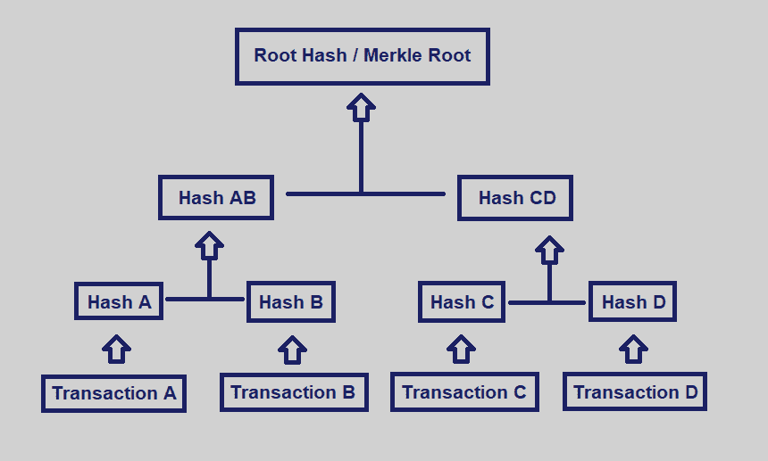

# 加密货币挖矿到底是什么？简短的介绍…

> 原文：<https://medium.com/coinmonks/a-brief-introduction-to-mining-cryptocurrencies-2095053865e7?source=collection_archive---------3----------------------->

A tl;dr to mining. Read further if you want to understand things a little better.

# 比特币:分布式记账

[比特币](https://blog.coincodecap.com/a-candid-explanation-of-bitcoin)是软件。然而，它与大多数其他软件应用程序的区别在于它是分散的。这意味着比特币网络中的每台电脑上都有该软件的副本。这些副本可以相互交流。随着*比特币*通过网络发送和接收，比特币程序在一致的基础上进行修改。每台计算机(*节点*)与其他节点一起工作，以达成一个*共识——*对网络上发生的新事务达成一致。比特币之所以特别受欢迎，是因为每枚比特币的价值。最重要的是，这一价值可以兑换成其他货币，如美元或欧元，从而使比特币成为自己眼中的货币。

与印刷的法定货币不同，比特币需要被开采。矿工利用处理能力创造新的比特币。然而，创造新的比特币只是次要的，因为挖掘的真正用途在于验证网络上发生的交易。分散的比特币网络上的每个矿工都扮演着重要的角色，因为采矿是新交易得到验证的唯一途径。这是保证网络安全的唯一方法。验证过程确保只有大多数人可以决定区块链的状态，本质上只是一个交易列表——一个保存关于谁拥有多少钱的数据的数字账簿。区块链上的交易被分组到形成链的*块*中。

区块链的最大效用是它为其内容提供的安全性。挖掘的事务是不可变的——除非攻击者能够在网络上产生超过 51%的处理能力(这是一个相当困难的策略)。事务被分组到块中。每个块包含 1 兆字节(1 MB)的事务。大约每 10 分钟就会创建一个新块。一旦被创造出来，它就可以被描述为“被开采的”。

近距离观察区块链可以发现，更大的复杂性和独创性赋予了比特币和其他加密货币真正的广度和范围，但仍有许多挑战是区块链的一部分。核心是验证交易的合法性。

## 为老问题寻找新的解决方案

使用软件作为货币的最大缺点之一是它很容易被复制粘贴。任何人都可以复制一个数字美元并重复使用——这个过程被称为“双重消费”。这将挫败它作为货币的效用，因为任何人可以不费吹灰之力凭空创造的任何东西都会迅速失去价值。

对于传统的法定货币，如美元或欧元，重复支出不是问题。一旦有人用他们的钱买东西，这些钱就会被花掉。一个人在商店里把钱交给收银员，他可能不再使用隔壁的钱。即使是银行和其他金融机构处理的电子交易，也会在中央数据库中留下记录和纸质收据。即使是精心制作的假钞也可以通过正确的技术检测出来。因此，传统菲亚特很难(如果不是不可能的话)重复支出。

在比特币发展之前，数字货币无法克服这个问题。中本聪关于比特币的[白皮书](https://bitcoin.org/bitcoin.pdf)描述了一个验证比特币网络上的交易是否真正合法的过程(并且不涉及重复消费)。简而言之，这个过程包括使用计算机处理能力，用易于验证的解决方案来解决难题。我们称之为采矿。

# 深入挖掘

由于比特币是去中心化的，比特币网络上的每台电脑(或 T2 节点 T3)上都有其区块链的副本。如前所述，由于没有中央权威机构来核实网络交易的合法性，这项任务就留给了矿工。例如，在一个完全不经核实就接受交易的网络上，任何人都可以很容易地编辑他们的分类账副本，以增加他们的持有量。网络将无法区分诚实节点和腐败节点。

矿工的任务是确保网络上的所有节点都有比特币区块链的一致副本。这是通过从未完成的事务中创建(挖掘)一个新块来实现的。换句话说，矿商将新交易归在一起，这些交易还不属于区块链。然后检查这些事务的不一致性。如果发现该块是有效的，并且网络达成共识，则该块被添加到区块链，并且每个节点用向网络通告的新块来更新其区块链的副本。

确定交易是否合法的一种方法是检查组中的每一个其他交易是否匹配*散列*(由挖掘者创建的唯一数字串)。哈希是加密货币广泛使用的一种加密技术。有许多不同类型的散列函数可用，但是它们都提供相同的效用——提供输出而不显示输入。

例如，我们可以计算单词“cat”的 256 位散列，并得出以下数字串:

*77af 778 b 51 ab D4 a3 C51 C5 DDD 97204 a 9 C3 AE 614 ebccb 75 a 606 C3 b 6865 aed 6744 e*

除了将每个字符串保持在预定的长度之外，哈希还用于保持特定输入的每个输出完全唯一。例如，单词“bat”的 256 位散列使用以下字符串:

*ca 5 bcec 12 f 716 f 44d 9745d 349 cc 80422 f 0d 14 ccab 09329 caf 533 bef 7 C2 d 952 EB*

请注意,“猫”和“蝙蝠”之间的哈希差别很大。换句话说，只看字符串是不容易猜出单词的。**哈希隐藏输入，同时显示输出**。这就是所谓的单向散列。

## 单向散列法

哈希函数接受任何输入，并提供固定大小的字符串输出。不同类型的散列函数被广泛使用，但它们都显示出四个使它们有用的特殊属性。这些属性使这些功能能够:

1.  **确定性**:对于任何输入，输出总是一样的。
2.  **高效**:寻找输出不需要大量的计算能力
3.  **唯一**:没有两个输入返回相同的输出
4.  **不可逆**:无法从输出确定输入

[Source](https://www.freecodecamp.org/news/how-bitcoin-mining-really-works-38563ec38c87/): freecodecamp.org

## 从比特到块

当 Alice 想要给 Bob 发送一些比特币时，她向 Bob 索要他的钱包地址。但是，此地址的工作方式不同于电子邮件或住宅地址。当 Alice 向 Bob 发送她的比特币时，她不是将它们发送到实际地址，而是在比特币网络上广播交易。

新事务包含的信息包括发送者(Alice)和接收者(Bob)的地址。简而言之，添加到 a 块的新条目由以下信息组成:

1.  交易的起点和终点
2.  交易的日期和时间
3.  一个*散列*——区分交易的唯一代码

每笔交易的来源和目的地都包含地址，这些地址是*公钥*，从*私钥*生成的散列，只有各自钱包的所有者才可以使用——在本例中是 Alice 和 Bob。公钥相当于地址，可以安全地共享并用作存储在区块链上的信息的一部分。

Alice 创建的事务用她的私钥签名，作为只有她而没有其他人进行该事务的证明。这些新交易，包括 Alice 发送给 Bob 的金额，在被添加到区块链之前由矿工验证，这个过程通常需要大约 10 分钟。这是矿工收集新交易、将其挖掘到新区块并从比特币网络上的其他矿工那里收到该区块合法的确认所需的大致时间。正如我们将在下一部分中看到的那样，开采每个区块所花费的时间大致是一致的。

## 困难

比特币程序的代码自动为挖矿设置了一个*难度*。这样做是为了让开采一个新区块有意地花费一些*工作*来完成。**采矿的困难阻止了对区块链的恶意使用，需要大量但可行的努力。**

难度由一个*目标散列*设定。**为了将特定散列视为有效并挖掘块，该散列必须小于目标散列。**

例如，这里是块号 [635440](https://blockchair.com/bitcoin/block/635440) 的散列:

*000000000000000000000536529 E0 fa 05 a 97966 DC 3c a61 C1 BC 1 fc eb0 a5 e 608d 51 a*

上述哈希必须小于或等于其目标值，才能被网络验证为块。举个更简单的例子，假设目标是 000536。任何带有四个零的计算散列都将有效(000089 < 000536) but some hashes with three zeroes will work (000456 < 000536) but 000789 won’t work.

Since hashing is deterministic, guessing the correct hash with a single input (a megabyte of transactions) will only lead to the same output. In most cases, this will not be an acceptable outcome. To overcome this, a number is added to the hashed input, which when rehashed falls within the difficulty limit. This number is called a ***nonce*** (一个“只使用一次的数字”)。这是一个 32 位的数字，矿工在开采一个区块时寻找。换句话说,“数学问题”本质上只是计算机的猜测工作，目的是找到正确的数字来散列输入。

找到随机数极其困难，更像是中了彩票。拥有更强的计算能力让矿工更有机会成为第一个发现这个数字的人。一旦发现了可以生成小于或等于目标散列的散列的随机数，随机数的发现者就为他们的发现赢得奖励，并且在块可以被挖掘之前，随机数被通告给网络。

为了确保每个区块在大约 10 分钟内被开采，开采难度根据总网络*散列率*每 2016 个区块进行自我调整，该散列率以兆散列(每秒一百万个散列)、千兆散列(每秒十亿个散列)和万亿散列(每秒万亿个散列)来衡量。

生成一个新块的平均时间可以使用以下公式计算:

时间=难度* 2 * 32/hashrate

大约 232 分之一或 42 亿分之一的散列成功。一个人试图使用 1200 万哈希/秒的 CPU 进行挖掘，需要数百万年才能成功。采矿的难度和所需的工作确保了区块链只能通过*共识*来修改。换句话说，只有通过集体努力才能改变区块链。这是保持比特币安全的原因。

如果没有设定的难度，对现代计算机来说，为一个新块提出一个目标散列将是微不足道的。要求矿工执行大量的工作会极大地阻碍区块链上的任何恶意活动。这项必要的工作被称为工作证明(proof-of-work，简称 PoW)，这是哈尔·芬尼(Hal Finney，也是第一笔比特币交易的接受者)为数字货币开发的一个概念。

## 工作证明

区块链是不可改变的。开采的区块不能被改变。这种不变性的存在是由于诸如散列函数之类的加密机制，以及挖掘有效事务所需的大量时间和资源。

区块链上的每个块都包含有关其内容的信息:块中包含的每个事务、时间戳以及区块链中前一个块的散列。试图改变已经挖掘的块的内容的恶意用户将不得不重新挖掘该块，以便找到有效的散列。这是因为，即使通过增加发送到特定钱包的比特币数量来改变数据块中的一位数据，也会导致完全不同的哈希。

这不仅会让计算能力有限的用户花费大量的时间，而且即使尝试成功了也不会有什么不同。这是因为该块需要被网络上的大多数节点接受。换句话说，这即使不是不可能，也是极其困难的。

## Merkle 树

对区块链来说，散列法有助于缓解重复支出的问题。冲突的事务或显示相同散列的事务被自动从新块中丢弃。

当找到一大块有效交易时，它就被构建成一棵 *merkle 树*。简单来说，**merkle 树可以被认为是一棵上下颠倒的树，树根在上面，树叶在下面。交易形成了树底部的叶子。**

[Source](https://hackernoon.com/merkle-trees-181cb4bc30b4): Hackernoon

Merkle 树有助于识别特定事务是否是块的一部分。这是通过连续散列成对的事务直到只剩下单个散列或*根散列*或 *merkle 根散列*来实现的。如果收集了奇数个事务，则复制最后一个事务以创建偶数个树叶。因为散列函数的任何输入都会导致单一的确定性输出，所以只要其中的事务保持不变，merkle 根就总是相同的。merkle 根也是唯一的，充当一个块中所有事务的标识符。

**Merkle 树对于区块链是必不可少的，因为它们允许矿工创建每个块的内容的散列。**如前所述，改变块中的单个数据位会完全改变块的散列。因此，对网络的恶意攻击可以简单地通过将修改块的 merkle 树的根与有效块的 merkle 树的根进行比较来防止。

## 块标题

比特币区块链上的每个区块都包含六个重要的数据，这六个数据被称为区块头。这是一个 80 字节的字符串，经过进一步哈希处理后将用于下一个块。

1.  **版本号** —版本号描述了块所遵循的块验证规则。在比特币的发展过程中，人们使用了不同的区块版本。4 字节。
2.  **先前块散列** —用作指针的先前块头的散列。改变该值需要改变区块链上的每一个先前的块*。这是区块链永恒性的关键。32 字节。*
3.  **Merkle root** —区块链 Merkle root 的散列，该散列是包含在该块中的所有事务的散列的派生。32 字节。
4.  **时间戳** —自 1970 年 1 月以来经过的秒数。这是以 Unix 纪元时间来衡量的。时间戳记录在挖掘器开始散列报头的确切时刻。4 字节。
5.  **难度目标(位)** —一个哈希值，描述块头的哈希值必须达到的最大值。4 字节。
6.  **Nonce** —修改标题哈希的数字，使得产品哈希小于或等于目标难度阈值。4 字节。

实际上，每个连续的字段都位于前一个字段的顶部。块头的代码如下所示:

[Source](https://www.datadriveninvestor.com/2019/11/21/a-decomposition-of-the-bitcoin-block-header/#): datadriveninvestor.com

# 挖掘算法

并非所有的区块链都是一样的。有许多不同的算法用于验证每个区块链上的交易。这些只是今天最流行的。

## SHA-256

安全哈希算法(Secure Hash Algorithm)的简称，SHA-256 算法是早期加密货币(如比特币)使用的一种流行的哈希函数。该算法从输入中产生一个*消息摘要*或一串数字。该算法不能为任何输入生成两个不同的输出，因此它用于检查输入(如文件)的完整性，因为对内容的任何更改都会导致不同的输出。

ASIC 挖掘器是专门为 SHA-256 算法设计的。

## Scrypt

Scrypt 是由 Colin Percival 开发的，用于使大规模定制硬件攻击难以执行。该算法利用了大量的内存，并抵消了 ASICs 使用的逻辑门的效率。各种加密货币，如莱特币，使用简化版本的 scrypt 算法作为工作证明，以减轻由于矿业公司采用大规模 ASIC 硬件而在比特币社区发生的计算能力集中化。

不幸的是，scrypt 算法中的简化原本只是为了保持 CPU 挖掘的可行性，最终导致了不可预见的后果。今天，已经有了基于加密的专用集成电路，谴责阻止中央集权的努力是失败的。

## 神秘之夜

与 scrypt 类似，CryptoNight 是本着平等的理念开发的。该算法利用内存，特别是 CPU 的 L3 缓存，这使得它对于缺乏缓存的 GPU 和 ASICs 来说效率低下。它通过调用“便笺式存储器”强调随机访问速度和对内存延迟的依赖，便笺式存储器是为存储工作数据分配的 2 MB 内存。换句话说，内存的使用阻止了算法被 ASICs 使用，并大大降低了 GPU 的效率。

尽管该算法是由几家制造商开发的专用集成电路的目标，但 CryptoNight 的开发者已经设法反复增加该算法的内存限制。

许多流行的加密货币如 Monero 和 Bytecoin 都使用 CryptoNight。

## Ethash

Ethash 是作为以太坊区块链的工作验证算法而开发的。它是由 Vitalik Buterin 和以太坊团队开发的 Dagger-Hashimoto 算法的更新版本。就像其他 SHA-256 替代品一样，Ethash 被设计用来抵抗 ASICs。

Ethash 可以被 CPU 和 GPU 使用。虽然使用这种算法的 CPU 挖掘不再有利可图，但它仍然可以充分支持智能合同或促进网络上的加密货币交易。可以使用名为“geth”的以太坊客户端进行 CPU 挖掘。

使用 Ethash 的 GPU 挖掘效率要高得多，但每个 GPU 至少需要 1–2gb 的 RAM。AMD GPUs 也比 Nvidia 表现更好。GPU 挖矿可以用 Ethminer，一个 Ethash 挖矿软件来完成。

虽然使用 Ethash 进行 ASIC 挖掘是可能的，但是以太坊社区和开发者都不鼓励这样做。

## X11

X11 算法是由埃文·达菲尔德在 2014 年开发的。它因实现了 11 种不同的工作证明散列算法而得名。分别是:布雷克、宝马、groestl、jh、凯克克、斯凯因、路飞、库比哈希、沙维特、simd、echo。

与其他挖掘算法相比，X11 以节能著称。它的效率比 SHA-256 大约高 30%。

# 结论

虽然这并不全面，但我希望您现在能够对矿业和区块链有更多的了解。

## 另请参阅:

*   [管理比特币挖矿的 6 大软件](https://blog.coincodecap.com/top-6-softwares-for-managing-bitcoin-mining)
*   [一个简单的采矿池指南](https://blog.coincodecap.com/a-simple-guide-to-mining-pools)
*   [最佳加密交易机器人](/coinmonks/whats-the-best-crypto-trading-bot-in-2020-top-8-bitcoin-trading-bot-c16adeb13317)
*   最好的比特币[硬件钱包](/coinmonks/the-best-cryptocurrency-hardware-wallets-of-2020-e28b1c124069?source=friends_link&sk=324dd9ff8556ab578d71e7ad7658ad7c)
*   最好的[加密税务软件](/coinmonks/best-crypto-tax-tool-for-my-money-72d4b430816b)
*   [最佳加密交易平台](/coinmonks/the-best-crypto-trading-platforms-in-2020-the-definitive-guide-updated-c72f8b874555)
*   最佳[加密贷款平台](/coinmonks/top-5-crypto-lending-platforms-in-2020-that-you-need-to-know-a1b675cec3fa)
*   Bitmex 上的[保证金交易的白痴指南](/coinmonks/the-idiots-guide-to-margin-trading-on-bitmex-dbbd7742c6fc?source=friends_link&sk=7bfa99d2a181142510c8442c8ddb0786)
*   加密摇摆交易的权威指南
*   [Bitmex 高级保证金交易指南](/coinmonks/bitmex-advanced-margin-trading-guide-2270c195ce25?source=friends_link&sk=1d986cca731f5084b9a2db4a4bc4a7ad)
*   开发人员的最佳加密 API
*   [加密套利](/coinmonks/crypto-arbitrage-guide-how-to-make-money-as-a-beginner-62bfe5c868f6)指南:新手如何赚钱
*   顶级[比特币节点](https://blog.coincodecap.com/bitcoin-node-solutions)提供商
*   最佳[加密制图工具](/coinmonks/what-are-the-best-charting-platforms-for-cryptocurrency-trading-85aade584d80)

> [在您的收件箱中直接获得最佳软件交易](https://coincodecap.com?utm_source=coinmonks)

