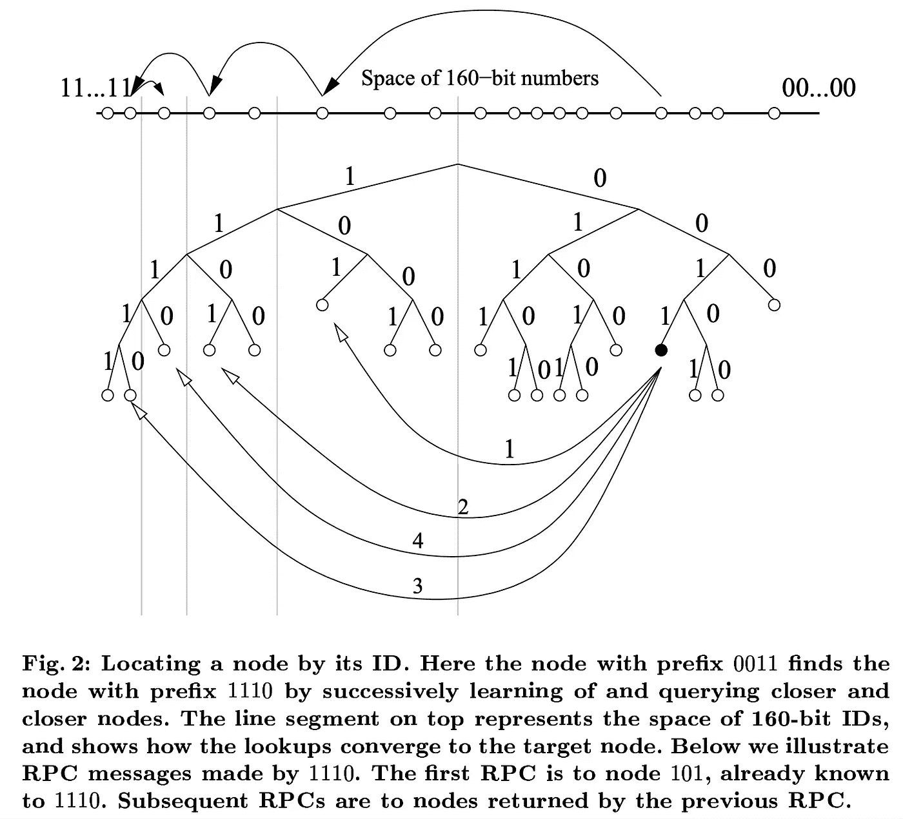
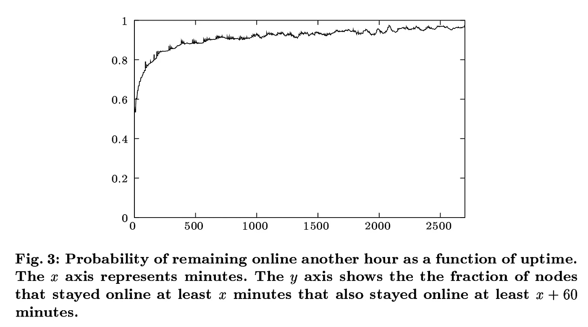

# Kademlia 的简要概述，及其在各种分散平台中的使用

> 原文：<https://medium.com/coinmonks/a-brief-overview-of-kademlia-and-its-use-in-various-decentralized-platforms-da08a7f72b8f?source=collection_archive---------0----------------------->

Kademlia 是一个分布式哈希表，在许多现代分散协议中实现，包括 Storj V3 网络、以太坊、BitTorrent、Swarm 和 IPFS。

Kademlia 为数百万台计算机提供了一种自组织成网络、与网络上的其他计算机通信以及在计算机之间共享资源(例如文件、blobs、对象)的方式，所有这些都不需要由个人或公司运行的中央注册表或查找。

Kademlia 由 Petar Maymounkov 和 David Mazières 于 2002 年构思，通常被认为是推动了第三代扁平层次计算协议的采用，因为它比集中式和基于泛洪的节点发现和路由方法更加可靠和高效。

Kademlia 的分布式特性意味着不存在 NodeIDs 映射到其地址的绝对事实(即，路由表是*分布式的*，因此每个节点必须在自己的路由表中为网络上的节点子集保留这种映射。

基于 Kademlia 的网络对拒绝服务攻击和一组节点的丢失具有很强的抵抗力，因为协议只是简单地绕过不可用的节点。

这使得分布式系统能够抵御攻击、停机和[中心故障点](https://storj.io/blog/2018/11/the-benefits-of-decentralization-go-far-beyond-ideology/)。

Kademlia 的重大突破是通过使用 XOR 度量(将在下一节中描述)来定义密钥空间中各点之间的距离，从而最大限度地减少节点间的消息传递。

因此，如果距离被表示为 log2(n)个节点，这意味着对于具有 10，000，000 个 Kademlia 节点的网络，对于与任何节点子集的通信，最多只需要大约 20 跳。

“[*The shortest distance between two points is not always a straight line.*](https://metaquestions.me/2014/08/01/shortest-distance-between-two-points-is-not-always-a-straight-line/)“ Image Source: ([*Maymounkov,* et al.](https://pdos.csail.mit.edu/~petar/papers/maymounkov-kademlia-lncs.pdf))

Kademlia 的另一个优势是，该协议自然更喜欢长寿命的节点，而不是新加入的节点。下图(摘自 Kademlia 的论文)说明了一个事实，即一个节点存在的时间越长，它在未来保持在线的可能性就越大。

这种对节点“活跃性”的偏好很自然地融入到我们的分布式存储系统中，在这种系统中，节点流失会导致一种情况，即[修复成本必须最小化](https://storj.io/blog/2019/01/why-proof-of--replication-is-bad-for-decentralized-storage-part-2-churn-and-burn/)。

Source: ([*Maymounkov,* et al.](https://pdos.csail.mit.edu/~petar/papers/maymounkov-kademlia-lncs.pdf))

加入 Kademlia 网络的过程只需要发现一个对等点，然后节点广播它的出现。然后，发起者从每个响应中收集 NodeID，并将其添加到自己的对等表中。(这就是术语“分布式哈希表”的来源。)

这导致了第三个优点，Kademlia 使用并行和异步查询防止了超时延迟或从已经脱离或离开网络的故障节点的“恢复阻塞”。

接下来，我将快速浏览一下 Kademlia 网络的基本组件:

## 卡德姆利亚 NodeIDs

Kademlia 将网络上的每个节点视为二叉树上的一片叶子。通常，每个 Kademlia 节点都有一个 160 位的 NodeID (SHA-1 ),其位置由其 ID 的最短唯一前缀决定。

为了将键值对分配给特定的节点，Kademlia 依赖于两个标识符之间的距离概念。给定两个 160 位标识符 x 和 y，Kademlia 将它们之间的距离定义为 XOR。

从节点的角度来看，树被分成一系列连续的子树，其中第 160 个子树包含单个节点。Kademlia 协议确保每个节点至少知道其每个子树上的一个节点。有了这种保证，一个节点可以通过它的 ID 定位任何其他节点。

## 路由表和 K 桶

路由表是一棵二叉树，它的叶子是 k 桶。Kademlia 路由表的结构是这样的，即节点维护离它们最近的地址空间的详细信息，并以指数方式减少对更远的地址空间的了解。

对称性是有用的，因为这意味着这些最接近的联系人中的每一个都将维护地址空间的相似部分的详细信息，而不是远程部分。

**K 桶**是网络中其他节点的路由地址列表，由每个节点维护，包含系统中对等参与者的 IP 地址、端口和 NodeID。他们更喜欢寿命最长的节点，这意味着人们不能通过用新节点淹没系统来超越节点的路由状态(从而防止某些类型的 DDOS 攻击)。

路由表大小由`O(log₂(n/k))`渐近限定，其中 *n* 是网络中节点的实际数量，而 *k* 是存储桶大小，因此较大的存储桶实现稍微减少了路由表中存储桶的总数。

## 对等消息传递

像 Kademlia 这样的分散式协议要求对等体使用相同的语言，这样它们就可以找到彼此，识别彼此的位置，并交换消息。

Kademlia 协议由四个远程过程调用(RPC)组成:

1.  **PING:** 探测一个节点，看它是否在线
2.  **存储:**指示节点存储一个键值对
3.  **FIND_NODE:** 返回与目标 id 最近的 k 个*节点的信息*
4.  **FIND_VALUE:** 类似于 FIND_NODE RPC，但是如果接收方已经接收到给定键的存储，它就返回存储的值

# **Storj 的 Kademlia(**白皮书章节 **3.3 和 4.6)**

Storj V3 网络是备受期待的 Storj 分布式和分散式对象存储平台的下一个版本。

新的网络使用 Kademlia 的修改版本作为类似 DNS 的功能的主要来源，用于*节点查找*，即使网络不需要 Kademlia 的键/值存储方面。

在构建之前的 Storj 网络时，我们非常关注 Kademlia 的实现，甚至围绕协议构建了一个[文件系统概念。我们很快意识到在分布式存储网络中使用修改的 k-bucket 的一些性能限制，并在 Storj V3 中解决了这些问题。](https://storj.io/blog/2016/09/introducing-kfs-a-local-file-store-inspired-by-kademlia/)

将 Kademlia 单独用于节点查找，可以消除 Kademlia 原本需要的一些其他功能，例如基于所有者的密钥重新发布、基于邻居的密钥重新发布、值的存储和检索等等。

此外，为了保证节点通信的安全性并提供完全的隐私性，每个对等体必须以只有目标参与者才能理解的加密语言相互通信(以避免窃听者和中间人攻击)。

出于这个原因，我们已经实现了大量的 [S/Kademlia 扩展](https://ieeexplore.ieee.org/document/4447808)，以在适当的时候启用安全的基于密钥的路由协议。

S/Kademlia 还提供了针对分布式系统的某些攻击的基本防护层，特别是:

1.  **Sybil 攻击** —用户生成大量任意身份(NodeIDs)来淹没网络。
2.  **Eclipse 攻击** *—* 攻击者试图通过确保所有出站连接都到达恶意节点来隔离网络图中的一个节点或一组节点。

S/Kademlia 扩展通过为节点生成创建最小工作阈值来防止地址空间上的 sybil 攻击。存储 NodeID 的生成不需要在比特币(以及类似的共识协议)中实现工作证明，而是需要在 0 的*位之后添加*位。这允许我们继续使用 Kademlia XOR 路由。

这减慢了添加新节点的过程，并且需要计算生成 NodeID 的开销，但是该工作的结果被合并到 NodeID 中。这允许我们继续使用 XOR 路由，而不需要增加额外的步骤来验证 NodeID 已经完成了工作。

在定义 V3 网络规范的过程中，我们与 Kademlia 作者 **Petar Maymounkov** 进行了密切的磋商，他也被列为 [V3 白皮书](https://storj.io/white-paper)的撰稿人(特别是他围绕[第 4.6.1 节](https://storj.io/storjv3.pdf#page=35)所做的工作)

Storj 通过使用公钥散列作为 NodeIDs、基于这些公钥的签名、节点审查过程以及 S/Kademlia 和 Maymounkov 的贡献所规定的多重分离网络查找来保护自己免受 eclipse 攻击。

## 在 Storj V3 中克服 Kademlia 的限制

为了设计一个全局可伸缩、高性能的分布式对象存储层，我们必须考虑一些限制。

首先，像 Kademlia 这样的 DHT 需要多次网络往返才能完成许多操作，这使得它很难实现毫秒级的响应时间。

Storj 卫星上的覆盖缓存会跟踪最新的在线节点。如果在**覆盖缓存**中没有找到它们，那么我们标记节点必须离线，因此擦除份额消失，从而进入[数据修复过程](https://storj.io/blog/2018/12/decentralized-auditing-and-repair-the-low-key-life-of-data-resurrection/)。

有趣的是，存储节点本身与 DHT 缓存层是分离的，也就是说，它们可以在不与卫星联系的情况下进行通信和组织。然而，为了使客户端上传/下载发生，它们需要协调代理(卫星)介入并与它们通信。

当每个 Kademlia FIND_NODE RPC 在覆盖层上共享时，消息包括存储节点的可用磁盘空间、每个卫星的可用带宽以及网络需要的任何其他元数据。节点发现缓存将收集这些由节点提供的信息，从而优化查找速度。

然后，参与的存储节点对卫星执行广泛的审查过程，以确保它所通告的资源的可用性。该过程为存储节点设置[基准信誉，并将](https://storj.io/blog/2019/01/reputation-matters-when-it-comes-to-storage-nodes/)[收益潜力](https://storj.io/blog/2019/01/sharing-storage-space-for-fun-and-profit/)考虑在内。

因此，进入路由表的节点被认为被网络“审查”,并且查找仅通过审查的节点进行。

这确保了只有具有经验证的磁盘空间的节点才能够进入和参与路由层，同时还增加了对网络容量的了解，并且还防止了攻击。

# 以太坊协议中的 Kademlia 用法

以太坊的区块链网络堆栈中的节点发现协议是基于 Kademlia 的一个略微修改的实现。

以太坊利用 Kademlia 的 XOR 度量和 k-bucket 结构，与 Storj 类似，lookup 主要用于发现新的对等体。

在以太坊中，客户端将其他节点的信息存储在两种数据结构中。第一个是名为 db 的长期数据库，它存储在磁盘上，在客户端重新启动后仍然存在。第二个是短期数据库，称为 table，它包含类似 Kademlia 的 bucketss，每当客户端重新启动时，这些 bucket 总是为空。

值得注意的是，以太坊最初的 Kademlia 实现容易受到 **eclipse 攻击** 的攻击，攻击者生成一组以太坊 NodeIDs，然后使用协调的策略从两台主机(每台只有一个 IP 地址)发起 eclipse 攻击。

Storj 能够避免这种情况，因为前面提到的 [4.6.1](https://storj.io/storjv3.pdf#page=35) 和 S/Kademlia 扩展，其中卫星审查过程和工作证明证书生成使得 NodeID 生成的成本对于潜在的攻击者来说不是微不足道的。

## 星际文件系统协议中的 Kademlia 用法

行星间文件系统(IPFS)也使用 Kademlia，带有 Coral DSHT 和 S/Kademlia 扩展。在 IPFS 的实现中，NodeID 包含一个到 IPFS 文件散列的直接映射。每个节点还存储从哪里获取文件或资源的信息。

许多项目都希望利用 Storj 网络作为 IPFS 的对象商店。其中最引人注目的是 RTrade，它正在构建一个由 Storj 支持的 IPFS 节点，以确保其 IPFS 文件的可用性和持久性。

## 群协议中的 Kademlia 用法

Swarm 的主要目标是为以太坊的公共记录提供足够分散和冗余的存储，特别是存储和分发 dApp 代码和数据，以及区块链数据。

群网络中的参与者在 Kademlia DHT 中通过群基本帐户的以太坊地址的散列来识别。这用作它们的覆盖地址，基于这些地址计算邻近顺序箱。

与大型对象存储相比，Swarm 最适合与以太坊智能合约相关的较小数据位。

Swarm 使用最大 4k 的碎片大小，TB 大约是 1000000000kb。因此，对于一个更大的对象，比如 1tb，要上传到 Swarm，将需要 250，000，000 个节点(仅略少于美国的人口)。

相比之下，Storj 更适合存储大型对象，因为我们只需要找到足够的节点来覆盖擦除份额。

Swarm 还实现了一个被称为*责任邻域*的概念，它采用了一种新颖的[冗余策略](https://swarm-guide.readthedocs.io/en/latest/architecture.html#redundancy)来确保节点流失时的可用性。根据我们操作之前 Storj 网络的经验，我们了解到碎片复制可能是一种确保文件持久性的[低效方式](https://storj.io/blog/2019/01/why-proof-of--replication-is-bad-for-decentralized-storage-part-2-churn-and-burn/)，尤其是在节点变动和上游带宽受限的环境中。

# 结论

了解 Kademlia 的最好方法之一就是看它的实际应用。您可以[加入 Storj 网络](https://storj.io/sign-up-farmer)来共享未使用的存储和带宽，并操作我们网络上的一个节点。

希望这篇文章能很好地概述 Kademlia 及其在现代分布式平台中的应用。Kademlia 和 XOR metric 是一个强大而有效的工具，在现代网络 Storj V3、以太坊、IPFS 和 Swarm 中用于查找、路由和节点发现。

*您有什么意见或代码更改可以让 Storj 变得更好吗？请发送一个拉取请求。Storj V3 网络的所有代码都是开源的，您可以通过我们的 repo、* [*这里的*](https://github.com/storj/storj) *查看我们当前的 Kademlia 实现。*

*你可以通过查看我们的* [*V3 网络白皮书*](https://storj.io/white-paper) *来了解更多关于 Storj 中 Kademlia 的用法。*

> 加入 Coinmonks [电报频道](https://t.me/coincodecap)和 [Youtube 频道](https://www.youtube.com/c/coinmonks/videos)获取每日[加密新闻](http://coincodecap.com/)

## 另外，阅读

*   [复制交易](/coinmonks/top-10-crypto-copy-trading-platforms-for-beginners-d0c37c7d698c) | [加密税务软件](/coinmonks/crypto-tax-software-ed4b4810e338)
*   [网格交易](https://coincodecap.com/grid-trading) | [加密硬件钱包](/coinmonks/the-best-cryptocurrency-hardware-wallets-of-2020-e28b1c124069)
*   [密码电报信号](/coinmonks/top-3-telegram-channels-for-crypto-traders-in-2021-8385f4411ff4) | [密码交易机器人](/coinmonks/crypto-trading-bot-c2ffce8acb2a)
*   [最佳加密交易所](/coinmonks/crypto-exchange-dd2f9d6f3769) | [印度最佳加密交易所](/coinmonks/bitcoin-exchange-in-india-7f1fe79715c9)
*   [开发人员的最佳加密 API](/coinmonks/best-crypto-apis-for-developers-5efe3a597a9f)
*   最佳[密码借贷平台](/coinmonks/top-5-crypto-lending-platforms-in-2020-that-you-need-to-know-a1b675cec3fa)
*   杠杆代币的终极指南