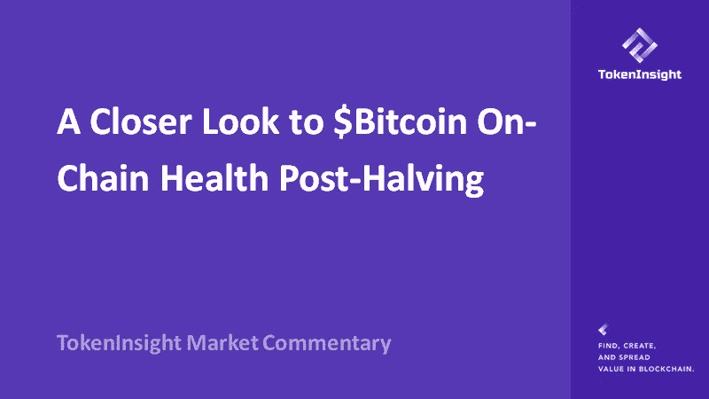
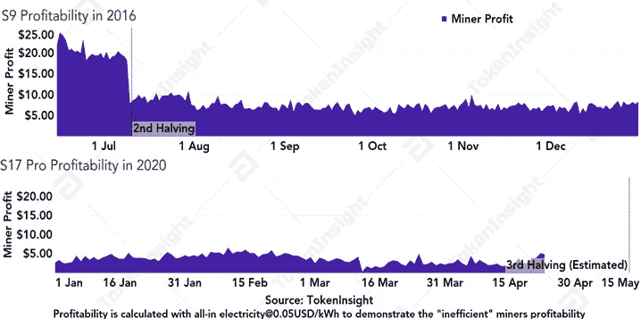
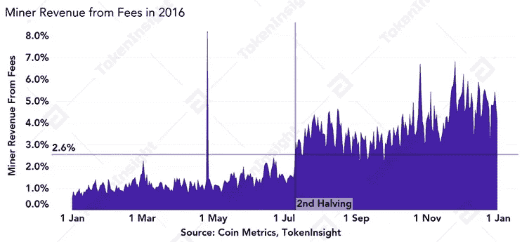
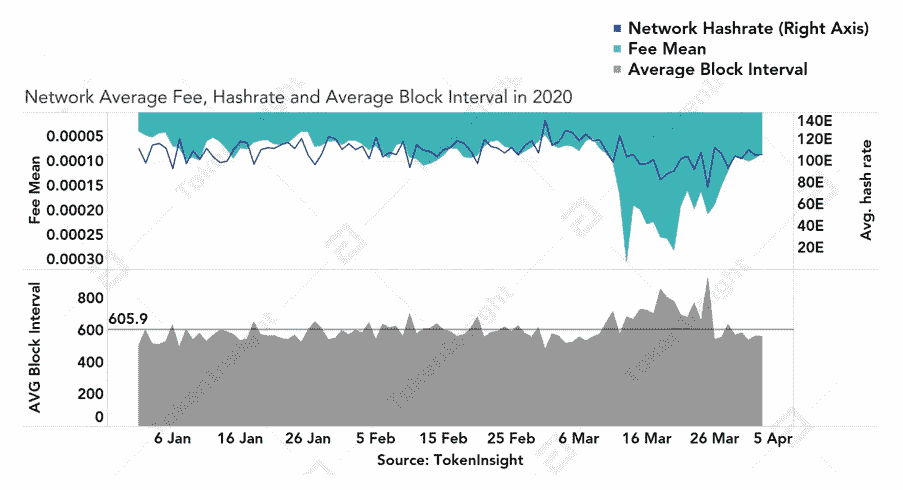
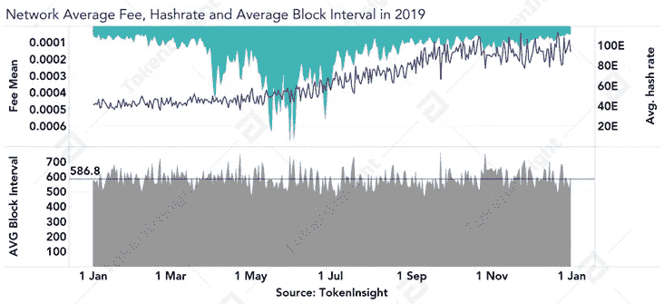
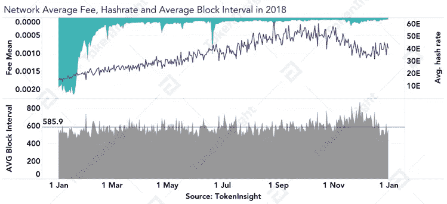
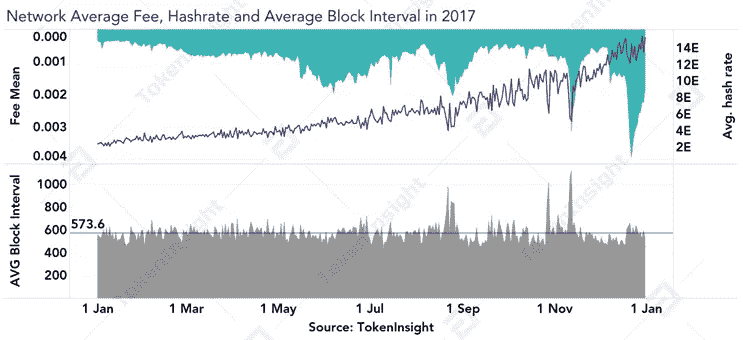

# 减半后比特币链上健康状况的进一步观察

> 原文：<https://medium.com/coinmonks/a-closer-look-to-bitcoin-on-chain-health-post-halving-f903ff1693b7?source=collection_archive---------1----------------------->

## 网络岗位减半会怎么样？

(TokenInsight Research 于 2020 年 4 月 28 日发布)

作者:徐强森

电子邮件:[johnson@tokeninsight.com](mailto:johnson@tokeninsight.com)

# **概述**

比特币第三次减半还有不到两周的时间，业界很想知道减半后比特币网络会发生什么。TokenInsight 围绕 hashrate、矿商收入、区块间隔、BTC 边际创造成本对数据进行了细分，以深入讨论减半后比特币网络可能会发生什么。

根据我们的分析，我们得出以下结论:

*   随着老一代 ASICs(例如 S9)逐渐退出比特币网络，网络哈希速率在减半后应该会经历合理的下降。
*   在减半后，矿商来自费用的收入至少会暂时翻倍.
*   短期平均费用可能会在减半后飙升，只要 hashrate 看到合理的下降，而网络活动保持减半前的状态。
*   每笔交易的长期平均费用取决于网络活动和网络散列的动态。
*   由于网络哈希速率的合理下降，平均块间隔将在减半后的短期内增加。

# **随着老一代专用集成电路(如 S9s)逐渐退出比特币网络**，网络哈希速率在减半后应该会有一个合理的下降

由于矿工在减半之前和之后都获得了健康的利润，2016 年发生的第二次减半并没有带来任何有意义的利润减少。换句话说，对于矿工来说，仍然有很大的激励去继续采矿获利。

我们认为第三次减半与 2016 年的第二次减半不同。根据我们的分析，当前矿商的利润率明显低于 2016 年，市场上最高效的矿商(例如 S17 Pro)在减半前每天收入不到 5 美元，而 2016 年市场上最高效的矿商(例如 S9)在减半前每天收入约 20 美元或减半后每天收入约 8 美元。

除非比特币在减半后迅速反弹至$10K，否则我们认为大多数 S9(效率最低的矿工)将至少暂时关闭，并在长期内永久关闭。

BTC 边际创造成本也表明，为 S9s 等专用集成电路开采 1 BTC 的成本徘徊在 6K 美元左右，目前仅赚取约 15%的利润率。当比特币第三次减半开始生效时，S9s 的边际创造成本将立即翻倍，至少达到 1000 美元 10K。那些矿工继续开采比特币没有任何经济利益。

# **来自费用的%矿商收入将会有所增长，至少暂时如此**

随着比特币网络按计划进行第三次减半，将块奖励从 12.5 削减至 6.25，减少块奖励在总矿工收入中的比例(块奖励+交易费)，矿工的费用收入将在短期内增长约 2 倍。miner 来自费用的长期收入百分比将取决于网络活动。

在 2016 年第二次减半后，该网络经历了来自费用的矿工收入的立即跃升。

# **平均交易费用可能会在短期内飙升**

在减半后的短期内，该网络的平均交易费用可能会出现飙升，而一些效率低下的矿工会投降并关闭他们的钻机，从而降低网络哈希拉，同时比特币网络在减半后的第一个困难调整期内重新平衡到平衡状态。

根据分析，我们认为网络平均费用暂时飙升主要有两个原因

1.当前困难时期的网络活动增加，而 hashrate 保持相对稳定，表现为相对恒定的平均块间隔，但平均交易费用较高。

2.哈希速率在短期内显著降低，而网络活动的降低不足以补偿哈希速率的降低，这由块间隔的增加来表示。

我们分析了第二次比特币减半后 4 年的数据。在此期间，比特币网络的平均交易费用多次飙升，

*   2020 年 3 月:由于短期内 hashrate 显著下降(原因 2)
*   2019 年 5-6 月:由于网络活动增加(原因 1)
*   2018 年 11 月:由于短期 hashrate 显著下降(原因 2)
*   2017 年 12 月:由于网络活动增加(原因 1)
*   2017 年 11 月:由于短期 hashrate 显著下降(原因 2)
*   2017 年 8 月:由于短期 hashrate 显著下降(原因 2)
*   2017 年 6 月:由于网络活动增加(原因 1)

根据分析，我们认为预计在 2020 年 5 月 12 日发生的第三次比特币减半可能会导致平均交易费用短期飙升，原因是短期 hashrate 突然下降(原因 2)。

# **在减半后，平均数据块间隔将在短期内增加**

随着一些效率低下的矿工关闭他们的钻机，网络散列率降低，导致在当前困难时期解决区块的难度增加，直接影响区块生成，从而增加平均区块间隔。

然而，一旦比特币网络到达下一个难度调整窗口，网络将重新调整其难度目标，并使网络达到平均每块 10 分钟的平衡。

# **最后的想法**

比特币网络是一个自平衡网络，它将根据哈希速率和难度水平重新调整其网络，以保持平均每块 10 分钟。当网络活跃度明显较高或短期内网络流量显著下降时，网络参与者有足够的动机在短期内支付更高的费用。

# 关于 TokenInsight

**token insight 成立于 2017 年，是一家领先的数据&技术驱动的区块链金融机构。** TokenInsight 首创完整的区块链行业分类体系，覆盖超过**1600 个项目，**发布超过 **300 份评级报告，**深入研究 **10 大行业。**

TokenInsight 的数据、评级和研究报告可以访问全球 70 多个数据平台，包括 **Messari、Delta、币安信息、AICoin、火币信息、**等。，月 PV 超过 3000 万。TokenInsight 已正式加入由加密货币排名网站 CoinMarketCap 发起的数据问责与透明联盟(Data)。

# 如果您喜欢我们的评论，请关注我们:

💡官方网站:[https://www.tokeninsight.com](https://www.tokeninsight.com/)

📌领英官方页面:[https://www.linkedin.com/company/tokeninsight/](https://www.linkedin.com/company/tokeninsight/)

🔎电报:

🗺https://www.twitter.com/tokenInsight

📕https://www.reddit.com/r/TokenInsight/

> [直接在您的收件箱中获得最佳软件交易](https://coincodecap.com/?utm_source=coinmonks)

