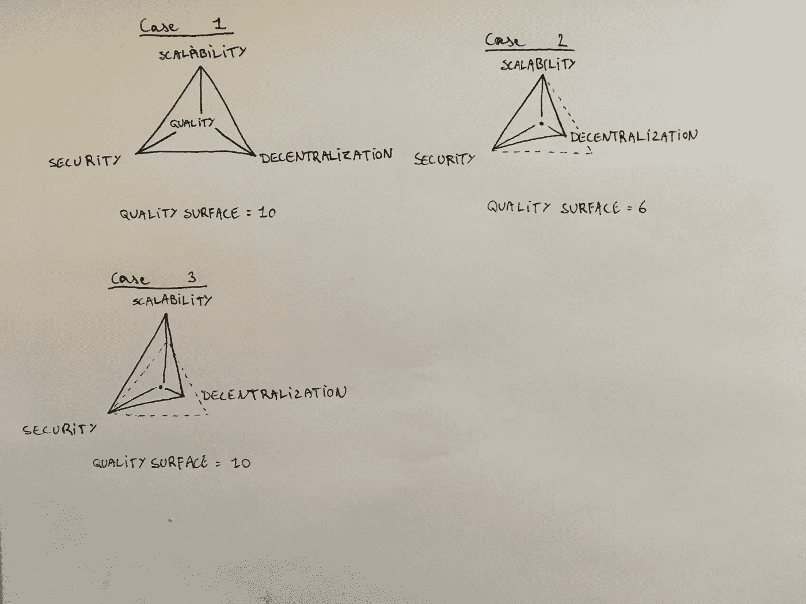
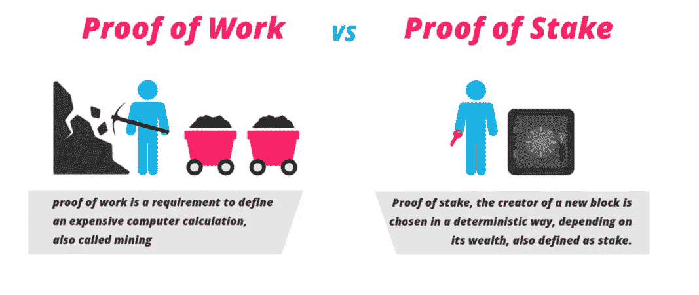

# 区块链平台对比—第 1 部分:竞争对手

> 原文：<https://medium.com/coinmonks/a-comparison-of-blockchain-platforms-part-1-competitors-381f9434cf96?source=collection_archive---------1----------------------->


## 这是这个系列的第二部分。在这篇文章中，我将讨论一些竞争对手，并解释我将在哪些方面对他们进行评估。享受吧。

在我们开始之前，我想弄清楚一些事情。很多人似乎认为区块链平台的竞争将会是赢家通吃。我*不*认为会是这样，而且理由很充分。许多平台关注不同的方面，一些关注速度，一些关注隐私，还有一些关注易用性。此外，在我看来，一个多国主导的区块链似乎是不可能的，因为这个世界仍然太过分裂。每个国家都有自己的规则和原则，因此在一个国家，一个区块链会比另一个更受欢迎，而在另一个国家则会发生相反的情况。

> [发现并回顾最佳区块链软件](https://coincodecap.com)

开发者自己也会有自己的喜好。可能有一个对最终用户非常有效的区块链，但是没有一个开发人员喜欢智能合同语言。这些都是微不足道的例子，但它们说明了一个问题。**这不是赢家通吃的情况**。

# 区块链 2.0

在我之前的文章中，我们讨论了从比特币(区块链 1.0)到以太坊(区块链 2.0)的过渡。既然你已经理解了这一切的*原因*，我们可以开始解决以太坊面临的一些障碍了。这些关卡将作为不同平台的评估点。

你可能听说过[隐猫](https://www.cryptokitties.co/)。CryptoKitties 就是所谓的[密码收藏品](https://www.coindesk.com/crypto-collectables-ethereums-next-killer-app-is-on-its-way/)。把它想象成可收藏的纸牌游戏——它们实际上没有任何内在价值，但人们还是愿意为它们付费。曾经有一段时间，围绕 CryptoKitties 有太多的炒作，以太坊网络跟不上。费用飙升，交易时间太长，无法确认。由于网络堵塞，一些 ico 甚至不得不改期。这就指出了一个很重要的瓶颈: [**扩展性**](https://blockgeeks.com/guides/blockchain-scalability/) 。


How to kill the Ethereum network:

# 可量测性

## 权衡取舍

Visa 平均每秒处理 2000 笔交易(tps)，峰值速率为 56，000 tps。作为对比，以太坊目前的状态下，大约能处理 20 tps，而比特币只能处理 7 左右。那太慢了。当然，将集中式支付处理器与分散式网络进行比较是很容易的，但它提供了一些对比。很明显，可伸缩性是一个真正的问题，如果找不到解决方案，情况会变得更糟，因为我相信这些网络只会越来越大。

当谈到区块链的可伸缩性时，不提及 Vitalik Buterin 的三难困境是愚蠢的。三难困境包括以下几个方面:

*   可扩展性，
*   去中心化，
*   安全性

维塔利克说，一个特定的区块链可以*只*拥有其中两个，同时牺牲另一个。我认为它不那么绝对，我将举例说明我的意思。



Visual representation of the blockchain trilemma

通过使用三角形，可视化这个三元悖论变得容易多了。每个角代表一个方面，表面积可以被认为是整体质量。

**案例一:完美网格。**第一个三角形是一个偶数三角形，它具有当前可能的每个方面。如果要我把以太坊归于一个型号，那就是这个。

**案例二:表现不佳。这个型号不好。它没有尽可能地分散，甚至没有改善其他方面。**

**案例三:可扩展。**在案例 3 中，区块链显然更喜欢可扩展性而不是分散性。虽然质量表面保持不变，但我认为权力下放是区块链最重要的方面，不应该为了速度而牺牲它们——哪怕是部分牺牲。近地天体可以归因于这种模式。

## 韵律学

重要的是要认识到可伸缩性不是一个单一的指标，而是各种性能和安全性指标的组合。

我发现将可伸缩性分解成这两个瓶颈最有用:**吞吐量**和**延迟**。

*   **吞吐量**:最大吞吐量是区块链可以确认交易的最大速率。比特币的是~7 tps，以太坊的是~20 tps。这个数字由最大块大小和块频率/块时间定义(比特币每 10 分钟，以太坊每 15 秒)。
*   **Latency** :一个事务被确认所花费的时间，当一个事务被包含在一个块中时被确认(平均块时间)。

在比较不同平台的扩展能力时，我们必须深入了解这两个组件。区块链是否可扩展很大程度上取决于它使用哪种[](http://bitmalta.com/blockchain-consensus/)*共识机制。接下来再说那些。*

## *共识机制*

*共识机制一直在创新。当我们谈论不同的平台时，你会看到许多不同的共识系统涌现出来。让我们来看两个最大的:**工作证明**和**股权证明**。*

*你们都听说过比特币*挖矿*。您可能还知道，这是一种通过解决哈希函数来保护网络和将交易数据附加到区块链的行为。受到*区块奖励*的激励，解决区块的矿工将获得一定数量的比特币。这个数字每四年减半，这将导致通货膨胀在 2040 年铸造 2100 万枚硬币时完全停止。这是名为**工作证明**的共识机制的一部分，即最初的比特币共识机制。*

> *当一个挖掘器解决一个散列时，它将解决方案广播给网络的其余部分。然后，这些其他挖掘者验证它确实是正确的，并且当网络的大多数同意时，该块被添加到链中。*

*PoW 非常安全——为了一致地将最后一个块作为一个实体来挖掘，您将不断需要比网络其余部分更多的散列能力。如果一个人试图改变链中较早的块，例如，操纵它们的平衡，他将不得不对目标块之后*的整个链重做解决方案。这样想吧:用你想要改变的每一个方块乘以持续挖掘一个方块所需要的能量。现在很明显，在一定数量的后续块之后，一个块变成了不可变的。看看这个:这里有一个很棒的网站:[https://anders.com/blockchain/blockchain.html](https://anders.com/blockchain/blockchain.html)**

*虽然**工作证明**是安全的，但是在可扩展性方面你可以看到一些问题:*网络中的每一个*矿工同时搜索那个块，当块被解决后，他们只是从零重新开始。*

> *[直接在您的收件箱中获得最佳软件交易](https://coincodecap.com/?utm_source=coinmonks)*

*[](https://coincodecap.com/?utm_source=coinmonks)*

*在原始的 PoW 系统中，随着时间的推移，采矿网络往往会变得更加集中:作为一名矿工，你必须下载整个区块链的历史。如果这个历史太长，只有拥有足够资源的矿工才能维持这个网络，这将导致某种形式的集权。然而，如果一个人要为一个矿池采矿，这个矿池会把你应该做的任何东西发给你，而不必拥有整个历史。请记住，矿池也是一种集中化的形式。*

**

*Proof of Work and Proof of Stake simplified. Source: [Blockgeeks](https://medium.com/u/aabebde780bb?source=post_page-----381f9434cf96--------------------------------)*

*目前，最大的两个区块链都是工作证明。然而，以太坊正计划在未来的某个时候，通过其 [Casper](https://blockgeeks.com/guides/ethereum-casper/) 实现，完全切换到股权证明。*

***利益证明**是一种共识算法，依赖于网络中验证者(而非采矿者)的经济利益。一组验证者被确定性地选择来对一个新的块进行投票，并且验证者的投票权重由它的股份大小决定。赌注是指将一定数量的硬币发送到赌注智能合约，该合约将锁定这些硬币。作为验证者，您可以投票并创建新的块。股权证明的安全性在于经济激励——如果你选择作弊，你的股权就会被销毁。用[弗拉德·赞菲尔](https://medium.com/u/aa9bb0a9d2ad?source=post_page-----381f9434cf96--------------------------------)的话说:*

> *如果你参与了 51%的攻击，就好像你的 ASIC 农场烧毁了一样。*

*由于赌注不像采矿那样需要大量资源，因此回报不必那么高。验证者得到的回报是与他们在网络中的股份成比例的交易费，而不是整体回报(因此减轻了通货膨胀)。它也更加节能，这是对基于网络的工作证明的普遍批评。*

*通过[](https://github.com/ethereum/wiki/wiki/Sharding-FAQ)*，利益相关证明还允许更大的可伸缩性。请记住，在今天的无许可的区块链，每一个矿工(PoW)或验证者(PoS)都在为区块链增加一个区块。这导致了一个非常糟糕的特性:**

```
**S = c * 1/nwhere:
S = speed/scalability
n = size of the network/number of nodes
c = constant number**
```

**理想情况下，我们可以以某种方式逆转这种逆相关性，让网络随着规模的增大而变得更快。这在分片中是可能的。**

**分片允许多组验证器各自处理自己的一组事务。假设一个股权证明网络包括 9 个验证器。当一个事务被广播时，它们*都*相应地投票和下注，所以当事务被发送时，它们得到线性解决**。然而，使用分片，网络被分成三个组/分片:A、B 和 C，都由三个验证器组成。这些小组可以并行处理他们自己的一组事务**。现在，网络速度随着验证器数量的增加而增加。******

******这些共识机制比我们目前看到的要多得多，但在下面的部分中，当谈到特定的区块链网络时，我们会发现越来越多不同的方面。******

******系列中会讲到的一些区块链平台(以太坊除外)，按市值排列:******

*   ******黎明的女神******
*   ******卡尔达诺******
*   ******主要的******
*   ******新的******
*   ******Qtum******
*   ******图标******
*   ******利斯克******
*   ******斯特拉斯******
*   ******波******
*   ******RChain******
*   ******Zilliqa******
*   ******前部缺血性视神经病******
*   ******科莫多岛******
*   ******避难所******
*   ******星云******
*   ******龙链******
*   ******更多内容，请在评论中提出******

******这就是这部分的内容。希望你学到了一些东西，我希望你和我一样对这些平台感到好奇。观察这个行业的未来将会如何发展肯定会很有趣。******

******如果你喜欢，想给我小费，这是我的两个小费罐:******

> ******BTC******
> 
> ******ETH:0x 47 B2 DC 3292 e 5 ecaf 56 adca 0 c 929746 be 65 E0 e 251******

******如果有什么不清楚的，或者你想让我写点什么，请在评论中留下你的建议。******

******我也有一个 Youtube 频道，在上面发布与技术相关的视频和教程。在这里查看。******