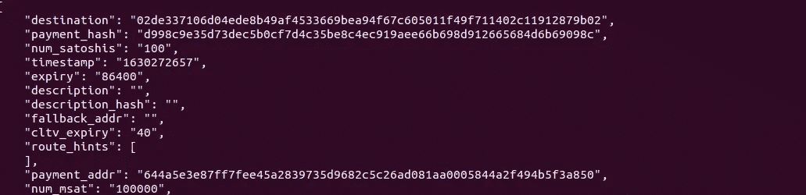

# 在 Linux 上建立比特币/闪电网络的完整初学者指南

> 原文：<https://medium.com/coinmonks/a-complete-beginners-guide-to-setting-up-a-bitcoin-lightning-network-on-linux-6a388d4103d4?source=collection_archive---------0----------------------->

## 在 regtest 模式下使用比特币内核运行 LND


在本文中，我将在 regtest 模式下完成我的 LND 设置。

# **什么是 Regtest？**

> 比特币核心的回归测试模式(regtest mode)可以让你立即创建一个全新的私人区块链，其基本规则与 testnet 相同，但有一个主要区别:你可以选择何时创建新块，因此你可以完全控制环境。

# 设置比特币核心

我们将在 LND 安装闪电网络。LND 与特定的比特币节点后端兼容，因此你需要安装其中一个才能让 LND 工作。

*   btcd
*   中微子
*   **比特硬币**

在本教程中，我们将使用 **bitcoind** 也称为比特币核心。

# **安装比特币核心**

```
*# Get the latest version of bitcoin core from bitcoincore.org* **$** wget [https://bitcoincore.org/bin/bitcoin-core-0.21.1/bitcoin-0.21.1-x86_64-linux-gnu.tar.gz](https://bitcoincore.org/bin/bitcoin-core-0.21.1/bitcoin-0.21.1-x86_64-linux-gnu.tar.gz) *# Get the corresponding signature file*
**$** wget [https://bitcoincore.org/bin/bitcoin-core-0.21.1/SHA256SUMS.asc](https://bitcoincore.org/bin/bitcoin-core-0.21.1/SHA256SUMS.asc)*# match the signature*
**$** sha256sum --ignore-missing --check SHA256SUMS.asc*# get the fingerprint of Bitcoin Core's release key*
**$** gpg --keyserver hkp://keyserver.ubuntu.com --recv-keys        01EA5486DE18A882D4C2684590C8019E36C2E964*# verify the signature in the signature file*
**$** gpg --verify SHA256SUMS.asc*# Unpack Bitcoin Core*
**$** tar -zxvf bitcoin-0.21.1-x86_64-linux-gnu.tar.gz
**$** cd bitcoin-0.21.1/bin
```

# **配置**

首先，运行这个命令 ***。/bitcoind-regtest-daemon***它会在 regtest 模式下启动比特币核心。我们需要建立一个配置文件，每次运行比特币核心时，它都会让我们的生活变得更轻松，但在此之前，比特币核心使用 ***。/bitcoin-cli -regtest stop。*** 对于 Linux 默认的配置文件应该在位置 ***~/里面。比特币*** 现在*我们将需要在那里创建一个 *bitcoin.conf* 文件，类似于这样:*

```
*regtest=1
daemon=1
txindex=1
rpcuser=USERNAME_HERE
rpcpassword=PASSWORD_HERE
zmqpubrawblock=tcp://127.0.0.1:28332
zmqpubrawtx=tcp://127.0.0.1:28333*
```

*这告诉比特币核心使用 regtest 模式，作为守护进程运行，并保留所有交易的索引。它还设置了 RPC 身份验证和 ZMQ 端口，供 LND 用来与节点通信。现在运行 **bitcoind** bitcoin-core 将启动。*

*现在运行:*

```
***$** ./bitcoin-cli getwalletinfo*
```

*您将看到警告，这是因为最新版本的 bitcoind 不会自动创建钱包，因此您必须通过 CLI 创建一个*

```
***$ ./**bitcoin-cli -stdin createwallet mywallet false false
[passphrase]
<ctrl-D><ctrl-D>*
```

*现在我们可以开采一些区块了。*

```
***$ ./**bitcoin-cli -generate 10*
```

**

*在您的 bitcoind 节点使比特币到期之前，您必须挖掘 101 个区块，才能将比特币转移到另一个钱包。完成此操作后，现在您应该会看到正余额:*

```
***$** ./bitcoin-cli getwalletinfo*
```

# ***安装 Go***

*Go 是编写 LND 的编程语言，所以我们需要先安装它。*

*要安装，请运行以下命令之一:*

```
***$** wget [https://dl.google.com/go/go1.16.linux-amd64.tar.gz](https://dl.google.com/go/go1.16.linux-amd64.tar.gz)
**$** sha256sum go1.16.linux-amd64.tar.gz | awk -F " " '{ print $1 }'*
```

*上面命令的最终输出应该是`013a489ebb3e24ef3d915abe5b94c3286c070dfe0818d5bca8108f1d6e8440d2`。如果不是，那么目标回购已经被修改，你不应该安装这个版本的 Go。如果匹配，则继续安装 Go:*

```
***$** sudo tar -C /usr/local -xzf go1.16.linux-amd64.tar.gz*
```

*此时，您应该设置您的`$GOPATH`环境变量，它代表您的工作空间的路径。默认情况下，`$GOPATH`设置为`~/go`。你还需要将`$GOPATH/bin`添加到你的`PATH`中。这确保了您的 shell 能够检测到您安装的二进制文件。*

*设置`go`路径，这可以在`.profile`(显示为`.bashrc`)或直接在`.bashrc`中完成:*

```
***$** nano ~/.bashrc*
```

*添加到末尾:*

```
*export GOPATH=~/gocode
export PATH=$PATH:$GOPATH/bin
export PATH=$PATH:/usr/local/go/bin*
```

*注销并重新登录以重新读取变量，或者您可以键入:*

```
***$** source ~/.bashrc*
```

*检查变量:*

```
***$** go env*
```

*如果你看到输出，`go`设置正确。*

# ***安装 LND***

*我们将从源头安装 lnd*

```
***$** git clone [https://github.com/lightningnetwork/lnd](https://github.com/lightningnetwork/lnd)
**$** cd lnd
**$** "make" && "make" install*
```

*上面的命令将安装当前`lnd`的*主*分支。如果您希望安装`lnd`的标记版本(因为主分支有时会不稳定)，那么[访问版本页面以找到最新版本](https://github.com/lightningnetwork/lnd/releases)。*

*要检查 lnd 是否安装正确，请运行:*

```
***$ **  make check*
```

# *建立 LND*

*我们将运行两个 LND 节点，因此让我们创建目录*

```
***$** mkdir ~/.lnd
**$** mkdir ~/.lnd2*
```

*现在让我们制作配置文件。在`.lnd`目录下保存为`lnd.conf`。*

```
*[Bitcoin]

bitcoin.active=1
bitcoin.regtest=1
bitcoin.node=bitcoind

[Bitcoind]

bitcoind.rpchost=localhost
bitcoind.rpcuser=YOUR_USERNAME
bitcoind.rpcpass=YOUR_PASSWORD
bitcoind.zmqpubrawblock=tcp://127.0.0.1:28332
bitcoind.zmqpubrawtx=tcp://127.0.0.1:28333*
```

*确保您使用之前在脚本中使用的比特币 RPC 用户名/密码。*

*现在我们将在`.lnd2`目录中制作`lnd.conf`:*

```
*[Application Options]

listen=0.0.0.0:9734
rpclisten=localhost:11009
restlisten=0.0.0.0:8180

[Bitcoin]

bitcoin.active=1
bitcoin.regtest=1
bitcoin.node=bitcoind

[Bitcoind]

bitcoind.rpchost=localhost
bitcoind.rpcuser=YOUR_USERNAME
bitcoind.rpcpass=YOUR_PASSWORD
bitcoind.zmqpubrawblock=tcp://127.0.0.1:28332
bitcoind.zmqpubrawtx=tcp://127.0.0.1:28333*
```

*这为网络、RPC 和 REST 连接设置了不同的端口*

*现在让我们设置一些别名。*

```
***$** nano ~/.bashrc*
```

*添加到末尾，这样我们就不用每次做命令的时候都把它们打出来。*

```
*export LND1_DIR="$HOME/.lnd"
export LND2_DIR="$HOME/.lnd2"alias lnd1="lnd --lnddir=$LND1_DIR";
alias lncli1="lncli -n regtest --lnddir=$LND1_DIR"alias lnd2="lnd --lnddir=$LND2_DIR";
alias lncli2="lncli -n regtest --lnddir=$LND2_DIR --rpcserver=localhost:11009"*
```

# *运行 LND*

*打开终端窗口并运行:*

```
***$** lnd1*
```

*我们需要创建或解锁钱包。打开另一个终端窗口。*

```
***$** lncli1 create*
```

*按照提示并保存助记符。*

```
***$** lncli1 getinfo*
```

*这将显示一些关于节点的基本信息，如下所示:*

**

*接下来，用`lnd2` / `lncli2`做同样的事情*

# *连接节点*

*如果你运行`lncli1 listpeers`，你会发现你的节点仍然是孤独的。让我们把它们连接起来。让我们获取第二个节点的信息。*

```
***$** lncli2 getinfo*
```

*输出应包含以下内容:*

**

*让我们使用以下命令将第一个节点连接到第二个节点:*

```
***$** lncli1 connect 02ddda5e36c254c9821ca3d8c17e1ecf9fd2f8ff703cf221eb59b4529224b79f92@localhost:9734*
```

*现在再次运行`lncli1 listpeers`。您的输出将类似于以下内容:*

**

*现在，您已经准备好创建渠道并汇款了。*

# ***创建频道***

```
***$** lncli2 newaddress p2wkh{"address": "bcrt1q7nf2d70la3ys27ckf8lgeg67fk4e3dfejuag2y"}*
```

> **这将产生一个 Bech32 格式地址，这是一个本地 segwit 地址格式，在打开/关闭通道的费用计算中费用较低。您还可以使用* `*lncli newaddress np2wkh*` *获得不同格式的地址，看起来更像传统的 multisig 地址，但不能利用 segwit 费用的优势。**

*现在，发送一个你之前挖掘的比特币到节点。我们将生成一些块来给它确认。*

```
***$** ./bitcoin-cli -named sendtoaddress address="bcrt1q7nf2d70la3ys27ckf8lgeg67fk4e3dfejuag2y" amount=0.5 fee_rate=1 replaceable=true**$ ./**bitcoin-cli generate 6*
```

*现在，我们可以打开一个通道。让我们获取第一个节点的 pubkey:*

```
 ***$** lncli1 getinfo*
```

*使用您在那里获得的值启动一个通道。*

```
***$** lncli2 openchannel 02de337106d04ede8b49af4533669bea94f67c605011f49f711402c11912879b02 100000*
```

*现在挖掘更多的块，使通道有足够的确认。*

```
***$ ./**bitcoin-cli generate 10*
```

*让我们看看它是否有效:*

**

# *创建和发送发票*

*要在终端中创建发票类型，请执行以下操作:*

```
***$** lncli1 addinvoice -amt 100
{
"r_hash": "d998c9e35d73dec5b0cf7d4c35be8c4ec919aee66b698d912665684d6b69098c","payment_request": "lnbcrt1u1psjhly3pp5mxvvnc6aw00vtvx004xrt05vfmy3nthxdd5cmyfxv45y66mfpxxqdqqcqzpgxqyz5vqsp5v399u058lal7u3dzswtntktg93wzdtggr2sqqkzy5t6ffd0n4pgq9qyyssqk204pw6as2599mdrefqx5lrycjax5559xnv2lrp9m4wpqavk6enkmtme09yxdt56552mx6v8eg9gpwxvl9mn0t5dea2gtmajzmukffsph8074z","add_index": "1","payment_addr": "644a5e3e87ff7fee45a2839735d9682c5c26ad081aa0005844a2f494b5f3a850
}*
```

*复制`pay_req`值并记下`r_hash`以备后用。*

*让我们检查另一个节点上的发票:*

```
***$** lncli2 decodepayreq lnbcrt1u1psjhly3pp5mxvvnc6aw00vtvx004xrt05vfmy3nthxdd5cmyfxv45y66mfpxxqdqqcqzpgxqyz5vqsp5v399u058lal7u3dzswtntktg93wzdtggr2sqqkzy5t6ffd0n4pgq9qyyssqk204pw6as2599mdrefqx5lrycjax5559xnv2lrp9m4wpqavk6enkmtme09yxdt56552mx6v8eg9gpwxvl9mn0t5dea2gtmajzmukffsph8074z*
```

*您的输出将类似于以下内容:*

**

*现在让我们付钱吧！*

```
***$** lncli2 payinvoice lnbcrt1u1psjhly3pp5mxvvnc6aw00vtvx004xrt05vfmy3nthxdd5cmyfxv45y66mfpxxqdqqcqzpgxqyz5vqsp5v399u058lal7u3dzswtntktg93wzdtggr2sqqkzy5t6ffd0n4pgq9qyyssqk204pw6as2599mdrefqx5lrycjax5559xnv2lrp9m4wpqavk6enkmtme09yxdt56552mx6v8eg9gpwxvl9mn0t5dea2gtmajzmukffsph8074z*
```

*您的输出将类似于以下内容:*

**

*让我们使用付款散列在接收节点上查找发票:*

**

*如果你看到已解决:真这是成功的信息*

# *结论*

*这是我在 2021 年比特币之夏[对比特币/闪电的基本设置的快速演练。](https://summerofbitcoin.org/)*

*[](https://www.buymeacoffee.com/NehaKumari)*

> *加入 [Coinmonks 电报频道](https://t.me/coincodecap)，了解加密交易和投资*

## *另外，阅读*

*   *[比特币主根](https://blog.coincodecap.com/bitcoin-taproot) | [Bitso 点评](https://blog.coincodecap.com/bitso-review) | [排名前 6 的比特币信用卡](/coinmonks/bitcoin-credit-card-bc8ab6f377c6)*
*   *[币安期货交易](https://blog.coincodecap.com/binance-futures-trading)|[3 comas vs Mudrex vs eToro](https://blog.coincodecap.com/mudrex-3commas-etoro)*
*   *[如何购买 Monero](https://blog.coincodecap.com/buy-monero) | [IDEX 评论](https://blog.coincodecap.com/idex-review) | [BitKan 交易机器人](https://blog.coincodecap.com/bitkan-trading-bot)*
*   *[币安 vs 比特邮票](https://blog.coincodecap.com/binance-vs-bitstamp) | [比特熊猫 vs 比特币基地 vs Coinsbit](https://blog.coincodecap.com/bitpanda-coinbase-coinsbit)*
*   *[如何购买 Ripple (XRP)](https://blog.coincodecap.com/buy-ripple-india) | [非洲最好的加密交易所](https://blog.coincodecap.com/crypto-exchange-africa)*
*   *[非洲最佳密码交易所](https://blog.coincodecap.com/crypto-exchange-africa) | [胡交易所评论](https://blog.coincodecap.com/hoo-exchange-review)*
*   *[eToro vs robin hood](https://blog.coincodecap.com/etoro-robinhood)|[MoonXBT vs Bybit vs Bityard](https://blog.coincodecap.com/bybit-bityard-moonxbt)*
*   *[Stormgain 回顾](https://blog.coincodecap.com/stormgain-review) | [Bexplus 回顾](https://blog.coincodecap.com/bexplus-review) | [币安 vs Bittrex](https://blog.coincodecap.com/binance-vs-bittrex)*
*   *[Bookmap 评论](https://blog.coincodecap.com/bookmap-review-2021-best-trading-software) | [美国 5 大最佳加密交易所](https://blog.coincodecap.com/crypto-exchange-usa)*
*   *[如何在 FTX 交易所交易期货](https://blog.coincodecap.com/ftx-futures-trading) | [OKEx vs 币安](https://blog.coincodecap.com/okex-vs-binance)*
*   *[如何在势不可挡的域名上购买域名？](https://blog.coincodecap.com/buy-domain-on-unstoppable-domains)*
*   *[印度的秘密税](https://blog.coincodecap.com/crypto-tax-india) | [altFINS 审查](https://blog.coincodecap.com/altfins-review) | [Prokey 审查](/coinmonks/prokey-review-26611173c13c)*
*   *[布洛克菲 vs 比特币基地](https://blog.coincodecap.com/blockfi-vs-coinbase) | [比特坎评论](https://blog.coincodecap.com/bitkan-review) | [币安评论](/coinmonks/binance-review-ee10d3bf3b6e)*