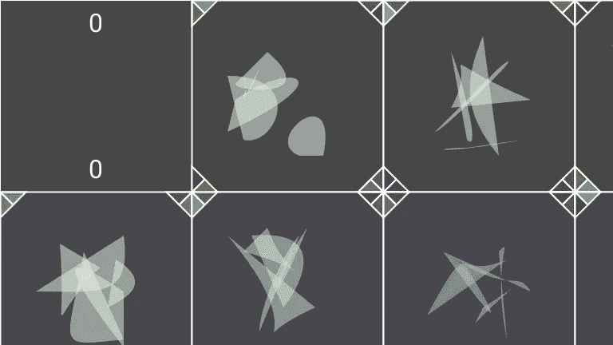

# CryptoArte 绘画综合指南

> 原文：<https://medium.com/coinmonks/a-comprehensive-guide-to-cryptoarte-paintings-724783c87442?source=collection_archive---------0----------------------->

## Z·纳达夫和塞巴斯蒂安·布罗彻

***TLDR:*** *这些年来，我们已经分享了很多关于 CryptoArte 画的信息。这个纲要把所有这些都放在一个地方——还揭示了一些以前从未共享的功能！*

# CryptoArte 画的特别之处是什么？

[CryptoArte](https://www.cryptoarte.io/) 是一个生成性的艺术集合，通过确定性的变换融合以太坊网络，创造出多面的艺术形式，不可替代的令牌，去中心化的应用。在这篇文章中，我们将通过分解绘画独特的艺术和计算方面来关注艺术本身。如果你不熟悉 CryptoArte 项目，可以在 [cryptoarte.io about page](https://www.cryptoarte.io/about) 获得更全面的介绍。

# 块、结构和分辨率

[该系列](https://www.cryptoarte.io/gallery)有 9895 幅画，每幅都是由 576 个连续的以太坊积木拼接而成。它们分布在 18 行 32 列中，因此可以完美地映射成 7680×4320 像素的数字图像(或 8K UHD 电视分辨率，也称为 4,320p)。这种精度既允许高分辨率打印，又非常适合现代显示器和电视。

[Painting #9,648](https://www.cryptoarte.io/paintings/9648)

# 时间戳、块号和历史背景

画的开头和结尾的“书挡”块都包含两个数字:在顶部，有一个块号，表示画中所代表的 576 个块的开始。在底部，UNIX 纪元时间中有一个时间戳，它反映了块被挖掘到秒的时刻。这样，书挡就成了这幅画“真实生活”寿命的标志，也是在以太坊历史中找到自己位置的一种方式。

我们认为这形成了三重历史意义:藏品本身背后的历史，画作描绘的真实生活时间线，以及每幅画与特定以太坊时期的联系。

An array of blocks at the start of [painting #80](https://www.cryptoarte.io/paintings/80)

例如，[绘画#80](https://www.cryptoarte.io/paintings/80) 开始于块 46，080，初始时间戳为 1，438，917，120，其映射到 2015 年 8 月 7 日星期五 03:12:00 GMT。

由于集合从[绘画#0](https://www.cryptoarte.io/paintings/0) 开始，并且每幅绘画描绘了 576 个块，所以用绘画开始块数除以 576 得到绘画数。在这种情况下，46080 除以 576 得到[画#80](https://www.cryptoarte.io/paintings/80) 。

The last blocks of [Painting #80](https://www.cryptoarte.io/paintings/80)

相反，来自最后一块的信息可以用来计算这幅画的确切寿命——如果我们从最后一块的 1，438，926，848 减去第一块的时间戳 1，438，917，120，我们将推断出 80 号画“存活”了 9728 秒，即 2 小时 42 分 8 秒。

更进一步，我们可以推导出这幅画的以太坊区块链的平均速度。用秒为单位的寿命除以方块数，[画 80 号](https://www.cryptoarte.io/paintings/80)平均每块 16.89 秒。

举例来说，收藏中寿命最长的画作有惊人的 27392 秒——或者说 7 小时 36 分 32 秒，而平均每块大约 47.56 秒！

# 矿工和稀有

每块积木内部都有一个非常重要的形状:一个象形文字图标，它的功能是作为该积木矿工的签名，并提醒我们以太坊区块链永恒不变的本质。

该图标源自矿工以太坊的 40 个十六进制数字或 20 个字节长的地址，分为五种方式，创建了五个程序生成的形状。

[Miner #92](https://www.cryptoarte.io/miners/0x0c8cf50ab18935a512803d2a10982d79dcb9ef88) mined nine blocks and is in eight paintings

由于以太坊矿工地址是唯一的，没有两个矿工可以有相同的图标，他们的图标在整个集合中保持不变。因此，一些图标只能在一幅画中找到，而其他矿工已经开采了许多块，可以在整个收藏中识别。例如，[涂装#93](https://www.cryptoarte.io/paintings/93) 就是一个特例，里面有不少于 7 个独特的一体式矿工！

[Painting #93](https://www.cryptoarte.io/paintings/93) has the most single-block miners in the entire collection

查看[矿工画廊](https://www.cryptoarte.io/miners)了解更多关于收藏中矿工的信息。

# 阻止背景颜色

在这幅画的构图中，色彩有几个作用。例如，通过将“基本”蓝灰色与编码成相应 RGB 值的四个“信号”融合在一起来计算每个块的背景:

1.  红色:使用以太气/开采区块时的拥堵/交易费用
2.  绿色:交易的以太币总额(货币)
3.  蓝色:散列块的难度
4.  透明度:位于顶层，由块内的事务数量决定

[Painting #0](https://www.cryptoarte.io/paintings/0) begins with a background scheme that is closest to the base color

虽然这些信号具有代表性，但生成算法对平滑过渡进行了大量处理，努力在表示和可视化网络之间保持平衡，同时生成美观的图像。这在某些绘画中发生的特定事件中可能会特别引人注目——再次考虑[绘画#80](https://www.cryptoarte.io/paintings/80) ，它包含有史以来第一次以太坊交易(注意序列中具有亮红色背景的第一个块)。

Block #46,148: the moment of Ethereum’s first transaction

# 哈希、维特拉效应和安全标记

除了每幅画的第一个和最后一个区块(如上所述，其中包含区块编号和时间戳)之外，每个区块的角落都用 8 个彩色三角形进行装饰，以创建类似玻璃或 vitraux 的效果。32 字节长的以太坊块的散列被编码成三角形的颜色，因为每个散列都是唯一的，所以为这幅画的真实性增加了另一个安全标记。这意味着，不仅每幅画，而且收藏中的每块积木都是独一无二的。

A closer look at the vitraux effect from [Painting #313](https://www.cryptoarte.io/paintings/313)

# 矿工图标颜色

虽然三角形的颜色是通过块散列计算的，但是它们也在确定相应矿工图标的颜色中起作用。从每幅画的第二块的左上角开始，最左边的三角形决定了矿工图标的颜色。随着每一个连续的区块，这种关联小心翼翼地顺时针旋转，直到八个循环完成，在这一点上它又开始了——**一个从未被揭示过的细节！**

这个效果不仅是另一个“隐藏的”(不再是了！)安全标记，而且在整个绘画中创造了平滑和舒缓的色彩循环。为了增强对比度，该算法将三角形颜色与块背景颜色一起处理，以达到令人满意的中间点。

A row of miners from [painting #314](https://www.cryptoarte.io/paintings/314) — note that the rotational color cycle which begins anew on the 9th block

# 金色矿工图标

在每幅画中，正好有一个矿工图标被一个明显的“金色”边框突出显示。从左到右和从上到下逐步移动，这些在整个系列中找到，并定位在绘画编号除以 576 的余数处——因此金色矿工在[绘画 1](https://www.cryptoarte.io/paintings/1) 上的位置 1，在[绘画 575](https://www.cryptoarte.io/paintings/575) 上的位置 575，然后一直回到[绘画 576](https://www.cryptoarte.io/paintings/576) 上的位置 0。

A “golden miner” icon from [painting #2,881](https://www.cryptoarte.io/paintings/2881)

就像从块散列中派生出的 vitraux 效果三角形一样，金色矿工图标也在绘画的整体配置中创建了一个安全标记。以上面的[画# 2881](https://www.cryptoarte.io/paintings/2881)为例，我们可以看到，画号 2881 除以 576 得到余数 1，因此金色矿工图标在位置 1。

# 了解更多信息

就是这样！我们希望你喜欢这次对 [CryptoArte](https://www.cryptoarte.io/) 画作及其构图的深入探究。如果您想了解有关整个 CryptoArte 项目的更多信息，请查看我们在 Medium 上发布的预发布文章和公告:

*   [***预发射密码***](/coinmonks/pre-launching-cryptoarte-56c967bcf2e9)
*   [***CryptoArte 预发布更新***](https://sebinatx.medium.com/cryptoarte-pre-launch-update-342414d4a93e)
*   [***CryptoArte 预发布更新#2***](https://sebinatx.medium.com/cryptoarte-pre-launch-update-2-ea8365c93cbd)
*   [***矿工图库:CryptoArte 预发布更新#3***](/coinmonks/the-miners-gallery-cryptoarte-pre-launch-update-3-e1cb3667fd22)

如果你想联系我们，请随时联系我们的 [Twitter](https://twitter.com/CryptoArte) ，或者通过我们的 [Discord 服务器](https://discord.gg/kwbRuwf)加入 CryptoArte 社区。

对于一个相关的 NFT 项目，看看这个关于[街区公园](/opensea/block-parks-36340d790850)的帖子。