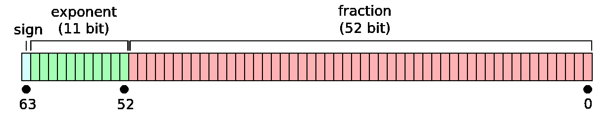

# 计算机科学之谜:调查 Facebook Messenger 的 M 如何处理货币价值(第二部分)

> 原文：<https://medium.com/coinmonks/a-computer-science-mystery-investigating-how-facebook-messengers-m-deals-with-currency-values-557d63228498?source=collection_archive---------3----------------------->

*如果你还没看过第一部，* [*先看那个*](/@tylerjustinfisher/a-computer-science-mystery-investigating-how-facebook-messengers-m-deals-with-currency-values-570097a5ff2b) *。*

那么，2⁶-2⁰来自哪里呢？

我们首先想到的是研究一种更大的数据类型，即长 double，它有 16 个字节。然而，这种类型似乎与 2⁶没有任何关联，所以我们排除了这种合理的可能性，以及任何其他类似的巨大类型。此外，为什么脸书的工程师会使用这样一个不必要的大数据类型呢？

当我们决定深入研究其他常见的 8 字节类型时，我们取得了突破，将我们的范围扩展到了我们一直怀疑的 long long 之外。我们最初认为这个数字应该是一个很长很长的数字，而不是一个双精度数，因为我们知道`LLONG_MAX`正好在 2⁶附近，而`DOUBLE_MAX`比*大得多，大约在 2 个⁰ ⁴.附近然而，当我们进一步思考这个问题时，整个谜团的迷雾开始消散。如何在不使用 1024 位的情况下得到一个像 2 ⁰ ⁴那么大的数？*

答案在于双精度是如何存储的。所有带符号的浮点数都存储为一个指数和一个二进制尾数(也称为小数有效数)加上一个符号(正或负)。特别是对于有符号的 double，它的 8 个字节给了它 64 位来处理。其中，第一位是符号，接下来的 11 位是指数，剩下的 52 位是尾数。



Image from [the Wikipedia page on doubles](https://en.wikipedia.org/wiki/Double-precision_floating-point_format)

浮点运算的机制对我来说相当生疏，在我能够完全理解最终的解决方案之前，我必须花相当长的时间来重新熟悉浮点数的具体工作方式。如果你对浮点数感到不确定，就像我最近一样，这里有一个纲要:

Doubles 和其他浮点数并不像 int 和 longs 那样直接存储数字。double 不是实际存储数字本身，而是识别比所需数字小的最接近的 2 的幂，然后计算出该 2 的幂必须乘以什么系数才能得到所需数字。然后它存储这个 2 的幂和这个系数，而不是像定点类型那样存储数字本身。

例如，十进制数 7 可以精确地描述为 4×1.75。这里，4 是 2 的相关幂，因为 2 = 4。小数 1.75 是从 4 到 7 的系数。因此，计算机实际上是将“4”和“1.75”存储在一起，并且能够确定它们相乘时等于“7”。(当然，它们都是用二进制表示的，因为十进制的 1.75 等于二进制的 1.11，所以 double 实际上将 7 存储为 2 ×1.11₂.)

类似地，对于十进制数 18，double 存储 2⁴的指数以及二进制数 1.001 的尾数，这相当于十进制数 1.125。这两个数的乘积是十进制数 18，即 16×1.125=18。

*(如果我的总结不清楚，* [*)维基百科页面上的浮点运算*](https://en.wikipedia.org/wiki/Floating-point_arithmetic) *给出了自己的解释，而* [*页面上的双精度运算*](https://en.wikipedia.org/wiki/Double-precision_floating-point_format) *包含了更多的例子。)*

有了这样的理解，我们现在就可以理解浮点数不精确的细微差别，以及 9，223，372，036，854，774，784 这个数字的确切来源。浮点运算的本质意味着存储的数字只能精确到一定的精度。对于有符号双精度浮点数，其精度由尾数分配的 52 位决定。直到 2⁵的数量级，每个整数都可以精确存储，整数之间的一些数字也是如此。从 2⁵开始，只有整数可以被精确存储。在 2⁵之后，整数精度也开始下降。具体来说，双精度浮点数不能精确存储的第一个整数是 2⁵ +1。

然而，双精度可以完美地存储整数 2⁵和 2⁵ +2。对于所有仅略大于 2⁵的数字，每个奇数都因舍入误差而丢失。这种舍入误差是由于 52 位的尾数仍然只有 2⁵到 2⁵1 范围内的唯一整数作为基数。现在的问题是，这个范围内的每个数字都要乘以 2 才能达到 2⁵到 2⁵⁴−1.的范围这允许 double 存储比 2⁵高得多的数字，但精度明显下降。

每当达到 2 的新次方时，这个问题就会变得更加复杂。2⁵⁴之后，可以精确存储的整数间隔 4；2⁵⁵之后，他们相距 8；仅次于 2⁵⁶16 岁。更一般地说，确定在给定的 2 的幂附近的可存储数之间的间距的公式是 2ⁿ⁻⁵，其中 *n* 是低于期望数的最接近的 2 的幂。(这应该简洁地解释了为什么对于 2⁵和 2⁵1 之间的数字，整数本身是可以精确存储的数字，因为 n = 52，2ⁿ⁻⁵ = 2⁵ ⁻⁵ = 2⁰ = 1。)

(快速补充:简单地考虑一下，这个间距暗示着接近`DOUBLE_MAX`和其他类似的巨大数字的疯狂。在这个数量级上，可存储的数字*间隔*2⁰⁴⁻⁵=2⁹⁷，这个数字*远远超过了可观测宇宙中的普朗克体积数。也就是说，在遥远的 2 ⁰ ⁴附近的每个数字将被许多许多可观测的宇宙强制向上或向下舍入，以便被压缩成 64 位的浮点数。)*

无论如何，这幅关于 double 如何工作的完整图片*主要是*解释了 M 愿意给出的数字的最后几位的奇怪行为:它被迫上下舍入数字以得到它能够存储为 double 的数字。例如，92，233，720，368，539，010 美元变成了 92，233，720，368，539，013.02 美元，因为后者实际存储为 9，223，372，036，853，901，302 美分，是距离 2⁶2 ⁰s(854，如果你好奇的话)的整数。这是最接近的可存储的数字，所以这是 M 必须使用的。

这也清楚地表明了我们的实际极限 2⁶2⁰来自哪里:在 2⁶之后，每个可存储的数字由 2⁶ ⁻⁵ = 2 ⁰.隔开由于 2⁶这个数字本身太大而无法存储，所以可以用双精度表示的最大数字是 2⁶以下第一个可以精确存储的数字，或者确切地说是 2⁶2 ⁰.

问题解决了，对吧？

不完全是。

如果双打可以一直到 2 ⁰ ⁴，为什么 2⁶是相关的？难道我不应该让 M 变得更高吗，尽管我会开始觉得这些数字之间的间隔很可笑？

我们最好的猜测是:在幕后有一个类型转换正在进行。最有可能的情况是，用户键入的文本首先被从字符串强制转换为 long long，这种类型允许精确的整数表示，一直到 2⁶1(因为没有尾数-指数舞蹈发生，它只是一个简单的二进制整数)。然后，这个数字从 long long 转换为 double，这时就会出现精度损失。数字 2⁶1 被向下舍入到比它本身低一倍的最高可存储数，2⁶2⁰，我们有一个合理的解释。

现在，对我来说，这个难题已经解决了，所有潜在的技术机制都被揭开了。

然而，有一个悬而未决的问题一直困扰着我:为什么从 long 到 double 的类型转换会发生？在我看来，在整个时间内将数字保持为 long 就足够了，而且实际上更健壮。

事实上，我被告知，一般来说，doubles 和 floats 应该特别地用*而不是*来表示货币，因为正是这种类型的问题。不可能精确地表示十的负次方(. 1，. 01 等)。)使用替身。考虑到货币值是用美分表示的，因此*总是*需要这样的值，这就变得非常禁止了。应该用定点数来代替。这个简单的 Java 例子应该让这个问题变得非常清楚:

```
System.out.println(0.91 - 0.32);> 0.5900000000000001
```

当然，在呈现给用户之前，很难完成这一点点。但是如果 M 想做，比如说，复利计算呢？在一个足够大的利率下，或者在一个足够长的时间框架内，这一点点累积起来不会造成重大误差吗？至少，这不会给任何必须钻研相关代码的脸书开发人员增加一点头痛吗，特别是在调试的时候，尤其是*由于使用了机器学习，系统已经有点黑箱的感觉了。*

是的，我知道这样一个事实，因为数字是以美分而不是以美元存储的，这个问题在某种程度上被回避了，但是如果 M 想用零头美分做任何事情，它就会回到最前沿。

我愿意假定脸书是无辜的，并且让我的思想开放，在这里有一些使用浮点数据类型的好理由。我不知道它是什么，但是，我想了很多。如果我要确信这不仅仅是一个奇怪的疏忽，我需要听到一个好的解释。

因为，在一天结束的时候，所有这些奇怪的行为都是完全可以避免的，如果这个数字被简单地存储在一个 long long all…*along*中的话。