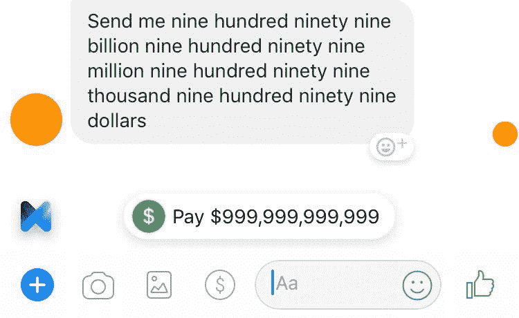
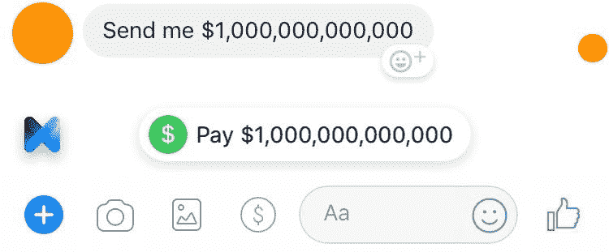
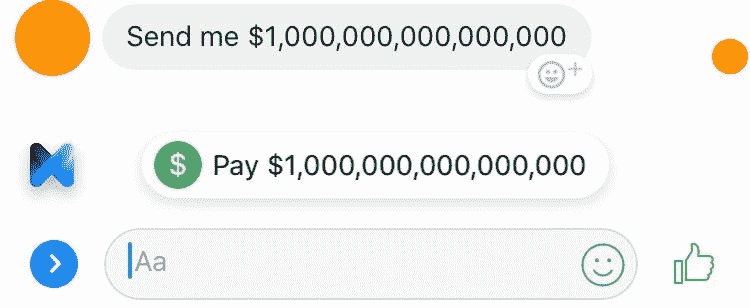
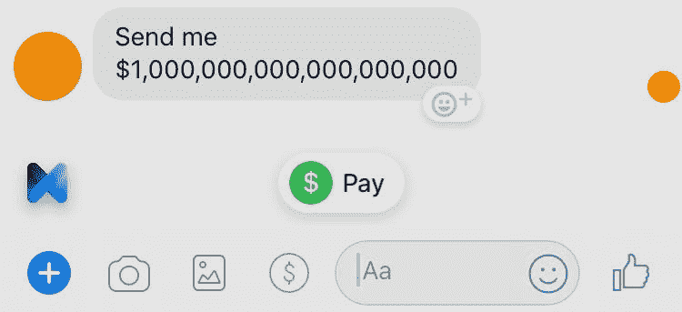

# 计算机科学之谜:调查 Facebook Messenger 的 M 如何处理货币价值(第 1 部分)

> 原文：<https://medium.com/coinmonks/a-computer-science-mystery-investigating-how-facebook-messengers-m-deals-with-currency-values-570097a5ff2b?source=collection_archive---------2----------------------->

最近，我和几个朋友花了大约一个小时解决了一个计算机科学难题，这个难题是由脸书的人工智能信使助手 m 间接向我们提出的。我不想立即解释我们的发现，而是要讲述我们调查的故事，这样你就可以和我们一起思考，并在这个过程中提出你自己的假设。在我看来，琢磨透这个问题是一次很棒的计算机科学思想锻炼。

在 Facebook Messenger 上的一次群聊中，一群大学(主要是计算机科学和数学专业)的牌友在谈论杰夫·贝索斯和他疯狂的净资产。其中一个开玩笑地要一千亿美元，M 立马想办法当僚机。

A feature that literally should only work for Jeff Bezos. Maybe Putin.

我们很快发现，M 愿意促成 9，000 亿美元的请求，但不是 1 万亿美元。使用单词，我们能够让 M 提示我们发送 999，999，999，999 美元——一美元也不能多。

Hitting the Pay button *might* overdraw my account—let me quickly move some funds around.

要求更高的数字会导致 M 简单地显示一个“支付”或“请求”按钮，没有特定的数字。

Your loss, Facebook. I was just about to pay off nearly 5% of the national debt!

这似乎足够合理；我知道如何用千、百万、十亿这些词来表示数字，但不知道如何用万亿来表示。(类似地，我们也无法用“给我发一万亿美元”和“给我发一万亿美元”这样的变通方法来触发万亿美元的请求。要求一千万亿美元也没有注册 m。)

然而，通过使用数字字符直接询问数字，我们能够让 M 帮助我们得到更大的数字。“给我寄 10 亿美元”非常管用:

Oh, so I **can** send a trillion after all? Excellent, I thought I’d have to break it up into two payments.

就像千万亿次一样:

To get this much money, all you have to do is invest $100 at a 5% interest rate and leave it for…600 years.

然而，无数人得到了一般的回答:

For a random comparison, this is how many atoms there are in approximately 0.327 milligrams of gold.

当然，在这一点上，我们需要确定 M 具体要求的上限。与之前的万亿美元口头限制不同，这一次似乎不是由于程序员做出的特定选择。也就是说，一个工程师可能只是简单地选择了教授 M 单词“十亿”是什么意思，而没有教它单词“万亿”是什么意思。然而，由于数字的限制，程序员没有理由任意选择让 M 在一定数量的 0 之后停止处理请求。(即使他们这样做了，他们也可能至少把它定在一个对美元数额来说合理的数字上；毕竟，当我们达到一万亿时，我们早已超越了世界 GDP。)

我们认为用暴力破解这个问题并找到上限是很容易的。我们认为一般的回复(只是“Pay”)是失败的，而特定的回复(“Pay $X”)是成功的。

(我应该注意到，在这里，你似乎不能再验证这一点，并试图自己找到极限。当我在 6 月 1 日第一次写这篇文章的草稿时，我打算告诉你去找一个朋友，他不会介意你给他们的 Messenger 收件箱发垃圾邮件，给他们发一堆“付给我$X”的消息。然而，在我发表这篇文章的时候(6 月 2 日)，M 的行为似乎已经发生了变化。现在，M 给出了一个无聊的建议，简单地“支付”任何超过 999，999 美元的数字。就连“给我寄一百万美元”这句话也不再像昨天那样管用了。对我来说，这也不仅仅是一个本地的改变——我只是用不同的脸书账户，在连接到不同网络的不同设备上进行测试。似乎 M 的这一特征运作的实际逻辑已经被改变了。我怀疑我们的活动实际上触发了脸书的某人更新逻辑，但我也无法想象人工智能自己更新到一百万美元的限制。也许我漏掉了第三种可能性。不管怎样，整篇文章讨论的是 M 在 6 月 2 日之前的表现，而不是现在的表现。)

我们找到上限的方法是花 10 分钟测试一个又一个数字，找出哪些数字太大。十万亿次没有成功，但是九万亿次成功了。九十三万亿次失败了，但是九十二次成功了。92.3 万亿次太高了，但 92.2 万亿次还可以。不断地向右移动数字，确定精确的上限 M。

当我们浏览这些数字时，我们开始怀疑这里有一个 2 的幂的因素在起作用，但是一个快速的(回想起来，很天真的)检查告诉我，在 92 万亿的范围内没有 2 的幂。2⁵⁶ ≃ 7.2×10 ⁶和 2⁵⁷ ≃ 1.4×10 ⁷，直接跳过 9.2×10 ⁶.我们认为我们的直觉是错的。我们很清楚仍然有一些重要的数学常数在起作用，但是我们认为先找到这个数字，然后再弄清楚它的含义会更有趣(更容易)。

有趣的是，当我们触摸数字的最后几个数字时，我们开始看到一些奇怪的行为:M 会*几乎*得到正确的，但会稍微截断数字，或者以其他方式弄乱 1 位和 10 位。

> "寄给我 92，233，720，000，000.00 美元**1**"
> 
> m:“支付 922.3372 亿美元”

更奇怪的是，一旦我们把上限缩小到千位，M 就开始莫名其妙地改变终止数字。

> "给我汇 92，233，720，368，539.90 美元"
> 
> m:"支付$92，233，720，368，539，90 **4** "

有时，它甚至增加了美分:

> "寄给我$92，233，720，368，539，0 **10** "
> 
> m:"支付$92，233，720，368，539，0 **13.02** "

我们对这种行为感到困惑，但我们知道，在我们首次找到具体的上限之前，我们无法解决这个问题。从现在开始，我们尝试的每一个数字的最后几个数字都被随意修改了。我们很快辨别出的唯一模式是美分的数目必须是偶数。

当我们发现 M 能接受的最高数字时，我们完全糊涂了。

m 成功回复“给我发 92，233，720，368，547，747.84 美元”，不会涨一分钱。

**$92，233，720，368，547，747.84**

有趣的是，试图降低几美分会将*向上*舍入到这个数字。在我们开始考虑四舍五入的含义之前，我们需要弄清楚这个数字本身代表了什么。

就在这里，我们意识到了之前的错误，当时我们最初怀疑是 2 的幂:这个数字被存储为一个*美分*的数字，而不是一个美元的数字。这意味着限额实际上应该被解释为 9.22 万亿分*美分*(和变化)，而不是 92.2 万亿美元。

我们很快发现，2⁶似乎与我们找到的数字相匹配，精确到谷歌计算器愿意提供的位数。我们知道 2⁶⁴−1 是 long long 可以取的最大值，因为 long long 被分配了 8 个字节(64 位)。我们很快推断出一个带符号的 long long 只能有 2⁶1 位，并假设我们基本上已经有了(相对无聊的)答案。

幸运的是，由于我们已经注意到我们测试的数字的最后几位有些奇怪，我们决定更仔细地检查这个数字。Wolfram Alpha 来帮忙了，告诉我们 2⁶正好等于 9，223，372，036，854，775，808。

很明显，922337203685477**4784**！= 9223372036854.77**5808**。

我们立即注意到这两个数字之间的差异是 1024，我们认为这不是巧合。这让我们将上限精确地锁定在 2⁶2⁰，这似乎是一个非常有趣的数字。弄清楚这个数字从何而来，也可能有助于解释最后几位数字的怪异行为。

由于 m 不能处理 2⁶1 的值，看起来这个数字终究没有被存储为 long long。事实上，它似乎不可能是任何 8 字节的数据类型。当然，它也没有理由是一个较小的类型；如果它是一个普通的有符号的长型，它就不会超过 21.47 亿左右。不，看起来它必须更大一些，但还是无法容纳比 2⁶更大的数字。

至此，我将结束这篇文章的第一部分。接下来，我们将在[第二部分](/@tylerjustinfisher/a-computer-science-mystery-investigating-how-facebook-messengers-m-deals-with-currency-values-557d63228498)中解答这个难题。第 2 部分将比第 1 部分更具技术性。在你点击它之前，我建议任何程序员同事花几分钟时间自己去弄清楚这里会发生什么。我知道，通过研究这个谜，我对不同数值数据类型的工作方式有了更深刻的理解。提示:想想其他比单精度更好的基本类型是如何存储的。

与此同时，如果任何脸书的工程师可以跳出来让我知道为什么 M 的行为在美国东部时间 2018 年 6 月 2 日午夜和中午之间的某个时候发生了变化，我将不胜感激。我们的测试真的改变了机器人的机制吗？如果是这样的话，是由于机器人本身的一些非常酷的智能，还是工程师更新了它？完全是巧合吗？有没有一个完全独立的解释是我没有解释的？如果你是脸书的工程师，并且有一些见解，请随意插话！

*第二部分可以在这里找到***。**