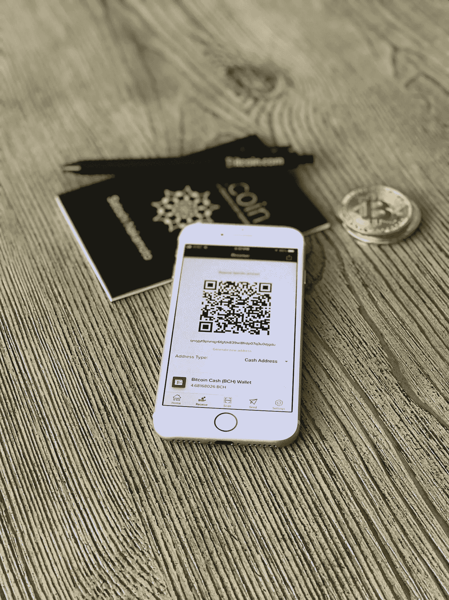
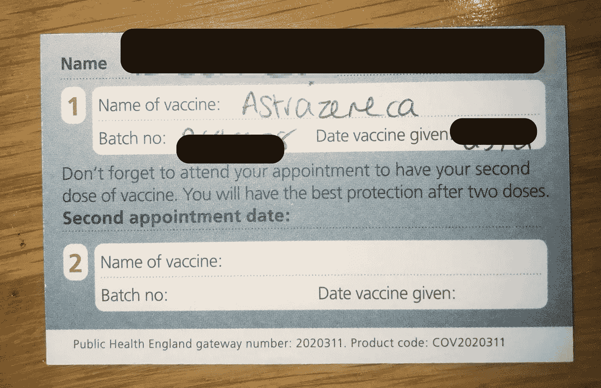
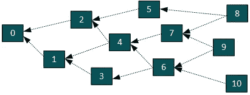
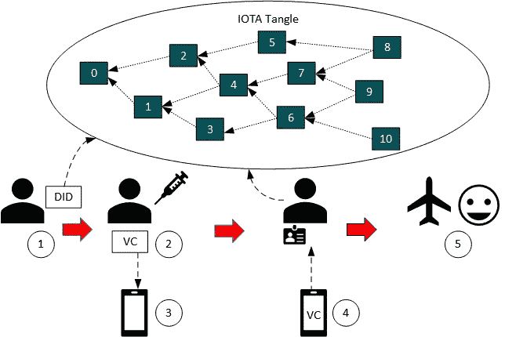

# 基于 IOTA 的 COVID 疫苗接种护照方案

> 原文：<https://medium.com/coinmonks/a-covid-vaccination-passport-scheme-based-on-iota-3ab9581bdf08?source=collection_archive---------3----------------------->



Photo by [David Shares](https://unsplash.com/@davidshares?utm_source=unsplash&utm_medium=referral&utm_content=creditCopyText) on [Unsplash](https://unsplash.com/s/photos/blockchain?utm_source=unsplash&utm_medium=referral&utm_content=creditCopyText)

你还记得在海外自由旅行到任何一个国家是什么感觉吗？不幸的是，一个叫新冠肺炎的小东西阻止了这一切。我们现在面临的只是旅行问题，不仅是那些需要拜访家人的人，还有那些在旅行和旅游部门工作的人。

疫苗护照的概念已经被提出，作为解决当前世界各地许多人面临的旅行问题的一种方法。然而，一个执行不良和不安全的计划只会导致更多的问题。导致许多国家在重新开放边境时犹豫不决、欺诈性索赔或个人数据丢失等问题。

目前在英国范围内发放的 COVID 疫苗接种证是接种疫苗时由护士发放的手写卡片。此卡不能用作疫苗接种证明或护照。然而，不幸的是，这是我们证明自己接种疫苗的唯一方法。



The current UK COVID vaccine ‘certificate’.

[现在，酒吧和餐馆可能会在顾客进入](https://london.eater.com/22369611/covid-vaccine-passports-england-restaurants-pubs-reopening)前询问他们的疫苗接种情况，我们最好不要弄丢那张卡！

如果我们*打算*走上接种疫苗护照的道路[而且看起来我们肯定会](https://ec.europa.eu/info/live-work-travel-eu/coronavirus-response/safe-covid-19-vaccines-europeans/covid-19-digital-green-certificates_en)，我们将需要一个安全的数字解决方案。一种不仅能防止欺诈性索赔，还能保护用户隐私的解决方案。2021 年这个要求过分吗？

# 分布式账本技术

一个解决方案是使用**分布式账本技术(DLT)** 实施疫苗接种护照计划。不，不完全是区块链。首先，DLT 的一般属性对于托管数字疫苗接种护照计划来说确实很有吸引力:

*   **分发** *:* 总账的副本被分发到所有参与节点。
*   **不可变**:账本上确认的数据是加密密封的，不使整个链条失效就不能修改。
*   **分散化**:没有中央权力机构控制网络。

然而，基于区块链的数字远程交易，如比特币和以太坊，在托管可能的数字疫苗护照计划方面确实存在缺陷。

# 极微小

因此，我们今天要讨论的 DLT 被称为[](https://www.iota.org/)**。IOTA 的主要特性之一是 [**纠结**](https://assets.ctfassets.net/r1dr6vzfxhev/2t4uxvsIqk0EUau6g2sw0g/45eae33637ca92f85dd9f4a3a218e1ec/iota1_4_3.pdf) ，这是一个 [**有向无环图(DAG)**](https://files.iota.org/papers/Direct_Acyclic_Graph-based_Ledger_for_Internet_of_Things.pdf) 用于存储事务。**

****

**The IOTA Tangle. Each block represents a transaction.**

**由于其基于 DAG 的[共识机制](https://ethereum.org/en/developers/docs/consensus-mechanisms/)，这种纠结是成功区块链的下一步。比特币和以太坊区块链使用的共识机制是一种工作证明(PoW)机制。PoW 机制要求挖掘者解决一个难题，以向链中写入一个块。这就是导致比特币网络的耗电量[比阿根廷整个国家的耗电量](https://www.bbc.com/news/technology-56012952)还要多的原因。**

# **为什么 IOTA？**

**IOTA 克服了用于托管疫苗护照的传统区块链的这些缺点:**

*   ****吞吐量:**在区块链上，每秒事务数(TPS)是有限的。在 IOTA 中，TPS 不受限制，因为节点可以立即将新块插入到分类帐中，只要它们处理较早的事务。**
*   ****确认延迟:**确认链条上的一个块有延迟。在比特币中，这可能需要几个小时。在 IOTA 中，确认率不受限制。**
*   ****交易费用:**在撰写本文时，比特币网络上的一笔交易费用为 13.41 美元。这对于数字疫苗护照方案来说是不可接受的。IOTA 没有交易费。**

**此外，IOTA 提供对 [**分散标识符**](https://www.w3.org/TR/did-core/) 和 [**可验证凭证**](https://www.w3.org/TR/vc-data-model/) 的支持，这使得它对于托管疫苗接种护照方案更具吸引力。**

# **did 和风投**

**W3C 定义的分散标识符(DID) [是个人或实体的机器可读、分散且可验证的数字身份。因为 DID 是 JSON 格式的数据结构，所以它可以作为消息存储在 IOTA tangle 上。](https://www.w3.org/TR/did-core/)**

**可验证凭证(VC)，[也由 W3C 定义，](https://www.w3.org/TR/vc-data-model/)是一种可信机制，以数字和机器可读的格式表示真实世界的凭证，并且可以加密验证。它也与一个 DID 有关。例如，真实世界的凭证可以是驾照或大学认证。在这种情况下，VC 将是确认 COVID 接种的数字证书。**

**该计划中的 VC 由已接种疫苗的个人持有。例如，这可以保存在智能手机应用程序中。下面显示了一个 VC 的示例:**

```
{
 “[@context](http://twitter.com/context)”:”[https://www.w3.org/2018/credentials/v1](https://www.w3.org/2018/credentials/v1)",
 “type”:[
 “VerifiableCredential”,
 “VaccinationCertificate”
 ],
 “credentialSubject”:{
 “id”:”did:iota:6BPsjvhjgmvZJJEwCTi4BSsTUbg74KaouAMegtB6o3EQ”,
 “vaccine”:{
 “vaccine_type”:”Pfizer-BioNTech”,
 “batch_id”:”6EQUJ5",
 “clinic_id”:”LV-426"
 }
 },
 “issuer”:”did:iota:957omZpmiG84SqmrYqg94nW7ay5uNpsQH4U8ouAEBwPz”,
 “issuanceDate”:”2021–05–13T07:12:16Z”,
 “proof”:{
 “type”:”JcsEd25519Signature2020",
 “verificationMethod”:”did:iota:957omZpmiG84SqmrYqg94nW7ay5uNpsQH4U8ouAEBwPz#authentication”,
 “signatureValue”:”3ars26H9JPRbuPBaGH8NgKAVkz2io8LnFVyK1pLk2hcmmK4b$\\$JypZZHCyw7uPBbkK38r6EdPgdpzUNDKnDMRZfWEM”
 }
```

# **它是如何工作的？**

**在数字疫苗接种证书方案的背景下，DID 将识别已接种疫苗的受试者，而 VC 将代表他们的疫苗接种证书。在实践中，动作的顺序可以是:**

****

**A Vaccine passport scheme on IOTA**

1.  **一个主体将为自己创建一个 DID 并将其存储在 IOTA Tangle 上。**
2.  **当受试者接种疫苗时，疫苗接种诊所将发布可验证的凭证，该凭证与受试者的 DID 和诊所的 DID 相关联。**
3.  **受试者将持有数字格式的 VC，例如在智能手机的应用程序中。**
4.  **当受试者需要证明他们的疫苗接种状态时，例如在预订航班或到达机场时，他们将向验证者出示他们的 VC，例如机场安检或航空公司。**
5.  **验证者将使用密码证明来验证 VC，在这种情况下是数字签名。如果 VC 有效，则允许对象旅行。**

# **好处**

**使用 IOTA 托管数字疫苗接种护照计划将有以下好处:**

*   **IOTA Tangle 提供了不可变的分布式数据存储，用于存储分散的标识符(did)。这意味着 DIDs 在 Tangle 上总是可访问的，并且是密码防篡改的，以防止欺诈或恶意篡改。**
*   **在 Tangle 上发送事务是没有成本的，包括用来存储 did 的消息。**
*   **DID 仅由主体控制，不受其他第三方控制。这意味着个人可以根据需要丢弃和重新创建 DID。DID 也不存储可直接识别的个人信息。**
*   **接种证书由受试者持有和控制。这意味着当受试者希望证明他们的疫苗接种要求时，他们只向验证者展示可验证的凭证。其他任何一方都不能透露或访问 VC。**

# **结论**

**虽然 COVID 疫苗护照可以像黄热病卡或护照上的印章一样简单，但你如何相信它是合法的？会有多少种不同的印章，需要更新护照的时候怎么办？这些是许多国家在再次开放边境之前会问[的问题。](https://www.nytimes.com/2021/05/19/world/australia/covid-borders.html)**

**现在是 2021 年。它需要数字化。虽然英国国民保健服务系统已经宣布他们将在国民保健服务系统应用程序中添加疫苗护照(我还没有看到它)，但我们需要的是一个核心可信的基础设施。这需要包括带有强数字身份检查的加密签名。个人应该有权生成这些内容，并把它们放在自己的数字钱包里。**

**查看 IOTA 基金会关于这个话题的研究[这里](https://blog.iota.org/digital-green-certificates-a-decentralized-and-interoperable-infrastructure/)和演示[这里](https://selv.iota.org/demo/app)。**

## **另外，阅读**

*   **[BlockFi vs Celsius](/coinmonks/blockfi-vs-celsius-vs-hodlnaut-8a1cc8c26630)|[Hodlnaut 回顾](/coinmonks/hodlnaut-review-best-way-to-hodl-is-to-earn-interest-on-your-bitcoin-6658a8c19edf) | [KuCoin 回顾](https://blog.coincodecap.com/kucoin-review)**
*   **[Bitsgap 审查](/coinmonks/bitsgap-review-a-crypto-trading-bot-that-makes-easy-money-a5d88a336df2) | [Quadency 审查](/coinmonks/quadency-review-a-crypto-trading-automation-platform-3068eaa374e1) | [Bitbns 审查](/coinmonks/bitbns-review-38256a07e161)**
*   **[密码本交易平台](/coinmonks/top-10-crypto-copy-trading-platforms-for-beginners-d0c37c7d698c) | [Coinmama 评论](/coinmonks/coinmama-review-ace5641bde6e)**