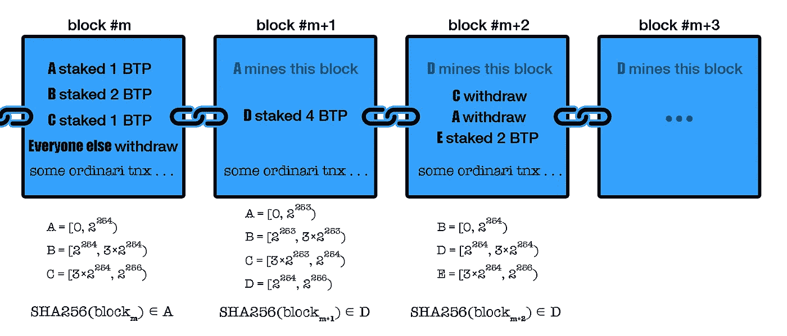
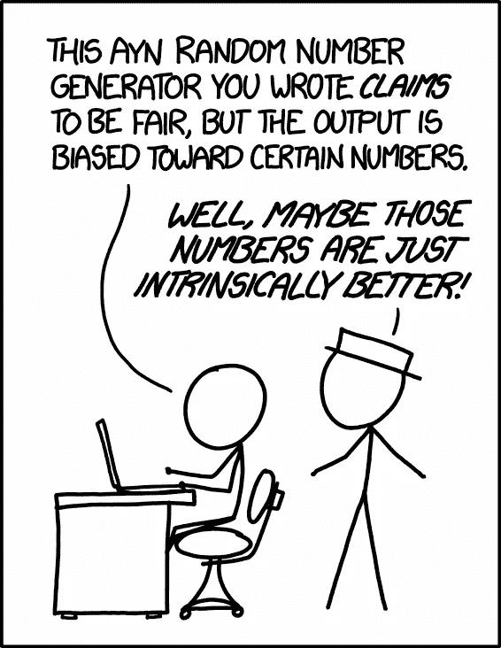

# 利害关系证明速成班(第二部分)

> 原文：<https://medium.com/coinmonks/a-crash-course-on-proof-of-stake-part-ii-96aeea8a0f58?source=collection_archive---------1----------------------->

## 利益证明的概念证明

## 目录

*   [先决条件和动机](/coinmonks/a-crash-course-on-proof-of-stake-part-i-843e7a44c682)
*   一个概念证明用于证明 ***(本帖)***
*   [分散随机数生成简介](/coinmonks/a-crash-course-on-proof-of-stake-part-iii-67aa720ea08f)
*   可验证延迟函数和可验证秘密共享*(即将推出)*
*   没什么利害关系和远程攻击*(即将推出)*

Adopted from an original by [analogicus](https://pixabay.com/en/users/analogicus-8164369/) on pixabay.com

到目前为止，我们已经了解到利害关系证明的核心思想是使用“利害关系”而不是“工作”或计算能力来保护区块链的投票机制免受 [Sybil 攻击](https://en.wikipedia.org/wiki/Sybil_attack)。这种替换只有在分散随机数生成(DRNG)机制的帮助下才可能选择下一个挖掘器；与工作证明不同，这种机制不需要大量的计算。

在这篇文章中，我介绍了一个简单实用的利害关系证明方案，并对其进行了检验，以获得一些关于利害关系证明的一般理解。除了教育意义之外，这种天真的实用方案还具有历史意义，因为它实现了第一个真实世界实现的利害关系证明区块链，如 [NXT](https://en.wikipedia.org/wiki/Nxt) 和 [Peercoin](https://en.wikipedia.org/wiki/Peercoin) 。

# 利益证明的概念证明

假设我们想从比特币中构建一个股权证明分叉！我们称之为比特币做赌注凭证，简称 BTP。首先，我们必须向系统添加两种新的特殊用途交易类型，如下所示:

*   **赌注交易**:任何人都可以在这类交易中下注(锁定)任何金额，成为利益相关者。
*   **提款交易**:利益相关者，也就是那些已经通过下注交易下注了一些硬币的人，可以通过这种类型的交易提取他们的股份。

按照普通交易，任何人都可以生成*押记*或*提款*交易，需要纳入区块链才能生效。此外，我们将终止工作证明。因此，我们分块移除 [nonce](https://en.bitcoin.it/wiki/Nonce) 字段。(*回想一下:每个有效块都包括一个黄金随机数，它是一个 32 位的数字，使得整个块的散列值低于目标值。黄金随机数是矿工应该解决的哈希难题的答案。*)

假设利益相关者已经下注了一些硬币。在每一轮中，在创建每个新块后，协议必须从可用的利益相关者中随机选择下一个块的矿工，其概率与他们的股份与总股份的比率有关。让我们使用最后一个块的 [**散列**](https://en.wikipedia.org/wiki/Hash_function) **作为随机性的来源，并根据它选择下一个块的矿工。虽然哈希函数是确定性函数，但是它们对输入的变化非常敏感，并且通常传统上使用任意输入的哈希函数的结果作为随机性的来源。**

准确地说，我们按照地址的顺序对 *N* 个可用的利益相关者进行排序，并为每个利益相关者分配一个非重叠区间，该区间的长度等于其股份与总股份乘以散列函数输出范围的比值(因此，分配区间的长度之和等于*max(hash(x))-min(hash(x))+1*)。其对应区间包含上一个块的哈希的利益相关者有机会挖掘下一个块，如果他这样做了，他将获得奖励。

**我们使用[*SHA256*](https://en.wikipedia.org/wiki/SHA-2)*作为我们的哈希函数，sha 256 的输出是一个 256 位的数，所以它的范围是 2 ⁵⁶.我只是对每个块的哈希做了一些假设。***

**

*A snapshot from the blockchain of BTP. At block #m, number of available validators is N = 3.*

*请注意，块之间必须有一个强制的最小延迟，比如说 *d* 秒，以便**为新块提供足够的时间在整个网络中传播**。因此，尽管块创建不需要解决耗费大量时间的硬散列难题，我们仍然需要延迟这个过程。*

*但是如果被选中的矿工不广播新块呢？选定的矿工可能会崩溃或碰巧是恶意的。好吧，如果被选中的矿工在 *D* 秒内没有响应，显然是 *D > d* ，协议通过**烧掉其部分股权**来惩罚他，并将生产新区块的任务分配给名单中的下一个利益相关者。*

*所谓的协议将以分散的方式执行。这意味着每个人都在他们的电脑上运行协议，每个人都可以看到区块链的本地视图。因此，**每个人必须本地决定**下一个块的选定矿工是否已经延迟超过 *D* 秒。例如，假设现在最长的链的长度是 *m* 并且 *V* 被选择作为块号 *m+1 的挖掘者。*如果你在 *D* 秒前收到 *V* 创造的新方块，而我在 *D* 秒后收到，在你看来， *V* 已经诚实行事并获得了奖励，而在我看来， *V* 是恶意的或不负责任的并受到了惩罚。因此，**网络延迟或恶意行为可能会导致在区块链分叉**。*

*我们已经完成了说明书的关键部分，找到了一些市场合作伙伴，并准备为 BTP 福克开展大规模的宣传活动！耶！*

*但是等一下，让我们先做一些安全分析😁。*

## *BTP 的安全分析*

***1)最后一个块散列的偏差***

*假设您是生成下一个块的选定利益相关者。您可以决定将哪组事务放入您的块中。因此，您可以控制散列函数的输入，从而控制其结果输出。为什么不试着让自己再次成为下一个矿工？你需要在超时之前测试一些不同的事务集，在 *D* 秒过去之前，希望找到一组事务，让你再次成为下一个块的矿工。所以最后一个块的散列作为一个随机数是有偏差的，这是不好的。我们将在下一篇关于分散随机数生成的文章中研究这个问题。*

**

*Maybe this gives you an idea about marketing strategies for BTP! Copyright reserved for [xkcd.com](https://xkcd.com/1277/).*

***2)需要新的选叉规则***

*正如我前面提到的，在 BTP，分叉可能是由于网络延迟或被选中的矿商封锁(不公开广播开采区块的行为)而发生的。这些分叉需要得到解决；否则，过不了多久，网络就会过时，因为人们不再能就交易的顺序达成一致。分叉选择规则是在不同分叉之间进行选择的共同基础。*

*工作证明使用“遵循最长的链”作为分叉选择规则，它保证了规范区块链上的最终协议，但是如果我们在这里使用相同的思想，恶意方可以很容易地攻击并使整个系统停止运行！*

**下面是方法:*假设你是被选中的下一个矿工，你是一个值得尊敬的攻击者！首先，你不公开发表任何东西，假装下一个被选中的矿工没有回应，然后继续下一个矿工，直到根据协议你再次成为被选中的矿工，然后重复同样的过程。与此同时，随着你获得回报，你在你私人持有的区块链中的股份越来越多，所以随着你持有的股份越来越多，你的工作会变得更容易。虽然**公共网络被迫等待至少 *d* 秒**才能传播每个块，但你可以尽可能快地生成新块(这比每 *d* 秒生成一个块要快得多)。最终，你有一个更长的链，然后你发布它。恭喜您，您已经恢复了此期间的所有交易，甚至赢得了可观的奖励。这种攻击被称为*远程攻击*。*

*从上面我们已经看到，“跟随最长的链”作为我们的证据方案的叉选择规则是不可接受的，但是也许其他选项如“跟随具有最大利害关系的链”对我们来说是有用的。我们将在接下来的帖子中讨论分叉选择规则，以及它与典型攻击的关系。*

# *下一步是什么？*

*我们已经了解了“利害关系证明”的核心理念，以及实施这一理念的简单实用的方法。然而，正如你已经理解的那样，我们需要更仔细地研究分散式随机数生成和可能的攻击，这正是我们在下面的帖子中要做的。*

*如果您准备好进行分散随机数生成，请转至 [*第三部分*](/@mmjahanara/a-crash-course-on-proof-of-stake-part-iii-67aa720ea08f) 。*

> *[直接在您的收件箱中获得最佳软件交易](https://coincodecap.com/?utm_source=coinmonks)*

**