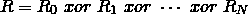
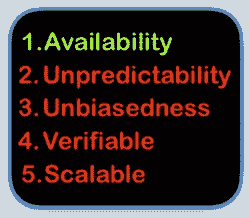
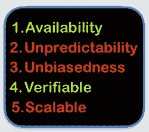
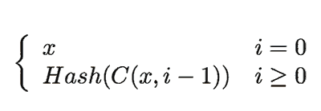
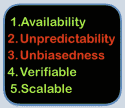

# 分散随机数生成简介

> 原文：<https://medium.com/coinmonks/a-crash-course-on-proof-of-stake-part-iii-67aa720ea08f?source=collection_archive---------1----------------------->

## 利害关系证明速成班(第三部分)

## 目录

*   [先决条件和动机](/coinmonks/a-crash-course-on-proof-of-stake-part-i-843e7a44c682)
*   [利益证明的概念证明](/coinmonks/a-crash-course-on-proof-of-stake-part-ii-96aeea8a0f58)
*   分散随机数生成简介 ***(本帖)***
*   可验证延迟函数和可验证秘密共享*(即将推出)*
*   没什么利害关系和远程攻击*(即将推出)*

Adopted from an original by [analogicus](https://pixabay.com/en/users/analogicus-8164369/) on pixabay.com

在最后一部分中，我介绍了一个简单实用的利害关系证明方案，它在安全性方面有严重的缺陷。其中一个缺点是我们的随机性来源的偏差能力，即最后一个块的散列；在每一轮中，被选中的矿工被允许并被激励去偏向随机数的结果，以增加他再次被选中成为下一个区块的矿工的概率。

为了解决这个问题，我们深入研究了分散随机数生成(DRNG)机制。首先，我们看到一个评估不同 drng 的框架，然后我们回顾 drng 的主要类型。开始吧！

*这部分会有点技术性，如果你觉得有些东西不清楚或难以理解，请告诉我。*

# 分散随机数生成

DRNG 机制是一组人在不依赖任何第三方的情况下协作生成一个随机数的过程。在我们继续讨论细节之前，让我先介绍一个简单的 DRNG。

## 朴素异或(上)

假设我们已经部署了一个智能契约来执行我们的方案。首先，它允许任何人注册成为 DRNG 机制的参与者；假设到目前为止已经有 N 名参与者注册。在每一轮中，该机制执行以下步骤来生成随机数:

1.  每个参与者必须在本地抽取一个随机数。我们把第 *i* 个参与者的本地随机数称为 *R_i* 。
2.  所有参与者必须向智能合同提交他们的本地随机数。
3.  输出是我们协作生成的随机数，计算如下:

Equation #1

如果参与者没有发送他的份额，我们简单地忽略该份额。此外，我们可以要求人们在注册时在智能合同中投入一些硬币，这样如果他们碰巧没有反应，我们就可以烧掉这些股份。

细心的读者可能会想，我们将如何使用 *R* 作为下一个块挖掘器的决定者，而 *R* 在生成之前需要许多新块(因为我们正在使用智能合同生成 *R* )。嗯，我们可以生成我们想要的那么大的 *R* 并将其分成块，比如说 *m* 块，然后我们可以使用这些块来选择所有后续 *m* 块的挖掘器。

## DRNG 对利益相关证明的期望特征

到目前为止，我们已经了解了两种不同的 DRNG 机制，*最后一个块哈希*和*朴素异或*，但是我们仍然没有一个框架来相互比较 drng。以下是[【1】](https://eprint.iacr.org/2016/1067.pdf)中 DRNG 在利益相关证明协议中所需的特性列表。

*   **可用性(活跃度)**:尽管有恶意节点参与，但成功完成。
*   **不可预测性**:在完成之前，没有人知道关于输出的任何事情。
*   **无偏**:输出随机均匀分布，尽管有恶意节点参与。
*   **可验证**:输出正确性可由第三方检查。这意味着，必须存在一个不可伪造的见证(或证明)来验证该输出是流程的唯一有效输出。
*   可扩展的:可由许多参与者执行；足够低的计算和通信复杂度。

一个好的 DRNG 必须大概率满足上述性质。

## 最后一块散列

现在我们有了合适的方法，让我们来权衡一下最后一个块哈希机制的优缺点。

*   **可用\\
    只要区块链保持可用，最后一个块哈希机制保持可用。**
*   不可预测性 ✘
    最后一个方块矿工实际上比任何人都更早知道结果。
*   不偏不倚的✘最后一个块生产者能够测试多个有效块，并且只广播对她有利的一个。
*   **可证实的** ✘
    没有证人或证明证明最终的区块是唯一可生产的区块。(事实上，在可能的情况下使用多个块。)
*   **可扩展的**:DRNG 只受限于区块链的可扩展性。它不需要额外的链上或链外消息。

## 朴素异或(第二部分)

我们来分析一下朴素的异或方案。首先，请注意，每个人都能够在流程完成之前观察事务并了解 *R_i* s。因此，**最后一个向智能合约提交其份额的参与者**可以提交 *R_N* ，使得 *R* 等于他想要的任意数字！*这叫最后一个演员问题。*所以，这个方案的输出不是*无偏的*，*不可预测的*也不是*可验证的*。

只要至少有一个参与者提交了她的份额，这个方案就会不断产生新的随机数；此外，不响应的参与者会受到惩罚。因此，将简单的 Xor 视为可用的方案是公平的。

每个块所需的链上事务的数量是 *N/m* ，如果我们假设 *m* 为常数，我们就不能在参与者数量巨大的情况下执行这个方案。因此，我认为朴素 Xor 是*不可销售的*。

Naive Xor

## 提交-显示异或

朴素 Xor 的主要缺点是最后一个参与者能够在提交它之前自适应地改变他的份额。很自然的想法是**限制参与者，使他们在看到其他参与者的份额后不能更改自己的份额**。为了实现这一想法，我们将一个*步骤 0* 添加到朴素 Xor，如下所示:

0.每个参与者必须首先提交其随机数的散列。因此，第 *i* 个参与者提交散列 *(R_i)* 。

然后我们按照朴素异或的步骤。显然要求 *R_i* 和 *Hash(R_i)* 一致，否则第 *i* 个参与者将受到惩罚。

这样，最后一个行动者不能自适应地改变他的份额以使 *R* 等于任意值。然而，他仍然可以决定发表或不发表他的份额。因此，他能够在某种程度上使结果有偏差。

为了使该方案可验证，我们必须在每次甚至一个人没有提交他的份额时终止过程，并再次重复整个过程。这样，每个人都可以观察区块链，并验证产生的随机数 *R* 是唯一可产生的随机数。(*)这会引起一些其他问题，但我不会详细说明。*)

Commit-Reveal Xor

## 哈希洋葱异或

Hash Onion is *multi layered* commit. Copyright reserved for [onionsnz.com](http://www.onionsnz.com).

最后两个方案，朴素 Xor 和提交-揭示 Xor，是不可扩展的，因为随着参与者数量的增加，它们需要大量的链上事务。想法是以减少所需消息数量的方式改变提交-揭示步骤。换句话说，这个想法是**让参与者能够用每条消息**承诺一个以上的价值。

*Hash onion* 是一个只使用一条小消息提交一系列值的工具。对于任意值 *x* ，我们定义 *C(x，i)* 如下:

Equation #2

比如 *C(x，2)* 是 *C(x，1)* 的 hash， *C(x，1)* 是 *C(x，2)* 的[前像](https://en.wiktionary.org/wiki/preimage)。如果一个人向 C(x，2)提交，他向一系列值提交: *x，hash(x)，hash(hash(x))* 。

*下面是哈希洋葱 Xor 方案:*每个块必须包含一个名为 *R* 的字段和一个名为*前像*的字段。我们将*场 R* 和*场预图像*设置为等于 genesis 块中的任意值。任何人都可以通过下注一些硬币并提交随机值 *R_i* 的 *C(R_i，m)* 来注册为准矿工。注意 *m* 是协议中预定义的常数。在每一轮中，协议根据 *R* 从一组注册挖掘器中选择下一个块挖掘器。被选中的矿工必须剥掉一层他承诺的洋葱！为此，矿工将*场预映像*设置为等于他已提交的最后 *C(x，i)* 的预映像(通过注册为矿工或通过产生块)。那么他必须如下设置字段 R:

*(新块的 R) =(最后块的 R) xor(新块的前图像)*

**例如**，如果 *V* 被选为下一个块的挖掘者，并且如果他挖掘的最后一个块的预图像等于 *C(R_V，5)* ，他必须用 *C(R_V，4)填充新块的预图像字段。*

在一个矿工开采完 m+1 个区块后，她的洋葱被完全剥掉，他不得不再次注册并提交一个新的洋葱。注意，在这个方案中，我们每个块只传送 2 个额外的消息。因此，即使有大量参与者，它也是可执行的。

现在我们有了*可用性*、*可验证性*和*可扩展性*。但是我们的方案*仍然缺少* *不可预测性*和*无偏性*。被选中的下一个矿工可以决定是取消提交还是不广播新的块。所以他比其他人更早知道最终结果，他可以偏向于对自己有利的方面。

Hash Onion Xor

# 下一步是什么？

有没有任何已知的 DRNG 机制可以满足所有这些期望的性质？！幸好是的！我们将研究 ***可验证延迟函数*** 和 ***可验证秘密共享*** 作为使我们能够建立这样的 DRNG 机制的关键工具。下一部分再见！:)

# 参考

[1][https://eprint.iacr.org/2016/1067.pdf](https://eprint.iacr.org/2016/1067.pdf)

> [直接在您的收件箱中获得最佳软件交易](https://coincodecap.com/?utm_source=coinmonks)

