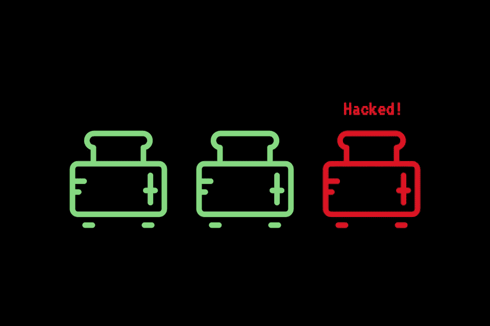

# 一个秘密的无政府主义者的图书馆——第 1 卷

> 原文：<https://medium.com/coinmonks/a-crypto-anarchists-library-vol-1-15fbd3ebf6aa?source=collection_archive---------5----------------------->

这一系列文章汇集了加密运动和黑客文化的基础文本、邮件列表、在线社区、书籍和文章。

在这篇文章中，我们将深入一些黑客文化的早期文件:**行话文件**和**黑客字典**。

我们也将看看关于他们的第一本书:**黑客—**的英雄们…