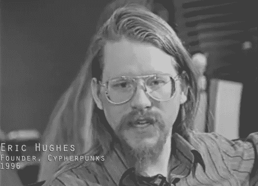

# 一个赛博朋克的宣言——隐私的定义

> 原文：<https://medium.com/coinmonks/a-cypherpunks-manifesto-a-definition-of-privacy-66c36f99e940?source=collection_archive---------4----------------------->

Cypherpunk 创始人之一埃里克·休斯在 1993 年 3 月 9 日写下以下文字。

— — — — — — — — — — — — — — — — — — — — — — — — — — — — — —

在电子时代，隐私对于一个开放的社会是必要的。隐私不是秘密。私事是不想让全世界都知道的事，而秘密是不想让任何人知道的事。

> 隐私是有选择地向世界展示自己的力量。

如果双方有某种交易，那么每个人都有他们互动的记忆。每一方都可以讲述他们自己对此的记忆；谁能阻止它呢？人们可以通过法律反对它，但是言论自由，甚至比隐私更是一个开放社会的基础；我们寻求不限制任何言论。如果多方在同一个论坛中一起发言，则每一方都可以与所有其他方发言，并将关于个人和其他方的知识聚合在一起。电子通讯的力量使这种群体言论成为可能，它不会仅仅因为我们希望它消失而消失。

因为我们需要隐私，所以我们必须确保交易的每一方只知道与交易直接相关的信息。既然任何信息都可以谈论，我们必须确保尽可能少地透露。在大多数情况下，个人身份并不突出。当我在商店购买杂志并把现金交给店员时，没有必要知道我是谁。当我要求我的电子邮件提供商发送和接收消息时，我的提供商不需要知道我在对谁说话，或者我在说什么，或者别人在对我说什么；我的供应商只需要知道如何得到消息，我欠他们多少费用。**当我的身份被交易的潜在机制暴露时，我就没有隐私了。我不能在这里选择性地展示我自己；我必须*永远*展现自己。**

因此，开放社会中的隐私需要匿名交易系统。迄今为止，现金一直是主要的这类系统。匿名交易系统不是秘密交易系统。匿名系统使个人能够在需要时并且仅在需要时透露他们的身份；这就是隐私的本质。

开放社会的隐私也需要密码学。如果我说了什么，我希望只让我想说的人听到。如果我演讲的内容被全世界知道，我就没有隐私了。 ***加密是表示对隐私的渴望*** ，用弱密码术加密是表示对隐私没有太多的渴望。此外，当默认匿名时，为了有把握地揭示一个人的身份，需要加密签名。

我们不能指望政府、公司或其他大型的、不知名的组织出于善意给予我们隐私。 说我们对他们有利，我们应该预料到他们会说话。试图阻止他们的言论就是与信息的现实作斗争。**信息不仅仅想要自由，它渴望自由。**信息膨胀，填满可用存储空间。 ***信息是谣言的更年轻、更强大的表亲；信息比谣言跑得快，眼睛多，知道得多，理解得少。***

如果我们希望拥有隐私，就必须捍卫自己的隐私。我们必须团结起来，创建允许匿名交易发生的系统。几个世纪以来，人们一直在用耳语、黑暗、信封、紧闭的门、秘密握手和信使来捍卫自己的隐私。过去的技术不允许很强的隐私，但是电子技术允许。

我们赛博朋克致力于建立匿名系统。我们用加密技术、匿名邮件转发系统、数字签名和电子货币来保护我们的隐私。

密码朋克写代码。我们知道必须有人编写软件来保护隐私，因为除非我们都这样做，否则我们无法获得隐私，所以我们将编写它。我们发布我们的代码，以便我们的密码朋克伙伴可以练习和使用它。我们的代码在全球范围内免费供所有人使用。如果你不认可我们写的软件，我们不会太在意。我们知道软件不能被破坏，一个广泛分散的系统不能被关闭。

密码朋克强烈反对对加密技术的监管，因为加密从根本上来说是一种私人行为。事实上，加密的行为将信息从公共领域移除。即使是反对加密的法律也只能延伸到一个国家的边境和暴力地区。密码学将不可避免地在全球传播，随之而来的是匿名交易系统。

隐私要广泛传播，就必须成为社会契约的一部分。人们必须为了共同的利益来一起部署这些系统。隐私只延伸到一个人在社会中的同伴的合作。我们赛佛朋克寻求你们的问题和你们的关注，并希望我们可以与你们接触，这样我们就不会欺骗自己。然而，我们不会因为一些人可能不同意我们的目标而偏离我们的方向。

赛博朋克积极致力于使网络更安全，保护隐私。让我们一起快速前进。

前进。

— — — — — — — — — — — — — — — — — — — — — — — — — — — — — —

Eric 提出了一个座右铭“让密码朋克来写代码”。他创建并主持了第一个匿名邮件服务，这种服务可以帮助你发送和接收信息而不暴露你的身份。

他在邮件列表上写道—

密码朋克写代码。他们知道必须有人编写代码来保护隐私，因为这是他们的隐私，所以他们要编写代码…

Cypherpunks 才不管你喜不喜欢他们写的软件。
密码朋克知道软件是不能被破坏的。
Cypherpunks 知道一个广泛分散的系统是无法关闭的。
密码朋克将保证网络的隐私安全。

来源-

> [https://en . Wikipedia . org/wiki/Eric _ Hughes _(cypher punk)](https://en.wikipedia.org/wiki/Eric_Hughes_(cypherpunk))
> 
> [https://www.wired.com/1993/02/crypto-rebels/](https://www.wired.com/1993/02/crypto-rebels/)
> 
> [https://www.activism.net/cypherpunk/manifesto.html](https://www.activism.net/cypherpunk/manifesto.html)

> 我们有一个活跃的社区，来这里加入我们的。订阅我们的时事通讯，在这里我们可以分享采访、交易想法、市场见解[点击](https://www.getrevue.co/profile/CoinMonks)。
> 
> [直接在您的收件箱中获得最佳软件交易](https://coincodecap.com/?utm_source=coinmonks)

***如果你是投资者、交易者、开发者或加密爱好者，或者对 heck crypto 如何工作有很多疑问，请加入我们的*** [***slack 社区***](https://goo.gl/3Ex81z) 。我们的 crypto 论坛 CoinMonks，也可以查看我们的网站，该网站根据开发进度对 Crypto 进行排名[**CoinCodeCap**](http://www.coincodecap.com)**。**

# ❤️喜欢，分享，留下你的评论

如果你喜欢这篇文章，不要忘记喜欢，与你的朋友和同事分享，并在下面留下你对这篇文章的评论。
还有……

