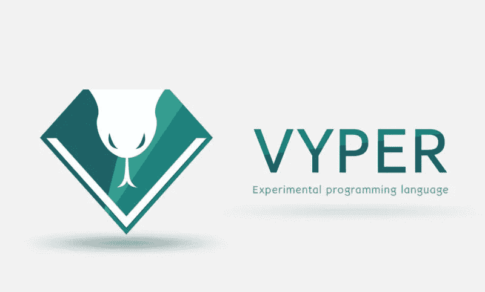

# 与 Vyper 共度的一天

> 原文：<https://medium.com/coinmonks/a-day-with-vyper-6a0a5861f24a?source=collection_archive---------2----------------------->



几天前，为了继续我的认证注册，我收到了一封来自 [**B9Lab**](https://b9lab.com/) 的电子邮件，要求我发送一个代表我的 EOA 地址或合同地址。

这听起来像是一个检查我的待办事项列表中的三项的好机会:

1.在媒体上写我的第一篇文章

2.在 **Vyper** 中编写智能合同

3.检查 Vyper 在 [**松露**](https://truffleframework.com/) 环境中的实际集成。

让我们从 Vyper 开始这一天吧！

# 为什么是 Vyper

在问为什么是 Vyper 之前，让我们先看看什么是智能合同。这是一个微服务，有一些函数可以调用，以便在一个分散的环境中存储和读取东西？是的，当然是。但是从非技术的角度来看，智能合同是机器和世界其他部分之间的交易。只要网络存在，就以某种方式工作的协议。

考虑到这些原则，一份巧妙的合同应该**易于书写**但也必须**易于阅读**。

从[到**的 Doc** 到](https://github.com/ethereum/vyper):

> 对读者来说简单比对作者来说简单更重要，而对没有多少 Vyper 使用经验(以及一般编程经验)的读者来说简单尤为重要。

简单首先将意味着 Vyper 没有:**修饰符**、**类继承、内联汇编、函数重载、运算符重载、递归调用、无限长循环**和**二进制不动点。**

# 安装 Vyper

我在 **MacOS** 上，对于不同的 OS 点击[这里](https://vyper.readthedocs.io/en/latest/installing-vyper.html)。

**先决条件:**

1.  安装 [Brew](https://docs.brew.sh/Installation.html)
2.  安装 [Python](https://python-guide.readthedocs.io/en/latest/starting/install3/osx/) ≥ 3.6
3.  安装 [npm](https://changelog.com/posts/install-node-js-with-homebrew-on-os-x)
4.  检查 *gmp* *leveldb* 是否安装了 Brew。

Vyper 仍然是测试版，所以我们将把它安装在一个虚拟的 python 环境中。

**虚拟环境:**

```
$ sudo apt install virtualenv$ virtualenv -p python3.6 — no-site-packages ~/vyper-venv$ source ~/vyper-venv/bin/activate
```

**维普:**

```
$ git clone [https://github.com/ethereum/vyper.git](https://github.com/ethereum/vyper.git)$ cd vyper$ make$ make test
```

# 项目设置

我们将使用 Truttle 的`init`选项来搭建我们的项目。

首先我们要装松露:

```
$ npm install -g truffle
```

创建并移动到新文件夹:

```
$ mkdir identity-test && cd identity-test
```

初始化项目:

```
$ truffle init
```

# 写身份契约

该项目的目的是写一个基本的身份契约，代表我是谁。我的基本身份是由:*名*、*姓*和*年龄组成，仅此而已*和*不比*少。

在 *contracts* 文件夹中创建一个名为 Identity.v.py 的文件(是的，我们可以使用 python 语法 highlighter)。

## 声明五个公共变量:

1.  *所有者*是创建合同的所有者的地址
2.  *名和姓*是名和姓的 32 字节表示。
3.  *出生*是一个 int128，代表出生的时间戳。(如果我使用负时间戳—1970 年之前的日期—，`assert birth < block.timestamp` 恢复我的交易，如果您知道原因，请写在注释中)。
4.  *创建时间*时间戳代表身份创建的日期*。*

## **申报创作*事件:***

## **建造者:**

*我们定义:*

1.  一个*公共* __init__ 函数，取:*名*、*姓*和*出生*。
2.  我们检查我们的函数参数不为空(注意:`assert not not _firstname` 等于`assert _firstname != 0x000000000000000`)
3.  我们定义我们的公共变量。
4.  我们记录了*创建*事件

## **名字更新功能:**

这里，我们更新*名字*，如果:(I)不为空，(ii)交易来自所有者，以及(iii)新名字不等于旧名字。最后我们返回新的名字。

## **回退功能:**

当函数签名与任何可用函数都不匹配时，或者当有人试图向我们的合同发送以太网时，就会触发回退函数。

如果有人想在我们的合同上签字，我们会退回去。

# 块菌整合

Truffle 还不支持 Vyper 契约，所以我们需要一些工具来将 Vyper 编译成 Truffle 的兼容工件。救救我们吧！

安装 Truper:

```
$ npm install -g truper
```

创建包文件:

```
$ npm init
```

在*脚本*字段中添加以下脚本:

```
"scripts": { "build:sol": "truffle compile", "build:vyper": "truper", "build": "npm run build:sol && npm run build:vyper", "console": "truffle console", "migrate:ganache": "truffle migrate --network ganache", "migrate:mainnet": "truffle migrate --network mainnet", "test": "truffle test"},
```

现在我们可以运行构建任务，将 vyper 和 solidity 契约构建到 */build* 文件夹中( **N.B.** 记得运行到 **virtualenv** )。

```
$ npm run build
```

# 试验

关于我们的块菌集成，最有趣的事情之一是我们可以很容易地测试我们的代码。

在*测试*文件夹中创建一个新文件 *Identity.test.js* 。

添加 [momentjs](https://momentjs.com/) 和[蓝鸟](http://bluebirdjs.com/docs/getting-started.html):

```
$ npm install moment bluebird
```

## **现在我们测试我们的构造函数:**

为了**测试**我们的构造器，我们有两个**主“块”**:

1.  **失败案例:**我们测试合同创建是否失败(I)值**为空**；以及(ii)如果我们在事务中使用**值，则。**
2.  **成功案例:**我们测试*名*、*姓*、*主*和*出生*是否有正确的值。注意，我们必须用`web3.toUtf8()`将 utf8 中的字节 32 和 bigNumber 转换成用`toString(10)`表示的字符串

## **更新 FistName 测试:**

1.  **失败情况:**我们测试函数是否失败，其中(I)事务来自**非所有者**地址(ii) 新名称为**空**，以及(iii)新名称**等于旧名称**。
2.  **成功案例:**我们测试新的*名字*是否有新的值。

## **回退测试:**

回退功能发送回不包括交易费用的交易值，因此我们在交易开始和结束时检查发送方的余额。

现在跑`$ npm run test`

# **部署到主网**

现在我们把合同放在主网上。我将使用 [Infura](https://infura.io/) 作为以太坊的连接提供者。

首先，我们必须安装 [HDWalletProvider](https://github.com/trufflesuite/truffle-hdwallet-provider) 来处理交易签名以及与以太网的连接。

```
$ npm install truffle-hdwallet-provider
```

接下来在 *truffle.js* 中，我们必须设置我们的钱包提供商:

1.  **记忆:**是你钱包的 12 个种子字。
2.  infura api key: 注册 infura 后的 key。
3.  **气价**:查看 [Eth 加油站](https://ethgasstation.info/)了解当前气价( **N.B.** 气价以卫为单位，Eth 加油站以 Gwei 为单位)。

运行`$ npm run migrate:mainnet`

仅此而已。回头见！:)

> [在您的收件箱中直接获得最佳软件交易](https://coincodecap.com/?utm_source=coinmonks)

[](https://coincodecap.com/?utm_source=coinmonks)