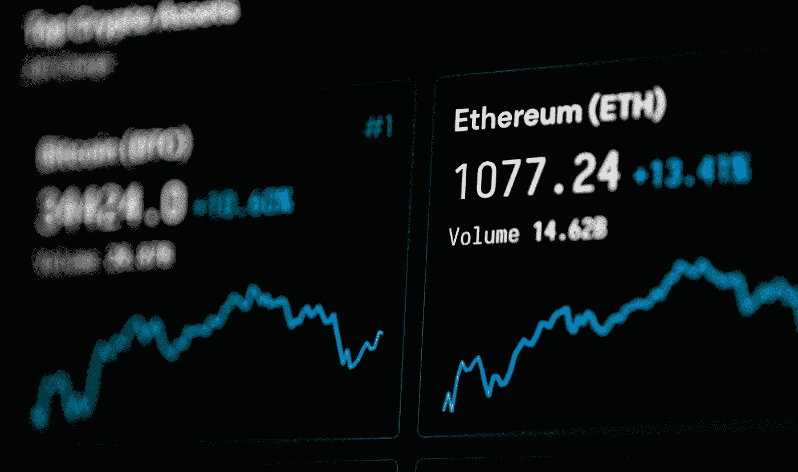

# 去中心化的应用网络:以太坊的案例

> 原文：<https://medium.com/coinmonks/a-decentralised-application-network-the-case-for-ethereum-fb88b8d6c63?source=collection_archive---------4----------------------->

这些年来，关于世界上第二大加密货币以太坊的喋喋不休、明争暗斗和讨论不在少数。这是我试图在为以太坊的成功辩护的同时，揭开抽象的神秘面纱。

## 简单地说

*   以太坊是一个去中心化的区块链协议，有三个用例:金融市场、中间层金融应用和非金融应用。
*   看涨的理由很简单，以太坊继续为去中心化的金融业务和生态系统提供动力。
*   bear 案例是以太坊 2.0 推出时出现的无法扩展或破坏协议的错误。

与流行观点相反，加密货币生态系统不是一个赢家通吃的零和游戏。事实上，只有一小部分加密货币旨在成为价值存储和交换媒介，其中大部分都输给了比特币。“加密货币”这个术语实际上是一种误导，如果它被称为“开放协议生态系统”或类似的名称会更合适。

无论如何，以太坊是市值第二大的加密公司，在出版时价值 2400 亿美元。这不是“比特币的黄金之银”,也不是竞争对手，尽管你可能已经读过。

一方面，比特币的[价值主张](https://chrisoncrypto.com/blog/f/11000-bitcoin-is-just-the-beginning)是作为一种价值储存手段——无缝、防篡改和绝对。这是区块链技术(像我一样讨厌这个术语)应用于货币。另一方面，以太坊是一个在网络上构建去中心化应用的平台。本质上，它是一个行业应用层，与低分辨率操作系统的共同点多于比特币。使用[的可靠性](https://soliditylang.org/)，开发者可以在以太坊区块链上编写任何东西，然后点击一个按钮，将它发送到以太网。

以太坊智能合约是一个自动化流程，一旦满足预定义的条件，它就会执行一项功能。它是 Uniswap、借贷和保险协议、金融衍生品、供应链管理、去中心化文件存储、不可替代令牌等去中心化交换的基础，也是其他组织结构的基础，这些组织结构更适合在以太坊协议上运行。

在某种程度上，以太坊是一个确保承诺得以兑现的平台。

## 三个应用程序

如前所述，以太坊有三大应用:金融市场、中层金融应用和非金融应用。

## 金融市场

去中心化金融的存在是因为以太坊。该平台利用稳定信用、金融衍生品、硬币发行、借贷协议和其他金融工具，使银行和金融服务机构脱媒。有抵押的稳定货币让地球上的任何人都能获得美元和财产等资产所有权。个人可以使用像 Compound 这样的贷款协议获得贷款，或者发行硬币来为项目筹集资金，而无需银行或传统的风险资本渠道。他们还可以在永不关闭的交易所以低成本交易金融衍生品。与充斥着费用、佣金、基金管理成本和对应风险的传统集中式服务相反，Uniswap 的费用要低得多(当以太坊网络不堵塞时)。诚然，收费仍是一项进行中的工作。代价是个人必须掌控自己的财务状况。Uniswap 是目前日交易量达到 10 亿美元的顶级点对点交易平台。

在我看来，这是迄今为止以太坊最强的基本面牛市。

## 中层财务应用程序

一旦数据输入显示条件得到满足，Etherisc 等保险协议将自动向受保人发放资金。其他对时间敏感的流程，如延误或取消航班的保险费，可以完全自动化。最近，不可替代代币热潮(NFT)表明，音乐家和艺术家可以将他们的艺术代币化，并直接提供给粉丝，从而提高利润率和解除管理公司的中介作用。虽然不缺乏泡沫和绒毛，但用例可以应用于金钱和非金融事物，如艺术或旅游保险。

## 非金融应用

非金融应用的两个例子包括分散自治组织(Dao)和分散文件存储。在 DAO 中，投票权由区块链本地人拥有的代币比例决定。公司决策是通过区块链上的投票智能合同系统做出的，消除了任何法律上的不确定性，也可能不需要根据商业模式设立董事会。此外，文件存储系统可以出租它们的磁盘空间，并接收区块链的令牌作为补偿，类似于 torrents 对互联网所做的(但有一个激励机制)。Filecoin 就是这样一种存储协议。

## 公牛案

以太坊的有利条件很简单:web 应用程序的全球化和无边界去中介化。在区块链，人们不需要银行提供担保证明就能获得贷款。企业家不需要组织一场融资活动来启动和运行一个项目。潜在的房地产投资者不需要银行来拥有一块商业地产。使用以太坊，人们不需要使用中央经纪人来买卖证券。当艺术家们能够将艺术符号化并直接卖给粉丝时，他们不需要依赖管理公司。

由于非中介化是网上各种交易的基础层，这个清单实际上是无穷无尽的。每个集中式解决方案都会收取运营成本费用，并且存在单点故障。以太坊解决了这个问题，公司可以在不同程度上利用公共服务。

以太坊的牛市要求由 web 2.0 早期普及的数字去中心化趋势继续下去。如今，以太坊运行着一个强大的并行分散式金融系统，该系统不会被关闭，任何有互联网连接的人都可以访问。

## 熊案

以太坊面临的两个主要威胁很简单:以太坊 2.0 推出时代码中的协议破坏错误和可伸缩性。

与比特币不同，以太坊尚未达到临界规模，必须继续与竞争对手一起快速发展，而不是躺在功劳簿上。尽管如此，它仍然是市场上最活跃的智能合约平台，开发者继续青睐它，而不是其他平台，如 Cardano、币安连锁、EOS 和 Tron。由于发达的生态系统、网络效应和先发优势，以太坊十有八九会在可预见的未来保持领先。

然而，比特币智能合约可能会对以太坊的连续性构成威胁，尽管在我看来，这种威胁远远小于可扩展性问题。如果像 EIP-1559 和乐观主义这样的扩展解决方案是一个失败，那么资本可以从以太坊流向提供低费用的集中期权(币安链)。

这些情景似乎不太可能。

## 把所有的放在一起

流行的说法是，随着大型科技公司、银行和金融集团将更多算法纳入其全方位服务，人工智能将使每个人都变得多余。许多人认为这些垄断是绝对的，只会永远扩大他们的利润。

相反，情况正好相反。

在我们说话的时候，比特币和以太坊正在分散货币、金融市场和商业。如上所述，他们的成功与主流观点形成了鲜明的对比，这种情况正在发生。任何人只要有网络连接，并且对旧的金钱观念有短暂的依恋，就可以立即打包离开传统体系。

因此，我的观点很简单:比特币是不变的可靠货币，以太坊是世界上最大的去中心化应用层。如果有人问我，在互联网普及之前，我是否可以拥有一个 TCP/IP，我会很感兴趣。

当然，不言而喻，以太坊不是万能的。该平台正在不断发展，还没有达到比特币可以说已经达到的临界质量。以太坊很可能将在未来几年经历更多审查，类似于比特币 2017 年的可扩展性辩论和硬分叉。事实上，这一时刻正在快速到来，并将影响一个基本问题:未来的世界是比特币既是可靠的货币，又是智能合约平台，还是会有一些针对不同用例进行优化的互操作协议？我认为后者是可能的。

总之，很明显，比特币是占主导地位的货币网络，以太坊是占主导地位的应用网络。那些仍在询问“下一个比特币”的投资者应该立即停止，而是应该将注意力转向即将被颠覆的行业，无论是赌博、保险还是其他完全不同的行业。

> 加入 Coinmonks [Telegram group](https://t.me/joinchat/Trz8jaxd6xEsBI4p) 并了解加密交易和投资

## 另外，阅读

*   最好的[密码交易机器人](/coinmonks/crypto-trading-bot-c2ffce8acb2a) | [网格交易](https://blog.coincodecap.com/grid-trading)
*   [加密复制交易平台](/coinmonks/top-10-crypto-copy-trading-platforms-for-beginners-d0c37c7d698c) | [如何在 WazirX 上购买比特币](/coinmonks/buy-bitcoin-on-wazirx-2d12b7989af1)
*   [CoinLoan 点评](/coinmonks/coinloan-review-18128b9badc4)|[Crypto.com 点评](/coinmonks/crypto-com-review-f143dca1f74c) | [火币保证金交易](/coinmonks/huobi-margin-trading-b3b06cdc1519)
*   [尤霍德勒 vs 科恩洛 vs 霍德诺特](/coinmonks/youhodler-vs-coinloan-vs-hodlnaut-b1050acde55a) | [Cryptohopper vs 哈斯博特](https://blog.coincodecap.com/cryptohopper-vs-haasbot)
*   [杠杆代币](/coinmonks/leveraged-token-3f5257808b22) | [最佳密码交易所](/coinmonks/crypto-exchange-dd2f9d6f3769) | [Paxful 点评](/coinmonks/paxful-review-4daf2354ab70)
*   [加密套利](/coinmonks/crypto-arbitrage-guide-how-to-make-money-as-a-beginner-62bfe5c868f6)指南| [如何做空比特币](/coinmonks/how-to-short-bitcoin-568a2d0b4ae5)
*   [如何在印度购买比特币？](/coinmonks/buy-bitcoin-in-india-feb50ddfef94) | [WazirX 审核](/coinmonks/wazirx-review-5c811b074f5b) | [BitMEX 审核](https://blog.coincodecap.com/bitmex-review)
*   [印度比特币交易所](/coinmonks/bitcoin-exchange-in-india-7f1fe79715c9) | [比特币储蓄账户](/coinmonks/bitcoin-savings-account-e65b13f92451)
*   [币安收费](/coinmonks/binance-fees-8588ec17965) | [僵尸加密审查](/coinmonks/botcrypto-review-2021-build-your-own-trading-bot-coincodecap-6b8332d736c7) | [热点审查](/coinmonks/hotbit-review-cd5bec41dafb)
*   [我的密码交易经验](/coinmonks/my-experience-with-crypto-copy-trading-d6feb2ce3ac5) | [购买硬币评论](https://blog.coincodecap.com/buycoins-review)
*   [Bybit 融资融券交易](/coinmonks/bybit-margin-trading-e5071676244e) | [币安融资融券交易](/coinmonks/binance-margin-trading-c9eb5e9d2116) | [Overbit 审核](/coinmonks/overbit-review-9446ed4f2188)
*   [加密货币储蓄账户](/coinmonks/cryptocurrency-savings-accounts-be3bc0feffbf) | [YoBit 审核](/coinmonks/yobit-review-175464162c62) | [Bitbns 审核](/coinmonks/bitbns-review-38256a07e161)
*   [Botsfolio vs nap bots vs Mudrex](/coinmonks/botsfolio-vs-napbots-vs-mudrex-c81344970c02)|[gate . io 交流回顾](/coinmonks/gate-io-exchange-review-61bf87b7078f)
*   [最佳比特币保证金交易](/coinmonks/bitcoin-margin-trading-exchange-bcbfcbf7b8e3) | [萝莉点评](/coinmonks/lolli-review-e6ddc7895ad8) | [比特币保证金交易](https://blog.coincodecap.com/bityard-margin-trading)
*   [创造并出售你的第一个 NFT](https://blog.coincodecap.com/create-nft) | [本地比特币评论](/coinmonks/localbitcoins-review-6cc001c6ed56)
*   [加密保证金交易交易所](/coinmonks/crypto-margin-trading-exchanges-428b1f7ad108) | [赚取比特币](/coinmonks/earn-bitcoin-6e8bd3c592d9) | [Mudrex 投资](https://blog.coincodecap.com/mudrex-invest-review-the-best-way-to-invest-in-crypto)
*   [如何在印度购买以太坊？](https://blog.coincodecap.com/buy-ethereum-in-india) | [如何在币安购买比特币](https://blog.coincodecap.com/buy-bitcoin-binance)
*   [顶级付费加密货币和区块链课程](https://blog.coincodecap.com/blockchain-courses)
*   [MXC 交易所评论](/coinmonks/mxc-exchange-review-3af0ec1cba8c) | [Pionex vs 币安](https://blog.coincodecap.com/pionex-vs-binance)