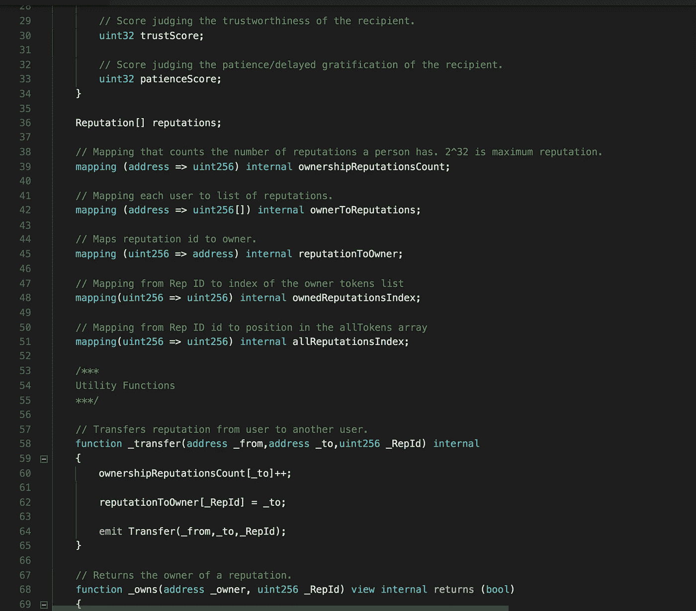

# 使用以太坊区块链的分散声誉系统

> 原文：<https://medium.com/coinmonks/a-decentralized-reputation-system-using-the-ethereum-blockchain-c3761eee2142?source=collection_archive---------3----------------------->

# **利己利他**

我最近看了一个由“Kurzgesagt——简而言之——人制作的关于利己利他主义的视频，这是我最喜欢的 [YouTube 频道](http://www.youtube.com/watch?v=rvskMHn0sqQ)之一。该视频的前提是，通过帮助那些不如我们幸运的人，我们实际上实现了自己的成功。

把它想象成一个正和游戏，而不是零和游戏……财富的馅饼变大了。让我解释一下。随着全球教育和金融普及程度的提高，对创意的需求也在增加。人们变得更加富有。这些财富推动了对产品和服务的需求，促进了创新。社会不断变得更好，因为我们不断找到更好的解决现有问题的方法，以及解决我们甚至不知道自己有问题的方法。

**哇。如果这一论点成立，我们可以在做全球社会公益的同时追求自己的自私欲望，以产生影响，找到意义，并获得金融财富。**

如果这对你来说似乎有点过于宏大，你可能想在这里停止阅读。文章的其余部分解释了我和我的团队在过去的这个周末进行的黑客马拉松项目。我们开发了一个基于全新范式的平台和应用，最好保持开放的心态。用马克·吐温的话说:

> “远离那些试图贬低你抱负的人。小人物总是这样，但真正伟大的人会让你觉得你也可以变得伟大。”

# **问题**

世界上有 20 亿人(是的，这是一个“b”)没有银行账户——是的，这是一个真实的词来描述那些没有银行账户的人。这些人被排除在世界金融体系之外。他们不能开信用卡，不能在网上购物，不能借钱，最终无法实现向上的经济流动。对于肯尼亚的农民来说，一场严重的干旱不仅仅会毁掉庄稼。这可能导致完全的财务损失，因为农民无法获得贷款并开始重建。

这个问题是信任的问题。因为农民从来没有参与过传统的金融生态系统，所以他/她还不如不存在…去银行。这位农民没有财务记录——没有信用记录。

# **解决方案**

在美国，信用评分是我们证明自己财务记录的方式。其他国家有他们自己的系统，而发展中国家通常根本没有系统。在创建由区块链提供的信誉评分平台 **SOURCE 时，我们决定以这些发展中国家为目标。**

> 在我们的新模型中，声誉是信誉的代理。

以肯尼亚的农民为例，她/他的社区——家人、朋友、当地商人——都可以帮助决定她/他是否值得。最终，随着这个人的名声越来越大，银行也可以跳出来担保。

> 有可能建立一个基于心理测试(想想就业测试)的信用价值预测模型，这可能非常准确。

我说“可能”是因为我没有做过广泛的研究，但是我读过世界银行在秘鲁进行的一项[试点研究](http://www.fomin.org/Portals/0/impact%20evaluation/Brief_psychometrics.pdf)的结果，该研究是关于一种心理测试筛选工具在信用价值方面的有效性，结果显示了积极的预测结果。此外，在今天这个大数据和机器学习的时代，我敢打赌，我们可以真正擅长设计有效的心理测试。

# **令牌**

你们有些人可能听说过 ERC20 代币。这是大多数令牌的标准协议，你知道有无数公司拥有 ICO。然而，ERC20 令牌仅适用于可互换资产，即可以相互交换的资产。比如比特币，或者美元(我可以把口袋里的任何一张美元换成任何一张美元)。然而，信誉背书是独特的、不可替代的资产，因此 ERC20 令牌标准将不起作用。相反，我们将 ERC721 令牌标准协议用于不可替换的资产。对于熟悉 Cryptokitties 的人来说，每只 kitty 都代表一个独特的不可替代的 ERC721 令牌。

# **激励机制**

你可能已经想到了六种作弊的方法。你说得对，但前提是网络参与者没有得到适当的激励。在后面的帖子中会有更多的介绍，但是我想说的是以太币令牌(在我们的例子中是 ERC721)可以被设计成在经济上激励合作而不是共谋。潜在地，我们甚至可以使用令牌管理的注册表，这将实现一个自我监管的系统，其中参与者不仅被激励不作弊，而且被激励排除作弊。同样，在以后的文章中会有更多的技术细节。

# **结论**

我们可以在信用评分之外推断这个用例。如果你每次在 Yelp 上评论一家餐厅时都得到认可，或者你不是穿着优步的烂醉如泥，或者鲶鱼不是你的约会对象，那会怎么样？所有这一切都发生在一个可互操作的、分散的生态系统中，在这个生态系统中，参与者受到经济激励，变得值得信任。我只是触及了表面。颠覆传统商业模式的机会是无穷无尽的，所以让我们一起努力去构建一个去中心化的世界。

我的队友周振庭和菲利普·格雷兹曼分别是摇滚巨星级的程序员和思想家。

**了解更多信息来源**

[github.com/MangoSalad/Source](http://github.com/MangoSalad/Source)

在 [**Linkedin**](https://www.linkedin.com/in/rikasukenik/) 和 [**Twitter**](https://twitter.com/rika_sukenik) 上与我联系

**参考文献**

[globalfindex.worldbank.org](http://globalfindex.worldbank.org)

[www.youtube.com/watch?v=rvskMHn0sqQ](http://www.youtube.com/watch?v=rvskMHn0sqQ)

[medium . com/@ simondlr/saving-the-planet-making-profitable-to-protect-the-commons-50393906 fe22](/@simondlr/saving-the-planet-making-it-profitable-to-protect-the-commons-50393906fe22)

[www . fomin . org/Portals/0/impact % 20 evaluation/Brief _ psycho metrics . pdf](https://www.fomin.org/Portals/0/impact%20evaluation/Brief_psychometrics.pdf)