# 对分布式账本技术的深入研究

> 原文：<https://medium.com/coinmonks/a-deep-dive-into-distributed-ledger-technology-a46dc29863ba?source=collection_archive---------0----------------------->

这个国家的人民不理解我们的银行和货币体系，这很好，因为如果他们理解的话，我相信在明天早上之前会有一场革命

- *亨利·福特*

*《泰晤士报》03/01/2009 财政大臣濒临第二次银行救助】*

- *中本聪蚀刻在比特币的创世区块*

# **简介**

我整个大学期间的暑假都致力于让自己沉浸在世界各地的不同国家中，去旅行、留学或拍摄旅行视频。在经历了缓慢而昂贵的国际转账后，我很快意识到我们的银行系统存在严重的低效问题。国际现金结算会给消费者和公司都带来很大的麻烦。交易可能需要一周或更长时间才能完成，银行收取高昂的费用。即使有了今天的技术，你也可以通过登机飞往目的地来更快地转移资金，而不是使用当前的银行基础设施。分布式账本技术(DLT)有望从根本上改变经济的货币交换方式，使成本高昂的第三方去中介化，并允许用户以极低的成本在安全的分布式网络上即时传输数据和价值。DLT 引入了可编程货币的概念，并提供了实物货币根本无法与之竞争的优势。互联网完全破坏了社会交换信息的方式，但自 20 世纪 70 年代末建立的银行支付轨道仍保持不变。DLT 将实现银行基础设施的现代化，并取消阻碍无银行账户人群获得金融服务的不必要费用。这些应用只是触及了价值互联网将带来的爆炸性机遇的表面，因为我们正在进入新的数字经济，这是自互联网以来计算机科学领域最大的创新。

# **货币的历史**

为了充分理解 DLT 创造新货币的能力，我们必须首先了解货币及其属性的历史。普通大众一听到钱这个词就会自动想到政府发行的货币。货币“充当交换媒介”，在这里不同的当事人集体商定价值；本质上，货币是一种信仰体系(Das，2015)。货币必须具备三个特征:通过稀缺性储存价值、记账单位和交换媒介。社会最早的货币形式包括贝壳、玻璃珠、盐和黄金。盐的价值很高，因为它能防止食物变质。9 世纪期间，盐贸易在非洲激增，商人会在盐和黄金之间进行“一磅一磅”的交换(Cartwright，2019)。然而，今天的经济主要通过法定货币与货币互动。法定货币代表国家发行的货币，包括美元($)、欧元(€)、日元( )和所有其他国家的货币。法定货币(美元、€等)。)的价值来源于一个管理国将本国货币定为法定货币的行为。菲亚特的危险在于，实物商品并不支持其价值。英镑仍然是最古老的法定流通货币，可以追溯到 1725 年英格兰银行首次发行纸币。现存最长的法定货币只有近 300 年的短暂历史。罗马硬币、唐朝的纸币，以及最近的德国马克和意大利里拉，都有着共同的历史:都是中央创造的法定货币，最终不复存在。

1971 年以前，黄金储备支持美元。美元持有黄金，因此美元持有者可以将美元兑换成黄金。当美国(以及其他所有国家)切断其货币与黄金的联系时，他们给其公民带来了重大风险。法定货币允许中央银行保持对货币政策的完全控制。中央银行代表政府采取行动，制定有利于国家利益的政策，即使这会损害他们所治理的公民的利益。政府也可以印制过多的货币，扭曲货币的价值，导致通货膨胀。津巴布韦、阿根廷和委内瑞拉的公民最近都遭遇了高通胀。

“商业市场的价值是人们愿意支付的技术、经济或服务的货币价值”(Anderson & Narus，1998)。市场上物品的稀缺或有限供应不仅会增加对物品的需求，还会增加其价值。由于非常受欢迎的漫威和 DC 超级英雄电影，对稀有漫画的需求急剧上升。一本 1938 年的原版《超人》漫画最近卖到了 320 万美元(Perez，2014)。退一步想想，为什么有人付出这么高的代价。第一版超人仍然供不应求，没有人可以创造额外的 1938 个原始副本。同样，数千年来被普遍接受为价值储存手段的黄金也受益于有限的供应。黄金具有很强的货币属性，因为它不可能复制，而且只能通过昂贵的采矿作业才能找到，这进一步增加了它的价值定位。

# **分布式账本技术**

DLT 代表了自互联网以来计算机科学中最重要的技术创新，并提供了一种创造数字可编程货币的革命性方法。DLT 是一个分布式公共数据库，具有分散的计算机网络，这些计算机使用一致的机制在加密安全的对等系统中上传信息、转移价值和记录交易。区块链是支撑大多数去中心化网络的技术，属于 DLT 的保护伞。包括[比特币](https://blog.coincodecap.com/a-candid-explanation-of-bitcoin) (BTC)和以太坊(ETH)在内的大多数主要数字资产都使用区块链作为其分布式系统。数据以块的形式进入公共分类账，这些块连接在一起形成一个链，因此得名“区块链”。人们可以将每个额外的块与物理分类帐中的新页面进行比较。

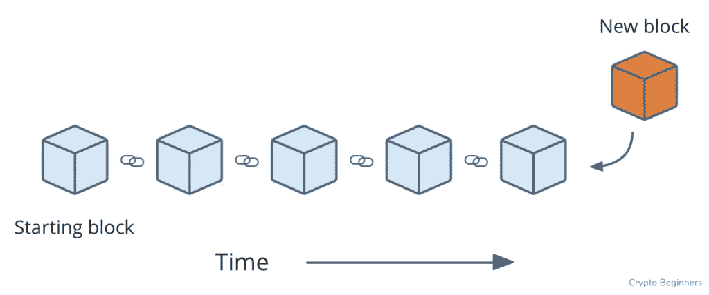

在正式进入之前，单独的计算机节点验证块内的所有传入事务。节点是连接到网络的任何电子设备(计算机、电话或文件服务器)。一组分散的计算机共同工作来保护网络并保持系统运行。这些节点遍布全球，分散式网络消除了单点故障的威胁。公司数据库是黑客的主要目标，因为这些数据中心存储着数百万人的信息。更糟糕的是，这些敏感信息通常保存在一个位置，使黑客更容易攻击。大规模数据泄露现在在社会中无处不在。脸书、万豪和无数其他公司遭受了暴露消费者数据的黑客攻击(Kiesnoski，2019)。DLT 通过在不同地理位置的几个不同的计算机节点上存储信息来解决这个问题。黑客现在需要对抗分布式系统中所有节点的联合力量，而不是攻击一个数据库。这增加了一个强大的额外安全层，这在今天的标准企业数据库中是没有的。

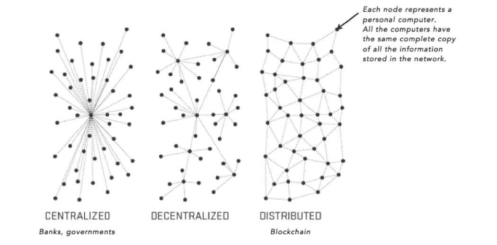

如果管理数据的人没有诚信，集中式数据库也会带来风险。那些控制中央服务器的人有能力改变信息，而不发送发生改变的信号。2015 年，在美国环保署发现“可以检测汽车何时接受测试的软件，改变性能以改善结果”(Hotten，2015 年)后，大众汽车受到了严格的审查。大众汽车前首席执行官和四名高管面临与排放丑闻有关的欺诈指控(Ludwig Burger，2019)。DLT 利用密码术来确保一旦块将自己粘在链上，就没有人能够改变数据。有史以来第一次，我们有了一个分散的记录保存系统，它提供了不可变的、可公开验证的、不能被篡改的数据。DLT 通过引入三重分录会计解决了数据完整性问题。

在过去的几百年里，人类用复式记账法处理所有的会计事务。复式记账会计使用一种有两个相等且互补的方面的模式:借方和贷方。复式记账系统中的分类账存储在本地，存在前面提到的风险。三重分录会计建立在以前的借/贷系统的基础上，包括所有交易的联合分类账。交易“由第三个条目加密密封”，第三个记录提供交易发生的证据(Trya，2014) **。**该印章提供了一份数字收据，其中包括参与方、交易详情和执行时间。

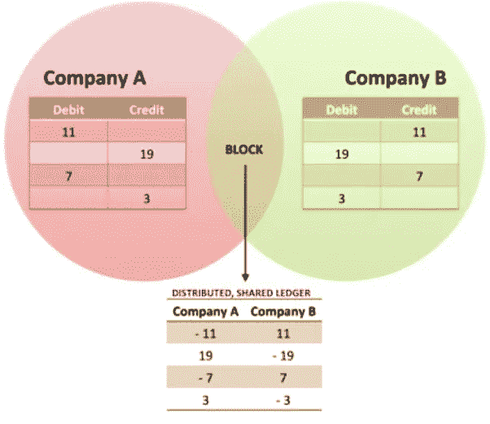

任何未来的改变都必须经历新的散列。哈希“将任何形式的数据转换成唯一的文本字符串”(Ray，2017)。加密散列可以被视为数字足迹。每个哈希都提供了数据通过时间戳更改的确切时间的证据。时间戳显示日期和哈希的精确秒数。每个块都引用前一个块的散列。“将每个块链接到其父块的散列序列创建了一个将所有块相互连接的链”(O'Reilly，2020)。这可以防止不法行为者更改、伪造和删除信息，因为分类帐将始终为新的操作加上时间戳。这进一步增强了 DLT 向经济体提供企业可以信赖的数字记录的能力。

传奇风险投资公司 Andreessen Horowitz 的联合创始人马克·安德森在《华尔街日报》上发表了著名的言论“软件正在吞噬世界”(Andreessen，2011)。软件几乎触及到我们日常生活的方方面面。我们通过手机、电脑和电动汽车——甚至我们的汽车——与软件互动。将你的父母消费媒体的方式与今天青少年消费媒体的方式进行比较。老一辈人要么看有线电视，要么阅读报纸和杂志。今天，几乎所有的美国人都在他们的电脑或智能手机上通过互联网消费数字形式的媒体。在信息互联网时代，货币仍然是唯一没有经历数字化变革的领域。

# **价值互联网**

在整个 20 世纪，长途电话需要用户支付额外的费用，阻碍了人们交流的时间。1990 年，《洛杉矶时报》报道说，圣地亚哥居民平均每年支付“60 至 100 美元”的长途电话费(合众国际社，1990 年)。21 世纪的第一个十年推出了 Skype 和 Whatsapp 这些产品和其他通信应用改变了人类通信的面貌。移动应用的出现削弱了电话公司对长途电话收费的能力。今天，任何拥有智能手机和互联网的人都可以免费进行全球交流。

环球银行间金融电信协会(SWIFT)“于 1977 年推出报文传送服务”(SWIFT，2020)。SWIFT 的网络覆盖 200 个国家和地区，有 11，000 家公司使用全球网络进行国际电汇。几乎每一家银行、公司和组织都使用 SWIFT。自 1977 年成立以来，SWIFT 的支付网络没有进行过重大升级，这意味着目前所有的交易都依赖于建于 70 年代的基础设施。四大会计师事务所毕马威(KPMG)概述了 SWIFT 的三个问题:电汇的吞吐时间、稳健的流程和转账成本(KPMG，2019)。跨境支付可能需要一周或更长时间来结算。每家银行都在各自的技术体系中运营，这就增加了出错的可能性。SWIFT 报告所有已执行支付的平均失败率为 6%。最后，每家银行收取 7-12%的转账启动费。当使用较小的流动性较差的货币进行交易时，这些成本会进一步增加。不幸的是，所有这些昂贵的费用都转嫁给了用户。

近 1.64 亿移民工人将国际汇款寄回国内，以养家糊口。世界银行估计，全球汇款在 2018 年达到“6890 亿美元”(世界银行，2019)。国际汇款由少数几家控制支付轨道的公司主导。西联汇款控制了大部分市场份额，通常对每笔交易收取 5-10%的费用。这些费用侵蚀了农民工辛苦赚来的利润。近年来，一些新公司利用互联网来解决这个问题。然而，没有一家公司能够解决这个问题的根源:所有的国际结算都必须通过 SWIFT。DLT 将解决 SWIFT 网络中遇到的低效率问题，并通过价值互联网(IoV)大幅改善跨境支付。

IoV 承诺了一个未来，在这个未来，价值可以像信息在互联网上传播一样迅速地自由跨境交换。价值不仅包括货币，还包括股票、证券和其他金融工具。DLT 提供了“无摩擦的全球汇款体验”(Team Ripple，2017)。通过 DLT 进行的国际支付至少在三个方面受益:快速交易、降低成本和不可逆转的最终结算。DLT 交易比 SWIFT 快，可以在一天中的任何时间进行。SWIFT 支付仍遵循银行营业时间，这意味着支付仅在银行营业时通过系统进行。DLT 消除了几个后端对账程序，降低了处理这些支付的成本。取消昂贵的 SWIFT 交易将大幅降低公司和消费者的支付费用。这将极大地惠及数百万汇款人，并让移民工人保留更多的钱。DLT 将加速资本在全球的流动。更快的全球结算提高了业务效率，并转化为更强劲的经济增长。

SWIFT 6%的故障率无法继续服务银行业。DLT 显著改善了 SWIFT 的故障率，并为所有支付建立了不可逆转的最终结算。对美元金融基础设施进展甚微的失望导致了数字美元项目的产生。数字美元项目旨在推进对数字美元基础设施优势的研究。该组织鼓励美国实现美元支付系统的现代化，并建立中央银行数字货币(CBDC)。前 CFTC 主席 Chris Giancarlo 与项目合作伙伴 Accenture 共同领导该组织。该组织希望发送美元像发送短信一样简单快捷。美元数字化将为美国银行体系之外的人打开更多渠道，这些人寻求以美元储存财富，避免持有严重受通胀影响的当地货币。

# **比特币**

在 2008 年大萧条最严重的时候，一个名为中本聪的匿名实体向加密邮件列表中的一小部分人发布了比特币白皮书。没有人知道聪的身份，我们只能推测聪是一个他，她，还是一群个体。比特币打开了潘多拉魔盒:它向世界展示了不受任何国家、政府或公司控制的货币。这个新颖的想法成为 DLT 的第一个成功应用。比特币白皮书的开篇写道，“电子现金的纯粹点对点版本将允许在线支付直接从一方发送到另一方，而无需通过金融机构”(Nakamoto，2008)。比特币引入了一种互联网协议，提供了一种无需许可的全球数字支付系统，允许任何有互联网连接的人安全地转移价值。想想电子邮件是如何改变全球商业和人类之间的信息传递的。电子邮件允许即时交流，而不必考虑地理限制。比特币提供了类似的解决方案，但人类不是传输信息，而是无缝交换价值。

许多人将比特币视为数字黄金，因为它因其强大的货币属性而实现价值。回想一下货币的三个属性:稀缺性、记账单位和交换媒介。Satoshi 在代码中嵌入了 2100 万比特币的上限。与黄金类似，比特币仍然供应有限。大约每十分钟，一个新的区块发行新的 BTC，直到供应在 2140 年达到其极限。这与当前央行持续增加货币供应(即印钞)进而推动通胀的政策形成鲜明对比。下图显示，仅在 2020 年，美国美联储的资产负债表就扩张了 3 万亿美元。

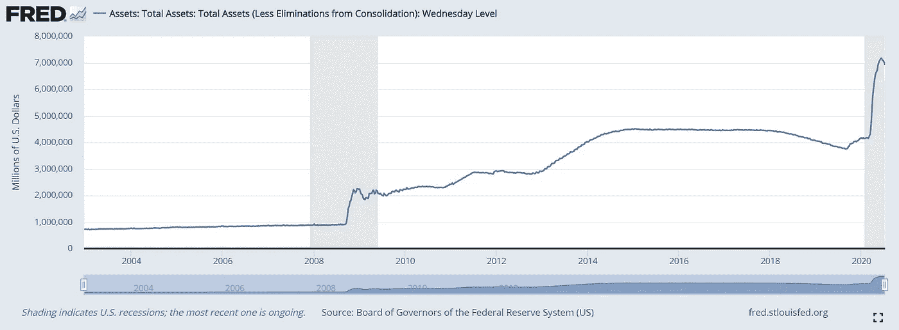

比特币的供应量将增加到 2140 年，但 BTC 将自己与菲亚特分开，因为发行率通过一个被称为减半的事件而下降。每四年，BTC 的发行利率减半。没有人能阻止这一点，因为 Satoshi 在协议中编程编码了这一特性。这意味着 BTC 将经历通货紧缩，直到达到最大供给。只有 2100 万 BTC 将存在，这使它成为地球上最稀缺的资产之一。

BTC 天生利用三重分录会计，这意味着系统维护所有单位和交易细节的记录。2010 年 5 月，拉兹洛·汉耶茨花了 1 万 BTC 买了两个比萨饼。他在这笔交易上花了大约 40 美元，这笔交易将永远铭刻在比特币的公共账本上。在出版时，这 10，000 BTC 将价值约 1.2 亿美元。这使得拉兹洛的交易成为有史以来最昂贵的披萨购买。下图总结了第一次有人花 BTC 购买真实物品的历史性交易。

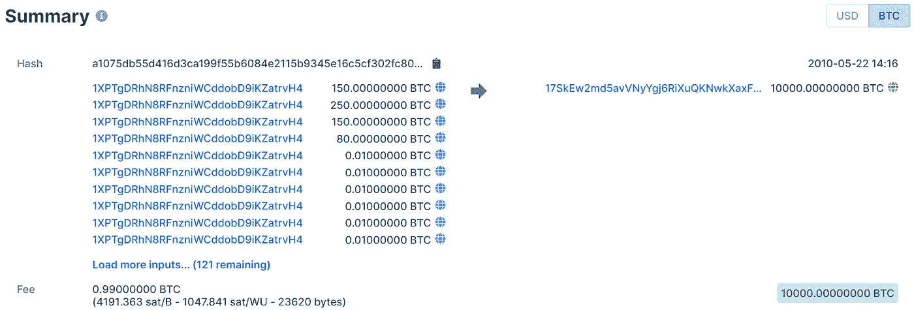

Bitcoiners celebrate May 22nd as Bitcoin Pizza Day

数千年来，黄金一直保持着事实上的货币地位。黄金面临的主要缺点在于它的可分割性、便携性和交易媒介。将黄金分割成小单位需要昂贵的生产成本，这推动了金币价格的上涨。美国造币厂最便宜的金币容量为十分之一盎司，售价为 260 美元(美国造币厂，2020)。这种高价值的价格并不使它成为日常购买的合适的交换媒介。然而，黄金是全球通用的货币。无论有人涉足哪个国家，黄金的价值都将保持不变。除了独特的套利机会之外，比特币的价格在各国之间也保持不变。比特币融合了黄金强大的货币属性，并更进了一步，因为 BTC 最多可以除 8 个小数点。购买比特币没有最低金额要求。买家可以获得任何金额，无论是 1 美元、10 美元、100 美元还是数百万美元。这让每个人都能接触到 BTC。与黄金相比，用比特币转移价值提供了更好的体验。黄金的局限性在于它的物理性质。运输黄金需要它像邮政服务一样移动邮件，而 BTC 则更接近电子邮件。比特币的 genesis block 于 2009 年 1 月 3 日推出，网络保持 24/7/365 的运行时间。

在比特币出现之前，由于数字信息很容易复制，以数字方式转移价值存在双重花费的问题。当“相同的资金同时花在两个接受者身上”时，就会发生双重支出(币安学院，2020)。实物现金不面临这个问题，因为货币有形地在手中交换。当鲍勃付给爱丽丝 10 美元时，鲍勃递给她一张 10 美元的钞票。鲍勃不能使用同样的 10 美元，因为他给了爱丽丝。对犯罪分子复制数字货币的恐惧迫使社会信任银行和中介来发送数字货币。受信任的第三方防止经济重复支出现金，但当我们取消中央权力机构并使用完全以数字形式存在的货币进行交易时，这个问题构成了巨大的威胁。

# **共识机制**

DLT 通过共识机制解决了重复支出问题。共识机制是确保所有节点在新信息附加到分布式分类帐时同步的计算机协议。这使得互不认识的不同方能够达成一致并相互信任。比特币的共识机制采用工作证明(PoW)，而大多数新创建的区块链平台采用股权证明(PoS)。PoW 让计算机解决复杂难题。这些通常被称为“矿工”的计算机相互竞争开采下一个区块的特权。电力需要昂贵能量消耗来支持一天 24 小时运行的计算机。采矿企业付钱来消耗计算机开采区块所需的能量。解决难题的矿工首先通过交易费和新发行的硬币(被称为区块奖励)获得金钱补偿。

交易费是在网络上使用时产生的。如果 Bob 想给 Alice 发送一个 BTC，Bob 必须首先创建一个数字签名来批准输出值。Bob 将发送一个输出值，Alice 将接收一个输入值。矿工将首先验证 Bob 的签名，以确认他拥有对 BTC 的合法所有权。Bob 必须向处理包含他的事务的块的矿工支付费用。假设一个恶意的矿工解决了难题并创建了假交易。区块的输出值不能超过包含交易费用和区块奖励的总输入值。其他矿工会注意到新的块包含一个不正确的输出值与无符号输入，表示无效的交易。他们将拒绝该块，恶意矿工将不会获得任何奖励。矿工将得不到报酬，并将消耗浪费的能量来换取金钱上的损失。这种博弈论激励道德行为，惩罚恶意行为。

使用 power 的主要好处在于结合了计算能力的分散式节点网络。所有计算机结合起来形成了保护系统的散列能力。大多数人只关注 BTC 的价格，而没有考虑网络的力量。虽然价格为所有数字资产提供了一个重要的窗口，但我们不能忽视网络的安全性。在 PoW 中，网络的散列能力为系统的安全性提供了强有力的洞察力。提供计算的新节点增加了散列能力，并标志着更强的安全性。相反，更少的节点意味着网络提供更弱的安全性，更容易受到黑客攻击。在比特币 11 年的历史中，散列值随着时间的推移不断上升，当 BTC 价格趋势上升时，新的矿工通常会进入这个空间。

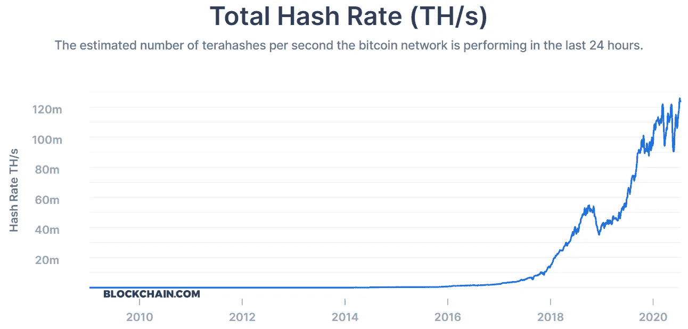

目前存在超过 11，000 个比特币全节点，遍布 96 个国家(Coin Dance，2020)。这些节点维护分类账的完整记录，并验证交易和块(比特币组织，2020)。PoW 在解决双重花费问题时实现了巨大的突破，然而，这种共识机制仍然包含风险。比特币交易目前遭遇高延迟，一旦启动就要排队。回想一下，每个块每 10 分钟出现一次。如果 Bob 发送给 Alice 1 个 BTC，Alice 需要 6 次批量确认或大约 1 个小时才能确信收到了合法付款。还有其他具有更高吞吐量的 PoW 区块链，但是它们仍然遭受同样的问题:所有节点必须接收分类帐的完整副本以达成共识并处理块。虽然 PoW 慢慢达成共识，但 DLT 专家称赞他们强有力的安全措施(Samani，2018)。

“51%攻击”仍然是破坏 PoW 中数据完整性的唯一方法。当恶意行为者拥有至少 51%的总计算能力并获得网络的多数控制权时，就会发生这种情况(币安学院，2020)。有了 51%，黑客就可以双倍花费他们的硬币。黑客无法阻止所有事务，但他们有能力阻止某些事务的处理，并降低整体吞吐量。这阻碍了用户转移价值的能力，并停止了网络活动。更糟糕的是，仅仅一次双重消费就可能造成严重的声誉损害。仅 2020 年 3 月 29 日就有三笔单独的交易，约 1000 BTC(block chain . com，2020)。每笔交易的金额在 600 万到 700 万美元之间。如果一个黑客花了 600 万美元，灾难就会发生。人们会开始质疑系统的数据，因为他们不再相信账本。对系统的信任将会被打破，用户将会转移到一个提供更高安全性的不同网络。

DLT 的工程师必须设计一个系统，诱使参与者诚实行事。每个 DLT 网络都希望建立经济活动。为了使经济活动蓬勃发展，网络必须吸引“合作伙伴、供应商、客户和竞争对手为整个生态系统做出贡献”(刘，2019)。在比特币的情况下，进入空间的矿工可以选择诚实参与或攻击。攻击网络需要大量资金来购买采矿设备和能源。攻击者会持续亏损，直到达到 51%。除非黑客达到 51%，否则攻击者会意识到诚实行事更有经济意义。比特币显示出强大的代币经济学，因为它让参与者之间的大多数激励保持一致。不幸的是，比特币目前每秒处理 7 笔交易。这使得网络对于大规模商业应用来说非常慢。利益验证(PoS)提供了一种替代的共识机制，使 DLT 能够以更低的延迟和更少的能源成本实现显著更高的吞吐量。

# **工作证明与利益证明**

可伸缩性仍然是采用 DLT 面临的最大障碍。Twitter、Google 和 Visa 可以同时处理数千名在线用户，因为它们的服务器是集中式的。DLT 工程师面临的挑战是，在保持高交易吞吐量的同时，结合分散网络的所有优势。可扩展性三难问题指的是 DLT 平台必须在“三个属性中的两个:安全性’(security)、可扩展性和区块生产的分散化”(Samani，2018)之间做出决定。PoW 支持安全性和分散化，而将可伸缩性放在次要位置。下图形象地展示了区块链开发人员目前面临的可伸缩性三难困境。

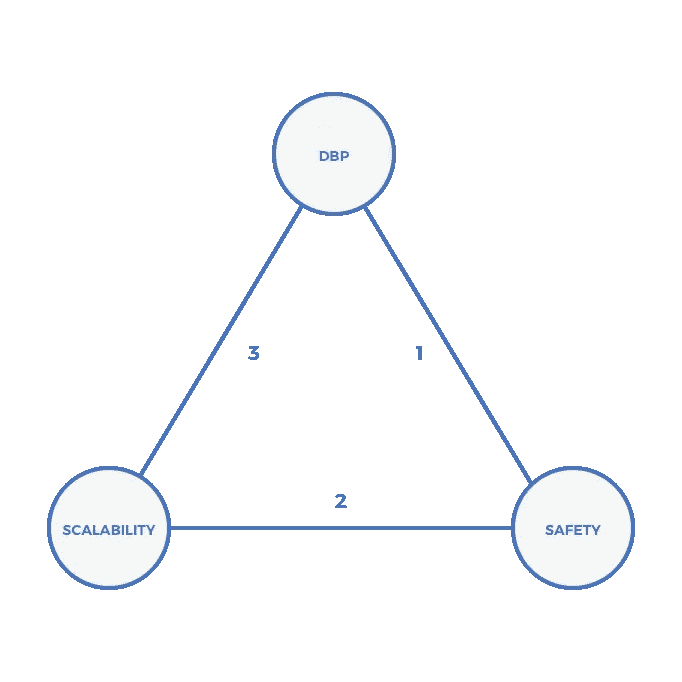

几乎所有的新 DLT 项目都采用了参与组织或共识机制的变体。每个项目创建不同的规则来确定哪个节点“铸造”下一个块。在 PoS 中，块创建术语是 forge 或 mint。这些术语不应该与采矿相混淆——尽管验证器的行为类似于 PoW 中的矿工。验证器负责铸造块、确认交易和保护网络。PoS 要求验证者“将一定数量的硬币锁定到网络中作为他们的赌注”(币安学院，2020)。资产保持锁定的时间取决于每个系统的规则。拥有较大的股份通常会增加 node 铸造下一个区块的可能性。没有 stake，验证器就不能添加新的块。验证者通过交易费接收付款。PoS 还提供通过整体奖励增加额外收入的选项。

要求验证者锁定数字资产可以确保他们“参与游戏”。验证者必须维护网络功能，否则会面临资产贬值的风险。如果交易未能确认或网络面临安全风险，开发人员将迁移并在不同的平台上构建。此外，如果验证者恶意行为，他们有失去股份的风险。处理无效交易的邪恶行为者可能会受到砍杀的惩罚。当一个实体不遵守规则，他们失去了他们的资产所有权时，就会发生削减。每个平台决定处罚的严厉程度。一些网络可能会选择让验证者失去他们的全部股份，而另一些可能会削减 30%。恶意验证者没有赎回其标记令牌的选项，因为这些数字资产在智能合约中保持锁定(稍后将详细讨论该主题)。

PoS 针对可扩展性进行了优化，并提供了更高的交易吞吐量。它消耗更少的能源，并提供有吸引力的成本效益(Schumann，2018)。商业活动最有可能发生在 PoS 网络上，因为交易更快地完成。终局性是指“一个人必须等待保证在区块链上执行的交易不会被撤销的时间”(Ifegwu，2020)。快速的“终结时间”提供了启动的事务快速达到不变性的保证。快速终结使企业可以在公共网络上轻松地进行交易，并且对自己的行为不会逆转充满信心。然而，销售点网络面临着控制大宗生产的实体减少的风险。集中式块生产导致较弱的安全性，因为较少的验证器容易受到攻击或共谋。

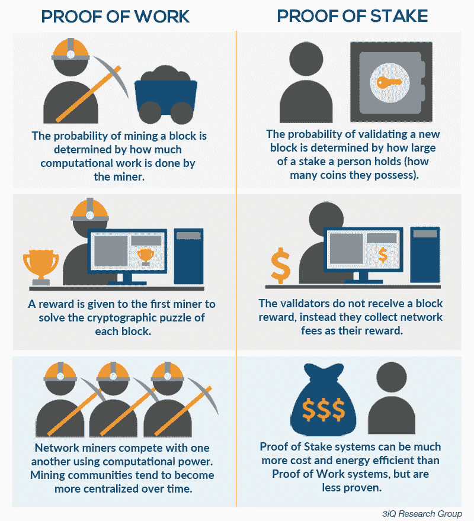

世界各地的 DLT 工程师继续努力解决可扩展性三难问题。区块链受到了过多的批评，认为它永远不会工作，因为速度慢，交易成本高。对互联网也提出了类似的指控。2008 年诺贝尔经济学奖获得者保罗·克鲁格曼在 1998 年臭名昭著地引用了“互联网的增长将大幅放缓……到 2005 年左右，互联网对经济的影响将变得明显不如传真机”(Yarow，2013)。早期的网络需要用户通过拨号建立互联网连接。连接到拨号上网需要额外的时间，而且不允许人们拨打或接听电话。宽带最终取代了拨号上网，并带来了更快的连接速度，同时让普通消费者更容易访问互联网。DLT 将经历和互联网一样的创新曲线。区块链空间将最终解决可扩展性三难问题，并产生数字资产。

# **数字资产**

几乎所有的 DLT 网络都创建了一个用于其生态系统内部的数字令牌。大多数人将其称为:加密货币、密码或数字资产。以太坊是 2015 年由当时 21 岁的维塔利克·布特林(Vitalik Buterin)创建的，拥有市值第二大的数字资产。以太坊使用以太(ETH)作为支撑系统的数字资产。构建该协议的 ETH 开发人员希望它成为一台世界计算机，拥有“其他应用程序可以在其上构建的平台”(Jacqui Frank，2019)。该网络将存在于“中立、开放的基础设施上，不受任何公司或个人的控制”(以太坊组织，2020)。这种非常独特的方法催生了其他 DLT 创始人建立自己的平台，与以太坊竞争。虽然比特币巩固了自己的数字黄金地位，但所有剩余的数字资产都需要服务于货币用例，或者吸引开发者到他们的平台上来构建成功的去中心化应用(dapp)。

想想通过苹果应用商店和 Google Play 创造的公司和产品的集体价值。世界各地的消费者每天都依赖优步、Whatsapp、Venmo 和其他应用程序来执行必要的生活功能。这些公司中有许多在 15 年前甚至还不存在。Dapps 旨在实现与当今移动应用类似的功能。然而，后端基础设施依赖于公共 DLT，而不是当今应用程序中的集中式公司服务器。Dapps 利用了前面提到的所有 DLT 优势。互联网催生了在应用层构建互联网服务的公司，而 DLT 引入了存在于协议层的数字资产。

ETH 和其他各种数字资产类似于纯粹以数字形式存在的资源。访问每个 DLT 网络上的计算服务需要使用协议的本地资产。就比特币而言，你必须在 BTC 支付交易费用。比特币提供了一个优秀的借贷系统，但对于希望构建强大 dapps 的开发者来说，这种代码并不理想。一些 dapps 已经获得了牵引力，但与标准应用相比，用户总数仍然非常少。当第一个 dapp 成功实现大规模采用时，对驱动 dapp 的数字资产的需求将会增加。想象一下，在一条快车道上，车辆必须支付通行费才能行驶。这个类比适用于 DLT，但所有的交易都是数字化的。在讨论交易的网络费用时，DLT 社区通常使用“燃气费”一词。高油价意味着交易需要更多的资金，反之，低油价意味着低成本。每个网络决定他们自己的代币经济规则。DLT 仍处于起步阶段，这意味着没有一个项目能提供所有的正确答案。最终，将经历价值增长的协议必须吸引创造有价值交易的网络活动，提供高安全性，并包含强大的令牌经济。

数字资产不仅类似于数字资源，而且还拥有投票权。同样，每个 DLT 平台都拥有决定治理规则的自由。通常，拥有大量代币余额的所有者会要求更大的投票权。一些网络可能使用 1 令牌 1 投票系统，而其他网络在允许治理参与之前需要最低余额。拥有治理权的数字资产引入了一种社区模式，在这种模式下，地理上分散的个人可以高效地合作，以推动协议的愿景和决策制定。拥有投票权的实体将共同管理每个平台。如果数字资产所代表的协议成功了，那么数字资产提供了一个令人信服的增值案例。在 DLT 之前，如果不借助第三方来执行合同义务，独立的实体就无法紧密合作。当 Vitalik 将智能合约作为以太坊的一项功能嵌入以太坊并制造可编程货币时，他带来了第二代 DLT。

# **智能合约**

我们的社会目前使用律师事务所和可信的第三方来建立利益相关者之间的信任。让外界参与进来会进一步增加商业交易的成本，尤其是在他们缺乏信任的情况下。1996 年，Nick Szabo 引入了智能合约的话题。智能合同是以软件代码形式存在的数字可执行合同，并根据之前商定的条款执行(Szabo，1996)。Szabo 引用了一个自动售货机来提供一个简单的例子，说明智能合约是如何工作的。鲍勃需要支付 1 美元才能得到一块巧克力。只有 Bob 付清 1.00 美元的余款，机器才会分发巧克力。没有全额付款，自动售货机不会提供巧克力。智能合约“受益于区块链提供的安全性、永久性和不变性”(Stuart Levi，2018)。如果各方都满足合同中设置的参数，代码将自动执行并履行其条款。

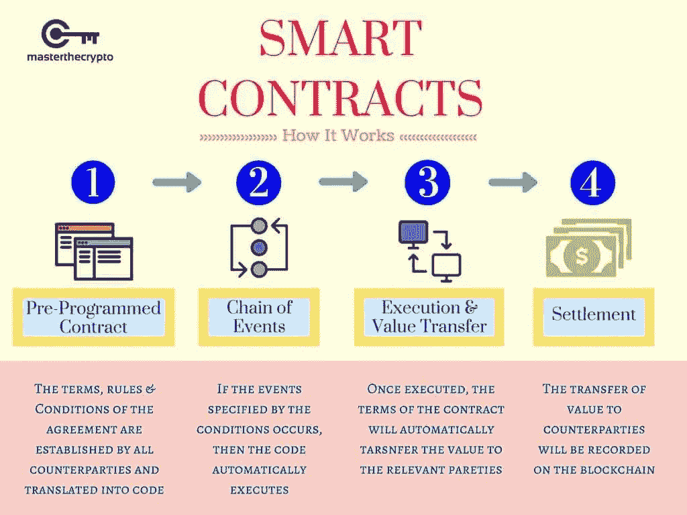

假设名为 Zion 和 Laer 的虚构公司第一次开展业务。锡安将向莱尔出售 100 块电脑芯片。双方同意 Laer 必须将全部金额存入托管账户。一旦芯片到达莱尔，锡安就会收到付款。莱尔的存款将存放在一份智能合同内的加密托管账户中。莱尔提交了定金，锡安收到了装运计算机芯片的通知。莱尔的仓库扫描条形码，确认货物已经到达。扫描触发智能合同自动执行，莱尔的存款自动转移到锡安。这种支付是在没有人工干预的情况下无缝进行的。相反，如果一方不履行协议，合同将无法执行。如果 Zion 未能运送计算机芯片，Laer 的存款将自动退还，Zion 将不会收到付款。这只是智能合约用例的一个小例子。企业可以创建高度复杂的协议，并使用智能合同来提高业务效率和履行协议。永久和不可变的软件代码允许两个未知方在知道合同条款不可更改的情况下安全地从事业务。

# **供应链**

跨国公司开发复杂的供应链来服务他们的合作伙伴、客户和供应商。大型企业使用企业资源规划(ERP)来“将众多业务流程结合在一起，并实现它们之间的数据流动”(Oracle，2020)。ERP 系统包括供应链操作员、项目管理、会计和企业管理日常运营所需的无数其他重要功能。这些系统为企业带来了繁荣，并使企业生态系统内的业务流程更加高效。然而，生态系统内的公司很难与网络外的实体互动。更糟糕的是，在 ERP 保护伞之外的小企业没有得到协调供应链的好处。如今，大多数公司都享受着 ERP 的好处，而大多数小型企业必须自己管理供应链数据流。

供应链的每一步都包括与处理敏感数据的多个企业的互动。这迫使实体主要在自己的企业生态系统内开展业务。当一个中央机构既能控制又能看到所有信息时，这就出现了单点故障。DLT 依赖于公共基础设施，允许任何实体选择加入或退出，而无需寻求中央当局的批准。四大会计师事务所之一的安永(EY)于 2020 年 3 月 4 日宣布启动基线协议。Baseline 推出了“一个新的公共领域区块链工具包，将允许企业安全和秘密地建立和部署采购和其他业务流程”(EY 新闻稿，2020 年)。基线将支持智能合同和零知识证明。零知识证明允许您向另一方验证数据值，而不必共享底层敏感信息。每一方都受益，因为他们只透露他们希望分享的信息。这使得小型企业能够从目前大型企业供应链中使用的 ERP 解决方案中受益，而不用担心被供应商锁定。

研究和咨询公司 Gartner 在 2019 年的一份新闻稿中表示，“组织可能会使用区块链来跟踪带有防篡改标签的全球发货”(Gartner 新闻稿，2019 年)。DLT 允许公司在整个供应链中数字化跟踪他们的货物，并提供库存进度的实时更新。“假酒是一个数十亿美元的问题”，困扰着整个葡萄酒行业(Micallef，2018)。欺诈者会重新装满空酒瓶，然后重新包装，使酒瓶看起来真实未开封。这对售价高达六位数的年份珍藏葡萄酒的生产商和消费者都不利。自 1864 年以来，DNV GL 一直是国际认可的注册机构，旨在为稀有的可收藏酒瓶配备防篡改标签。我的故事是，DNV GL 的区块链数字保证解决方案由 VeChain 支持，允许潜在买家扫描标签并读取产品的生命周期信息。买家可以阅读整个酒瓶的旅程，从葡萄生长的地方开始，生产商的储罐操作，装瓶过程和运输数据。需要额外安全保护的收藏葡萄酒可以贴上标签，当有人开瓶时标签会自动打上时间戳。消费者可以信任这些信息，因为所有数据都来自 DLT 的公共基础设施。

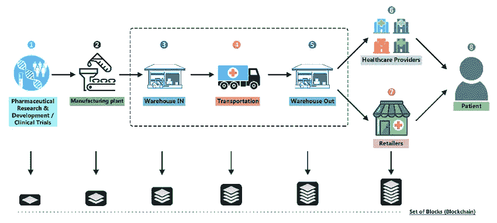

上图是一个简化版的医疗供应链。在每一个新的步骤中，一个包含新的运输数据的块将自己附加到链上。这不仅能提供更好的整体运输信息，还能准确定位整个供应链中的货物流动。在商品的整个生命周期中为其打上时间戳，这开启了一个广泛的用例，可以在危机时刻让公司受益。卫生与公众服务部发布了一份报告，指出食品和药物管理局“并不总是有一个高效和有效的食品召回流程来确保国家食品供应的安全”(Mccallister，2017)”。该报告提到，食品生产商召回受污染的库存平均需要 57 天。2019 年，由于可能受到大肠杆菌污染，近 10 万磅沙拉被召回。当食品召回发生时，生产商疯狂地搜索过时的程序，以确定哪些受污染的供应品需要下架。DLT 简化了这一过程，并为生产者提供了一个不变的审计线索。由于所有运输信息都以数字形式存在，食品召回的时间会大大缩短。公司可以提取运输数据，以确定疫情从哪里开始，并删除受影响的库存。

DLT 集成供应链可以延伸到收藏的葡萄酒、药品、食品之外，可以整合人们购买的任何产品。然而，DLT 仍然需要在现实世界和数字世界之间架起一座桥梁。oracle 提供存在于网络之外的外部数据。Oracles 负责在传递信息之前验证外部数据源。可信的神谕可以防止恶意行为者上传虚假信息。在我的故事中，DNV GL 审计员将与生产商一起工作，并利用其丰富的认证经验“验证来自这些活动的数据是准确和相关的”(DNV GL，2018)。专家审计员和不可变数据记录的这种结合为消费者提供了一种可行的解决方案，这些消费者需要他们所消费的产品的真实性和原产地证明。

# [**分权财政**](https://blog.coincodecap.com/the-ultimate-guide-to-defi-decentralized-finance)

世界银行集团发布报告估计，“17 亿成年人仍然没有银行账户”(世界银行报告，2017)。这些成年人无法获得金融服务，也无法利用数十亿人所依赖的银行系统。这个问题在发达国家和新兴国家都存在。大约有 2400 万美国家庭没有银行服务，另有 800 万家庭没有银行服务(FDIC 执行摘要，2017 年)。没有银行账户的人与任何金融机构都没有关系，而没有银行账户的人有一个标准的银行账户，但必须寻求外部帮助来获得金融服务(借款、贷款、兑换等)。).美国人仍然没有银行账户的两个驱动因素与开户资金不足和银行费用高有关。

那些生活在新兴经济体的人面临着货币通胀的风险，这将使他们的财富贬值。委内瑞拉在 2018 年经历了 1000 万的恶性通货膨胀，阿根廷在 2019 年经历了 53%的通货膨胀，黎巴嫩在 2020 年面临 25%的通货膨胀。无数其他国家的通胀担忧伤害了最脆弱的国民。新兴经济体的富裕精英了解通胀，并对冲他们的投资组合以对抗通胀。他们持有部分美元、外国房地产、股票和其他金融资产。美元有自己的通货膨胀问题，但相对于世界其他地区，它的价值远远高于其他法定货币。委内瑞拉政府最近允许美元流通，现在“委内瑞拉一半以上的交易都是用美元进行的”(Reeves，2020)。尽管美国以外的人希望能够持有美元，但我们目前的系统使得普通人几乎不可能获得美元。在 DLT 引入分散融资(DeFi)之前，低收入人群很难获得美元。DeFi 利用 DLT 的可编程货币和全球可访问性来消除障碍，并允许任何人接受金融服务。

手机为没有银行账户的个人提供了一种将钱存入电子钱包的机制。在非洲，“拥有移动电话的人数超过拥有电力的人数”(《经济学人》，2017 年)。DeFi 重建了传统的金融系统，并使用智能合约以编程方式执行所有交易，而无需使用中介。与目前只为一个地区的人服务的银行系统相反，DeFi 在互联网上自然存在，并从第一天开始在全球范围内推出。稳定币仍然是整个 DLT 地区最受欢迎的数字货币之一。“稳定币是一种数字货币，旨在保持与某些‘稳定’资产的价格平价”(Circle，2020)。仅在 2020 年的前三个月，stablecoins 的市值就增长了 20 亿美元。

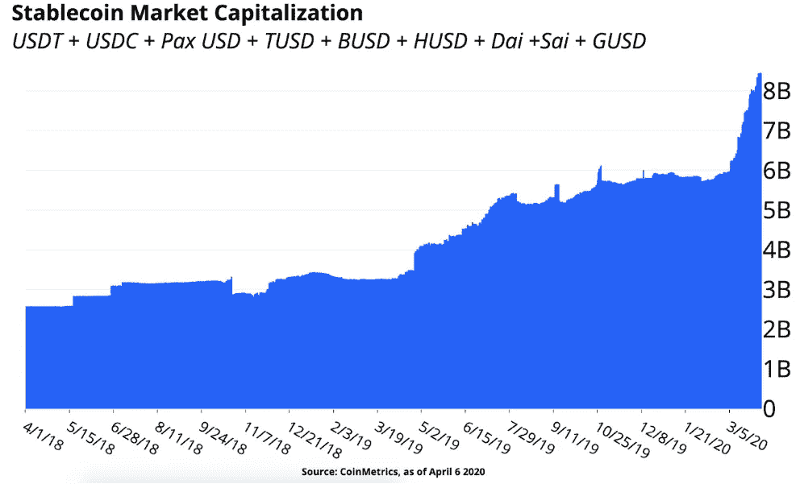

Stablecoins 存在于 DLT 平台之上，并受益于之前讨论的区块链的所有优势，包括快速、低成本和全球支付。大多数稳定的硬币价值 1 美元。由 Centre 于 2018 年创建的 USD Coin (USDC)代表一种数字代币，它与 1 美元保持 1:1 的挂钩，并在以太坊上运行。USDC 实现了与美元的价格平价，因为每一个 USDC 代币都必须等于美国监管银行持有的相同数量的美元储备。均富 LLP 每月对这些银行账户进行审计，并在网上公布审计报告。这种透明性为用户建立了信任，因为他们可以自己验证 USDC 代币不超过储备的美元数量。

DeFi 用户可以在手机上创建自己的数字钱包，没有最低月余额和账户费用。这为无数个人获得快速低成本的金融服务打开了大门。DeFi 已经为用户提供了从他们的数字资产中赚取利息的能力。与银行类似，DeFi 利用存款通过智能合同向借款人发放贷款。DeFi 不歧视财富、性别、种族或宗教。贷款申请人不再需要提交信用检查，而是可以获得即时融资。

目前，在 2020 年，大多数 DeFi 贷款流程要求用户存放数字资产，并对其贷款头寸进行超额抵押。超额抵押贷款指的是借款人存入的抵押资产超过贷款本身的价值。例如，抵押率为 150%的 100 美元贷款需要 150 美元的存款。不幸的是，大多数寻求贷款的人负担不起超额抵押。DeFi 还非常不成熟，在大规模采用之前仍需要改进。开发者继续尝试新的想法，包括更好的信誉系统来解决这个问题。DeFi 不能解决无银行账户者面临的所有问题，但它让金融服务更接近这个服务不足的群体。与美元挂钩的稳定货币为贫困国家的人们提供了一个巨大的机会，他们可以用美元而不是面临高通胀风险的货币来储存财富。DeFi 的目标是让地球上的每一个人都能在手机上使用开源软件获得所有的金融服务。

# **结论**

DLT 的创新旨在颠覆金融业，就像本世纪初互联网颠覆媒体、新闻机构和零售购物一样。大多数 DLT 的批评者表示，由于缓慢的交易时间和糟糕的用户体验，采用将永远不会到来。然而，所有的创新技术在开始时都会遇到这些问题。老年人和祖父母会回忆起拨号上网的可怕经历。技术不断自我改进的能力仍然是它最强大的品质。人类自然会寻求解决既省时又省钱的问题；DLT 解决方案让经济在这两个领域都得到改善。反对 DLT 的另一个常见论点是，公司不会将数据上传到公共平台，而是使用私人许可的网络。未来的公司很可能会建立他们自己的许可分布式账本，这肯定会提高效率。然而，私有 DLT 将不会受益于公开公共网络中的价值累积。一些大公司有自己的内部网，供员工查看公司特定的私人信息，但每个现代公司都在互联网上维护一个公共网页。绝大多数公司决定在公共互联网上建立强大的存在，因为这使他们能够轻松地与客户、顾客和客人联系。

电子邮件的出现彻底改变了人类的交流方式。在基本层面上，我们可以把电子邮件比作 DLT，因为它允许人们在网络上自然地传递价值。比特币为所有参与者提供了一个更好的经济未来，因为它体现了货币最强大的属性。当中本聪(Satasohi Nakamoto)在 BTC 的协议中加入了一个硬上限时，比特币就与所有其他形式的货币(包括黄金)区分开来。永远只会有 2100 万个比特币存在；无论多少金钱、影响力或权力都无法改变这一点。改变这一规则的唯一途径需要比特币社区的很大一部分人达成强烈共识。如果你问任何一家开发商、BTC 顶层的商业建筑或投资者，他们是否想增加 BTC 的供应量，他们的回答总是响亮的“不”。这与央行不断印刷更多法定货币的政策形成了直接对比。2020 年上半年，美国美联储将其资产负债表从 4 万亿美元扩大到 7 万亿美元。Ikigai 的首席信息官特拉维斯·克林(Travis Kling)完美地总结了比特币的价值主张。“比特币是非主权的、有上限的、全球性的、不可改变的数字价值储存手段。这是针对全球央行和政府货币和财政政策不负责任的保险政策”(Kling，2019)。每个人都必须问自己:*把价值储存在一种由一小撮富人控制的无限供应的货币中，还是储存在一种有严格上限* *的不受审查的非主权资产中，我会感觉更舒服？*

与黄金类似，比特币没有控制其货币政策的中央机构。DLT 的魅力在于社区能够通过共识机制和聪明的契约来管理自己。今天的西方国家坚持政教分离，以此作为自由的支柱。在当时，这种想法是激进的，教会为了保住自己的权力进行了激烈的斗争。在接下来的 100 年里，我们可能会开始看到一场新的革命:金钱和国家的分离。我们的社会没有研究货币的历史，也不能理解国家政府凭空创造了法定货币。由一小群人管理的中央政府总是面临两个因素的风险:自身利益和人为错误。如果 2020 年能证明什么的话，那就相信央行会不择手段地继续印钞。美国建立在为其公民建立自由的基础上。第一修正案保护宗教自由、言论自由、集会和向政府请愿的权利；但它未能解决人们的金钱自由。DLT 将权力从中央政府手中拿走，还权于民。本质上，它允许人们对自己的钱拥有自由和真正的货币主权，而不依赖于第三方托管人。

DLT 提供了一个真相的数字记录系统。各种规模的企业都可以轻松利用三重记账法，降低交易对手风险。在 DLT 保护的数据提供了更高的透明度，并允许审计人员在不损害安全性的情况下查看业务活动。贸易活动将会增加，因为 DLT 允许公司从事以前被认为风险太大的业务。多日银行转账将消失，每个人都将享受即时全球支付。Web 3.0 将提高效率，同时消除欺诈和容易出现人为错误的冗长后端程序。

DLT 将在互联网上推出第三层，名为 Web 3.0，这将创造新的商业机会，解决目前我们经济中的低效率问题。互联网的第一次迭代引入了网页和电子邮件。谷歌套件和移动应用改变了互联网格局，带来了不可或缺的新功能。Web 2.0 产品诞生了数十亿美元的科技公司，包括谷歌、亚马逊、脸书、优步、网飞和其他一些公司。DLT 已经计划通过智能合同和 DeFi 带来巨大的创新。这些 dapps 将催生新的创新。就像发达国家的人们离不开智能手机一样，我们将回头看看 DLT，思考如果没有强大、分散的智能合约平台，经济将如何运转。

计算机科学领域大约每 10-15 年经历一次技术革新。20 世纪 50 年代推出了大型计算机，70 年代发明了个人计算机，互联网在 90 年代后期取得了成果。智能手机和应用商店中的移动应用程序代表了 21 世纪中期以来的最新创新。我们现在发现自己处于 2020 年，这意味着技术行业将很快经历新一轮的发展。我相信 DLT 将继续推动计算机科学创新，利用 DLT 的公司将脱颖而出。吸引用户的成功的 DLT 网络也可能经历基础数字资产的大估值。货币和价值交换的中断代表了 DLT 与之前列出的技术突破的独特和关键的区别。如果 DLT 成功了，它不仅会颠覆互联网基础设施，还会改变货币本身。与技术类似，货币随着时间的推移而演变。人类以前曾用贝壳、玻璃珠、盐和黄金作为货币。继黄金之后，现代国家创造了法定货币纸币。如今，菲亚特主要以数字形式存在，大多数交易都是在线进行，或者通过借记卡和信用卡进行。中国经济几乎完全取代了实物现金，商店甚至没有能力接受现金或信用卡。中国公民使用移动应用程序来促进所有的金融交易。

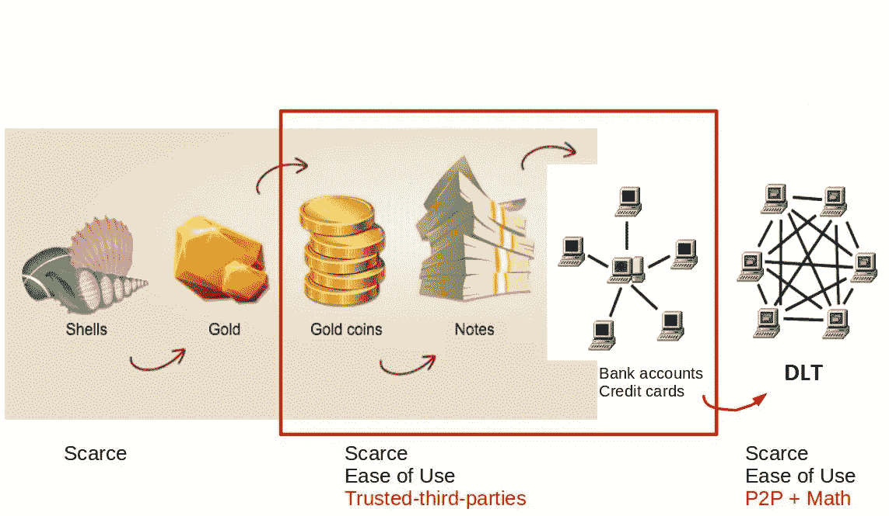

软件继续渗透到生活的各个方面，认为金钱会避开这一趋势仍然是目光短浅的。DLT 代表了一种新型货币的诞生，这种货币完全以数字形式存在，并且是可编程的。可编程货币为全新的金融概念打开了大门，这些概念将惠及社会，包括 DeFi、智能合约和人类尚未想到的新工具。DLT 为人类提供了一个难得的机会，在没有中央权力机构保持单边控制的情况下，创造一种新型货币。技术将继续创新，但历史上只有少数时刻社会见证了新货币的诞生。互联网允许信息自由流动，DLT 打算效仿，引入一个资金可以在互联网上自由流动的世界。DLT、比特币和区块链象征着金融自由。DLT 社区设想的未来是，人类拥有一个无需许可的全球不可变智能合约平台，在任何时候只需点击几下鼠标，就可以与世界上任何人安全地交换价值并进行低成本交易。

*《纽约时报》09/Apr/2020 注入 2.3 万亿美元，美联储的计划远超 2008 年的救援行动】*

- *被 F2Pool 蚀刻在比特币的 629999 块中*

*******

***作者注:***

我想对 Linda Xie、Mary Ann McCarthy、Karina McCarthy、Jonathan Defuso 和 Ariella Senzamici 的建设性批评表示诚挚的感谢。他们的反馈很有帮助，他们的见解也很有价值。

我也想向每一个读过这篇文章的人致以衷心的感谢。我花了无数个小时和周末来研究、写作和综合我三年来所用的所有 DLT 信息。我真诚地希望这篇文章能帮助你更好地理解 DLT，并点燃你投身数字资产的热情。我由衷地相信，DLT/区块链将改变世界，为地球上的每个人提供一个更美好的经济未来。DLT 有这么多层次，理解它是一项艰巨的任务。如果您是 crypto 的新手，我想张开双臂向您发出邀请，欢迎您加入 crypto 社区。

对于那些仍然不理解比特币、加密和 DLT 的人来说；一点也不要感到沮丧。我花了两个月的时间阅读和挖掘大量的资料，才发现了我的灵感。有些人可能在一天内掌握这门学科，而其他人则需要更长的时间。如果你想讨论本文中的任何话题，请随时在 Twitter 上与我联系，我会不断更新 DLT 的时事。Twitter 上的加密社区很活跃，我们总是很乐意向任何有兴趣学习的人解释这些话题。我也欢迎任何建设性的批评，我很想听到你对这篇文章的反馈。

推特:@tmccarthyv94

如果这篇文章对你有所帮助，请考虑捐赠。即使你没有，我仍然非常感激你读了这篇文章。如果你想照亮我的一天，那就把钱捐给下面的任何一个人。谢谢你和霍德尔·斯特朗。

保持谦逊，积累 sat。

比特币:BC 1 qjnr 7 zcg 66 VW 72 mvgv 6k 2 az 5 e 5 zwx 8 w 0 SG 8 u 4 l 9

以太坊:0x 0477 F4 af 28 a 961 e 94 ffc 828 B3 DAA 356 b0dc 0698 f

戴、:0x 0477 F4 af 28 a 961 e 94 ffc 828 B3 DAA 356 b0dc 0698 f

ve chain & VTHO:0x 6 f1 e 6 a 7 ab 6a 1 f 250 b 20608 c 37034 a 353 cc 23 f 686

**免责声明:**本文内容仅用于教育目的。不要将本文中的任何内容视为财务建议。请在投资数字资产之前做好自己的研究。

**作品引用**

安德森和纳鲁斯(1998 年)。*商业营销:了解顾客看重什么*。摘自哈佛商业评论:[https://HBR . org/1998/11/Business-marketing-understand-what-customers-value](https://hbr.org/1998/11/business-marketing-understand-what-customers-value)

m .安德森(2011 年 8 月 20 日)。*为什么软件正在蚕食世界*。检索自华尔街日报:[https://www . wsj . com/articles/sb 10001424053111903480904576512250915629460](https://www.wsj.com/articles/SB10001424053111903480904576512250915629460)

Antonopoulos，A. (2017)。*掌握比特币。*塞瓦斯托波尔:奥莱利媒体公司。

币安学院。(2020).*双倍支出解释*。从币安学院检索:[https://Academy . binance . com/security/double-spending-explained](https://academy.binance.com/security/double-spending-explained)

币安学院。(2020).*股权证明说明*。从币安学院检索:[https://Academy . binance . com/区块链/proof-of-stage-explained](https://academy.binance.com/blockchain/proof-of-stake-explained)

币安学院。(2020).*什么是 51%攻击？*从币安学院检索:[https://Academy . binance . com/security/what-is-a-51-percent-attack](https://academy.binance.com/security/what-is-a-51-percent-attack)

比特币组织。(2020).*运行完整节点*。从比特币中检索:[https://bitcoin.org/en/full-node#what-is-a-full-node](https://bitcoin.org/en/full-node#what-is-a-full-node)

Blockchain.com(2020 年)。*比特币区块探索者*。检索自 block chain . com:[https://www . block chain . com/BTC/tx/ff8e 6817 b 7 E3 ff 05 a 7 C3 e 9 e 6932803160357648390 bfeea 14 dead 8 f 6 f 253 e 87 a](https://www.blockchain.com/btc/tx/ff8e6817b7e3ff05a7c3e9e6932803160357648390bfeea14dead8f6f253e87a)

卡特赖特，M. (2018 年 4 月 19 日)。*罗马货币。*从古代史百科中检索:[https://www.ancient.eu/Roman_Coinage/](https://www.ancient.eu/Roman_Coinage/)

卡特赖特，M. (2019 年 3 月 6 日)。*古代西非的食盐贸易*。检索自古代史百科:[https://www . Ancient . eu/article/1342/the-salt-trade-of-Ancient-west-Africa/#:~:text = An % 20 anonymous % 20 Arab % 20 traveller % 20 of，the % 20 Sudan % 20 lived % 20 in % 20g HANA。](https://www.ancient.eu/article/1342/the-salt-trade-of-ancient-west-africa/#:~:text=An%20anonymous%20Arab%20traveller%20of,the%20Sudan%20lived%20in%20Ghana.)

圆形。(2020).什么是 USDC？从圈子里检索:[https://developers.circle.com/docs/what-is-usdc](https://developers.circle.com/docs/what-is-usdc)

硬币舞。(2020 年 7 月 5 日)。*比特币节点汇总*。从币舞中找回:【https://coin.dance/nodes】T2

康沃尔郡(2020 年 4 月 29 日)。*黎巴嫩因经济和日益严重的贫困引发的骚乱导致一人死亡，数十人受伤。检索自英国《金融时报》:[https://www . ft . com/content/2 F9 a6c 98-a0df-485 b-b38a-6 E6 B3 b 6 e 79 AC](https://www.ft.com/content/2f9a6c98-a0df-485b-b38a-6e6b3b6e79ac)*

Das，A. (2015)。作为交换媒介的货币:过去和现在:技术能促进交换吗？*环球期刊公司*。

德勤。(2016 年 3 月)。*区块链技术改变会计行业的游戏规则？*从德勤检索:[https://www2 . Deloitte . com/content/dam/Deloitte/de/Documents/Innovation/block chain _ A % 20 game-changer % 20 in % 20 accounting . pdf](https://www2.deloitte.com/content/dam/Deloitte/de/Documents/Innovation/Blockchain_A%20game-changer%20in%20accounting.pdf)

DNV GL。(2018).*我的故事——酿酒师从葡萄到瓶子的故事*。从挪威船级社 GL 检索:[https://www.dnvgl.com/mystory/mystory-winemakers.html](https://www.dnvgl.com/mystory/mystory-winemakers.html)

以太坊组织。(2020 年 6 月 22 日)。*以太坊是什么？*从以太坊取回:[https://ethereum.org/en/what-is-ethereum/](https://ethereum.org/en/what-is-ethereum/)

EY 新闻稿。(2020 年 3 月 4 日)。 *EY 发布基线协议，这是一项针对区块链公共以太坊的开源计划*。检索自 EY:[https://www . ey . com/en _ GL/news/2020/03/ey-launchs-baseline-protocol-an-open-source-initiative-for-the-public-ether um-区块链](https://www.ey.com/en_gl/news/2020/03/ey-launches-baseline-protocol-an-open-source-initiative-for-the-public-etherum-blockchain)

FDIC 执行摘要。(2017).联邦存款保险公司全国无银行账户和银行服务不足家庭调查。从联邦存款保险公司检索:[https://www.fdic.gov/householdsurvey/2017/2017execsumm.pdf](https://www.fdic.gov/householdsurvey/2017/2017execsumm.pdf)

加里森，C. (2020 年 1 月 15 日)。*阿根廷 2019 年通胀率为 53.8%，为 28 年来最高*。检索自路透社:[https://www . Reuters . com/article/us-Argentina-inflation/Argentina-2019-inflation-was-53-8-28 年来最高-idUSKBN1ZE2P0](https://www.reuters.com/article/us-argentina-inflation/argentina-2019-inflation-was-53-8-highest-in-28-years-idUSKBN1ZE2P0)

Gartner 新闻稿。(2019 年 4 月 24 日)。 *Gartner 确定 2019 年 8 大供应链技术趋势*。从 Gartner 检索:[https://www . Gartner . com/en/news room/press-releases/2019-04-24-Gartner-identified-the-top-8-supply-chain-technology-0](https://www.gartner.com/en/newsroom/press-releases/2019-04-24-gartner-identifies-the-top-8-supply-chain-technology-0)

t .哈福德(2017 年 9 月 11 日)。*桑白皮如何为纸币铺平道路*。转自 BBC:[https://www.bbc.com/news/business-40879028](https://www.bbc.com/news/business-40879028)

Hotten，R. (2015 年 12 月 10 日)。*大众:丑闻解释*。转自 BBC:[https://www.bbc.com/news/business-34324772](https://www.bbc.com/news/business-34324772)

伊弗格武大学(2020 年)。*终结*。从 https://academy.binance.com/glossary/finality 币安学院取回:

Jacqui Frank，S. S. (2019 年 2 月 13 日)。Vitalik Buterin 在他 20 岁出头的时候创造了世界上最大的加密货币之一——以下是他是如何做到的以及为什么。检索自 Business Insider:[https://www . Business Insider . com/vitalik-buter in-created-ether eum-one-of-the-world-three-large-cryptographics-2019-1](https://www.businessinsider.com/vitalik-buterin-created-ethereum-one-of-the-worlds-three-largest-cryptocurrencies-2019-1)

k . kiesnoski(2019 年 7 月 30 日)。有史以来最大的 5 起数据泄露事件。检索自美国消费者新闻与商业频道:[https://www . CNBC . com/2019/07/30/five-of-the-big-data-breakes-ever . html](https://www.cnbc.com/2019/07/30/five-of-the-biggest-data-breaches-ever.html)

t .克林(2019 年 11 月 13 日)。从推特上检索到:[https://twitter.com/Travis_Kling/status/1194687511945195520](https://twitter.com/Travis_Kling/status/1194687511945195520)

毕马威。(2019 年 3 月 11 日)。*国库数字化*。检索自毕马威:[https://home . KPMG/se/SV/home/nyheter-rapporter/2019/03/se-news-digitalization-in-treasury . html](https://home.kpmg/se/sv/home/nyheter-rapporter/2019/03/se-news-digitalization-in-treasury.html)

刘，k .(2019 . 2 . 6)。*代币经济学#1:我们为什么需要代币经济学？*从 Hackernoon 检索:[https://hacker noon . com/token-economics-1-why-do-we-need-token-economics-2c 0006098 AEA](https://hackernoon.com/token-economics-1-why-do-we-need-token-economics-2c0006098aea)

路德维希汉堡，M. M. (2019 年 4 月 15 日)。*德国检察官指控大众汽车前首席执行官文德恩欺诈*。检索自路透社:[https://www . Reuters . com/article/us-Volkswagen-emissions-winter Korn/former-Volkswagen-CEO-winter Korn-被德国检察官指控欺诈-iduscn1r 11 o](https://www.reuters.com/article/us-volkswagen-emissions-winterkorn/former-volkswagen-ceo-winterkorn-charged-with-fraud-by-german-prosecutors-idUSKCN1RR11O)

麦卡利斯特博士(2017 年 12 月 28 日)。联邦调查人员称，FDA 召回受污染食品的时间太长。检索自 NPR:[https://www . NPR . org/sections/the two-way/2017/12/28/573987023/FDA-take-take-too-long-to-recall-contamited-food-federal-investigator-say](https://www.npr.org/sections/thetwo-way/2017/12/28/573987023/fda-takes-too-long-to-recall-tainted-food-federal-investigators-say)

Micallef，J. (2018 年 12 月 1 日)。你的地窖里有什么？假酒是一个价值数十亿美元的问题。检索自福布斯:[https://www . Forbes . com/sites/Joe micallef/2018/12/01/what-in-your-cellar-fake-wines-a-a-multi-billion-dollar-problem/# 4 EDF 6 C2 B1 c 83](https://www.forbes.com/sites/joemicallef/2018/12/01/whats-in-your-cellar-counterfeit-wines-are-a-multi-billion-dollar-problem/#4edf6c2b1c83)

早间版。(2018 年 5 月 4 日)。大众汽车前首席执行官因排放测试丑闻被起诉。检索自 NPR:[https://www . NPR . org/sections/the two-way/2018/05/04/608374639/former-Volkswagen-CEO-proped-over-emission-testing-丑闻](https://www.npr.org/sections/thetwo-way/2018/05/04/608374639/former-volkswagen-ceo-indicted-over-emission-testing-scandal)

中本聪(2008 年 10 月 31 日)。Bitcon:一个点对点的电子现金系统。从比特币中检索:[https://bitcoin.org/bitcoin.pdf](https://bitcoin.org/bitcoin.pdf)

Neem，D. (2007 年 9 月 5 日)。纸币是中国的发明吗？从比利时国家银行取回:【https://www.nbbmuseum.be/en/2007/09/chinese-invention.htm 

甲骨文。(2020).*什么是 ERP？*从甲骨文中检索:[https://www.oracle.com/applications/erp/what-is-erp.html](https://www.oracle.com/applications/erp/what-is-erp.html)

奥赖利。(2020).*掌握比特币*。检索自奥莱利:[https://www . oreilly . com/library/view/mastering-bit coin/9781491902639/ch07 . html](https://www.oreilly.com/library/view/mastering-bitcoin/9781491902639/ch07.html)

佩雷斯，C. (2014 年 8 月 25 日)。世界上最贵的漫画书售价 320 万美元。从纽约邮报检索:[https://ny Post . com/2014/08/25/worlds-most-friendly-comic-book-sells-for-3-2m/](https://nypost.com/2014/08/25/worlds-most-expensive-comic-book-sells-for-3-2m/)

雷，S. (2017 年 11 月 3 日)。*密码哈希*。从 Hackernoon 检索到:[https://hackernoon.com/cryptographic-hashing-c25da23609c3](https://hackernoon.com/cryptographic-hashing-c25da23609c3)

里夫斯，P. (2020 年 2 月 19 日)。在美国制裁下，委内瑞拉使用美元维持一些经济活动。从 NPR 检索:[https://www . NPR . org/2020/02/19/807488229/use-of-u-s-dollar-in-Venezuela-sustain-some-economic-activity-und-u-s-sanctio](https://www.npr.org/2020/02/19/807488229/use-of-u-s-dollar-in-venezuela-sustains-some-economic-activity-under-u-s-sanctio)

j .罗拉特(2013 年 12 月 8 日)。我们为什么重视黄金？转自 BBC:[https://www.bbc.com/news/magazine-25255957](https://www.bbc.com/news/magazine-25255957)

沙马尼，K. (2018 年 2 月 23 日)。*扩展可信计算的模型*。检索自 multi coin Capital:[https://multi coin . Capital/2018/02/23/models-scaling-trust-calculation/#:~:text = The % 20 scalability % 20 trilemma % 20 posits % 20 that，of%20block%20production%20(DBP)。](https://multicoin.capital/2018/02/23/models-scaling-trustless-computation/#:~:text=The%20scalability%20trilemma%20posits%20that,of%20block%20production%20(DBP).)

桑切斯诉(2019 年 8 月 3 日)。委内瑞拉恶性通货膨胀达到 1000 万。“休克疗法”可能是消除经济损失的唯一机会。检索自美国消费者新闻与商业频道:[https://www . CNBC . com/2019/08/02/Venezuela-inflation-at-1000 万-its-time-percent-of-1000 万-percent-of-its-time-shock-therapy . html](https://www.cnbc.com/2019/08/02/venezuela-inflation-at-10-million-percent-its-time-for-shock-therapy.html)

t .舒曼(2018 年 4 月 5 日)。*解释共识机制:PoW vs. PoS* 。从 Hackernoon 检索:[https://hacker noon . com/consensus-mechanisms-explained-pow-vs-pos-89951 c 66 ae10](https://hackernoon.com/consensus-mechanisms-explained-pow-vs-pos-89951c66ae10)

斯图尔特·李维(Stuart Levi)，A. L. (2018 年 5 月 26 日)。*智能合同及其潜在和固有限制的介绍*。检索自哈佛法学院公司治理论坛:[https://corp gov . Law . Harvard . edu/2018/05/26/an-introduction-to-smart-contracts-and-these-potential-and-inherent-limits/](https://corpgov.law.harvard.edu/2018/05/26/an-introduction-to-smart-contracts-and-their-potential-and-inherent-limitations/)

斯威夫特。(2020).*雨燕历史*。从 SWIFT 检索:[https://www.swift.com/about-us/history](https://www.swift.com/about-us/history)

萨博，N. (1996 年)。*智能合约:数字市场的基石*。检索自[https://www . fon . hum . UVA . nl/rob/Courses/information inspeech/CDROM/Literature/lot winter school 2006/Szabo . best . vwh . net/smart _ contracts _ 2 . html](https://www.fon.hum.uva.nl/rob/Courses/InformationInSpeech/CDROM/Literature/LOTwinterschool2006/szabo.best.vwh.net/smart_contracts_2.html)

涟漪队。(2017 年 6 月 21 日)。*价值互联网:它意味着什么，如何惠及每个人*。检索自 Ripple:[https://Ripple . com/insights/the-internet-of-value-it-means-and-how-it-benefits-every one/](https://ripple.com/insights/the-internet-of-value-what-it-means-and-how-it-benefits-everyone/)

经济学人。(2017 年 11 月 8 日)。在撒哈拉以南非洲的大部分地区，手机比电力更普遍。摘自《经济学人》:[https://www . Economist . com/graphic-detail/2017/11/08/在撒哈拉以南非洲大部分地区，手机比用电更普遍](https://www.economist.com/graphic-detail/2017/11/08/in-much-of-sub-saharan-africa-mobile-phones-are-more-common-than-access-to-electricity)

世界银行。(2019 年 4 月 8 日)。*2018 年全球汇款创新高*。从世界银行检索:[https://www . World Bank . org/en/news/press-release/2019/04/08/record-high-汇款-2018 年全球发送](https://www.worldbank.org/en/news/press-release/2019/04/08/record-high-remittances-sent-globally-in-2018)

Trya，J. (2014 年 2 月 10 日)。*用比特币进行三重记账*。检索自比特币杂志:[https://bitcoinmagazine . com/articles/Triple-entry-bookkeeping-bit coin-1392069656 #:~:text = Triple % 20 entry % 20 accounting % 20 is % 20 an、utility % 20 payments % 20 和%20other%20expenses。](https://bitcoinmagazine.com/articles/triple-entry-bookkeeping-bitcoin-1392069656#:~:text=Triple%20entry%20accounting%20is%20an,utility%20payments%20and%20other%20expenses.)

合众国际社。(1990 年 8 月 30 日)。*长途电话费调查*。检索自洛杉矶时报:[https://www . latimes . com/archives/la-xpm-1990-08-30-fi-253-story . html](https://www.latimes.com/archives/la-xpm-1990-08-30-fi-253-story.html)

美国造币厂。(2020).*金币*。于 2020 年 6 月 14 日从美国铸币局检索:[https://catalog . usmint . gov/coins/precious-metal-coins/gold/# srule = price-low-to-high&start = 0&SZ = 9](https://catalog.usmint.gov/coins/precious-metal-coins/gold/#srule=price-low-to-high&start=0&sz=9)

VeChain 组织。(2020). *VeChain 白皮书 2.0* 。从 VeChain 检索:[https://www.vechain.org/whitepaper/](https://www.vechain.org/whitepaper/)

世界银行报告。(2017).*衡量金融包容性和金融科技革命*。从世界银行检索:[https://globalfindex.worldbank.org/](https://globalfindex.worldbank.org/)

j . yarow(2013 年 12 月 30 日)。保罗·克鲁格曼回应所有人对他的互联网名言的质疑。检索自 Business Insider:[https://www . Business Insider . com/Paul-Krugman-responses-to-internet-quote-2013-12](https://www.businessinsider.com/paul-krugman-responds-to-internet-quote-2013-12)

## 另外，阅读

*   最好的[密码交易机器人](/coinmonks/crypto-trading-bot-c2ffce8acb2a)
*   [密码本交易平台](/coinmonks/top-10-crypto-copy-trading-platforms-for-beginners-d0c37c7d698c)
*   最好的[加密税务软件](/coinmonks/best-crypto-tax-tool-for-my-money-72d4b430816b)
*   [最佳加密交易平台](/coinmonks/the-best-crypto-trading-platforms-in-2020-the-definitive-guide-updated-c72f8b874555)
*   最佳[密码借贷平台](/coinmonks/top-5-crypto-lending-platforms-in-2020-that-you-need-to-know-a1b675cec3fa)
*   [最佳区块链分析工具](https://bitquery.io/blog/best-blockchain-analysis-tools-and-software)
*   [加密套利](/coinmonks/crypto-arbitrage-guide-how-to-make-money-as-a-beginner-62bfe5c868f6)指南:新手如何赚钱
*   最佳[加密制图工具](/coinmonks/what-are-the-best-charting-platforms-for-cryptocurrency-trading-85aade584d80)
*   [莱杰 vs 特雷佐](/coinmonks/ledger-vs-trezor-best-hardware-wallet-to-secure-cryptocurrency-22c7a3fd391e)
*   了解比特币的[最佳书籍有哪些？](/coinmonks/what-are-the-best-books-to-learn-bitcoin-409aeb9aff4b)
*   [3 商业评论](/coinmonks/3commas-review-an-excellent-crypto-trading-bot-2020-1313a58bec92)
*   [AAX 交易所评论](/coinmonks/aax-exchange-review-2021-67c5ea09330c) |推荐代码、交易费用、利弊
*   [Deribit 审查](/coinmonks/deribit-review-options-fees-apis-and-testnet-2ca16c4bbdb2) |选项、费用、API 和 Testnet
*   FTX 密码交易所评论
*   [n 零审核](/coinmonks/ngrave-zero-review-c465cf8307fc)
*   [Bybit 交换审查](/coinmonks/bybit-exchange-review-dbd570019b71)
*   [3Commas vs Cryptohopper](/coinmonks/cryptohopper-vs-3commas-vs-shrimpy-a2c16095b8fe)
*   最好的比特币[硬件钱包](/coinmonks/the-best-cryptocurrency-hardware-wallets-of-2020-e28b1c124069?source=friends_link&sk=324dd9ff8556ab578d71e7ad7658ad7c)
*   最佳 [monero 钱包](https://blog.coincodecap.com/best-monero-wallets)
*   [莱杰 nano s vs x](https://blog.coincodecap.com/ledger-nano-s-vs-x)
*   [bits gap vs 3 commas vs quad ency](https://blog.coincodecap.com/bitsgap-3commas-quadency)
*   [莱杰纳米 S vs 特雷佐 one vs 特雷佐 T vs 莱杰纳米 X](https://blog.coincodecap.com/ledger-nano-s-vs-trezor-one-ledger-nano-x-trezor-t)
*   [block fi vs Celsius](/coinmonks/blockfi-vs-celsius-vs-hodlnaut-8a1cc8c26630)vs Hodlnaut
*   [Bitsgap 评论](/coinmonks/bitsgap-review-a-crypto-trading-bot-that-makes-easy-money-a5d88a336df2)——一个轻松赚钱的加密交易机器人
*   [Quadency Review](/coinmonks/quadency-review-a-crypto-trading-automation-platform-3068eaa374e1) -专为专业人士打造的加密交易机器人
*   [PrimeXBT 审查](/coinmonks/primexbt-review-88e0815be858) |杠杆交易、费用和交易
*   [埃利帕尔泰坦评论](/coinmonks/ellipal-titan-review-85e9071dd029)
*   [SecuX Stone 评论](https://blog.coincodecap.com/secux-stone-hardware-wallet-review)
*   [BlockFi 评论](/coinmonks/blockfi-review-53096053c097) |赚取高达 8.6%的加密利息