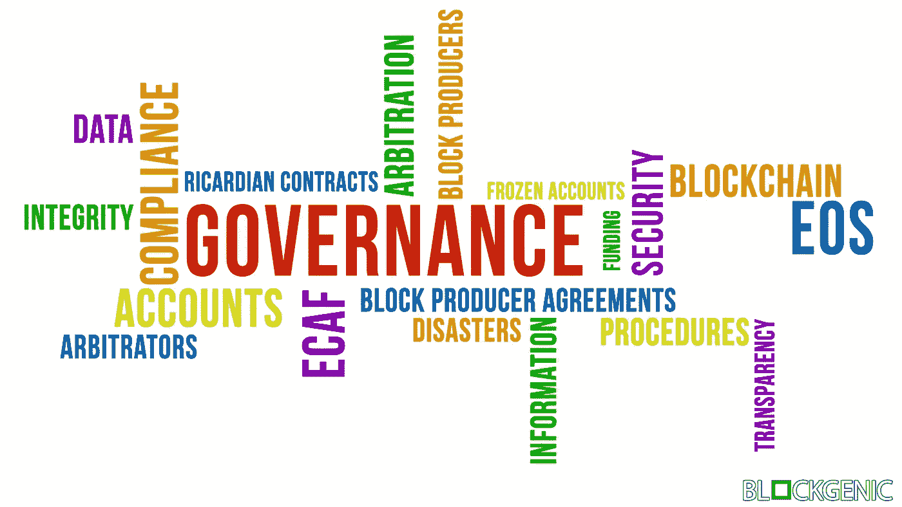

# 对 EOS 治理的深入探讨

> 原文：<https://medium.com/coinmonks/a-deep-dive-into-eos-governance-49e892eeb4a2?source=collection_archive---------2----------------------->

一个打破宪法，打破块生产者协议和被盗账户的故事？还是治理下的区块链未来的艰难开端？EOS 的承诺之一是引入 onchain 治理，但是到目前为止它有多成功呢？

# EOS 治理的承诺

2018 年 3 月 16 日，Block.one 发布了 ['EOS。IO 技术白皮书 v2'](https://github.com/EOSIO/Documentation/blob/master/TechnicalWhitePaper.md) 。EOS 治理以如下方式描述:

> 治理是一个过程，通过这个过程，社区中的人们:
> 
> 1.就软件算法无法完全捕捉到的集体行动的主观事项达成共识；
> 
> 2.执行他们达成的决定；和
> 
> 3.通过宪法修正案改变治理规则本身。

**第 1 点**描述了投票和决定社区事务的能力。这意味着代币持有者能够在 road EOS(或任何使用 EOS 的区块链)上投票。IO software)正在采取行动，对各种有时是艰难的决策进行投票的能力，以及对 EOS 生态系统中的违规行为者采取行动的能力。

这也意味着 EOS 有一个管理机构对争议进行裁决,《EOS 章程》规定该管理机构是 ECAF，它指定自己的仲裁员对每个争议进行裁决。街区生产者执行 ECAF 的所有裁决。令牌持有者可以对不良和/或不合规的块制造商提出索赔，获得被盗帐户的帮助，等等。

**第 2 点**描述了当选区块生产商执行决策的能力，无论是社区投票或公投的结果，还是仲裁员命令的结果。

**第 3 点**描述了改变宪法的可能性，甚至可能完全取代宪法。在 EOS mainnet 的发布会上，各方就章程达成一致，指定 ECAF (EOS 核心仲裁论坛)作为解决 EOS 区块链争议的组织。[你可以在这里找到宪法](https://github.com/EOSIO/eos/blob/37ce45c0b60d2710569c2d1a9229945cc0e855a9/governance/constitution.md)。

为了修改宪法，必须进行以下过程:

> 1.砌块生产商提议修改宪法，并获得 15/21 的批准。
> 
> 2.砌块生产商连续 30 天保持对新宪法的 15/21 批准。
> 
> 3.所有用户都必须表明接受新章程，作为今后处理交易的条件。
> 
> 4.块生产者采用对源代码的改变来反映宪法的改变，并使用新宪法的散列将其提交给区块链。
> 
> 5.砌块生产商连续 30 天保持对新规范的 15/21 批准。
> 
> 6.对代码的更改在 7 天后生效，在批准源代码后，给所有非生产完整节点 1 周的时间进行升级。
> 
> 7.所有没有升级到新代码的节点都会自动关闭。

这些承诺对 EOS 来说是独一无二的，在区块链这片广阔的土地上，这是一片无人涉足的领域。

# EOS 治理的现状

EOS mainnet 的推出并不是没有问题，但是这些问题有多严重，它们能够被避免吗？

它始于帐户被盗，这是诈骗和盗窃的结果，导致 7 个人无法访问他们在 mainnet 上的 EOS。在没有 ECAF 官方命令的情况下，当时最大的 21 家大宗商品生产商一致投票冻结了受影响的账户。这使得机构群体两极分化，导致许多人质疑 EOS 治理的完整性和分权程度。账户冻结后，大宗商品生产商对自己提出了争议，以便让 ECAF 审查他们的行动。(紧急)仲裁员认为这些行动是公正的，并下令冻结另外 20 个帐户，这引发了更多的争议，因为没有任何证据表明这些帐户以任何方式受到了损害。

随后，突然出现了不遵守《区块生产商协议》的区块生产商。这引发了另一个问题:如果一个街区制作人在注册成为街区制作人之前连主办一个网站的能力都没有，他们是怎么获得这么多选票的？只要这些区块生产商背后的鲸鱼继续支持他们，这些区块生产商中的许多今天仍然活跃，似乎不可触及。这些砌块生产商的出现，以及无法惩罚他们的违规行为，进一步分裂了 EOS 社区，社区中的许多知名人士表达了他们对 EOS 现状的不满。

也有各种关于‘买票’的讨论。EOS 章程禁止这样做:

> “不买票——任何成员不得提供或接受任何有价物品以换取任何类型的投票，任何成员也不得不当影响另一成员的投票。”

但是什么时候可以认为是买票呢？当一个街区制作人做空投的时候。当一个区块生产者奖励用户使用他们的平台？尽管许多人都表达了他们的观点，但是还没有人能对这些问题给出一个明确的答案。

# 如何改进 EOS 治理

有很大的改进空间，但是什么样的改变会产生最大的影响呢？我们认为这些是可以做出重大改进的领域:

## 透明度

缺乏冻结账户的证据表明，仲裁过程并不像一些人所希望的那样透明。缺乏关于 ECAF 及其运作方式的信息也是 ECAF 准备不足的原因之一。然而，ECAF 正在更新他们的网站([，可以在这里找到](https://eoscorearbitration.io/))，该网站目前包含所有以前的仲裁员命令、所有人员的名单等等。然而，在为某些订单提供证据时，更大的透明度是可取的。关于人员的更多信息也是可取的，因为似乎有这方面的需求。

## 可证明性

官方(非连锁)ECAF 订单的精确复制品的创建，导致了许多混乱，显示了 ECAF 官方订单发布方式的缺陷。ECAF 已经认识到这个缺陷，并创造了一种方法来验证订单链。这种方法目前可行，但一个新的、用于验证和接收 ECAF 官方订单的在线系统可能会有很大帮助。

## 教育

大多数令牌持有者不太熟悉 EOS 治理是如何工作的。这导致了大量的误解，也导致一些人甚至建议完全去除 EOS 的治理方面。这些建议显然是荒谬的，对 eos 治理及其工作方式进行更好的教育，可以帮助减少重复问题和超越建议的数量，这些问题和建议目前充斥着各种 EOS 相关的电报渠道..好的和广泛可用的资源总是有价值的。

# 结论

虽然这篇文章可能听起来非常关键，但每个版本都有自己的问题，到目前为止，还没有发现严重的错误和/或漏洞。EOS 治理目前可能缺乏力量，ECAF 或许应该做更好的准备，但从各方面考虑，EOS 治理看起来仍然很有希望，仍然可以解决无政府的区块链目前面临的一些大问题。毕竟，完全去中心化带来的问题比它解决的问题更多。

## 我们的社交

[网站](https://blockgenic.website/)
[推特](https://twitter.com/blockgenic)
[Youtube](https://www.youtube.com/channel/UCXTaehuAs3UWKnMVnT71MMQ)
[Meetup](https://www.meetup.com/nl-NL/Seattle-EOS/)
[Steem](https://steemit.com/@block21)

*由* [写成*由*写成](https://www.linkedin.com/in/yannick-slenter/) *为* [*为*](https://blockgenic.website/)