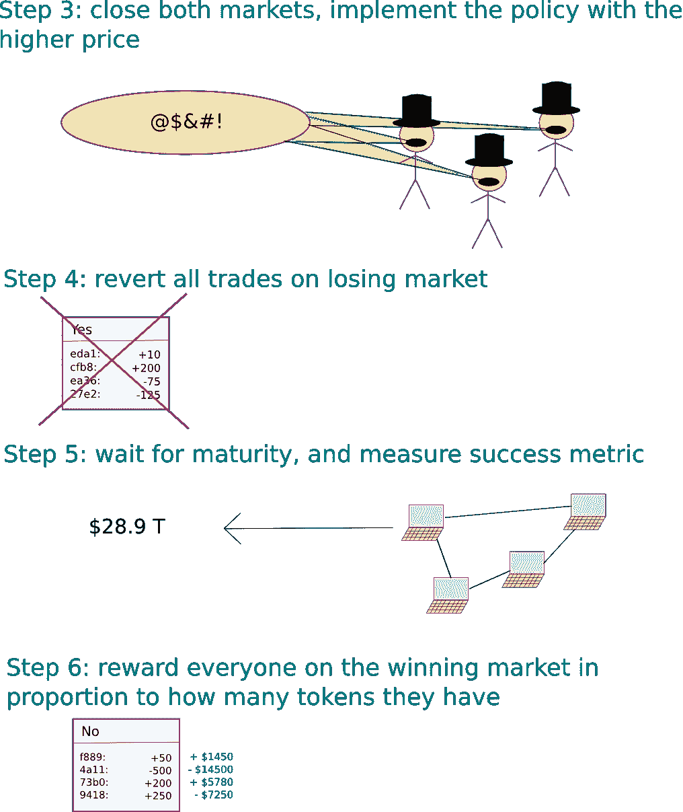

# 对专制的深入探讨:国家政府和私人组织能从区块链治理模式中学到什么(上)

> 原文：<https://medium.com/coinmonks/a-deep-dive-into-futarchy-what-national-governments-and-private-organisations-can-learn-from-a-9408aa2fb887?source=collection_archive---------2----------------------->

Robin Hanson, The Father of Futarchy. Source: [https://www.mixcloud.com/](https://www.mixcloud.com/epicenterbitcoin2/eb98-robin-hanson-futarchy-prediction-markets-and-the-challenge-of-disruptive-technology/)

# **前言**

在我的一生中，我总是只关注事物的社会方面:社会是如何运作的，人们为什么以他们的方式行事，社会机构和政府的作用，以及不平等、不平等和权力失衡的概念。

然而，在某个时候，我开始感到非常空虚。

这个世界上有太多的错误，但我觉得无能为力。当然，写下它必然会提高人们的意识，但除此之外没有实质性的行动。

在某个时候，所有这些行为开始感觉像是一个空洞的想法，重要的只是为了减轻我的内疚，我并没有真正的*对此做任何事情。*

然而，现在我已经涉足这个奇妙的区块链世界，我已经更好地理解了我空虚的原因。

不应将技术领域视为与社会世界分离的孤岛；技术正是能够让人们更好地了解社会状况的管道，也是一种工具，人们可以利用它来促进所有社会状况的更大包容性，包括*治理和政治*。

在任何给定的社会关系背景下，区块链技术都有很多帮助。作为一门我们也可以应用于现实世界的学科，区块链的技术也有很多值得我们学习的地方。

今天，我将讨论一个这样的转变，以便分别从国家和私人组织的政治和治理模式出发，从理论上构建一个更美好的未来。

# **民主的问题**

如今，超过 60%的国家是民主的。

尽管理论上有许多不同形式的民主，但今天唯一真正实行的是直接民主、代议制民主或两者的混合。

在直接民主制中，公民被赋予完全的控制权、责任和平等，他们直接参与国家的决策。

顺便说一下，代议制民主是全球最广泛使用的民主形式，通常涉及公民将他们的直接投票权交给代表(他们说公民通过国家选举等过程投票),代表公民就国家问题做出决定。

然而，民主作为一种政治制度并非没有缺陷。事实上，它有很多。

为了本文的内容，我将把它们缩减为 3 个主要部分:

1.  有责任
2.  少数民族的“特兰尼”
3.  政治活动

*问责*

Source: [https://cartoonmovement.com/](https://cartoonmovement.com/)

政治代表在当选后，对自己的行为只有非常松散的责任——如果有的话。在大多数国家，通常很少或根本没有机制来确保政治家在选举期间所作的承诺得到履行。然后，这些承诺(通常)就变成了吸引选民的空头承诺。

不幸的是，这将导致所谓的“选举周期政治”，在即将到来的选举之前，当选代表试图说服选民相信自己的能力和“可投票性”，要么通过引入实际上不可行的民粹主义建议、**，要么通过分发昂贵的“选举前礼物”(Wahl Geschenke)。**

*【少数人的暴政】*

其次，由于群众唯一的“发言权”是在政治代表的选择上，这意味着代议制民主最终在最高层决策时不会考虑群众的知识、专长和意见。

这将导致一种情况，即群众的智慧没有得到充分利用，如果有的话。信息也不会得到全面充分的汇总。随之而来的是，国家政策可能最终根本不能代表民众的价值观和信仰，使他们孤陋寡闻，甚至可能(最终)无效。

此外，将个人偏好简化为一次投票往往会导致权力集中，因为减少的决议使当选官员负责其专业领域之外的决策。

Source: [https://wiredpen.com/](https://wiredpen.com/)

*政治活动*

在政治代表中——学科专家在决策过程中也作为软技能被边缘化，在一定程度上，知识的广度是影响决策的关键。知识的深度仅次于外表和关系网，或者我们所知道的政治活动。

当选官员也会倾向于(尽管是有意的)让迎合他们的学科专家包围自己，导致社交网络凌驾于公正的专家意见之上、**以及系统内根深蒂固的回音室。**

所有上述情况最终都可能导致系统采取“愚蠢”的政策。

因此，为了使民主作为一种政治制度得到“固定”，必须解决三个要点:

1.  增强政策决策的问责制
2.  给群众更多的权力，增加对个人关心的议题的投票决议
3.  消除决策回音室

在所有这些问题上，我建议采用 Futarchy 作为解决方案。

# **futarcy，及其在区块链技术中的作用**

然而，在我深入研究之前，有必要先了解父权制是如何形成的，以及它在区块链空间中扮演的角色。

Robin Hanson. Source: [https://www.fhi.ox.ac.uk/](https://www.fhi.ox.ac.uk/)

Futarchy 的概念最初是由经济学家 Robin Hanson 提出的，作为一种未来形式的治理模式，该系统的成员将*对价值观进行投票，但将对信念进行下注*(稍后将详细介绍)。汉森的概念是基于纯粹的经济模式和政治理想，与区块链技术没有任何关系。

然而，由于二权制是现实世界中一种尚未尝试过的政府形式，区块链空间是一个很好的(也是唯一的)起点，让我们可以从中了解它如何可能有助于解决我们当前在全球民主政治体系中面临的问题。

首先，是 Vitalik Buterin 首先将 Futarchy 这一概念引入区块链，并于 2014 年在该空间内推广，当时他提出，Futarchy 将为区块链以太坊上的[分权自治组织](https://blog.ethereum.org/2014/05/06/daos-dacs-das-and-more-an-incomplete-terminology-guide/) (DAOs)构成一种非常有效的治理模式。

顾名思义，Dao 在运作上是完全自主的，它们本质上是无中介的，没有权力或影响力的中心。

然而，在此基础上，出现了几个问题:如何治理 Dao？谁会提出修改建议？谁的建议会被选择，谁最终会执行？

因此，很明显，为了让 Dao 发挥作用，需要一种与它们的去中心化特性相兼容的*治理模式*。换句话说，所有的 Dao 都需要一个工具来确保在没有中央实体的情况下，上述问题都能得到满意的回答。

进入 Futarchy。

# 到底什么是双权制？

在独裁统治下，传统的民主模式仍然会被用来定义我们想要什么，但是现在赌博市场会告诉我们如何得到它。

也就是说，民选代表仍将通过传统的民主程序正式定义和管理国家福利的事后衡量，但现在— **市场投机者和参与者将决定应该实施哪些政策来让国家达到这些选定的目标。**

于是，*投价值观，赌信念。*

我知道这是一个很复杂的概念，一眼就能理解，所以让我进一步分解一下。

汉森的意图是通过利用博彩市场来决定政策的实施，以解决传统民主的缺点。这是因为他发现，博彩(或预测)市场似乎总是胜过专家(甚至机构)和民意调查，而且一直如此。稍后会详细介绍。

可衡量的最终目标，或“价值观”(x 是 y 乘 z):其中 x 是一种度量——货币或其他，y 是期望的结果数量，z 是时间阈值)，仍将以传统的民主方式进行投票，而为了达到最终目标而制定的“信念”或政策将留给市场投机者。

如果预测市场支持实施，则策略将在值中指定的 z 阈值处实施和评估。换句话说，通过预测市场(*信念*)决定的制定政策被用来实现预先民主投票的预期最终目标(*价值观*)。

让我们看看整个过程将如何进行。

首先，父权制始于投票阶段。尽管这个系统严重依赖于预测市场来决定通向特定最终目标的*路径*，但是所述最终目标本身仍然必须以民主的方式来决定。然而，在这种情况下，我们不是像传统做法那样简单地投票决定*意味着结束*，而是投票决定“结束”是什么。

例如，最终目标可以是“到 2025 年，新加坡的失业率将降低到 2%”(参见:x 到 y，by z)，其中阈值( *2%* )、持续时间(*从撰写*之时起的 3.5 年)和部门(*新加坡的失业率*)都被选择。

假设这个最终目标已经被选为*和*最终目标，通过传统的民主投票流程来实现。预测市场现在将决定实现这一目标的实际政策。

还是那个例子，成功的标准(最终目标)是到 2025 年失业率达到 2%。下一步将是公布一项政策建议(以实现上述最终目标),并开放各种选择的市场。

Source: [https://blog.ethereum.org/](https://blog.ethereum.org/)

为了这个小小的思想实验，让我们使用政策“x”作为某人提出的达到上述最终目标的手段，其中市场 y 和 y 代表决定政策命运的期权的定价。

如果 y 代表“是”的价格，并且在市场关闭时超过 y 代表“否”的价格，则该策略将被实施，并且“否”市场上的所有交易将被恢复。

随着时间的推移，在提案的成功得到检验之后，如果它确实在分配的截止日期(2025 年)之前对初始值(2%的失业率)的成功产生了影响，那么获胜方将根据他们在获胜方(“是”)的政策持有量获得奖励。

最终，获得的实际回报和损失仍将全部取决于实现。**即使一个人做出了正确的政策选择，如果该政策最终在执行中无效，并且未能实现所选择的最终目标，他/她仍有可能亏损。**

Source: [https://blog.ethereum.org/](https://blog.ethereum.org/)

尽管最终目标的性质如此，上述思想实验使得 Futarchy 成为以太坊区块链网络上 Dao 非常合适的治理模型。

如果你想更深入地了解为什么会这样，我建议你阅读布特林的精彩提议。

然而，作为对那篇文章的一个快速总结，Futarchy 模型在两个主要方面使 DAOs 受益:

1.  这使得管理基金的高管更难为了他们的短期利益欺骗组织和社会(DAO 协议现在可以委托给*基金本身)*
2.  它允许治理成为一个彻底开放和透明的过程(现在可以信任 DAO 协议来*治理自己)*

从本质上来说，二层治理模式允许 Dao 有效运作，而不会损害其最初赖以建立的一个非常关键的原则，即权力下放，因为它允许问责制、开放性和透明度。

所以现在我们知道 fut archy*有一些实质性的价值；在这种情况下，在 DAOs 的区块链空间内。*

*外推至现实世界的治理和政治结构，**专制真的能成为解决民主问题的模式吗？***

*阅读下一篇: [*深度探究未来:国家政府和私人组织能从区块链治理模式中学到什么(第二部分)*](https://derekklim.medium.com/a-deep-dive-into-futarchy-what-national-governments-and-private-organisations-can-learn-from-a-e3fb02d66c4f)*