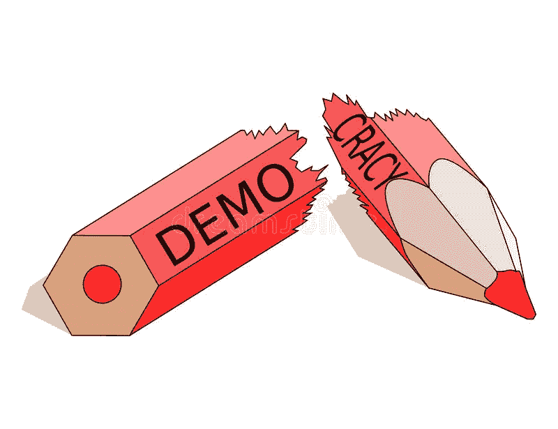
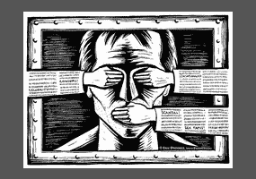
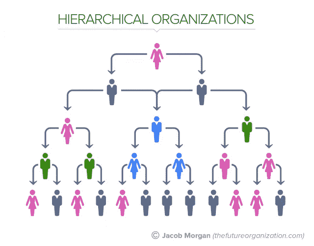
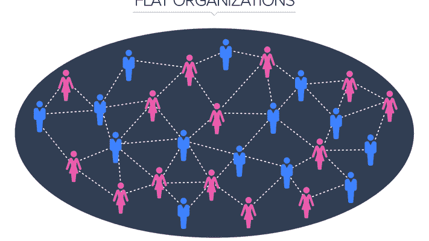

# 深入探究未来:国家政府和私人组织能从区块链治理模型中学到什么(第二部分)

> 原文：<https://medium.com/coinmonks/a-deep-dive-into-futarchy-what-national-governments-and-private-organisations-can-learn-from-a-e3fb02d66c4f?source=collection_archive---------10----------------------->

Source: [https://www.dreamstime.com/](https://www.dreamstime.com/)

先看: [*深度探究未来:国家政府和私人组织能从区块链治理模式中学到什么(第一部分)*](https://derekklim.medium.com/a-deep-dive-into-futarchy-what-national-governments-and-private-organisations-can-learn-from-a-9408aa2fb887)

# **专制如何可能“修复”民主？**

回想一下为了使民主作为一种政治制度得到改善，需要解决的三个要点(我在第一部分中提到过):

> 1.增强政策决策的问责制
> 
> 2.给群众更多的权力，增加对个人关心的议题的投票决议
> 
> 3.消除决策回音室

在我看来，Futarchy 将能够很好地解决这些问题，因为这种模式将带来 4 个主要好处，至少在理论上:

1.  激励选民做出明智的选择
2.  减少糟糕决策者的影响
3.  减少个性偏见
4.  将公众参与和专家分析结合起来

*激励选民做出明智的选择*

在当今任何现存的政治体系中，投票人都不会有热情去教育他/她自己他/她将要投票的政策。

这仅仅是因为他们没有这样做的动机，因为他们的投票对决策产生任何影响的可能性微乎其微，甚至为零。客观地看，据估计，个人投票对美国总统选举产生影响的可能性是百万分之一。

在独裁统治下，人们被激励做出更明智的选择或投票，因为如果结果对他们有利，他们将能够产生可观的利润。但是，如果事情没有按照他们的方式进行，他们将损失相同数量的钱。

因此，如果预测市场被用于这一目的，选民将被高度激励去做适当的研究，并对他们正在投票的问题进行充分的教育。

*减少糟糕决策者的影响*

随着预测市场系统的发展和成熟，它将自然地开始淘汰那些不擅长预测正确(或更受欢迎)结果的人，因为每当他们站在错误的一边时，他们往往会赔钱。

随着淘汰数量的增加，所有“坏”的预测者必然会从市场中被过滤掉，从而减少对整个决策过程的“坏”影响。

*减少个性偏见*

Source: [https://www.debate.org/](https://www.debate.org/)

所有的选民都会带着他们自己的偏好和偏见来到投票站——这是人类与生俱来的东西。此外，在这个社交媒体占主导地位的数字时代，选民很容易被他们在网上看到的东西左右和影响。导致大多数选民不理性投票；相反，他们根据偏见、成见和社会影响投票，这增加了他们的投票可能不是最明智的，或最全面的。

在未来的体制下，金钱将处于危险之中。因此，个人必须尽可能地理性，抛开个人偏见或偏好，为最有可能让他们赚钱的东西投票。

此外，在未来的体制中，选民将不再投票选举代表，因为他们将只投票选举政策提案。换句话说，选民不能再根据个性投票——考虑到最近世界各地政治体系中煽动者数量的增加，这一点也不是坏事。

*结合公众参与和专家分析*

最后，Futarchy 允许公众参与和专业专家分析之间的协同婚姻。

当涉及到关键决策时，人们倾向于相信技术专家，而不是官僚或政治领导人。因此，期货系统将允许公司和/或个人通过在市场上购买或出售并基于冲突的信息赚取利润来将他们的关键发现纳入决策中。

# **作为政治体系的专制的局限性**

然而，和所有事情一样，专制也不是没有缺点；事实上，它甚至可能严重阻碍未来的决策。

作为一种潜在的政治制度，父权制有 6 个主要的局限性:

1.  市场操纵
2.  人们会盲目追随市场趋势
3.  波动性
4.  参与率低
5.  价值主体性
6.  无法真正衡量影响

*市场操纵*

首先，未来模式并没有真正提供足够的保护，防止被一个强大的实体或联盟操纵。

如果一群拥有相同终极计划的人或实体走到一起，他们实际上可以囤积“有”代币，同时在市场上做空“无”代币。这将推动有利于特定结果的象征性价格，允许操纵整个系统。

人们会盲目追随市场趋势

其次，事实一再证明，在大多数市场中，人们倾向于根据其他人(可能不是最准确或最诚实的人)的建议和参考，而不是深入的研究或核心信息收集来做出购买选择。

Source: [https://www.esquire.com/](https://www.esquire.com/)

他们也可能在没有进行尽职调查的情况下根据市场趋势做出选择——这是一种非常常见的情况，许多加密领域的人现在称之为“FOMO”(害怕错过)。

因此，整个想法，即 Futarchy 将汇集良好的信息聚合器实际上可能是不可行的应用。

*波动性*

一个非常相关的注意事项是，如果由于波动性而出现明显的趋势，那么在买家简单地跟随市场的情况下,“知情”参与者的叙述也会被粉碎。

一个人操纵市场会导致市场向一个方向摇摆，让信息不丰富的交易者简单地跟随市场趋势，而不是理解他们实际上投票的是哪种类型的建议。

*参与率低*

此外，很像传统的投票，投票率可能会被证明是一个 futarchy 系统中预测市场的问题。交易员和投机者可能只是唯一参与市场的人，而你的标准选民可能会继续远离仍然隐含的沟通成本。

*价值主观性*

“价值观”也不总是容易量化，考虑到它们仍然会受到情绪偏见的影响，这伤害了双权制的根本原则。

如果投票阶段已经被玷污或受到任何形式的操纵，个人可能最终会得到他们甚至不认同的价值观。

*无法真正衡量影响*

最后——衡量一项政策是否产生了影响容易受到人为错误的影响，而且可能很困难。

其他因素可能已经影响了最初建立的值，并且简单地减少被制定为二进制的提议的影响并不容易，因为它不一定是自动的。

因此，代替这些缺点，并且直到它们被正确地解释——当涉及到当今世界的政治体系时，甚至尝试一种专制的治理模式都可能是不明智的。

这里利害攸关的事情太多了，各国失去的东西太多了。我们不能提议对政治制度进行如此彻底的改革，除非拿出具体的证据证明这种改革能够而且将会首先奏效。

这就是为什么我发现现实世界中进行实验和测试的最佳机构——就实施专制治理模式而言——应该是私人组织。

这是因为像民主政治系统一样，私人组织也有许多缺陷，我觉得这些缺陷可以通过独裁来解决。然而，与前者不同的是，私人组织(相对而言)风险较小，我们可能会有更大的犯错空间。

Source: [https://corporatefinanceinstitute.com/](https://corporatefinanceinstitute.com/)

# **私人组织结构的问题**

因为讨论每一种私人组织形式的每一个可能的问题会花费太多的时间和字数，我认为这超出了本文的范围。

相反，我将利用我自己以及我周围的人的个人经历来讨论这一部分。

因此，有一个警告——你在私人机构的经历可能与我将要分享的完全不同；这是意料之中的，我的分享并不意味着以任何方式代表所有，甚至是大多数的私人组织。

首先，大多数私人组织采用等级结构，有明确定义和严格执行的指挥链。在这种结构中，组织被分成多个层级，每一个较低的层级都比上一个层级拥有更少的决策权。

Source: [https://www.forbes.com/](https://www.forbes.com/)

因此，那些接近组织金字塔底层的人会发现，即使有可能，也很难将任何决策正式化。这在很大程度上是因为有大量的障碍，或者用组织行话来说，就是繁文缛节，他们必须跳过这些障碍，因为他们需要遵守指挥链。

这最终会导致 3 个主要问题:

1.  对资历和经验的不健康的崇拜
2.  决策权的高度集中和集中
3.  缺乏对努力工作的激励

对资历和经验不健康的崇拜

当一个组织是等级森严的时候，它往往会把那些在那里工作时间更长或者职位更高的人放在一个基座上。不管这些人的真正能力、专业知识或作为员工的效率如何，只要他们能比大多数将要离开的人呆得更久。

这种不考虑能力而推崇资历和经验的做法是不健康的，而且对于任何组织的运营来说，都是极其违反直觉的。再加上这些组织通常采用的自上而下的决策结构，这必然会导致无效和过时的政策，不仅会阻碍组织的潜在发展，还会对其他员工的士气甚至福利产生负面影响。

此外，在运用彼得原理时，在公司内长期担任同一职位的员工(通常是私人组织中的高级职员)被认为是不称职的，因为他们没有能力进一步晋升，这就变得非常清楚，那些纯粹因为资历和经验而将人放在最高层的私人组织将永远不会发挥其最大潜力。

*决策权的高度集中和集中*

此外，正如我在前面提到的，任何层级结构的组织中的决策过程本质上都是自上而下的。

换句话说，大多数关于组织未来的重要决策通常都是由少数高层人员秘密做出的。因此，决策权高度集中在他们手中，集中在一个权力中心，这个权力中心不接受或不愿接受外部任何人的意见。

Source: [https://www.truity.com/](https://www.truity.com/)

在这样的过程中没有任何透明度，组织中的大多数其他人将被排除在外，这对他们不利。

此外，由于权力只集中在少数人手中，当员工试图往上爬时，肯定会有政治活动。这不仅会污染工作场所的文化，还会违背公司真实发展的直觉(因为员工可能会说/做他们认为他们的上司想听到/看到的事情)

*缺乏对努力工作的激励*

由此推论，由于那些高层之外的人*永远不会*真正与组织的未来方向有任何利害关系，他们也不会被激励为之努力工作。

我的意思是，为什么有人会为一个他们没有发言权或影响力的实体付出如此多的努力？责任感只能到此为止；激励(与个人愿望和目标一致)是真正推动员工努力工作的因素。

此外，由于组织决策仅由高层管理人员做出，其他员工必须参与的许多项目或计划可能与他们的兴趣、偏好甚至能力不一致。在这种情况下，上述员工就更没有动力去尽最大努力，因为这甚至可能不是他们首先相信或能够执行的事情。

# **futarty 作为私人组织的治理模式**

当使用 Futarchy 模式进行决策时，一个组织的方向将不再仅仅取决于少数人(高层管理人员)。这代表了传统层级结构的扁平化，并将确保权力在董事会中更均匀地分配。

Flat Hierarchy. Source: [https://www.forbes.com/](https://www.forbes.com/)

现在，即使是最初级的员工也将在公司的短期和长期未来以及日常活动中拥有更直接的利益。

问题 2 ( *决策权的高度集中和集中)*通过 Futarchy 的设计自然得到了解决，因为决策过程将会民主化，所有人都可以参与。

推而广之，问题 1 ( *对资历和经验的不健康崇拜)*也将被否定，因为决策权将不再集中在资深和有经验的人手中。当然，他们可能仍然期望被崇敬，而其他人也肯定会这样做。然而，由于他们能够对组织行使的权力和影响力将被未来模式大大削弱，这种崇敬最终将只是一个空洞的概念。

最后，从所有这些情况来看，问题 3 ( *缺乏对努力工作的激励)*也可能成为一个无关紧要的问题，因为他们现在将在组织的日常工作以及总体方向中拥有发言权和股份。

# **最后的想法:未来的独裁统治**

当然，必须承认，上述所有观点都是基于一个非常肤浅的概念，即在私人组织的背景下的二权制；真正的深潜会占用更多的时间和空间。此外，上述私人机构的高管是否愿意首先尝试这种模式，也仍然是一个悬而未决的问题。

我的意思是，这样做将违背他们自己的个人利益和收益。首先，我已经知道一个事实，这种模式永远不会在我目前工作的组织中作为一个提案出现。

然而，这种模式在改善私人组织和工作场所文化方面的革命性潜力，永远不应该被否认和轻视。还需要做更多的工作来观察在真实世界的私人组织中(不仅仅是在 DAOs 中)的实现是否真正可行和有效。

对我来说，我当然希望在有生之年的某一天，我能看到这一切成为现实。

## 也阅读

 [## BlockFi 评论 2021 —通过您的加密获得 8.6%的利率

### 让你的密码发挥作用，获得比特币和其他加密货币的最佳利率

medium.com](/coinmonks/blockfi-review-53096053c097)  [## 加密税务软件——五大最佳比特币税务计算器[2021]

### 不管你是刚接触加密还是已经在这个领域呆了一段时间，你都需要交税。

medium.com](/coinmonks/best-crypto-tax-tool-for-my-money-72d4b430816b) 

> 加入 [Coinmonks 电报频道](https://t.me/coincodecap)，了解加密交易和投资