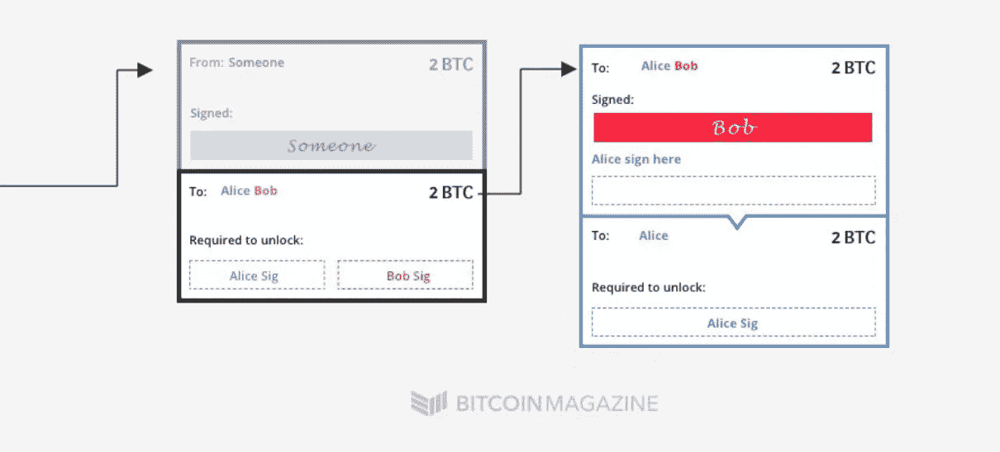
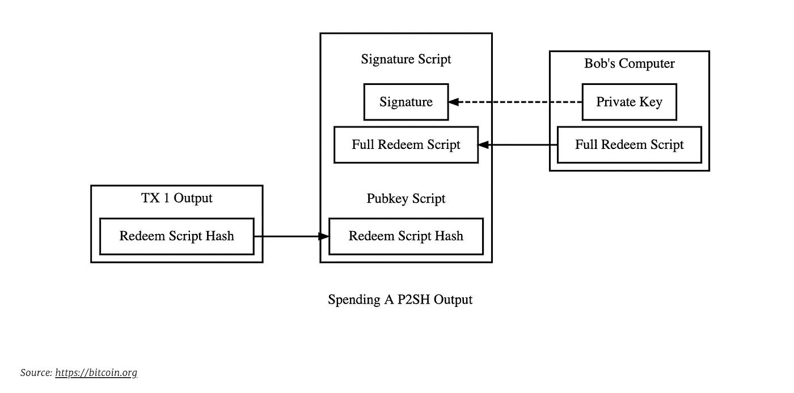
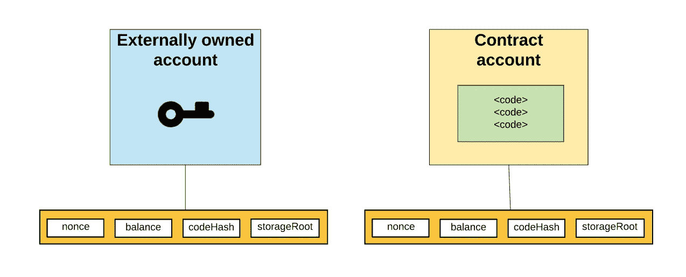
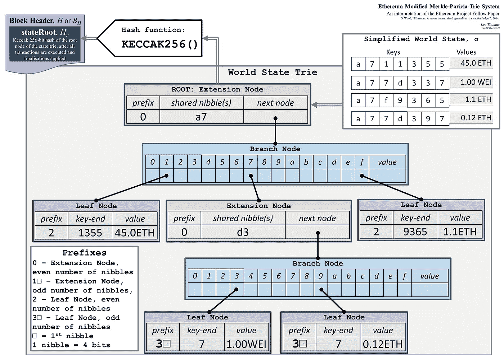
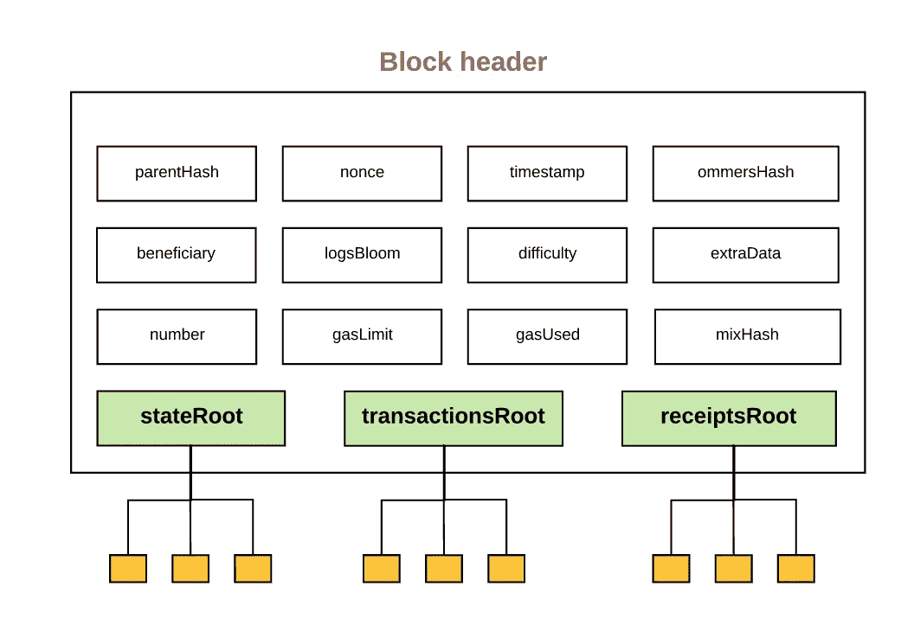
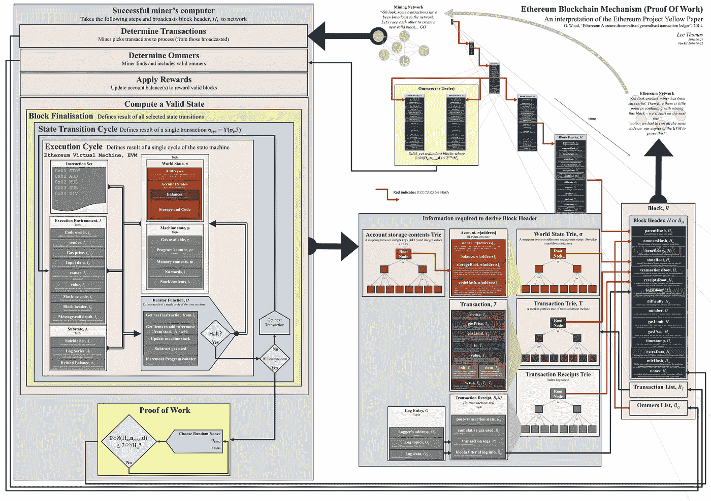

# 对智能合约的深入研究

> 原文：<https://medium.com/coinmonks/a-deep-dive-into-smart-contracts-6a8f5bacdb2b?source=collection_archive---------1----------------------->


在本帖中，我们将讲述智能合约的基础知识——从它第一次出现在比特币区块链开始，到它今天在以太坊的样子。我们将讨论图灵完整意味着什么，以及维塔利克的建议是如何完整的。最后，我们将研究以太坊中状态是如何变化的，并以一些结束语结束。这篇文章假设读者对比特币有所了解。如果工作证明共识或已花/未花的交易模型让你感到困惑，那么请参考我之前关于[比特币的信任模型](/@uneeb.agha/trust-model-of-bitcoin-part-i-34aacf47d444)的帖子，在那里我介绍了基本概念。

# 比特币脚本

大多数人听到“智能合约”都会想到以太坊。虽然以太坊通过其智能合约结构提供了广泛的功能，但我个人认为，从比特币脚本作品开始，并对其缺乏的地方发展直觉是有意义的。如果你想直接跳到以太坊，跳过这一节。

## 超越简单的 TX

Satoshi 的白皮书没有提到比特币脚本。它只是设计了一个系统，付款人可以用收款人的公钥和他自己的私钥对交易进行编码，收款人以后可以参考。但随着比特币越来越受欢迎，它需要做的不仅仅是这些。例如，如果比特币需要被机构采用，它需要一种机制来汇集交易。更具体地说，Alice 需要向 Bob 和 Charlie 发送资金。鲍勃不应该在查理允许的情况下拿走资金。反之亦然。事情变得很复杂。如果查理离开公司怎么办？如果丹可以随意代替查理签名呢？这些形式的签名被称为多重签名，后来通过比特币改进提案被引入。类似地，如果比特币要作为支付系统发挥作用，它需要提供一定的担保。如果我用我的比特币买了一部 iPhone，后来才发现它被篡改了怎么办？我该去找谁？通常，买家通过托管服务受到保护。一方坐在买方和卖方之间，决定某个项目是否确实是错误的购买。你可能会想——啊！又是多重签名。但也不尽然。如果第三方托管服务也开始恶意行为，并密谋反对卖方，该怎么办？因此，比特币需要设置时间锁。例如，在这种情况下，允许某种类型的交易持续 X 时间量，并且在到期时间之后，启用不同类型的交易。现在你需要的不仅仅是多重签名和时间锁。你需要条件句。



## **P2SH**

不仅仅是这两个场景，还有更多的场景。比特币一般是如何解决这个问题的？一种实现可以是将交易从一个钱包发送到另一个钱包。和逻辑放在钱包里。允许第三方介入并解决此类问题。然而，这引入了信任问题。更安全的方法是将逻辑嵌入事务本身。这将最小化攻击面，任何不符合规则的交易都将被视为无效。所以，你不是把比特币发给某个实体，而是发给一个脚本。该脚本(通常称为 redempt 脚本)包含需要满足的逻辑，以便获得比特币。它只返回真或假。



多重签名兑现脚本的示例如下:

```
OP_2 [A’s pubkey] [B’s pubkey] [C’s pubkey] OP_3 OP_CHECKMULTISIG
```

做某些操作有操作码。随着时间的推移，他们的编码已经[标准化](https://en.bitcoin.it/wiki/Script#Opcodes)。为了检索该交易中的比特币，您需要提供满足该脚本的签名。此类签名的示例如下:

```
OP_0 [A’s signature] [B’s signature] [serialized redeem script]
```

然后，比特币节点可以使用签名和脚本的组合来验证交易是否确实有效。这是比特币智能合约的要旨。2012 年，加文·安德森(Gavin Andresen)作为[比特币改进提案:16](https://github.com/bitcoin/bips/blob/master/bip-0016.mediawiki) 的一部分提出了这一概念，如今这一概念被广泛使用。

## **超越比特币剧本**

比特币节点符合脚本模式，以赋予其意义。但是没有意义的剧本呢？如果我把垃圾储存在比特币区块链上。交易无效。对一个比特币节点没有任何意义。但是如果不同种类的节点能够理解它呢？你可以创建一个处理各种交易的元区块链，比特币只是其中的一个子集。 [Cryptograffiti](https://cryptograffiti.info/) 允许你通过简单地使用 OP_RETURN 操作码，后跟你想写的任何文本，向区块链写任何东西。毫无意义的冒险。但这仍然是一个有趣的实验。

## **彩色硬币**

2009 年 1 月，中本聪宣布发布比特币 v0.1，对此哈尔·芬尼回应道:

> 祝贺 Satoshi 发布第一个 alpha 版本。我期待着尝试一下。
> 
> …
> 
> 作为一个有趣的思想实验，想象一下比特币获得成功，成为全球使用的主要支付系统。那么货币的总价值应该等于世界上所有财富的总价值。我发现，目前对全球家庭财富总额的估计在 100 万亿至 300 万亿美元之间。有了 2000 万枚硬币，每枚硬币的价值约为 1000 万美元。

财富不仅是以货币的形式获得的，也是以资产的形式获得的。这些资产可以像比特币一样在区块链上持久化。比特币可以被“着色”来代表一种资产。这就是彩色硬币背后的动机。但是，这个系统超出了比特币的范畴；就是设计一个点对点的电子现金系统。因此，也许重新思考区块链应该提供什么是有意义的。

## **图灵完备性**

如果比特币脚本语言能够模拟通用图灵机，即能够在任意输入上模拟任意图灵机的图灵机，那么它将被视为图灵机。虽然比特币脚本确实支持条件句(`OP_IF`、`OP_ELSE`、`OP_ENDIF`)，但它不会向内存添加任何东西。它只是以基于堆栈的顺序方式处理提供给它的内容。这意味着比特币脚本的功能有限。它不能在程序中存储状态。例如，您不能创建一个列出 Alice 的 pubkey 的组织。比特币的脚本框架无法捕捉到这样的规则。

比特币的支持者认为，增加脚本的表达能力是一种无用的努力，事实上，引入的问题比解决方案更多——因为表达能力意味着你必须更加小心你的代码。是什么决定了比特币是否应该推出多 sig 等功能；时间锁；P2SH 但不是图灵完备的脚本？这个问题引发了很多争论，这些争论一直延续到 day⁴.

# **以太坊**

维塔利克·布特林是第一个发现这种差距的人。2013 年，21 岁的 Vitalik 开始了以太坊项目——一个使用图灵完整脚本语言的区块链。这种语言被称为“坚实”。与比特币脚本相反，Solidity 支持各种编程结构，包括条件和存储状态以供以后检索。它开启了新的可能性。以太坊中的智能合约可以由任何人在任何地方编写，并以相对较低的成本部署到以太坊主链上——引发寻找下一个突破的淘金热。让我们更深入地探讨一下可靠性。

## **坚固度**

没有比深入代码并理解它更好的学习可靠性的方法了。下面是一个多重签名合同的例子。首先要注意的是，实现这种契约有多种方式。这是表现力增强的结果。下面的合同是一个非常简单的方法，让双方将钱存入合同。一旦他们准备好转移资金，他们就可以批准合同并调用 send 函数来转移所有资金。

在不深入语义细节的情况下，让我们大致了解一下下面的契约试图实现什么。如果不是什么都懂也不用担心。假以时日，它会变得更加清晰。如果你还想理解代码，请参考《坚实的 docs⁵.》

```
pragma solidity >=0.4.22 <0.6.0;contract SimpleMultisig { address trustee1;
  address trustee2; mapping(address => bool) signed; constructor(address _trustee1, address _trustee2) public {
    trustee1 = _trustee1;
    trustee2 = _trustee2;
  } function approve() public {
    require (msg.sender == trustee1 || msg.sender == trustee2);
    require (signed[msg.sender] == false);
    signed[msg.sender] = true;
  } function send(address payable _receiver) payable public {
    require (signed[trustee1] == true && signed[trustee2] == true);
    _receiver.transfer(address(this).balance);
    signed[trustee1] = false;
    signed[trustee2] = false;
  } function getBalance() public view returns (uint256) {
    return address(this).balance;
  } function() external payable {
    // fallback for accepting Ether
  }
}
```

有三个变量:两个地址引用需要其签名的受托人，一个带符号的映射将受托人的地址映射到 true 或 false 值(取决于他们是否批准了支出金额)。这三个命名的函数(`send`、`approve`、`getBalance`)做的正是您期望它们做的事情:它们允许调用者批准发送资金，实际发送资金并检查合同中的当前余额。该契约还有一个匿名的“回退”函数，它接受以太。这是用来存放乙醚的。

调用契约的实际过程如下所示:

1.在以太坊区块链
2 上部署合同。调用构造函数并实例化`trustee1`和`trustee2` 3 的地址。通过调用回退函数并在协定调用中提供 Ether 作为值，在协定中存放 Ether。这不是函数的参数。
4。调用`getBalance()`检查平衡并确保乙醚正确存放
5。两个受托人都叫`approve()` 6。其中一个受托者调用`send`并提供接收者地址。
7。呼叫`getBalance()`检查平衡并确保乙醚被正确提取

这里有几点需要注意:

*   这里涉及到干预区块链的多个步骤。另一方面，比特币中的多重签名是一步到位的过程。因此，它更加精简。
*   合同更加灵活。例如，代替硬编码两个地址，您可以接受可变数量的地址，并对`approve`函数的行为有一个灵活的规则。
*   因为契约的调用是一个多步骤的过程，所以您需要注意权限。谁被允许采取什么行动。这是通过`require`关键字完成的，但也有其他方法。

此时，读者应该开始看到使用比特币智能合约和以太坊智能合约之间的权衡。显而易见，以太坊智能合约要强大和灵活得多。它们可以用来创建复杂的操作序列。现在让我们换个话题，回到理论上来。

## **国家机器**

回想一下，在比特币区块链中，如果你想检查你的钱包的余额，你从时间的起点开始，应用 bloom filters 逐块前进，以检查块中是否有引用你的地址的交易。一旦你找到了它们，你就按照这个顺序去弄清楚你的平衡是如何随着时间变化的，以及它现在是什么样的。

这种通过事务表示状态的模型在以太坊世界中并不是一对一的映射。在以太坊智能合约中(我们从现在开始称之为合约)，你有各种各样的变量。它们需要被存放在某个地方。除此之外，你还有经典以太——它本身的功能与比特币非常相似。

因此，以太坊中有两种类型的账户:

1.外部拥有的账户(用户账户由私钥控制)
2。合同账户(由代码控制)



账户的状态由四部分组成:

1.Nonce:这不同于块中存在的 nonce。其目的是防止重放攻击。本质上，这个数字表示从帐户地址发送的交易数量。
2。平衡:*(自明)* 3。代码哈希:合同代码
4 的哈希。存储根:Merkle-Patricia trie 根节点的散列，它对帐户的存储内容进行编码(键值映射)

让我们放大默克尔-帕特丽夏·特里。那看起来到底像什么？下图所示，但只要知道它本质上将键映射到它们的值就足够了，因为它的结构是一个 trie。为什么？这样我们可以使用 Merkle Proof⁷.快速检查树中是否存在某个状态



看起来我们有一些方法来建模我们的帐户状态(包括契约和外部拥有的)。我们可以在合同中表示状态，并随时间改变它们。但是还有两个问题需要回答？

*   状态到底保存在哪里？
*   状态究竟是如何变化的？

显然，第一个问题的答案是区块链。为了改变状态，我们需要创建一个将在下一个块中使用的新事务。回想一下，在比特币区块链中，每个区块包含多个交易。类似地，在以太坊区块链中，每个块包含多个事务以及多个状态变化。



所有的状态变化以及事务再次被存储为 merkle 树，并且它们的根是块头的一部分。我发现了一个图表，大胆地试图总结完整的以太坊区块链机制。这是相当进化的，但为了它的价值，我会把它留在下面。



## **结束语**

自从区块链上一项简单的无信任交易诞生以来，我们已经走过了漫长的道路。以太坊成立至今已有 4 年。如今，人们可以构建复杂的交易形式，发行/出售代币，使其与美元价格挂钩。或者发放可以产生利息的贷款。它毫无信任地做这一切。如果哈尔·芬尼的预言是真的，加密货币确实正在夺取世界上所有的财富；它需要形成一个更复杂的框架来捕捉各种价值。今天，我们只受到两件事的限制:区块链的可扩展性和我们的想象力。

# **参考文献**

[1] [高级比特币脚本](https://www.youtube.com/watch?v=yU3Sr07Qnxg)
【2】[比特币 multisig 艰难的方式:理解原始 P2SH multisig 交易](https://www.soroushjp.com/2014/12/20/bitcoin-multisig-the-hard-way-understanding-raw-multisignature-bitcoin-transactions/)
【3】[托管示例](https://bitcoin.org/en/contracts-guide#escrow-and-arbitration)
【4】[一个加密版本的冲突](/@arjunblj/a-conflict-of-crypto-visions-6f3e28066454)
【5】[Solidity docs](https://solidity.readthedocs.io/)
【6】[以太坊究竟是如何工作的](/@preethikasireddy/)
【7】[Merkling in ether](https://blog.ethereum.org/2015/11/15/merkling-in-ethereum)

> [直接在您的收件箱中获得最佳软件交易](https://coincodecap.com/?utm_source=coinmonks)

[](https://coincodecap.com/?utm_source=coinmonks)