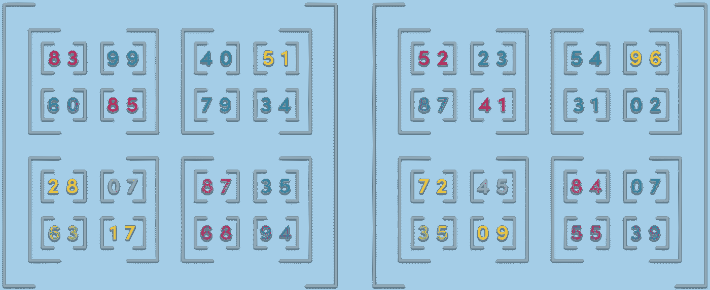

# JavaScript 中的张量

> 原文：<https://medium.com/coinmonks/a-deep-dive-into-tensors-in-javascript-4e73d7f10142?source=collection_archive---------6----------------------->



大多数机器学习模型的核心是数字。支撑你执行的所有数学变换的特殊数据类型被称为张量。

张量是从数学和物理中引入的一个概念，它们在理论上[要比这篇文章所涉及的](https://www.quora.com/What-is-a-tensor)复杂得多。如果你是一个黑客，想在网上用 Javascript 开始一个机器学习项目，你可以假设:

1.  张量有数据
2.  张量有一个维度
3.  张量有形状
4.  张量有一种类型
5.  张量描述了有效的变换

让我们一个一个地过一遍。

# 1.张量有数据

张量是一组数据的储存库，通常是数字。这样，它类似于用 Javascript 编写的平面或多维数组。

我们可以使用 Tensorflow.js 构建一个张量，并通过调用`.print()`获得其数据的表示:

```
> tf.tensor([1, 2, 3, 4]).print();
Tensor
    [1, 2, 3, 4]
```

# 2.张量有一个维度

上例中的数组是一个简单的数字序列。考虑这个数组的另一种方式是它的维度为 1 。

更复杂的东西，比如包含行和列的 Excel 电子表格，**的维度是 2** 。

张量定义了一种将维度编码到数据结构中的简单方法。(维度通常被称为“秩”，如“这个张量的秩为 2”。)

让我们看一个二维张量的例子:

```
> tf.tensor([[1, 2], [3, 4]]).print();
Tensor
    [[1, 2],
     [3, 4]]
```

正如[丹尼尔·杰弗里斯在他的教程](https://hackernoon.com/learning-ai-if-you-suck-at-math-p4-tensors-illustrated-with-cats-27f0002c9b32)中所列出的，高阶张量被用于各种各样的机器学习问题:

> 3D =时间序列
> 
> 4D =图像
> 
> 5D =视频

# 3.张量有形状

与张量的维数(或秩)密切相关的是形状。

张量的形状描述了张量维度的潜在长度。这里有一个例子:

```
> tf.tensor([[1, 2, 3], [3, 4, 5]]).shape
(2) [2, 3]
```

# 4.张量有一种类型

张量的数据有一个固定的类型来描述数据是什么。Tensorflow.js 中的有效类型可以是浮点数(小数)、整数或布尔值。

我们可以在创建张量时设置数据类型:

```
> tf.tensor1d([1, 2], null, 'float32').dtype
"float32"
```

# 5.张量描述了有效的变换

张量编码了与其他张量相关的有效数学运算的知识。由于这个原因，不把张量看作数据结构，而是看作对象或类是有用的。这正是 [Tensorflow.js 表示张量](https://js.tensorflow.org/api/0.12.0/#class:Tensor)的方式。

假设我们想要计算[点积](https://en.wikipedia.org/wiki/Dot_product):

```
> tf.tensor1d([1, 2]).dot(tf.tensor2d([[1,2], [2, 3]])).print()
Tensor
    [5, 8]
```

但是，如果我们尝试执行无效的计算:

```
> tf.tensor2d([[1, 2, 3], [4, 5, 6]]).dot(tf.tensor2d([[1,2], [2, 3]])).print()
Uncaught Error: Error in dot: inner dimensions of inputs must match, but got 3 and 2.
```

张量防止我们执行无效的计算。如果你来自非数学背景(像我一样)，你会非常感激这些错误信息。


到目前为止，我们已经看到了用 Tensorflow.js 使用普通数组作为输入来构建张量的例子。另一种构造张量的方法是用一个`TypedArray`。

# 类型化数组

类型化数组由底层数据缓冲区`ArrayBuffer`和处理缓冲区数据的对象`DataView`定义。

> 类型化数组是浏览器的一个相对较新的功能，它产生于在 WebGL 中有效处理二进制数据的需求。类型化数组是一块带有类型化视图的内存，很像 c 语言中数组的工作方式。——[伊尔马里·海基宁](https://www.html5rocks.com/en/tutorials/webgl/typed_arrays)

您可以直接创建视图，通过以下方式在幕后创建缓冲区:

```
const typedArray = new Int8Array(5);
f64a[0] = 1;
f64a[1] = 2;

// Int8Array(5) [1, 2, 0, 0, 0]
```

或者，您可以从视图中单独显式声明缓冲区:

```
const buffer = new ArrayBuffer(8); // 8-byte ArrayBuffer.
const typedArray = new Int8Array(buffer);
typedArray[0] = 1

// Int8Array(8) [1, 0, 0, 0, 0, 0, 0, 0]
```

如果您确实显式创建了缓冲区，您必须了解字节的底层表示:

```
const buffer = new ArrayBuffer(8); // 8-byte ArrayBuffer.
const typedArray = new Int16Array(buffer);
typedArray[0] = 1

// Int16Array(4) [1, 0, 0, 0]
```

可以有多个视图指向同一个底层缓冲区。例如，这种方法用于[将 MNIST 图像示例迭代地构建到底层数据缓冲器](https://thekevinscott.com/dealing-with-mnist-image-data-in-tensorflowjs/)中。这里有一个简单的例子:

```
const buffer = new ArrayBuffer(8); // 8-byte ArrayBuffer.
const firstHalfView = new Int8Array(buffer, 0, 4);
const secondHalfView = new Int8Array(buffer, 4, 4);
firstHalfView[0] = 1
secondHalfView[0] = 2
console.log(buffer);
// [[Int8Array]]: Int8Array(8) [1, 0, 0, 0, 2, 0, 0, 0]
```

您可以使用许多同名的类型化数组；[这里是它们的字节大小的概要](https://blog.codingbox.io/exploring-javascript-typed-arrays-c8fd4f8bd24f)。

# 为什么要使用类型化数组？

答案:**性能**。

最初引入类型化数组是为了处理 WebGL 和其他需要超快的性能的图形层。机器学习受益于类似的性能水平，这就是为什么许多大型机器学习模型在服务器上训练，跨强大的 GPU 并行化。

> 因为类型化数组由原始内存支持，所以 JavaScript 引擎可以将内存直接传递给本地库，而不必费力地将数据转换为本机表示。因此，在向 WebGL 和其他处理二进制数据的 API 传递数据时，类型化数组的性能要比 JavaScript 数组好得多。— [伊尔马里·海基宁](https://www.html5rocks.com/en/tutorials/webgl/typed_arrays)

习惯使用类型化数组来确保编写高性能代码是一个好习惯。

# 结论

在实践中，你可以用张量，记住张量有:

1.  数据
2.  尺寸
3.  形状
4.  类型
5.  有效转换的描述

最初发表于[https://thekevinscott.com](https://thekevinscott.com/tensors-in-javascript)