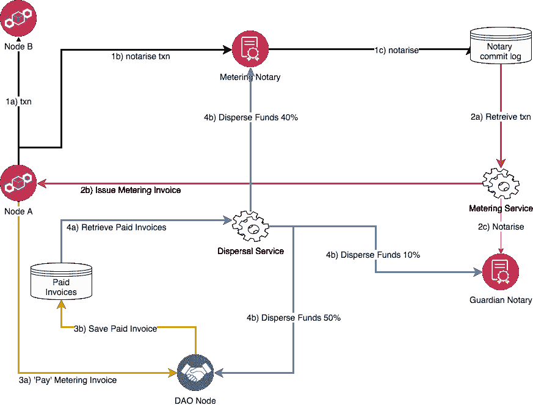

# 深入了解 Cordite 的计量公证人

> 原文：<https://medium.com/coinmonks/a-deeper-dive-into-cordites-metering-notaries-316adfe093af?source=collection_archive---------3----------------------->


在 Richard Crook 的中型文章中，他带我们踏上了一段区块链激励之旅，从工作证明、股权证明，到计量[cordit](https://cordite.foundation/)。

在本文中，我将介绍 Cordite 中当前的计量实现、我们做出的设计选择以及最终的工作原理。

我应该强调，目前，计量的当前实施是许多可能性中的一种，我们不局限于单一的计量方法——我们并不固执己见！

这里提供了一个简短的版本，供那些赶时间的人使用

*“用 9 个要点衡量为什么、什么、如何”*


为什么？

1.计量的目的是激励组织经营公证，并确保交易成本在高用量和低用量用户之间公平分配，而不是回到环境昂贵的算法。

什么？

2.计量是一种成本回收模型，其中公证人对业务节点处理的所有交易进行计数，然后向其发送这些交易的发票。这非常类似于你的电费账单。

怎么会？

3.计量目前作为 Corda 服务在单节点验证或非验证公证上运行。

4.交易成本、令牌类型和费用分配保存在一个名为“meteringModelData”的 DAO 状态中。

5.使用标准的 Corda Collect Sigs/Finality 流将计量发票设置到发起交易的业务节点。

6.业务节点可以支付或争议发票。

7.计量支付被发送到 DAO 节点，然后该节点根据 DAO 规则分散费用。

8.要将计量集成到现有的 Cordapp 中，它需要公证“感知”并具有 Cordite jars。

9.与现有的 PoW 和 PoS 协议不同，计量设计不局限于单个奖励模型。

# 还在吗？—更深的潜水

接下来的两个部分用我自己的话概括了为什么和什么是计量——如果你对这两个部分都感到满意，那么请随意进入设计考虑部分。

## 为什么要测光？

“如果 Alice 和 Bob 为不同的交易使用支付相同的价格，这公平吗？”


想象一下，你认为计量的概念完全是无稽之谈，你开始了自己的公证业务，名为“坚如磐石公证公司”。

你买了一个具有 16 个内核和 64 GB 内存的值得生产的云服务器，每小时花费 70 便士，如果全速运行，一个月大约 500 英镑。

你已经有两个客户，并决定每月向他们收取 250 英镑的公证费；你暗自希望，在你创业的头几个月，服务器没有得到充分利用，你将从中获利。

您的第一个客户是 Alice，她在 Mega corp .工作，他们在第一个月就完成了 10，000 笔交易。爱丽丝很高兴，因为她的交易费用是每笔 2.5 便士。

您的第二位客户是鲍勃，他刚刚开始自己的 alt 币经纪业务。他对新客户使用他的服务非常兴奋，所以他支付了 250 英镑的公证费。不幸的是，鲍勃有一个糟糕的月份，只做了两笔交易，做了两笔交易，结果他的交易成本是 125 英镑。

月底，你、鲍勃和爱丽丝出去庆祝你的新生意。

爱丽丝和鲍勃开始聊天。当鲍勃听说爱丽丝每笔交易付 2.5 便士时，他的脸沉了下来。鲍勃看起来很悲伤，所以你决定用你的利润给他买瓶啤酒，但是当你查看你的银行账户时，余额为零，因为你的服务器 100%被利用了。

如果您想要一个更公平的商业模式，您可以决定计量实际上可能是一个好主意。

## 什么是计量？

*“公用事业公司计费是成本回收的良好模式”*


计量遵循与公用事业账单相同的模式，因为您使用一些资源，无论是煤气、电力还是移动电话数据，并且在未来的某个时候您会收到使用账单；在未来的某个时候，您将支付账单！

在计量公证人的情况下，交易是资源，“计量”发票被发送给这些交易的创建者。

采用计量和账单模式的优势之一是，我们有机会创建多种不同的商业模式，以反映当前实用新型的运作方式；这使得公司能够控制和计划他们的现金流。下面是几个例子:

*   按需付费—只需支付使用费用。
*   free mium——前 1000 笔交易是免费的，然后您开始付款。
*   预付折扣——您先支付一笔“更便宜”的交易，然后在用完这笔交易后支付正常费率。
*   延迟还款——您有 90 天的时间支付计量费用。

上述模型都不是特别有创意，但是如果你把这种灵活性与比特币、以太网和一些新生的“股权证明”模型的单一货币和单一交易成本模型相比较，那么我希望你会同意，有机会创造适合各种形式和规模的成本模型。

# 设计考虑

*“在每笔 Corda 交易中加入成本状态可能不是一个好主意”*


当我们为 Cordite 设计成本回收模型时，我们围绕业务和技术含义进行了多次讨论。当时，我们不知道最终会采用计量方式，但我们最终还是通过问一些关键问题来实现这一目标。

## 我们应该在每笔 Corda 交易中嵌入交易成本吗？

今天的大多数加密货币都是这样工作的；为了让您的比特币交易得到处理，您必须在交易中嵌入您准备支付的金额。

对于已经构建了 Cordapp 并想使用这种模型的人来说，他们必须改变所有的流程，以便在每一个事务中嵌入某种“令牌”状态；这将立即给采用制造一个昂贵的障碍。

我们认为，如果你能神奇地将你的 Cordapp 指向一个计量公证人，成本回收就可以了——我们已经非常接近了。

## 我们应该改变核心的 Corda 代码库吗？

另一个选择是将交易成本模型嵌入到 Corda 核心代码中，这样无论发生什么，每个人都能得到它。

我们对 Cordite 的一般原则是，它将建立在 Corda 之上，只有在绝对必要的情况下，我们才会向 Corda 核心添加更多的功能。

我们可以选择自己的发布周期，这一点与不把 Corda 变成一个做太多事情的[‘上帝’](https://en.wikipedia.org/wiki/God_object)对象一样重要。

按照 David Rutter 关于 Corda 是操作系统的比喻，Cordite 是“办公套件”,提供一套关键工具来支持您的业务。

*`为什么要把自己局限于单一的经济模式？`*


## 我们应该使用什么货币/代币进行成本回收？

拥有一个单一的令牌和一个单一的发行，因此经济模式将适用于一些商业网络，但可能不是所有的。

我们的观点是，我们需要某种代币来支付交易，但我们无法预测未来的企业会如何交换价值；有些人可能只希望交换法定支持的代币，而其他企业可能希望拥有自己的公用代币、奖励代币或企业代币。

我们决定让商业网络和公证人所有者决定他们使用哪些代币。

*`支付交易费用来开具发票可能会让你陷入鸡生蛋的悖论`*


## 用户没钱支付交易怎么办？

想象一下这样一个矛盾的场景:为了从你的生意中获得一些钱，你需要发送一张发票；但是为了发送发票，你需要支付交易费用？

通常情况下，新企业没有太多的现金流动，需要以后支付账单——如今大多数发票都有 90 天的回收期。

我们仔细考虑了如何在 Cordite 中进行管理，并基于现有的公用服务模型提出了计量概念。公用事业公司计量你交易，然后给你寄账单。

*`授权用户抗议糟糕的服务`*


The UK Power Industry Regulator

## **如果节点所有者收到的服务很差怎么办？**

一旦我们有了“发票”系统，我们现在需要处理公证人提供的服务很差或节点没有按时支付账单的情况。我们决定实现“争议”功能，这样我们就可以管理糟糕的服务和不准确的收费。

## 我们如何控制计量成本和分配资金？

至此，我们已经充实了心刀的概念；我们决定用它来管理商业网络的计量规则，如令牌类型、交易成本和对计量“方”的奖励分配。这有效地实现了对定价和费用分配的一定程度的控制；就像 DLT 的“ofgem”一样。(注:这些是英国的水电监管机构)。

*`谁管理警察？`*


## **计量公证人应该能够公证他们自己的发票交易吗？**

我们持悲观态度，认为计量公证人可能是恶意的，我们不应该相信他们会公证自己的计量发票。

因此，我们需要引入另一个公证人，最初称为“警察”公证人，但后来改为更友好的“监护人”公证人。这与前一周在电影院看《银河护卫队二世》没有任何关系。

在提出这些问题时，我们希望提出一个成本回收模型，该模型可以适应许多不同类型的业务网络的要求。

*`计量是科迪特吃自己的狗粮`*


# 计量是如何工作的？

在我详细介绍计量是如何工作的之前，值得一提的是计量利用了 Cordite 的另外两个组件，DGL 和 DAO。如果您对这些不熟悉，那么您可以在此阅读它们[:](https://cordite.readthedocs.io/en/latest/content/concepts.html)

计量由一组 Corda 收集签名/终结流和两个运行在计量公证和 DAO 节点上的 Corda 服务构建而成。

如果你不熟悉 Corda 服务，那么你可以在 Cordite 贡献者 Dan Newton [这里](/corda/corda-services-101-245e2126ba58)的一篇精彩文章中了解这些服务的内幕。

该图显示了计量中的关键角色以及他们如何编排计量流程。



在此图中，有四个独立的“事务”在起作用。这种隔离可以防止计量影响初始业务事务的整体性能，并减少整体操作中的摩擦。

事务编号为 1–4，并执行以下操作:

1.在节点 A 和节点 B 之间发生商业交易；这由计量公证人进行公证。

2.计量服务从公证人的保险库中检索交易，并向创建交易的节点 A 发出计量发票；这是由监护人公证员公证的。

3.节点 A 使用指定的 DGL 令牌支付计量发票，并将该支付发送到 DAO 节点；这个也是监护人公证员公证的。

4.费用分散服务根据 DAO 中的计量规则分割计量费用，并向计量公证人、监护人公证人和 DAO 基金会基金付款。

*`Corda 服务是计量最好的朋友`*


计量的关键驱动因素是计量服务和费用分散服务。

## **计量服务是如何工作的？**

对于在公证人上启动的计量服务，您需要一个小的配置文件。这是它最辉煌的时刻。

```
{
“meteringRefreshInterval” : 2000,
“meteringServiceType” : “SingleNodeMeterer”,
“daoPartyName” : “Cordite Committee”,
“meteringNotaryAccountId”: “metering-account-acc1”,
“meteringPartyName”: “Cordite Metering Notary”,
“daoName”:”Cordite Committee”
}
```

值得讨论每个参数，因为这将充实计量故事。

*   **计量刷新间隔**

目前，计数服务的轮询时间为 2 秒。在每次轮询期间，它检查其配置，然后读取公证人保险库中的已提交交易。

对于单节点公证，事务存储在下表中:

```
NODE_NOTARY_COMMIT_LOG
```

在您自己的计量实现中，您可能希望在安静时间、预定时间甚至每天进行计量；这些选项中的每一个都将适合您自己的使用案例。

*   **计量服务类型**

我们预计未来会有许多不同类型的公证人和计量类型；此参数驱动从“抽象”meter 类继承的“meter”类型。

*   **道党名**

计量发票从业务节点支付给 DAO。计量公证人将此参数放在每张计量发票上，因此业务节点知道将付款发送到哪里。

*   **计量 NotaryAccountId**

这是计量费支付到的科迪特 DGL 帐户的名称；同样，这些都印在每张发票上。此外，在当今的商业世界中，许多发票在开具时并没有实际说明应该向哪个账户付款——如果你仔细想想，这是相当令人震惊的！

*   **计量方名称**

计量服务根据该参数检查计量公证人的节点组织名称。如果它们不匹配，计量服务将退出；这充当了额外的带子和支架，防止计量意外地在错误的节点上运行。

*   **道名**

计量配置的其余部分保持在特定的 DAO 状态。注意:网络中可以有很多 DAO 状态。对于我们的测试网络，我们的道州简称为“科迪特委员会”

计量服务在每次轮询时检查 DAO 状态，以确保它具有最新的计量费用和配置。

如果它没有找到包含计量参数的 DAO 状态，那么什么都不会被计量！

*`您的业务网络成员最终控制计量规则`*


计量配置的其余部分存储在名为“meteringModelData”的类中，该类存储在 DAO 状态中。

这是它在 json 中的样子，为了简洁做了一些编辑

```
{
**meteringTransactionCost:**
{ meteringTransactionCost: 10,
  meteringTransactionTokenDescriptor:{ symbol: ‘XTS’ }
},**meteringNotaryMembers:**{ ‘OU=Cordite Foundation, O=Cordite Metering Notary, L=London, C=GB’:{ accountId: ‘metering-notary-account1’,
description: ‘I am a cool metering notary’,
meteringNotaryType: ‘METERER’ },‘OU=Cordite Foundation, O=Cordite Guardian Notary, L=London, C=GB’:{ accountId: ‘guardian-notary-account1’,
description: ‘I am a guardian of the galaxy’,
meteringNotaryType: ‘GUARDIAN’ }
},**meteringFeeAllocation:**{
daoHoldingAccountId: ‘dao-holding-account’,
daoFoundationAllocation: 50,
meterNotaryAllocation: 40,
guardianNotaryAllocation: 10,
daoFoundationAccount: ‘dao-foundation-account’ }
} 
```

该配置分为三个主要部分。

**计量交易成本:**

这决定了用于支付计量费用的 DGL 令牌的类型以及应该支付该单位的多少。

**计量公证成员:**

这定义了由 DAO“批准”的所有公证人的列表。计量公证人从该列表中挑选其监护人公证人。有了 Corda 4，我们将能够使用 Roger Willis 出色的参考状态实现来强制使用这个列表。

**计量费用分摊:**

这决定了如何在计量公证人、监护人公证人和您的业务网络基金之间分割计量费用。

上述所有参数均由您的业务网络管理的 DAO 通过投票和提案机制进行控制；这使得 DAO 成员能够治理计量。

在当前的实现中，计量和监护公证人是 DAO 的投票成员，因此他们可以投票反对任何“免费”交易的提议！！！

这很好地把我们带到了费用分散服务。

*`根据业务网络设置的规则发放奖励`*


## **费用分散服务是如何工作的？**

到目前为止，您可能已经猜到费用分散服务需要一个配置文件，所以这里是:

```
{
“feeDispersalRefreshInterval”:2000,
“feeDispersalServicePartyName”:”Cordite Committee”,
“daoName”: “Cordite Committee”
}
```

像计量服务一样，费用分散服务在 2 秒钟的轮询中运行，然后从 DAO 状态中提取“meteringModelData”。

该服务运行在收集计量费用的指定 DAO 节点上。

计量费用被支付到被称为“持有账户”的 DGL 科迪特账户。

费用分散服务检查其金库中的“已支付”计量发票，并且当它找到已支付的计量发票时，它读取计量费用分配结构，并且根据计量费用分配表来划分持有账户中的代币。

然后，它为每笔分配创建一个“计量发票分割”，并将这些分配发送给计量和监护人公证人，并将一些资金放入“Dao 基金会帐户”，用于资助您的业务网络的进一步发展。

所有这些计量交易都由监护人公证人进行公证，这留下了一个小问题，即我们需要为监护人公证人的勇敢努力支付报酬。因此，我们必须先向计量公证人进行公证转账，然后才能向监护人公证人付款。

在这一点上，你可能会说，‘计量公证人肯定会计量这个交易，并创建一个无限的计量循环’——直到我修改了代码，不对监护人公证人的交易收费，它才这样做！

*“没有一套强大的流程，任何 Cordapp 都没有任何用处”*


## **计量流量**

没有一套健壮的流程，Cordapp 就不是一个真正的 Cordapp，值得讨论一下这些流程，以补充一些额外的细节。

计量发票经历了从发行到支付再到分发的生命周期。这是管理业务流的一种非常普通的标准状态机方法。这些状态在“计量状态”枚举中定义——我将在解释流程时提到这些状态。

*‘所有计量交易均可批量完成’*


**IssueMeteringInvoicesFlow:**

如 tin 上所述，这将从计量公证人向发起交易的业务节点发出计量发票。与所有计量流量一样，这由监护人公证人进行公证。

您可能已经注意到，流名称是复数形式的；这是因为所有计量流都可以处理多个发票和付款。计量发票契约还煞费苦心地验证在事务中提交多个状态时没有欺诈行为。

在该流程的接收端，业务节点检查它是否确实创建了交易，并且由计量公证人进行了公证。这再次反映了我的观点，我们应该不信任任何东西，无论它来自何方。

此时，计量发票处于“已发行”状态，由节点所有者所有。

*“在原子交易中支付物品的强大概念”*


**PayMeteringInvoicesFlow:**

这是由业务节点发起的，这实质上意味着节点所有者控制她何时支付计量账单。

该流程的参数是计量交易 id 列表和支付费用的 Cordite DGL 帐户 Id。

在这个简单的流程中，有一个非常强大的概念，我称之为“支付物品”交易。

到目前为止，在技术解决方案中，支付发票导致数据转移到不同的轨道上，一个用于支付(BACS、SWIFT 等)，一个用于发票(电子邮件、传真、邮寄！😱).

当我们可以将支付和已付发票结合在一个单一的原子操作中时，它是非常强大的——全球的账户职员将不再花费无尽的时间来匹配发票和支付；向小公司发送随机发票的欺诈者将逃之夭夭。

该流程使用 Cordite DGL 来实现这一点，这样我们可以确保您可以轻松地将 DGL 令牌状态集成到自己的流程中，以支付发票、数字媒体、贷款、抵押贷款和加密仓鼠等数字项目。

此时，计量发票处于“已支付”状态，由 DAO 分散节点所有。

*“用业务网络选择的 DGL 令牌分割发票”*

**分散流量计流量:**

我在上面介绍了分散，所以唯一要添加的是计量发票被分割成三个“计量发票分割”,并在 DAO 选择的 DGL 令牌中与相应的付款一起发送——同样，原子操作减少了对帐的需要。

如果一切顺利，那么计量发票将最终处于“资金分散”状态。

此外，三种计量发票分割状态将以“分割 _ 分散”状态结束

“论账本数字纠纷”


**争议干预声音流:**

如果业务节点所有者认为计量发票不公平，她可以使用此流程将它们发送回计量公证人。它简单明了！

此时，计量发票处于“有争议”状态，由计量公证人所有

*“唯一性和解决数字争议”*


**reissuemeteringivoiceflow:**

计量公证人“所有者”可以重新签发计量发票，但对发票中可以更改的字段(当前为金额、令牌类型和目标帐户)权力有限。

争议/再发行周期可能会发生很多次，就像在当前的商业模式中一样。这突出了另一个问题，即我们需要非常小心地保持计量发票的唯一性，以防止创建重复的发票。

我们通过在保险库中的计量发票上强制执行唯一索引以及仔细检查计量发票合同中的“重新发行计数”来做到这一点。

“开源，开放思想”


## **总之**

感谢您到此为止，我希望这篇文章能让您深入了解 Cordite 计量，它如何消耗其他 Cordite 组件，以及最终如何使用 Corda 流和服务构建相当复杂的 Cordapps。

如果您想为您的 Cordapp 设置 cordite 计量，那么值得看看我们贯穿整个过程的端到端计量集成测试。在 cordite repo 中查看该类:

```
[MeteringIntegrationTest](https://gitlab.com/cordite/cordite/blob/master/cordapps/metering-cordapp/src/integrationTest/kotlin/io/cordite/metering/MeteringIntegrationTest.kt)
```

以下是测试的预览:

```
private fun runEndToEndTest() {
  createDaoAndMembers()
  setUpDaoMeteringParameters()
  createAndLoadAccountsForMeteringFunds()
  createAccountsAndDoSomeTransfers()
  checkForMeteringInvoicesAndPayThem()
  checkFinalBalances()
}
```

Cordite 是作为开源共享的，这篇文章也是我们尝试分享我们的思维过程——“为什么”和“如何”一样重要

cordite 的贡献者越来越多，我们欢迎各种规模的提交和设计想法；要了解更多信息，请从这里的[开始](https://cordite.foundation/)！

> [直接在您的收件箱中获得最佳软件交易](https://coincodecap.com/?utm_source=coinmonks)

[](https://coincodecap.com/?utm_source=coinmonks)