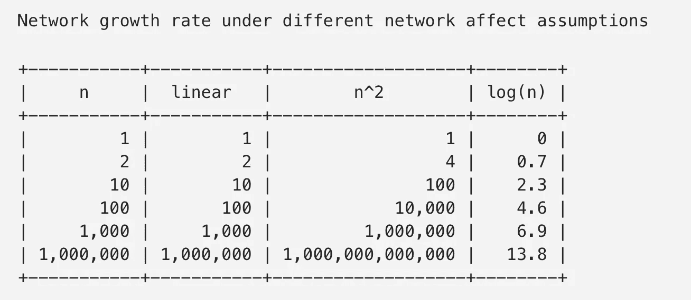
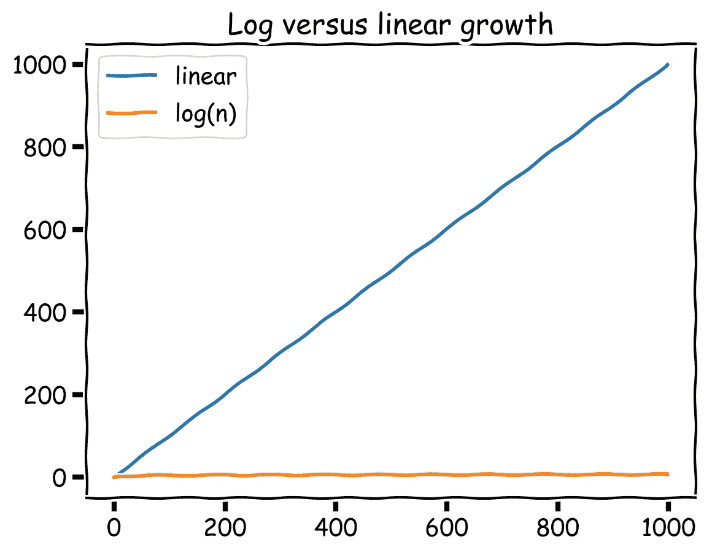
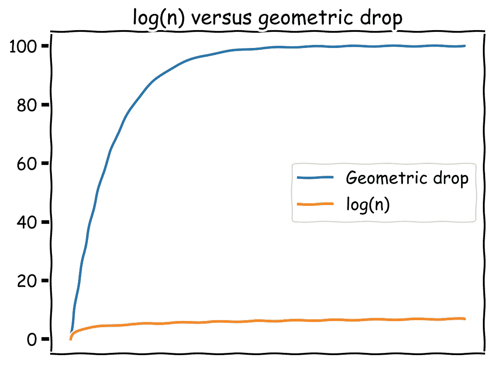

# 对比特币网络效应的深入研究

> 原文：<https://medium.com/coinmonks/a-deeper-look-into-bitcoin-network-effects-d6b4b8a16f03?source=collection_archive---------2----------------------->


来自 Multicoin Capital 的 Kyle Samani 最近写了一篇发人深省的文章[关于价值商店的网络效应](https://multicoin.capital/2018/05/09/on-the-network-effects-of-stores-of-value/)。我强烈建议你先读一读，然后花点时间思考一下。

大多数人普遍认为比特币有很强的网络效应，而且货币可能是所有货币中网络效应最强的。如何评估网络效应，最著名的规则是[梅特卡夫定律](https://en.wikipedia.org/wiki/Metcalfe%27s_law)。每当讨论网络效应时，就一定会提到梅特卡夫定律。该定律指出，网络的价值与 n 成正比，其中 n 是网络中参与者或节点的数量。典型的例子是电话系统，其中有 n 个参与者，每个参与者可以联系 n-1 个其他参与者，使得网络的总值与 n * (n-1)成比例，除了 n 的最小值之外，网络的总值可以近似为 n。

Kyle 经常在推特上说，他认为价值储存(SOV)的网络效应比通常假设的要弱得多，而不是 n，它们更像 log(n)(见下面脚注中的和)。言外之意，他是在说(这部分是我说的，不是他说的),因为比特币正被吸引成为一种价值储存手段，比特币的网络效应比大多数人想象的要弱得多。这听起来可能有点数学，你可能会想，只要有网络效应，谁会真的在乎呢？为了了解这种差异，我们来看一下基于 n 的增长和基于 log(n)的增长。为了更好地衡量，让我们也包括线性增长。



看看网络价值在 n 假设下增长有多快，在 log(n)假设下增长有多慢。对数增长比线性增长慢得多，而线性增长又比对数增长慢得多。下面是对数增长与线性增长的对比图。与线性相比，log(n)增长在 0 处看起来像一条平坦的线。



判断网络效应是否在起作用的一个方法是看现有市场中供应商的数量以及领先供应商的支配地位。如果有强大的网络效应，那么你会期待一个占主导地位的供应商。网络效应导致赢家通吃，因为最大供应商的价值主张比其他任何供应商都高得多。如果一个市场有强大的网络效应，那么不惜任何代价获得早期增长是有意义的。一旦网络效应发生，那么任何人都不可能赶上，为获得早期增长而付出的成本将是值得的，甚至更多。我们稍后会回到这个话题，但现在回到比特币。

凯尔令人信服地指出，对于一个主权财富基金来说，你唯一真正关心的是能够在未来获得流动性，例如当你决定套现或购买某些东西时。因此，每个新参与者加入时对你的价值只是他们带来的额外流动性，超过某个临界点后，新人加入时的边际新流动性对你来说真的没什么区别。

我同意凯尔的观点，如果流动性是唯一的考虑因素，那么网络效应确实很弱。我忍不住想，也许还有更多。随着每个新参与者加入比特币网络，我也会受益，因为我现在可以在不需要流动性的情况下与他们进行交易。有可能对方会直接接受我的比特币，而根本不需要我把它们兑换成法币。因此，一旦有足够多的人使用比特币作为 SOV，一个新的好处就会出现，我们可以用比特币彼此交易。你可能会说，这不再是 SOV，我们现在谈论的是货币的交换媒介作用，网络效应更强。这个论点可能是正确的，但它确实说明，一旦大量的人首先使用某样东西作为 SOV，从 SOV 到交换媒介就有了一个自然的过程。这种自然发展的价值没有反映在 log(n)假设中。只有当参与者达到足够大的临界质量(比如 10 亿)时，这种进展才可能开始显现。所以它可能在很长一段时间(几年或几十年)内不可见，然后很快发生。另一种说法是，对于不同时作为交换媒介的 SOV，进入交换媒介的流动性是网络价值的重要驱动因素。但是超过某一点，SOV 将开始成为交换媒介，因此网络效应改变了⁶.

如果我们看看货币的历史，在任何时间点都倾向于有一个占主导地位的 SOV(对于一个特定的地理区域，如果该地理区域是孤立的)。这意味着 SOV 可能有很强的网络效应，但这与 Kyle 关于 SOV 网络效应很弱的论点不一致。那么，为什么 SOV 是赢家通吃呢？网络效应不是主导供应商的唯一原因，所以让我们试着找出一些其他原因，为什么我们一次只能看到一个主导供应商。我认为有两个简单但有力的原因:

1.  人们会根据 SOV 的特性和可供选择的方案的特性来选择 SOV。这不是网络效应，但将导致大多数人最终选择相同的 SOV，因为市场在一段时间内确定了**哪一个具有最佳特性。**
2.  不需要一个以上的 SOV。一旦你有一个单一的 SOV 与期望的属性，市场对这种经济商品的需求现在完全得到满足。出现新 SOV 的唯一原因是当前 SOV 的特性受到损害，或者出现了具有更好特性的 SOV。

如果以上都是正确的(包括凯尔关于 SOV 的对数假设)，那么这也意味着当一个新的 SOV 正在建立时，没有必要匆忙。更重要的是确保 SOV 具有正确的属性，即使这需要时间，并且意味着你最初很少被采用。如果 SOV 的网络效应很强，那么这种策略可能不是一个选项，你需要尽快采用它，即使这意味着牺牲 SOV 的一些理想特性。

一个相反的论点是，由于货币作为交换媒介的网络效应很强，要成为一个占主导地位的 SOV，首先要成为一个占主导地位的交换媒介。如果人们用你来交换，那么你也会成为一个苏联人。在这种情况下，尽早采用是很重要的。我个人的观点是，这是错误的做法。如果你试图过早地成为交换媒介，那么为什么会有人接受你进行交换(你还没有在市场上为大量的人建立价值)。在最好的情况下，如果你在交换中被接受，那么你将立即被交换到其他对接受者有既定价值的东西上。所以你最终成为了其他有价值的东西的支付轨道。VISA 和 MasterCard 一直被用于交换(因为它们快捷方便)，但被交换的潜在价值是菲亚特，而不是 VISA 或 MasterCard。它们是促进交流的支付轨道，这本身就很有价值，它们的业务具有非常强的网络效应，但 VISA 和 MasterCard 没有演变成自己的 SOV。如果 Visa 和 MasterCard 发布他们自己的令牌，会不会突然变成一个 SOV，或者只是一种新的方式来促进他们作为菲亚特支付轨道的服务。这里也想到了涟漪。为了促进快速和廉价的交换，他们已经做出了许多 SOV“妥协”。XRP 成为真正的交易媒介(相对于支付轨道)和 SOV 的可能性有多大？我的观点是，除非你是苏联第一⁵.，否则你不能成为交易媒介首先是价值，然后是价值交换。

另一种可能的情况是，一个或多个大型现有资产一旦进入区块链，无论如何都会成为方便的 SOV，然后这些资产将被市场用于交易。在这种情况下，你根本不需要像比特币那样的独立 SOV。假设我的投资组合中有苹果的股票，这些股票存在于区块链上。然后我可以用我的钱包给某人送一小部分股份作为报酬。为什么我需要另一个 SOV，尤其是一个没有苹果股票等“真实”资产支持的 SOV。我不相信这种情况会发生的原因是，大多数人不会想要苹果股票作为支付。他们会想要别的东西。这是金钱解决的需求巧合问题，当所有东西都放在区块链上，可以快速廉价地交换时，这个问题仍将存在。货币本质上是每个人都准备接受的用于交换的单一资产。好吧，如果我的钱包立即将我的苹果股票转换成了另一方乐意接受的东西，那会怎么样呢？同样，问题是另一方会接受什么。人们仍然需要钱，这是每个人都会接受的交换资产。人们希望持有多大余额的货币需求可能会发生变化(下降或上升)，但仍然需要货币。

让我最后说，以上是我的坚定信念。这是一个巨大的经济和社会实验，我们将不得不看看结果如何。我的主要论点是，SOV 的网络效应(因此也是今天存在的比特币的网络效应)可能很弱，但这并不意味着 SOV 不会成为占领所有市场的赢家。作为一个 SOV，你的成功之道是专注于拥有正确的属性，而不是为了快速采用而做出妥协。一旦有足够多的人把你当作一个 SOV，那么交换媒介的角色就会开始出现。最后，如果你成为占主导地位的交易媒介，你可能会被用作记账单位(货币的最终作用)。比特币可能永远不会超越 SOV 的角色(这仍然是可以的)，但如果它成为一个被广泛持有的 SOV，那么它也可能成为下一个交易媒介(可能首先是互联网或特定在线市场⁴这样的“本地”经济)，然后有一天甚至可能成为一个记账单位。

# 脚注

一个有趣的练习是尝试并理解为什么 log(n)是弱网络效应的合适函数。一种可能的解释是假设第一个新参与者增加了 1 的值，第二个只增加了 1/2 的值，第三个增加了 1/3 的值，以此类推([齐夫定律](https://en.wikipedia.org/wiki/Zipf%27s_law))。如果你将所有 n 个参与者的这些值相加，那么这就是非常粗略的由 log(n)近似的

```
log(n) ~ 1 + 1/2 + 1/3 + 1/4 + ... + 1/(n-1) + 1/n
```

**参见[https://spectrum . IEEE . org/computing/networks/metcalfes-law-is-error](https://spectrum.ieee.org/computing/networks/metcalfes-law-is-wrong)了解更多细节，以及 Metcalfe 定律为何过于慷慨的精彩解释。**

**另一个模型显示了每个额外参与者增加的价值如何随着时间的推移而减少，如下所示。**

```
1 + x + x² + x³ + x⁴ + …  (where 0 < x < 1) 
```

**这个序列对于 n 个参与者的值是(1–x^n)/(1–x)。例如，如果 x = 0.99，那么每个额外的参与者比他们之前的参与者少 1%的价值。每减少 1%的价值都会以类似复利的方式复利。我们姑且称之为“几何落差”，并与 log(n)进行比较。**

****

**正如您在图表中看到的，假设几何下降的增长最初要强劲得多，但随后很快就稳定下来(尽管比 log(n)增长水平更高)。这可能是一个更好的或者至少是弱网络效应的替代模型，在弱网络效应中，初始参与者增加了很多价值，但是在临界质量点之后，新参与者的边际价值非常低。直觉上也更容易推理，你可以根据市场使用不同的下降值。也就是说，我认为最重要的方面是增长是超线性的还是次线性的，不要担心要使用的确切函数。**

**关于什么样的属性才是好的 SOV 的讨论，请参见[https://www . Amazon . com/bit coin-Standard-Decentralized-Alternative-Central-ebook/DP/b 07 BPM 3 gzq](https://www.amazon.com/Bitcoin-Standard-Decentralized-Alternative-Central-ebook/dp/B07BPM3GZQ)**

**⁴你可能会说，比特币已经是加密交易者的一种交易媒介和记账单位**

**⁵:为了获得最初的增长并用作交换媒介，在 SOV 属性上做一点妥协怎么样，然后希望市场觉得你的 SOV 属性足够好，或者你以后尝试修复妥协。也许这就是比特币现金的方式，看看它如何发展会很有趣。**

**⁶:另一个可能的网络影响是，如果很多人认为某样东西是 SOV，我更有可能认为它是 SOV。所以每个新的参与者都增加了社会认可。**

***如果你喜欢这篇文章或者得到了什么好处，请* ***拍*** *(最多 50 次)，让别人也能发现。***