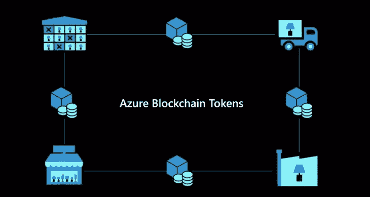

# 深入了解微软的堆栈，为企业区块链应用带来令牌化

> 原文：<https://medium.com/coinmonks/a-deeper-look-into-microsofts-stack-to-bring-tokenization-to-enterprise-blockchain-applications-166e2a56b1bf?source=collection_archive---------0----------------------->

符号化是区块链生态系统中最迷人的趋势之一。将物理或数字资产表示为区块链令牌的想法实现了可编程的所有权转移和责任动态，这是其他技术难以实现的。在其短暂的历史中，标记化已经…