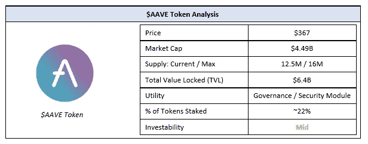
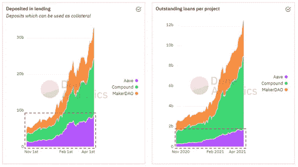
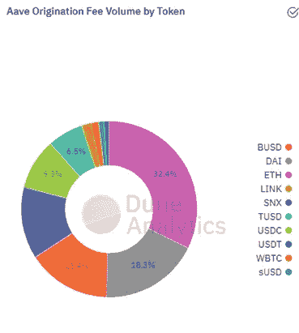
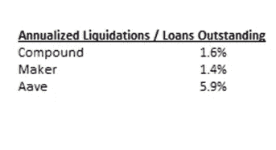
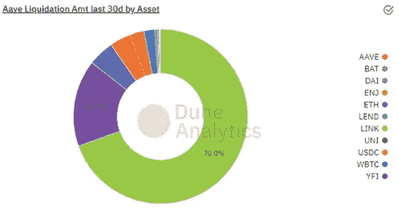
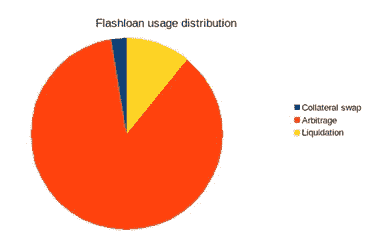
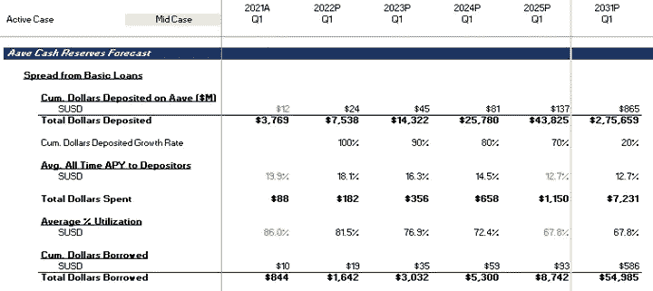

# 对$AAVE 平台和令牌的详细研究

> 原文：<https://medium.com/coinmonks/a-detailed-study-of-the-aave-platform-and-token-1310908b8a08?source=collection_archive---------1----------------------->

**总结**

在撰写本文时，Aave 是 DeFi 贷款领域的重量级公司，已经建立了 TVL 第三大的 DeFi 贷款平台。凭借强大的流动性比率、健康的抵押品利差和开创性的快速贷款产品，Aave 无疑在这一领域崭露头角。然而，由于最近抵押品清算水平相对较高，以及其快速贷款业务对套利用例的高敞口，Aave 在不久的将来面临一些根本性挑战。

至于$AAVE 代币，AAVE 已承诺使用国库储备购买和焚烧$AAVE 代币，这将减少供应，并可能推高价格。然而，对 Aave 的治理和安全令牌$AAVE 的有机需求似乎有限，赌注率约为 22%。根据我们对 Aave 的国库现金流预测的估计，我们估计$AAVE 代币的内在价值约为 484 美元，高端约为 856 美元，低端约为 135 美元。

也就是说，最近重新命名的$AAVE 仍然相对年轻，其采用率的增长可能会让我们感到惊讶。总的来说，随着故事的展开，我们将密切关注这个项目。

完整的模型可以在[这里](https://drive.google.com/file/d/1MYEuMt6yZzVW-TPUjA7Phw6pHtfC0tnB/view?usp=sharing)找到。

**DeFi 概述**

过去一年，贷款平台一直引领着 DeFi 的上升。通过这些平台，密码持有者既可以利用密码抵押贷款，也可以将密码存入银行以赚取利息。储户将他们的加密货币放入贷款池，并从他们的加密储蓄中获得有吸引力的被动回报。借款人可以用他们的密码借款，贷款被超额抵押以防止密码抵押品的价格波动。这也允许贷款是无限期的——借款人可以持有他们的贷款，只要他们的抵押品保持在一定数量以上。贷款人和借款人的利率通常是可变的，由存款金额的使用情况决定。该系统保护了所有相关方，消除了对长流程和第三方(如银行)的需求。通过为交易双方提供普遍具有吸引力的利率，难怪贷款协议风靡全球。

Comparison of Traditional and DeFi APRs

借贷 DeFi 空间目前锁定了 291 亿美元的总价值(约占 DeFi 中 590 亿美元 TVL 的 50%)。其中，Compound、Maker 和 Aave 是最大的参与者，占据了约 92%的贷款 DeFi 空间。

Source: DeFi Pulse

Aave 是首批 DeFi 贷款平台之一，最初于 2017 年以 EthLend 的名义推出，后来更名为 Aaave。除了传统的 DeFi 借贷产品，Aave 还提供其他平台没有的闪贷(详见下文)和稳定的借款利率。

【Aave 是如何工作的

Aave 有两个关键产品:1)传统借贷，2)闪贷。

1.传统借贷

和复合、创客等同行一样，Aave 的核心业务是借贷平台。Aave 目前支持超过 20 种加密货币(如 ETH、DAI、、等。)在其平台上。这个过程是这样进行的:例如，存款人将 ETH 存入银行，作为交换，他将收到一个 aETH 令牌。这个令牌就是计息，也就是说，当储户想提取存款时，他们可以返还储蓄存款，并获得他们原来的储蓄存款加上收取的利息。在贷款期间，ETH 将存放在一个资金池中，借款人可以提交任何其他货币的抵押品并借入 ETH。所有贷款都被超额抵押，这意味着抵押品的价值必须高于借入资产的接收价值；借款人可以在固定利率和可变利率之间进行选择。贷款也是无限期的，这意味着只要担保资产的价格保持在一定水平以上，借款人就可以持有所借资产。Aave 保留利差，并对所有原始贷款收取 0.00001%的费用。

2.快速贷款

快速贷款是无抵押贷款，借款和还款都发生在同一个街区。这是由 Aave 首创的产品，迄今为止，已经在 Aave 平台上完成了价值约 28 亿美元的快速贷款。闪贷目前有三种用例:1)套利，2)抵押品互换，3)清算。

套利用例的存在主要是因为借贷平台之间的利率不协调，从而为用户提供了一些从利差中获利的机会。快速贷款确保套利交易时假设利率被锁定。抵押品互换和清算用例主要存在于借款人抵押品的价格低于阈值水平时。这两种情况都允许借款人以高于官方清算价格的固定价格来弥补损失。Aave 目前对每笔闪贷交易收取 0.09%的固定费用。

**评估 Aave 平台**

利用率和活跃用户是我们首先考虑的基本因素之一。谈到每日活跃账户，Aave 目前仅落后于 Compound，Maker 和 Curve 紧随其后。

Source: Coin Metrics

鉴于 Aave 拥有合理的用户参与度，我们于是转向可能表明 Aave 贷款业务健康状况的财务指标。为了对此进行评估，我们考察了三个指标:1)未偿还贷款/存款总额；2)抵押资产的分布和相对强度；3)历史清偿率。

1.总的来说，Aave 在流动性管理方面表现更好。由于与 Maker 的存款利率相似，Aave 的未偿贷款较少。这是一个积极的迹象，在市场中，贷款期限可以是无限的，当利用率增加时接受高利率可以打破系统。

Source: Dune Analytics

2.基于发起费用的划分，Aave 平台上的大部分抵押品都是蓝筹股、相对稳定的资产，如戴、和 ETH。对于平台的稳定性来说，这也是一个积极的信号——如果抵押品倾向于更小、更不稳定的资产，短期的市场广度不足可能会引发大量的清算事件，这可能会破坏平台的稳定。

Source: Dune Analytics

3.对 Aave 来说，一个基本的黄色信号是，根据过去一个月的数据，其年化清算额超过了其他贷款平台。

Source: Debank, Dune Analytics

其中很大一部分归因于 LINK 的清算，该公司在 Aave 的抵押品池中仅占一小部分。如果这是一次性事件，可以关闭警告标志；然而，如果这种情况持续下去，可能会导致 Aave 平台的不稳定。

Source: Dune Analytics

最后，我们看了一下 Aave 最独特的产品之一:闪贷。也就是说，我们想了解他们目前的产量是否可持续。根据我们发现的数据，目前超过 80%的闪贷被用于套利。这是另一个黄色信号，因为随着信息不对称的减少，套利机会将开始在 DeFi 领域消失。如果到那时没有任何其他有意义的快速贷款用途，这可能会对 Aave 的这一特定收入流产生问题。

总体而言，Aave 是在一个快速增长的市场中运营的少数几家大型企业之一。除了清算方面的一些风险，从大多数指标来看，该平台的健康状况似乎是稳定的。对于大多数这些协议，重要的是要记住平台和令牌之间的交互根据协议的不同而不同。因此，从投资的角度来看，评估$AAVE 代币的代币组学以理解其真正价值是很重要的。

**记号组学**

总共有 1600 万美元的 AAVE 代币，其中约 1250 万目前处于供应状态，其余 300 万归创始团队所有。与 Compound 相比，这种程度的去中心化无疑是令人鼓舞的，在 Compound 中，大约 50%的令牌仍然由创始团队和投资者持有。

$AAVE 令牌有两个关键用例:1)治理和 2)保护协议。治理用例相对简单。持有硬币的人可以参与平台的运营决策。第二个用例如下。持有硬币的人可以参与安全模块，获得约 7%的收益率。作为交换，如果该协议出现流动性危机，他们持有的$AAVE 代币可能会被削减 30%。

这个系统相对较新，自安全模块宣布以来，Aave 还没有经历过流动性危机。这使得很难评估这类事件发生的可能性，因此也很难评估这一提议的吸引力。也就是说，这个用例肯定比 Compound 等平台的纯治理主张更有吸引力。

目前，只有大约 22%的 AAVE 代币持有者持有代币。相比之下，Curve DAO 等同行的这一比例约为 49%。这表明，对 AAVE 元的有机需求可能没有我们希望的那么强劲。

与大多数平台一样，Aave 有一个资金库，存放一部分借贷利差和闪贷费用。就 Aave 而言，这只基金目前的目的是在公开市场上购买更多代币，然后烧掉。这将通过部分抵消疲弱的有机需求，增加供应的通缩压力，以及潜在的价格上行压力。

在未来，与许多其他 DeFi 协议一样，基于治理投票，财政部现金流也可以作为股息分配给股东。为了估计$AAVE 代币的内在价值，我们计算了财政部预测现金流的现值，并除以发行中的代币数量。

**方法论**

1.从 Aaave 的 AaveWatch 仪表板中的当前存款、利用率、最近利率(借贷)和快速贷款数据开始

2.根据历史趋势，为未来存款的增长创建书立

3.假设利用率、借出 APY 和借出 APY 意味着随着时间的推移回归到历史最高水平，并随着供需平衡长期保持在这些水平

4.根据利用率计算借款

5.计算一段时间内借贷的利差——这是平台最大的现金流来源

6.根据历史数据，为快速贷款的增长创建书签

7.计算归属于 Aave 国库的借款和快速贷款的费用

**结果**

假设每年利差的全部价值都存放在美国财政部，并且存款和快速贷款的增长率在未来几年保持强劲，我们发现，根据现金流，AAVE 代币的估计内在价值约为 484 美元，高端为 856 美元，低端为 135 美元。

然而，最终，代币的价格取决于该代币的需求和供给。就美元 AAVE 而言，外汇储备正被用来消耗供应，这是价格走势的一个积极信号。然而，目前有 22%的人押注有机需求(投机者的需求除外)似乎并不强劲。这可能部分是因为投资者需要更好地理解在安全模块中押注代币的风险/回报；鉴于其短暂的历史，可能需要几个市场周期才能理解清算事件的可能性。此外，7%的收益率可能是一个相对微弱的拉动，因为其他几个协议，如渴望金融能够提供更高的收益率为基础的回报。

随着时间的推移，如果代币持有人和投资者开始看到 Aave 治理的价值和/或安全模块的收益，我们可能会看到更多的赌注，这将是有机需求的积极迹象。在此之前，纯粹基于价格行为投资$AAVE 可能是最好的，以便在借贷赤字空间获得短期敞口。

简单看一下我们模型的结果:

完整的模型可以在[这里](https://drive.google.com/file/d/1MYEuMt6yZzVW-TPUjA7Phw6pHtfC0tnB/view?usp=sharing)找到。

在推特上关注我们 [@ClearChainCap](https://twitter.com/ClearChainCap)