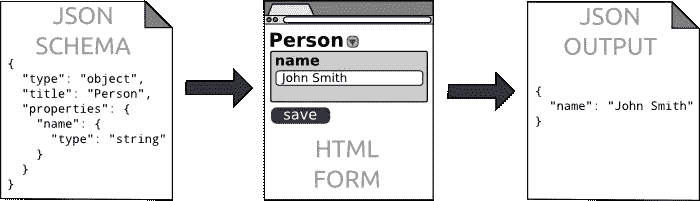
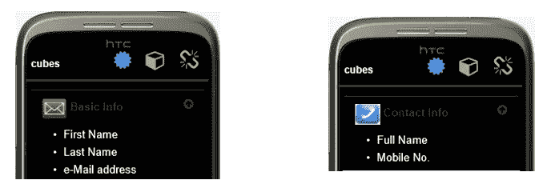

# Qubic 的开发者愿景

> 原文：<https://medium.com/coinmonks/a-developers-vision-of-qubic-ea0b54d61603?source=collection_archive---------3----------------------->

> 免责声明:下面的信息是我个人对 Q 的理解。写这篇文章是为了从开发人员的角度传达我对如何实现 Q 的想法。请随时与我讨论、改进和合作，以产生想法和开发解决方案。也请原谅我，因为英语是我的第二语言。

早在 2010 年，我就开始开发应用程序与世界分享。但是在那些时候，可用的工具和框架并不能满足我执行和完成我的想法的需求。

事实上，当时我不愿意接受开源框架。正如我一直认为的，从头开始做我所有的应用程序特性/功能是最好的方法。

但当我开始使用开源软件时，它让我的生活变得更轻松，并帮助我专注于只做应用程序的核心部分，并专注于解决问题，特别是流程。

随着我继续创建改变生活的应用程序(wow)的旅程，我发现了许多有用的框架和标准。我将在下面列出一些，因为这与我想传达的内容有关。

1.  [http://schema.org](http://schema.org)
2.  http://json-schema.org/
3.  【https://github.com/json-editor/json-editor 

从上面可以看出，这都是关于元数据的。第一个是用于指定具体对象模式和相关模式的标准，这些模式构成了完整树结构中的数据层次。

第二个是关于验证这些元数据，以便当有效负载或元数据被提交到服务器时，数据有效所需的所有验证都可以在客户端处理。这可以节省时间，并避免在后端存储不一致的数据。

第三个是我个人对显示这种元数据的偏好，这样给定一个对象，我将不必手动操作 UI，而是以整洁和流畅的方式在 UI 中自动呈现数据。(见下图)

JSON-EDITOR

# 现在所有这些和 Qubic 有什么关系？

我先说一个人的常见信息。

上面的图片使用了[**用户名，姓名]，[电子邮件，电子邮件地址]【T7]字段，这两个字段包含相似的信息，但**的别名**不同。**

用我自己的术语。我们将创建**比特** s，**立方体** s ( *量子比特*？)和**块**

让我们将这些原始信息分别称为**位**(即用户名位、电子邮件位等)

电子邮件地址+姓名经常用在**注册表单**中。

在…期间

*b)全名+手机号*可以让你成为一个**的联系方式表单**

**I) BI** TS 是关于对象或属性的单一信息，如年龄、性别等..

**II)立方体**是一组**位**，用于根据其使用环境创建一组信息。

例如，让我们将一些**位**组合在一起，称之为**立方体**

***Mail Info Cube*** and **Contact Info Cube** respectively.

> 以上是 ***邮件信息魔方*** (左图)和 **联系人信息魔方**(右图)

**让我们用 JSON (Javascript 对象表示法)格式对邮件和联系人立方体进行编码。**

**点击下方，通过 JSON-editor 查看作为表单输入的普通 JSON**

 [## JSON 编辑器 MailInfo 示例

json-editor.github.io](https://json-editor.github.io/json-editor/?schema=N4IgLglmA2CmIC4QFkCGFoEkB2AzA9iADTgCeADvEvgEYBWsAxmMSOQE76XuSwDOiULgjs+YbKgC2VUGApUQY9hGwBzVgBN+jZeUj5siEADERYgAQTprSSoAysNWAAWiACwktuVAFdoLJAA1CGZ8dhAAXxJoVDErGTJKIyUVdU9tXX1DJDtYsEspeBJbbAcnVwQPEC9ffyMAFQgpPgNIklhJdGhBRIUUtU0MiD0IVqQAUU6McwBBDQ12fgFi+0dVF3d07z8AkCnoAAFUVUcwcgAPADpGfElIiIigAA==&value=N4IgZglgTgzgLgOwIYFsCmIBcIBqEDGcA9lCADQgA2S8y6WIAKhKjEQuSGikhJQzz4ABJAHM0COAAcAHgDp8RFCAC+QAAA==&theme=bootstrap2&iconlib=fontawesome4&object_layout=normal&show_errors=interaction)  [## JSON 编辑器 ContactInfo 示例

json-editor.github.io](https://json-editor.github.io/json-editor/?schema=N4IgLglmA2CmIC4QGED2A7MBDAxmAkugGaogA04AngA7xKoBGAVrHuSNQE6q2eSwBnRKCIBXaNHRYAtnVBgadEALCcI6AObsAJoJxrqkDIhAAxcdAAEU2e2nqAMrE1gAFogAsFXUSziwJgBqEHionJYAKhAyAsYAvhTSjBBwAHKkCPKKJipqmjp6BkboJgCyyXCW6QB0do7OGm6e3rC+/iYAFADUAGwAzACUAJwATAAMALQAjCN9Ex4ArD0A7CBx60AAAA==&value=N4IgZgrgNlB2CGBbApiAXCAagSwMYBcB7AJwAIAVbJAZ0NhABoRFCAjbKZAOUPRAAoA1ADYAzAEoAnACYADAFoAjNNHyALAFZhAdhABfIAA=&theme=bootstrap3&iconlib=fontawesome4&object_layout=normal&show_errors=interaction) 

**一个样本 json 模式验证器**

A sample json-schema

# Qubics +智能合约+甲骨文

在没有 DLT(分散式分类账交易)的早期，我们保存这些数据的方法是从客户端将数据发送到服务器，然后在服务器端将其保存到数据库。

在这种集中的方式下，信任是很重要的。如果用户的所有信息都在你的服务器上，他们如何信任你的服务？这就是 DLT 或者可能是量子力学如何发挥作用的。第一条规则？数据不必存储在我们的服务器上！

怎么会？假设您的用户拥有一个银行账户，出于显而易见的原因，他需要将这些数据保存在银行中并确保其安全。但是您的服务需要银行信息，因此您可以继续验证用户是否确实有帐户余额。

我认为 Qubic 可以为我们做的是，通过使用某种元数据指令或对用户银行账户信息的引用，将请求传递给银行服务。

假设一家银行已经发布了一个名为 BankOracle 的智能联系人。这个 Oracle 包含一个 BankQubic，目的是在需要时扩展其中的数据。现在在你那边。你所需要的只是一个银行账户的参考。

**III 块**

所以如果你需要更多关于安全银行账户的信息。你的元数据或者有效载荷应该提交我称之为**的块**，包含上述的 BankQubic。

当您将 bankBlocks 传递给 BankOracle 时，它不理解它已经并期望收到由它们提供的 bankQubic。这样，数据就真正与外界隔绝了。如何获得银行券是另一个讨论的主题。但我知道你明白。

**挡块**由嵌有**动作**项的**立方体**组成。

如果我们扩展 bankQubic，它可能包含以下操作项。

再举一个例子，Qubic 和 Oracle 像级联事件一样协同工作，从不同的 Oracle 获取信息，见下文。

请注意，这只是一个伪代码，从某种意义上来说并不完美，但我做它只是为了了解我们在未来可以做些什么来跨服务器共享数据，并通过不同参与者的参与来建立仲裁。

# 量子和神谕在行动！

# 更多的演员…神谕，量子…

为了“信任发生”,可以添加 taxOracle、trackingOracle 和 inspectionOracle，它们必须了解并信任您，共同组成一个法定人数,使您的 qubic 有效。

我有很多适合 IOTA tech 的应用程序在排队等候。遗憾的是，经过多年的迭代，有些仍然处于开发阶段，因为我是自由职业者，断断续续地被雇佣。我在空闲时间一点一点地做一些启动的事情，可能上帝计划了这一切，所以我可以将 IOTA 集成到我的应用程序中。耶！

刚刚收到:来自埃里克的灵感。

还有一件事，我计划基于上面概述的想法发布一个开源回购协议。目前，它是一个托管在 GitHub 中的私人回购。

 [## agentpx

github.com](https://github.com/agentpx) 

但是名字应该是 WDX 和沃。干杯！！！

！提示[agent px](https://medium.com/u/978e0ea5bdbc?source=post_page-----ea0b54d61603--------------------------------)金额> :D