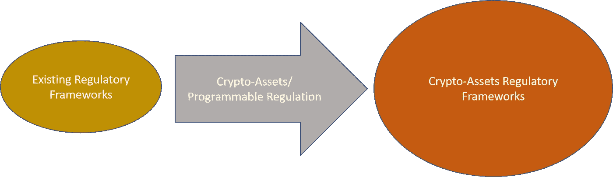
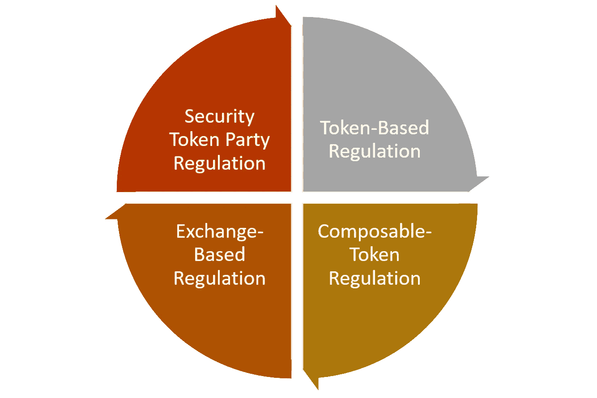

# 考虑安全令牌的另一种方式:可编程监管

> 原文：<https://medium.com/coinmonks/a-different-way-to-think-about-security-tokens-programmable-regulation-78f785fbd21a?source=collection_archive---------2----------------------->

安全令牌是加密资产领域最令人兴奋的发展之一，这迫使我们从技术、社会政治和经济角度重新思考生态系统的不同方面。最近，我遇到了一个场景，让我通过监管的视角来看待安全令牌，并产生了一些非正统的想法，我想我可以与你们分享。

如果你读了最近一波的博客帖子和文章(包括我的)😉)关于安全令牌的主要优势，您可能会听到流动性和部分所有权等元素经常被称为新加密范式的主要优势。俄勒冈大学的 Stephen McKeon 教授在他的著名文章“安全令牌论题”中列出了安全令牌的 8 个主要优点:

1)全天候市场

2)部分所有权

3)快速结算

4)直接成本的降低

5)增加流动性和市场深度

6)自动化合规

7)资产互操作性

8)扩大安全合同的设计空间

教授的 McKeon 列表中的第 7 点[自动合规]经常被忽略，而倾向于更性感的好处，如部分所有权和流动性。然而，在其当前的新生状态中，第 7 点可能是安全令牌对加密资产空间的最重要贡献。在我最近的工作中，我冒昧地用另一个让我们更接近实际应用的术语来重新命名第 7 点:可编程调节。在我们深入探讨可编程监管的理念之前，让我们揭开安全令牌优势背后的一些关键信念。

# 你喜欢的关于安全令牌的事情可能不是真的(仅仅是现在)

伴随着对安全令牌的兴奋而来的是许多不知情的观点，这些观点描绘了一幅扭曲的空间现实图景。如果我们希望安全令牌成功，我们需要建立正确的技术和经济严谨性，并忽略一些宣传。流动性和部分所有权是证券代币被夸大的好处中的两个，它们与该领域的现状并不完全相关。

为另类非流动性资产的投资者提供一个流动性渠道，可能会成为证券代币的最大好处，但这绝非无足轻重。首先，安全令牌空间的流动性充其量是有限的，我觉得许多平台都认为这是理所当然的。我喜欢[证券化平台](https://www.securitize.io/)的一点是，它们似乎是少数几个在流动性模型方面提出了深思熟虑和务实方法的平台之一。该领域的大多数证券代币发行(sto)认购不足，投资者群体的成长并非易事。此外，我们需要考虑公司的角度。作为一家私人公司，你真的希望有成千上万的投资者积极交易你的代币/股票吗？在最好的情况下，我可以告诉你，这种模式并不适用于所有公司，因为它打开了各种游戏化治理问题的大门，并可能分散对业务真正目标的注意力。

现在让我们来看看部分所有权。你认为有多少人会因为拥有塞尚 1%的股份而兴奋？部分所有权是一个非常有趣的概念，但在我看来，当涉及到房地产租赁等产生股息的资产时，它更为实际，在许多其他情况下，它可能变得不切实际。

如果流动性和部分所有权不是证券代币的绝对优势，那它是什么？让我们来看看可编程监管，或者如 McKeon 教授所说的自动合规。

# 作为调节放大器的安全令牌

下面是这篇文章的主要观点和一个非常简单的想法，它让我改变了对安全令牌的看法:

***“安全令牌将现有的监管框架放大到加密空间，并使其可编程。”***

希望这个想法听起来不是完全愚蠢的，你仍然在这里😉。让我解释一下。多年来，监管机构一直在努力调整合规模式，从不同类型的金融产品到加密资产。大多数这些尝试都是徒劳的，因为加密资产的行为不像传统的金融资产类别；它们是可编程的，在多个交易所同时交易，全球可用，它们严格来说既不像证券也不像商品，还有许多其他独特的特征。因此，大多数金融监管模型根本不适用于加密领域。我们需要一座桥梁，使现有的监管框架适应加密资产。安全令牌就是那座桥！

安全令牌是第一种受监管的加密资产，但它远不止于此。安全令牌将现有的监管框架扩展到加密领域。使用安全令牌作为工具，许多跨不同地理位置的监管模型可以适应加密世界。更重要的是，安全令牌打开了可编程监管模式的大门。

# 可编程调节

可编程监管的概念是对安全令牌空间著名的“代码即法律”以太坊口号的改编。可编程监管就是将监管、合规和治理规则构建为可以在不同区块链上运行的智能合约。我们已经看到了第一代安全令牌平台内置的基本形式的了解客户(KYC)和反洗钱(AML)规则。虽然普遍采用，KYC 和反洗钱是一些最基本的监管形式，肯定不足以主流采用安全令牌。然而，可编程监管允许我们使用安全令牌作为工具，将几乎任何监管模型编程为可由不同加密产品使用的可执行智能合约。

可编程调节是一个非常抽象的术语，它不能转化为单一的技术方法。通过初步分析，我们可以确定与当前一代安全令牌平台相关的不同类型的可编程监管:

**基于令牌的监管:**加密令牌是加密资产空间中任何金融交易的原子表示，因此是可监管的最小单位。将监管和合规规则嵌入加密令牌无疑是最有效的可编程监管形式。 [Harbor](https://harbor.com/) 率先推出了被其他安全令牌平台采用的 [R-Token 标准](https://harbor.com/rtokenwhitepaper.pdf)。

可组合令牌监管:我很难为这个概念找到一个更好的名字，☹，但我的想法是:随着像 Harbor R-Token 这样的概念变得更加主流，我们很可能会看到 R-Token 的变体，它们作为外壳令牌来执行特定类型的监管。例如，假设我们有一组代表曼哈顿商业房地产租赁的证券令牌，我们希望在欧盟托管的交易所进行交易，但这需要符合不同的监管模型。在这种情况下，我们可以想象一个房地产欧盟 R-Token，它聚合各个 R-Token 并执行欧盟法规。这是可编程调节的一个很好的例子。

**基于交易所的监管:**安全令牌中的许多监管规则无法在令牌级别表达，因为它们表达了更复杂的规则，如托管模式、流动性条款等。像 OpenFinance 这样的安全令牌交易所有机会创建代表这些监管结构的可编程模型。

**基于当事人的监管:**安全令牌平台涉及不同的当事人，如发行人、审计员、托管提供商、法律代表和许多其他人。这些当事人还受监管模型的约束，这些模型可以被编程为智能合同。例如，想象一个智能合同，它抽象了欧盟内任何涉及安全令牌尽职调查的律师事务所都需要遵守的监管规则。[证券化平台](https://www.securitize.io/)包含了合规服务的概念，这在某种程度上服务于该角色。

正如公用令牌和加密货币已经成为可编程货币的形式一样，安全令牌也有机会成为可编程监管的工具。在早期，可编程监管的思想可以被认为是安全令牌空间的最大贡献。