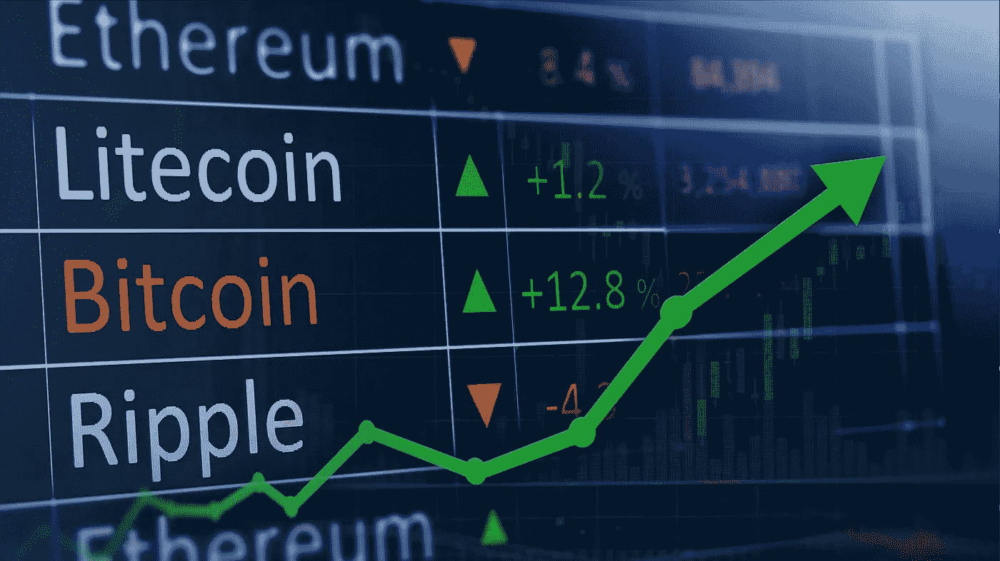
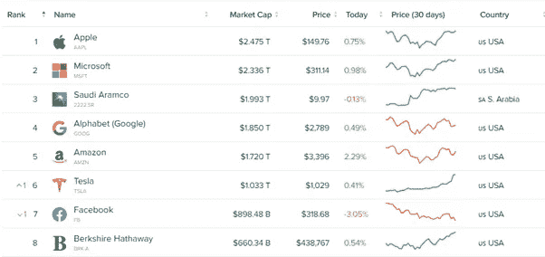
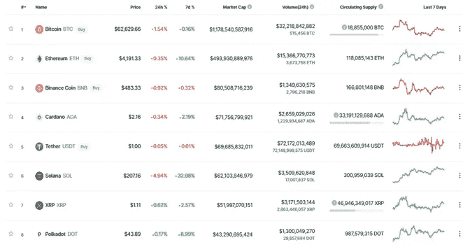

# 关于加密市值的一些话

> 原文：<https://medium.com/coinmonks/a-few-words-about-crypto-market-cap-8ab1d6587d76?source=collection_archive---------15----------------------->

## **简介**

几年前谁会想到加密货币的市值会超过 2.6 万亿美元，BTC 会成为历史上最赚钱的资产？

当然，在疫情和世界经济不稳定的情况下，通货紧缩资产的增长只是时间问题。

来自世界各地的大公司、机构和零售投资者、大型基金以及成千上万的家庭主妇对密码市场的兴趣和进入为市场资本的增长提供了巨大的机会。

## **交易与投资:股票还是加密货币市场？**

正如《金融时报》在其文章中指出的那样，2021 年上半年，美国股市的交易量下降了近 30%，许多人开始认真考虑加密货币，而不是将其视为一个“泡沫”，而是一个长期赚钱的重要机会。
目前，整个加密货币市场的市值约为 2.6 万亿美元，超过了苹果(2.4 万亿美元)、微软(2.3 万亿美元)、Saudi Aramco(1.9 万亿美元)、亚马逊(1.7 万亿美元)等市值最大公司的指标。)、Alphabet 谷歌(1.8 万亿美元)、特斯拉(1 万亿美元)、脸书(8980 亿美元)、伯克希尔哈撒韦(6600 亿美元)等等。

目前仅比特币的市值就接近 11 亿美元。以太坊约 5000 亿美元。这也使他们成为资产资本化最大的公司之一，也不能被“大玩家”和普通投机者忽视。

*Not everyone is satisfied with the possible tens of percent growth per year, against the potential of hundreds and thousands of percent in the crypto market.*

例如，迄今为止，苹果股票的年化回报率为 29.20%。

微软以 46.67%让大家开心。

相对于一年期收益率超过 400%的比特币和 1000%左右的以太坊。

## **即将离任的列车还是新的视角？**

当然，说使用技术分析可以成功预测加密货币的成本是不正确的，因为在这里我们会偶然发现 S-2-F 等模型，这些模型看起来很符合逻辑，并将在不久的将来带来非常大的收益。

与股票市场不同，这里有许多其他因素可以影响趋势的发展。人为因素和政治局势在某个时间点会极大地影响价格。但它们不能影响资产的实际价值。然而，要说加密货币是最年轻的，同时也是最赚钱的，潜力巨大的资产——这是毫无疑问的。即使是长期的熊市和停滞，利润总是超过任何预期。

现在是 2021 年下半年，看到新的机会以及持续的大规模采用，我们可以自信地说，加密货币正是每个热衷于金融的人都会感兴趣的。也许不是 2021 年或 2022 年，但这是一个时间问题和“错过的机会”。

> 加入 Coinmonks [电报频道](https://t.me/coincodecap)和 [Youtube 频道](https://www.youtube.com/c/coinmonks/videos)了解加密交易和投资

## 另外，阅读

*   [尤霍德勒 vs 科恩洛安 vs 霍德诺特](/coinmonks/youhodler-vs-coinloan-vs-hodlnaut-b1050acde55a) | [Cryptohopper vs 哈斯博特](https://blog.coincodecap.com/cryptohopper-vs-haasbot)
*   [AscendEx Staking](https://blog.coincodecap.com/ascendex-staking)|[Bot Ocean Review](https://blog.coincodecap.com/bot-ocean-review)|[最佳比特币钱包](https://blog.coincodecap.com/bitcoin-wallets-india)
*   [霍比审核](https://blog.coincodecap.com/huobi-review) | [OKEx 保证金交易](https://blog.coincodecap.com/okex-margin-trading) | [期货交易](https://blog.coincodecap.com/futures-trading)
*   [Godex.io 评审](/coinmonks/godex-io-review-7366086519fb) | [邀请评审](/coinmonks/invity-review-70f3030c0502) | [BitForex 评审](https://blog.coincodecap.com/bitforex-review)
*   [Crypto.com 费用](/coinmonks/binance-fees-8588ec17965) | [僵尸密码审查](/coinmonks/botcrypto-review-2021-build-your-own-trading-bot-coincodecap-6b8332d736c7) | [替代品](https://blog.coincodecap.com/crypto-com-alternatives)
*   [有哪些交易信号？](https://blog.coincodecap.com/trading-signal) | [Bitstamp vs 比特币基地](https://blog.coincodecap.com/bitstamp-coinbase) | [买索拉纳](https://blog.coincodecap.com/buy-solana)
*   [ProfitFarmers 回顾](https://blog.coincodecap.com/profitfarmers-review) | [如何使用 Cornix Trading Bot](https://blog.coincodecap.com/cornix-trading-bot)
*   [MXC 交易所评论](/coinmonks/mxc-exchange-review-3af0ec1cba8c) | [Pionex vs 币安](https://blog.coincodecap.com/pionex-vs-binance) | [Pionex 套利机器人](https://blog.coincodecap.com/pionex-arbitrage-bot)
*   [我的密码交易经验](/coinmonks/my-experience-with-crypto-copy-trading-d6feb2ce3ac5) | [比特币基地评论](/coinmonks/coinbase-review-6ef4e0f56064)
*   [CoinFLEX 评论](https://blog.coincodecap.com/coinflex-review) | [AEX 交易所评论](https://blog.coincodecap.com/aex-exchange-review) | [UPbit 评论](https://blog.coincodecap.com/upbit-review)
*   [AscendEx 保证金交易](https://blog.coincodecap.com/ascendex-margin-trading) | [Bitfinex 赌注](https://blog.coincodecap.com/bitfinex-staking) | [bitFlyer 点评](https://blog.coincodecap.com/bitflyer-review)
*   [麻雀交换评论](https://blog.coincodecap.com/sparrow-exchange-review) | [纳什交换评论](https://blog.coincodecap.com/nash-exchange-review)
*   [支持卡审核](https://blog.coincodecap.com/uphold-card-review) | [信任钱包 vs 元掩码](https://blog.coincodecap.com/trust-wallet-vs-metamask)
*   [Exness 评测](https://blog.coincodecap.com/exness-review)|[moon xbt Vs bit get Vs Bingbon](https://blog.coincodecap.com/bingbon-vs-bitget-vs-moonxbt)
*   [如何开始通过加密贷款赚取被动收入](https://blog.coincodecap.com/passive-income-crypto-lending)
*   [加密货币储蓄账户](/coinmonks/cryptocurrency-savings-accounts-be3bc0feffbf) | [加密交易机器人](https://blog.coincodecap.com/best-crypto-trading-bots)
*   [BigONE 交易所评论](/coinmonks/bigone-exchange-review-64705d85a1d4) | [CEX。IO 审查](https://blog.coincodecap.com/cex-io-review) | [Swapzone 审查](/coinmonks/swapzone-review-crypto-exchange-data-aggregator-e0ad78e55ed7)
*   [最佳比特币保证金交易](/coinmonks/bitcoin-margin-trading-exchange-bcbfcbf7b8e3) | [比特币保证金交易](https://blog.coincodecap.com/bityard-margin-trading)