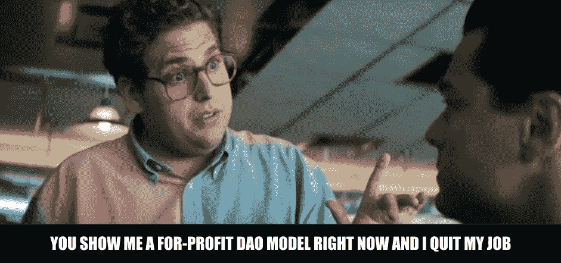

# 营利性道模式

> 原文：<https://medium.com/coinmonks/a-for-profit-dao-model-cb2f8cab1ed3?source=collection_archive---------4----------------------->

由于 DeFi 的可组合性，对于新的和新奇的想法和产品有一个近乎无限的设计空间。这些产品中有许多依赖于建立一个良好的流动性池来实现良好的用户体验，同时保持去中心化。这意味着流动性贡献需要公开，提供者将期待回报。这使得平台的建造者没有太多的机会来为自己的成功赚钱。虽然有些人可能是为了制造产品而制造产品，或者是为了获得资助而制造产品，但适当的激励措施应该会大大加快创新的步伐。

我在以前的几篇文章中提出了一些粗略的想法，我将在这里尝试将这些想法结合到一个部署 DAO 的盈利性产品的模型中。

 [## 液化度

### DeFi 目前最热门的是流动性。在代码开源的世界里，用户在技术上…

medium.com](/@jon.tomp/liqui-dao-ity-df838a33a9)  [## 纳税流动性池

### 像 uniswap、compound、pooltogether 和其他基于资产池的应用程序的激增…

medium.com](/coinmonks/taxed-liquidity-pools-7889de2236ea) 

**以下是我正在努力满足的要求**

1.  支付开发者前期工作的钱
2.  公开参与提供流动性并赚取收益
3.  对创始人来说有一些长期的好处

当使用术语 DAO 时，我认为 Moloch v2 代码在发布时应该足够了。我不知道推出这一产品需要什么样的法律要求，欢迎任何人在这方面分享反馈。我要讲的这个例子，我认为可能很常见。有一个产品创意，人们有兴趣推出该产品，但他们需要开发人员的帮助。

1.  编译利益相关者群，推出 DAO
2.  要求存款，并在所有人都认为合适的时候发行股票(也许那些“工作”的人会得到更多的股票，也许就这样了)
3.  确定产品范围并从开发商/开发商店获取报价
4.  道挑选开发人员并批准支付工作费用的提议。这可以通过财政部拨款、发行股票或两者结合来实现
5.  产品生产并上市。仅从"一体行动"开始向流动性池捐款。这保证了早期收益，但也是在应用/合同出现问题时的安全措施
6.  在预定的时间或事件(产品使用达到 X 目标或 Y 日期)时，流动性池贡献限制被取消(任何人都可以贡献)
7.  所有非 dao 捐款都征收小额税(1-2%)。这在上面的文章中有更详细的讨论。

道应该比那些后来贡献的人经历更好的回报。该税支付给早期的贡献者，但也是对短期流动性供应的一种威慑。立即存款和取款会净损失。理想情况下，延迟开放贡献访问将足以为产品建立一些良好的牵引力，并针对没有实施税收的分叉版本建立流动性护城河。DAO 的好处不像一次大的融资那么大，但希望它足以支付开发成本，并为那些冒着时间和资产风险来构建产品的人提供利润。

请在此处或 twitter 上的[留下反馈。](https://twitter.com/Tompkins_Jon)

> [在您的收件箱中直接获得最佳软件交易](https://coincodecap.com/?utm_source=coinmonks)

