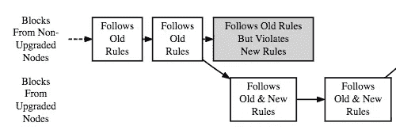
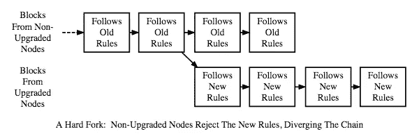
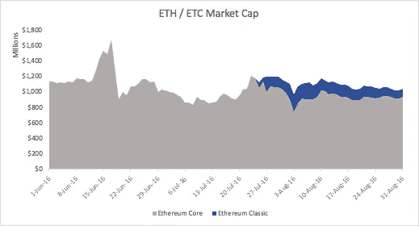
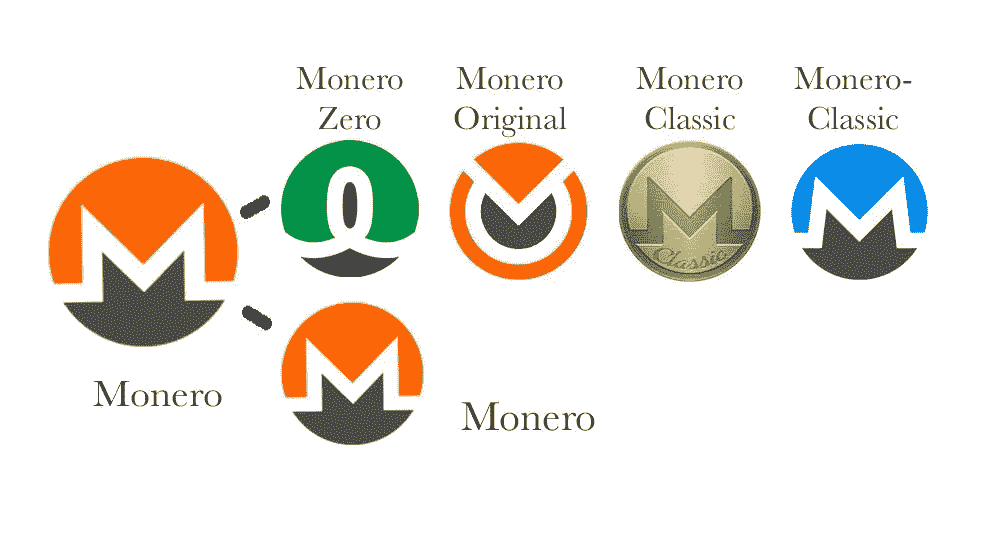
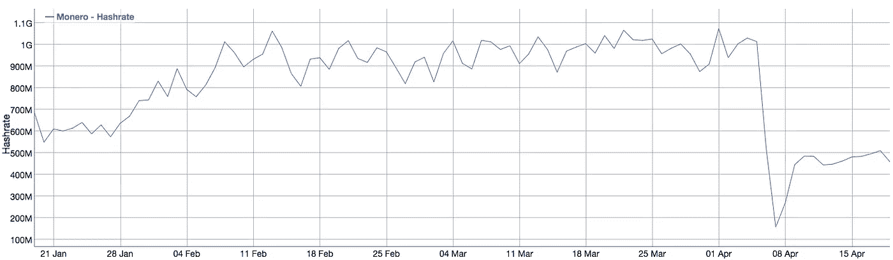

# 叉子太远了？

> 原文：<https://medium.com/coinmonks/a-fork-too-far-152528e8b9a2?source=collection_archive---------4----------------------->

对于美元和欧元等传统货币，央行单方面控制货币政策:扩张、收缩、利率等等。相比之下，诞生于金融危机期间的加密技术在设计上分散了对经济政策核心原则的控制。 ***对于最极端的政策分歧，有一种机制可以毫不夸张地将加密货币拆分成多个替代版本:“分叉”*** *。*

*虽然分叉长期以来一直是加密精神的组成部分，但比特币现金分叉让一些人认为分叉通常是市场添加剂。最近的分叉，包括隐私硬币 Monero 的五方分裂，可能暗示了其他情况。*

# “分叉”？

每个区块链都在一个选定的共识机制下运行，由社区决定哪些区块是有效的。每个块验证提示一个改变的机会，一个加密分支代表一种普通用户实现改变的**方式**、**和一种**、**分散实体随着快速发展的生态系统而转变的手段。**

从技术上来说，分叉表示区块链在特定的块号 N 处分叉，这是基于交易的组成部分或之前的交易历史。虽然分叉可以有不同的含义(下面会有更多的介绍)，但它*总是*意味着参与者必须决定支持哪条道路向前发展。从 N+1 区块开始，用户、投资者、开发商、矿工和任何运营 node 的人都必须决定他们将尊重哪个版本的区块链——真正掌握在人民手中。(除非,[缺乏参与者分散化](https://arewedecentralizedyet.com/),但我们将把这一点留到后面的文章中。)

区块链的变化往往是由核心开发者或对当前方向不满意的开发者引入的。通常，这些建议会以“改进建议”的形式出现(见 [BIPs](https://github.com/bitcoin/bips) 和 [EIPs](https://github.com/ethereum/EIPs) )。如果这些变化足够有意义或有争议，它们可以成为一个软或硬的分叉。

## 柔软的叉子

[https://bitcoin.org/en/developer-guide#consensus-rule-changes](https://bitcoin.org/en/developer-guide#consensus-rule-changes)

软分叉表示增量软件升级。它是向后兼容的，通常不太突然，使它成为小型演进的首选解决方案。许多改进建议变成了软叉，实质上是在现有区块链的基础上增加了新的规则。在此版本中，所有节点都会将新事务视为有效，但数据块只能由具有正确软件升级的矿工挖掘。因此，如果大多数矿工都使用升级版软件，这个链条将会增长得更快，成为主导链条。然后，未升级的矿工区块将作为“[孤儿](https://blockchain.info/orphaned-blocks)被拒绝，因为它们会不断追加到较短的链中。因此，未升级的事务返回到未确认的[内存池](https://themerkle.com/what-is-the-bitcoin-mempool/)。

这意味着**软分叉依赖于至少来自矿工的多数支持**。否则，升级基本上会被拒绝(升级后的事务成为较短的链)，并且需要硬分叉才能真正被认为是有效的。

## 硬叉子

[https://bitcoin.org/en/developer-guide#consensus-rule-changes](https://bitcoin.org/en/developer-guide#consensus-rule-changes)

硬分叉代表了不向后兼容的重大软件变更。通常，硬分叉背后的基本原理要么是**重新分配硬币**(例如，否定最近的黑客攻击)，要么是**改进扩展、安全性或效率的轴心**(例如，增加块大小、新的共识机制等)。任何这些变化都与旧的规则/交易链直接冲突。因此，节点必须更新它们的软件，以将新的分叉交易和余额视为有效。

当一些参与者忠于旧的链时，这可能会变得混乱，这是经常发生的情况。在这些场景中，**分叉的区块链越分化越好**，因为这些**分叉的版本将直接争夺矿权和开发者支持**。此外，交易所和钱包等其他参与者必须决定是否支持新令牌，即用户是否可以认领和/或交易这些硬币——这些决定对分叉硬币的成功也至关重要。

# 几个比较硬的“硬叉子”

近期密码史上最大的两个分叉是以太坊经典分叉和比特币现金分叉。最近，Monero 以一种更加史诗般的方式分裂，留下了 5 家连锁店。

## 以太坊>以太坊经典

最混乱的分叉之一是由 2016 年臭名昭著的 [DAO hack 引发的](https://www.coindesk.com/understanding-dao-hack-journalists/)，当时投资者因智能合约操纵损失了超过 7000 万美元的以太坊(按黑客攻击前的价格)。

以太坊核心(ETH)代表一个修改后的分类账，将被盗资金返还给原所有者，而以太坊经典(ETC)诞生于 [block 1920000](https://etherscan.io/block/1920000) 以纪念被黑的会计。ETC 的支持者认为以太坊的基金会是在向 DAO 的投资者提供救助，因此永久地违反了区块链不可改变的本质。

在分叉时，以太坊的价格已经受到 DAO hack 的影响，因此任何价格稳定都可能是附加的。事实上，分叉导致了集体以太坊市值在略高水平上的新平衡。

Data from www.coinmarketcap.com

## 比特币>比特币现金

比特币已经有了自己的分支讨论，在过去的一年里升级，并分裂了更广泛的社区。具体来说，随着比特币用户努力扩大网络规模，诸如块大小增加和数据存储修正( [Segwit](https://www.coindesk.com/information/what-is-segwit/) )等解决方案浮出水面。主要参与者开始[协商妥协](https://twitter.com/barrysilbert/status/870597494497038336?lang=en) (Segwit2x)，将于 2017 年底分叉，将块大小从 1MB 增加到 2MB，并减少每笔交易的数据量。

随着这些[纷乱的对话持续](https://hackernoon.com/the-great-bitcoin-scaling-debate-a-timeline-6108081dbada)，比特币的价格停滞不前，投资者谨慎地观望，等待决定。在比特币占据主导地位多年后，许多人想知道这是否会成为致命的断层线，导致“[翻转](https://forum.bitcoin.com/bitcoin-discussion/what-is-the-flippening-t30919.html)的窃窃私语。

一些成员，特别是矿池，认为 Segwit2x 太过增量，会在未来引发更多痛苦的分叉。这些支持者于 2017 年 8 月 1 日在[区块 478558](https://blockchain.info/block/0000000000000000011865af4122fe3b144e2cbeea86142e8ff2fb4107352d43) 分叉比特币现金，将区块大小增加到 8MB。

Data from [www.coinmarketcap.com](http://www.coinmarketcap.com)

正如你所注意到的，比特币现金的诞生标志着比特币市值及其集体市值大规模上涨的开始，**在分叉的两个月内总价值翻了一番，从 450 亿美元增加到 900 亿美元**！

## Monero > Monero 原创/零/经典/-经典

按市值计算，Monero 是排名前 15 的加密货币之一，长期以来因其对隐私的专注而备受尊崇。比特大陆在三月中旬宣布发布[针对 Monero 的专用集成电路](https://twitter.com/BITMAINtech/status/974180147166261248)，为 Monero 矿业设置了障碍，促使 Monero 更快做出了放弃的决定。我将把关于 ASIC 电阻的讨论留到另一篇文章 TL；is Monero 博士所在的社区担心这会让一些矿商主导验证并集中等式的这一边。他们[长期持有这种观点](https://getmonero.org/2018/02/11/PoW-change-and-key-reuse.html)，并迅速采取行动打击[ASIC 和采矿机器人](https://news.bitcoin.com/battle-algorithms-bitmain-sparked-asic-mining-war/)。

Monero 在仅仅几周后发布了紧急软件更新，硬分叉在 2018 年 4 月 6 日正式完成了 block 1，546，000。主要的变化是调整他们的共识机制(PoW ),并将 Monero 的最小规模从 5 个增加到 7 个，这意味着任何交易必须与至少 6 个其他交易混合才能获得批准。这些变化使得前面提到的专用集成电路变得无用，尽管它们带来了另一个代价。

在时间紧缩和即将到来的关于 ASIC 抵抗和必然性的哲学辩论之间，Monero 基础的派别分裂成不同的硬币——目前我们处于 [**5 Monero 链**](https://www.coinbureau.com/analysis/monero-hard-forks-successfully-four-new-projects/) : Monero，Monero Zero，Monero 原创，Monero 经典和 Monero-经典。也有迹象表明会有第六个——[mone roc](https://moneroc.org/)，尽管还不知道细节。

虽然 Monero 仍然是这五个中的领导者，但这些分叉表明了 Monero 社区中正在进行的争议。

> “Monero Classic 的主要信息是，我们认为开发人员更改工作证明会造成更多的集中化，并损害分散化。”— [便当谭](https://bitcoinmagazine.com/articles/monero-just-hard-forked-and-it-resulted-four-new-projects/) (Monero 经典款)

Monero Original 在 HitBTC 上找到了一些牵引力。虽然现在观察市值影响还为时过早，但许多人都在关注主链上的*杂凑率*，以此作为保留矿商支持的标志。哈希速率或哈希能力是指网络消耗的计算能力，它与解决工作证明的难度有关。随着越来越多的矿工加入，保持块验证以适当的速度进行的难度必须增加，因此散列率增加。相反，散列值的急剧下降表明矿工逃跑了，可能会使链更容易受到链攻击。这也意味着交易将需要更长的时间来结算，直到预先计划的难度下降到与新的散列率相匹配。

[https://bitinfocharts.com/comparison/monero-hashrate.html#3m](https://bitinfocharts.com/comparison/monero-hashrate.html#3m)

在最初下降了 90%之后，Monero 主链散列率似乎稳定在大约 40%的 fork 前散列能力。这可以解释为 60%的矿工支持分叉期权，这可能会极大地威胁到主链的稳定性。幸运的是，困难[调整得很快](https://monero.stackexchange.com/questions/7975/how-does-the-difficulty-adjustment-for-monero-work/7981#7981)所以积压的事务永远不会成为问题。

M onero 最近的分叉可能向社区发出关于分叉的心态转变的信号。具体来说，**快速且相当单边的分叉可能不可容忍，**这反过来意味着**硬分叉将总是更长的妥协。**鉴于这些资产基础的高风险，这似乎是合理的，但也改变了需要进行分叉讨论的挑战类型。[黑客们值得付出这样的紧张和时间吗？可扩展性？集中化风险？随着时间的推移，越来越少的人会被淘汰。](https://cryptoglobalist.com/2018/04/13/nano-nano-will-nano-fork-after-bitgrail-hack/)