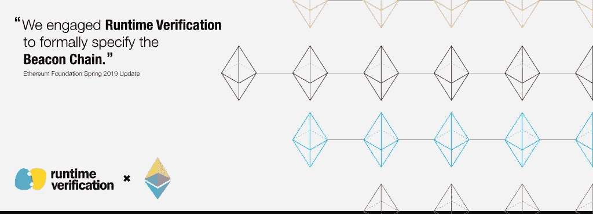
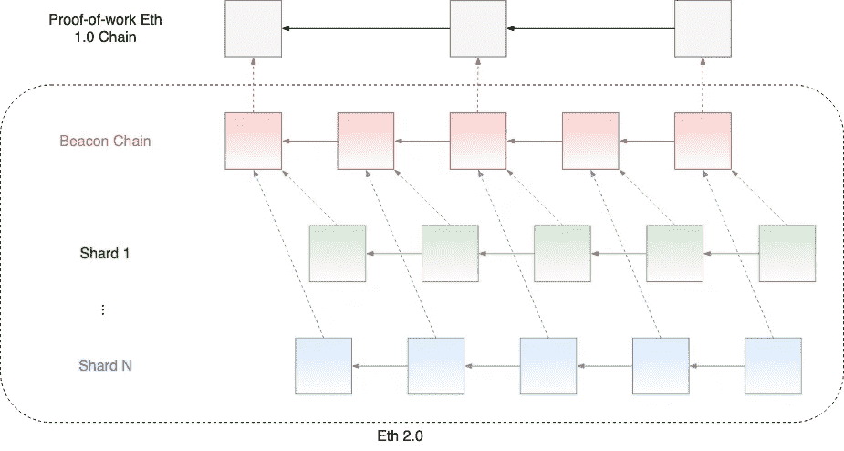
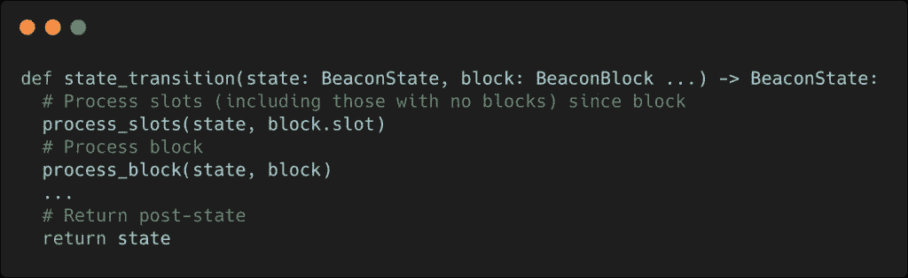
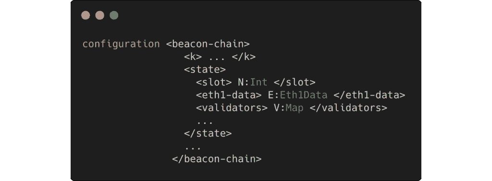
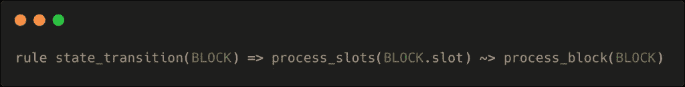
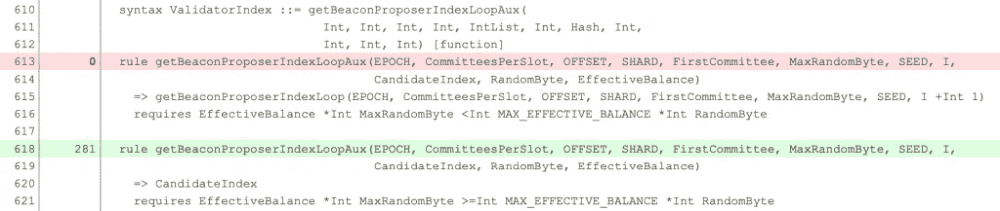

# 信标链 K 中的正式模型:以太坊 2.0 的主要利害关系证明区块链

> 原文：<https://medium.com/coinmonks/a-formal-model-in-k-of-the-beacon-chain-ethereum-2-0s-primary-proof-of-stake-blockchain-429883e316b9?source=collection_archive---------1----------------------->

## 作者:Musab A. Alturki，Denis Bogdanas，Chris Hathhorn 和 Daejun Park

随着即将到来的 2.0 版本(代号为 Serenity)的重大更新，[以太坊](https://docs.ethhub.io/ethereum-roadmap/ethereum-2.0/)正在过渡到一个分片的、利益相关(PoS)共识机制。它带来了更好的能效、安全性和可扩展性。以太坊 2.0 的特定 PoS 协议被称为信标链。

我们很高兴地报告[运行时验证](https://runtimeverification.com)和[以太坊基金会](https://www.ethereum.org)之间正在进行的合作中的第一个里程碑，以建立一个用于建模和验证信标链的正式框架。我们已经在 [K 框架](http://www.kframework.org)中完成了信标链的可执行形式化模型。K 规范[和描述这项工作的](https://github.com/runtimeverification/beacon-chain-spec)[技术报告](https://github.com/runtimeverification/beacon-chain-spec/blob/master/report/bck-report.pdf)都可以在网上找到。

那么信标链是什么？它在 K 中的模型是如何开发出来的？为什么这种发展很重要？

# 简而言之，信标链

信标链是即将推出的[以太坊 2.0](https://docs.ethhub.io/ethereum-roadmap/ethereum-2.0) 的 PoS 协议层。该协议主要负责在参与该协议的网络中的所有节点之间达成关于系统状态的共识。

在协议中被称为验证者的参与节点主要通过建议新的信标块或投票支持现有的信标块来对系统的分布式操作做出贡献，这取决于节点的当前状态。信标块主要封装了发布到网络的一组投票。该协议管理如何选择验证者来提议和投票给块，以确保每个验证者都有公平的机会做出贡献。

对信标块的投票被称为证明。证明是共识机制的基本组成部分。通过信标块的证明:

*   验证器证明块是有效的，并且它应该被附加到链上；
*   如果链已经分叉成多个分支(根据[分叉选择规则](https://github.com/ethereum/eth2.0-specs/blob/dev/specs/core/0_fork-choice.md))，验证器通过识别块应该被附加到哪里来为“规范的块链”投票；
*   验证器有助于决定块的终结性，这是一个告诉我们什么时候信标块可以被认为是最终的，因此不应该被还原的过程(根据[卡斯珀·FFG](http://arxiv.org/abs/1710.09437))；
*   如果块不属于主链，验证器会投票给块的碎片。直观地说，碎片是一个链接到信标链的独立链，可以通过系统中验证器的子集与状态中的其他碎片并行处理，显著提高系统一次处理更多事务的能力，从而提高其可伸缩性(参见[碎片和交叉链接](https://github.com/ethereum/wiki/wiki/Sharding-FAQ))。

最后，遵循协议并做出明智决定的验证者将获得乙醚奖励，作为红利分发，以鼓励正确的行为。另一方面，一个偏离协议或者行为不稳定的验证器可能会受到惩罚，比如拒绝给它分红，或者在某些严重的情况下，削减它的股份。这种奖惩系统有助于使恶意用户在经济上无法成功攻击系统(参见 [Serenity Design 基本原理注释](https://notes.ethereum.org/@vbuterin/rkhCgQteN?type=view))。

信标链目前由以太坊基金会开发的 Python [“以太坊 2.0 阶段 0 —信标链”](https://github.com/ethereum/eth2.0-specs/blob/dev/specs/core/0_beacon-chain.md)中的参考实现定义。

定义协议操作的实现的主要组件是信标链状态转换功能`[state_transition](https://github.com/ethereum/eth2.0-specs/blob/dev/specs/core/0_beacon-chain.md)`。该函数实现的相关部分摘录如下:

处理开始于起源状态(已经处理了起源信标块的状态)。给定要处理的下一个信标块，并假设该块是有效的，信标链状态转换功能将给定的信标链状态(前状态)转换成新的状态(后状态)。这种后状态反映了以下结果:

1.  说明(潜在的)丢失的块；(`process_slots`)；
2.  处理程序块的内容(`process_block`)。

关于转换功能和信标链操作的更详细的描述可以在[这里](https://notes.ethereum.org/@djrtwo/ByHlx-j6V?type=view)找到。

# 用 K 语言建模信标链

我们在这项工作中的目标是建立一个信标链的正式模型，该模型尽可能与[“以太坊 2.0 阶段 0 规范”](https://github.com/ethereum/eth2.0-specs)给出的参考实现相对应，以便实现以下任务:

*   模拟或动画显示信标链状态转换功能的执行；
*   从信标链测试套件运行现有测试；
*   分析现有测试套件的代码覆盖率，并用新的测试来改进它。

[K](http://www.kframework.org) 是实现这一目标的一个非常合适的框架，因为它支持信标链的正式模型的开发，其特征在于:

1.  可通过 K 工具中的模式重写来执行，以便从规范中直接获得信标链状态转移函数的解释器(无需额外成本)；
2.  具体，因为它的规范直接对应于系统的 Python 实现(对一些特定的抽象取模，比如签名验证)。

K 模型还为更精细的验证任务铺平了道路，如可达性分析和演绎验证，但这些是正在进行和未来工作的一部分，将在其他地方描述。

在项目的 Github 库中可以获得 K 版本模型的完整规范，以及一份更详细描述这项工作的[技术报告](https://github.com/runtimeverification/beacon-chain-spec/blob/master/report/bck-report.pdf)。

# 信标链在 K 中是如何建模的？

非常一般地，信标链在 K 中被建模为状态转换系统，其状态是信标链状态，并且其转换由主信标链状态转换函数定义。

在 K 中，信标链状态被指定为由(可能嵌套的)单元组成的配置，其中每个单元表示定义协议所需的配置的语义元素。例如，下面的摘录显示了`<beacon-chain/>`配置的两个单元:`<k/>`单元，它是一个保存要执行的程序(计算)的特殊单元，以及`<state/>`单元，它包含信标链状态的所有结构元素(下面只显示了三个，三个点表示省略的单元):

信标链状态转移函数由 K 中的算子指定，该算子将由当前信标链配置建模的信标链前状态转换成由结果 K 配置建模的信标链后状态。运算符声明如下:

如上所述，涉及到两个主要的连续步骤:`process_slots`和`process_block`。使用操作符`~>`，K 中命令的排序自然被指定为在延续之上堆叠计算。例如，使用以下 K 规则来定义状态转移函数:

只有当`process_slots`成功终止时，由`process_block`定义的下一个计算才会发生，它捕获预期的语义。

在开发转换函数的语义规范时，我们面临的一个挑战是 Python 语义丰富的表达式和命令式编程风格与 K 的语言定义结构和声明式规范风格之间的不匹配。在这个开发过程中，我们已经确定了一些模式，以及如何在 K 中优雅地指定它们，例如上面描述的用于排序的堆栈计算结构。其他模式更复杂，不匹配更明显，例如列表理解表达式，它在信标链的引用实现中被大量使用。在这些情况下，这种编码通常非常冗长，但是如果不在 k 中定义一个中间语言结构，这种编码是不可避免的。[技术报告](https://github.com/runtimeverification/beacon-chain-spec/blob/master/report/bck-report.pdf)详细介绍了这些模式以及它们是如何被指定的。

# 验证模型

以太坊基金会为信标链提供了丰富的[测试套件。除了作为 Python 实现的调试工具，测试套件还被第三方生产客户端开发人员用来确保与参考实现的一致性。测试套件由 3000 多个不同的单元测试组成。](https://github.com/ethereum/eth2.0-spec-tests)

给定开发 K 模型的抽象级别，信标链的标准测试套件中的测试可以直接在模型中执行，而不需要任何工具。这被证明是非常宝贵的，因为它提供了一种机制来验证模型，并确保模型与参考实现一致，就像验证其他生产实现一样。所有的测试都可以按照[项目的存储库](https://github.com/runtimeverification/beacon-chain-spec)中给出的指令自动运行。

# 扩展测试覆盖范围

标准信标链测试套件的设计目的是使用 Python 可用的代码覆盖率分析工具来最大化代码覆盖率。然而，Python 的覆盖范围通常是相当粗粒度的；它没有区分语义丰富的 Python 结构(比如列表理解表达式)的各个执行分支。

k 提供了一个不同的基于规则的覆盖率分析工具。它检测在执行中是否应用了规则(如果是，应用了多少次)。使用这种基于 K 的工具的语义覆盖已经被证明在其他语言的上下文中是有用的，比如 JavaScript，我们在所有浏览器中都发现了新的错误(这些结果在 [PLDI 的论文](http://dx.doi.org/10.1145/2737924.2737991)中有描述)。

因此，我们的计划是评估标准 Python 代码覆盖率确保语义覆盖率的情况，并查看基于规则的覆盖率分析是否可以揭示标准 Python 代码覆盖率工具未检测到的任何未覆盖的功能。事实上，分析揭示了测试没有覆盖或者没有充分覆盖的执行路径，而 Python 的覆盖率没有检测到这些路径。这些检测中的大部分是在复杂行为的规范中，就像在列表理解表达式和复杂循环中通常遇到的那些。

下面是由 K coverage 工具生成的覆盖率分析报告的快照，显示了一个没有在测试套件中的任何测试中应用的规则。

# 走向

信标链的可执行 K 模型是实现正式验证信标链及其参考实现的基本安全性和活性属性的最终目标的第一步，但也是关键的一步。事实上，如果没有一个可信的、正式的系统模型来验证，形式验证的问题是没有意义的。除了执行状态转换功能、运行测试和分析测试覆盖的能力之外，这里给出的 K 形式模型还可以用于陈述和验证在这个低抽象级别上可表达的低级别不变量。

然而，信标链是一个非常复杂的协议。在这个低抽象层次上直接验证安全性和活性这样的高级属性通常是不可行的。相反，通常采用抽象提炼技术。因此，我们的计划是遵循以下方法:

1.  构建这个具体模型的抽象，保留协议的核心共识机制；
2.  在抽象模型上证明期望的属性；
3.  表明这些属性在具体模型中得以保留。

我们期待着继续与以太坊基金会在这项工作上的合作。为此，我们非常荣幸地与以太坊基金会的以下专家合作:Danny Ryan、Carl Beekhuizen 和 Martin Lundfall。

*原载于 2019 年 10 月 22 日*[*【https://runtimeverification.com】*](https://runtimeverification.com/blog/a-formal-model-in-k-of-the-beacon-chain-ethereum-2-0s-primary-proof-of-stake-blockchain/)*。*

> [直接在您的收件箱中获得最佳软件交易](https://coincodecap.com/?utm_source=coinmonks)

