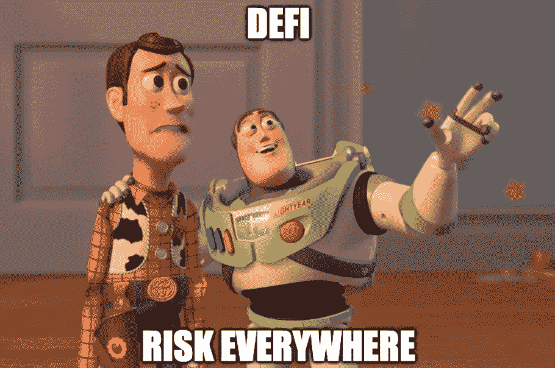
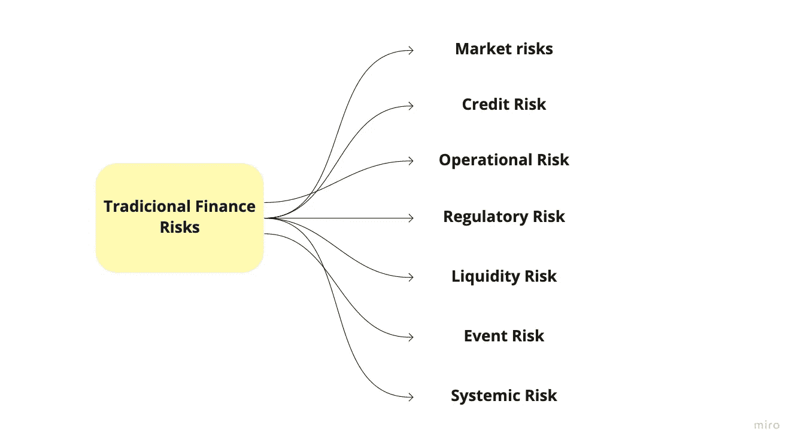
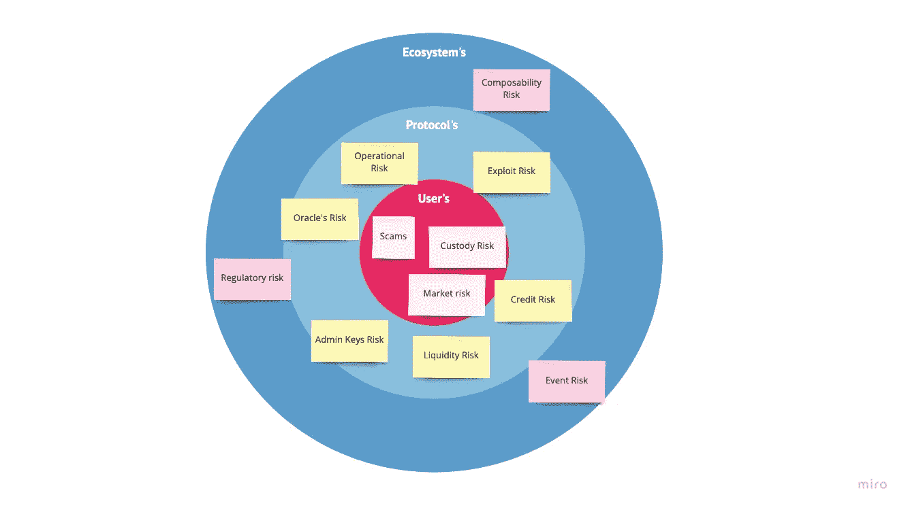
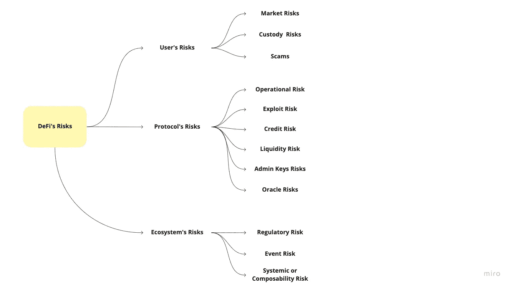
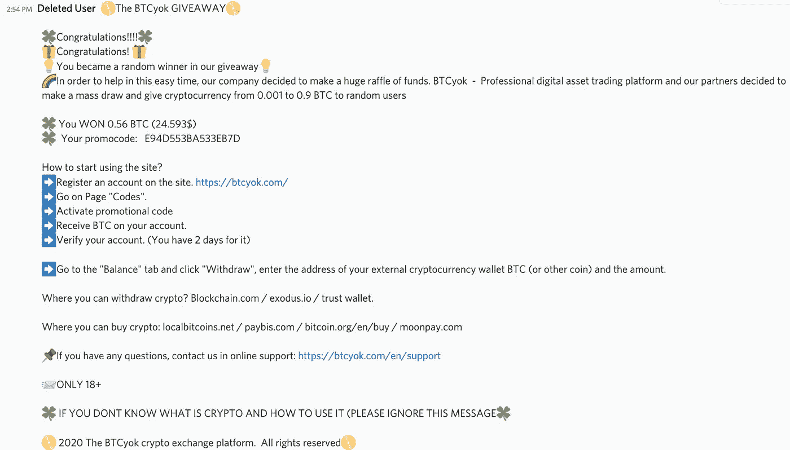
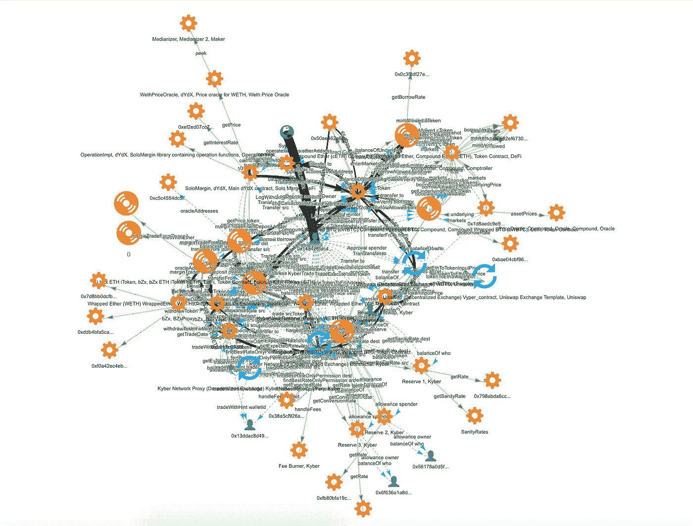

# DeFi 风险评估框架

> 原文：<https://medium.com/coinmonks/a-framework-for-assessing-defis-risk-5d63b7958019?source=collection_archive---------1----------------------->

Sad but true.

## 到处都有风险。从哪里开始？

> *免责声明:* DeFi 是一项高度实验性的技术，其风险不容小觑。使用 DeFi 协议时要注意这一点，永远不要分配你输不起的资金。

如果你是 DeFi 的新手，你可能想知道为什么或者人们如何在如此危险的条件下生存。

作为人类，我们经常害怕我们不知道的东西。跟冒险没什么两样。有些人甚至担心与 T2·迪菲一起交往，因为有“许多风险”

> 但是说真的，“很多风险”是什么意思呢？

事实上，存在不同类型的风险，每种风险都有一种类型和潜在的后果，以及减轻每种类型风险的具体方法。

本文旨在阐明 DeFi 空间中的“许多风险”,并提出一个在与 DeFi 协议交互时应对风险的框架。

# 传统市场中映射的风险类型

让我们先来看看传统金融通常如何映射不同类型的风险:

Traditional Markets Risk map.

迄今为止，传统市场绘制的风险图考虑了他们的前提**他们的世界如何运转**。因此，该领域的大多数 TradiFi 和 Fintechs 都有相同的风险框架。

> 然而，DeFi 建立在完全不同的基础设施上。

这意味着传统金融的风险框架可能不适合这种情况，因为**我们没有共同的前提。**DeFi 空间的几个前提是:

*   **系统的透明度**。公开所有合同和系统规则与传统金融有着根本的不同。
*   **保管**。做好用户资金的托管也是另一个至关重要的不同前提和操作方式。
*   **可组合性**。协议之间有着深刻的联系，甚至可能互相需要。
*   **黑暗森林。**交易处理的功能与传统市场完全不同。

因此，DeFi 应该有自己的风险框架。这并不意味着降低风险，而是让风险框架适应我们这个世界的运作方式。

# 定义中的风险

一个人如何接近他们中的每一个？个人可以做些什么来减少他们的风险暴露吗？

是的，有*就有*要。

而**如何应对**取决于每个用户的**风险偏好**。我所说的风险偏好是指每个人在应对资金损失的可能性时的舒适程度。毕竟不是每个人都是德根，这完全没问题。

下面，我添加了一张图片来说明我们正在绘制的风险，以及它们在什么级别会产生影响。

例如，整个生态系统固有的风险(生态系统的风险)会影响协议和用户。

Distribution of risks according to each instance in the DeFi space.

作为一个用户，不惜一切代价避免风险的绝对最佳方式是让 T2 完全置身事外。但是，如果你和我一样，愿意承担一些风险，有一些方法可以降低你的风险敞口。

第一步是了解它们的含义，它们的后果，了解你的风险偏好，以及你可以使用哪些东西或工具来减轻潜在的风险。

# 绘制 DeFi 的风险图

为了更好地组织 DeFi 中映射的风险，我将风险的类型分成子组。每个都与一个风险实例相关:

-风险**用户**可以减轻，

-协议可以减轻的风险**，**

-以及影响整个**生态系统的风险。**

DeFi’s Risk map.

下面解释了每种类型的风险实际上代表什么以及它们带来的潜在后果，接着是根据公开信息评估协议或特定情况的风险是多还是少的一般建议。

# 用户的风险

用户可以承受的风险，并依靠用户来减轻风险。

## 市场风险

与传统市场一样，DeFi 也存在基于资产或市场价格波动的负面投资结果风险。众所周知，加密是一种波动性很大的资产类别，其波动性远高于美国股市。

**可能性:**大部分时间存在于易变资产中。
**后果:**价格波动可能对用户的回报产生正面或负面的影响。
**减轻风险的方法:**降低市场风险的方法不止一种。最常见的是使用衍生品作为对冲解决方案，限制一个人的投资组合在波动性资产中的总比例，以减少整体风险，完全远离资产类别，并在不相关的资产中分散投资组合。

## 保管风险

大多数协议是非托管的，把托管的障碍留给用户去处理。对于不熟悉保管自己的私钥和评估插入您的私钥的呼叫是否真实的用户来说，这可能是一种风险。

DeFi 的一部分是用户保管他们的资金，并使用钱包与应用程序进行交互，大多数情况下使用 Metamask 或另一个浏览器钱包。这带来了资金丢失或被盗的风险。

**可能性:**如果用户在保管自己的资金，这种风险会一直存在(即使对于那些知道什么是最佳实践的人来说，风险仍然存在)。
**后果:**用户会损失资金。
**缓解方法:**建议用户在大额移动之前，先学会如何保管自己的资金。对此的共识方向是始终使用硬件钱包，并将种子短语存储在安全的地方(以防您丢失硬件钱包)。如果你用的是契约钱包，像 Argent 一样，设置监护人和每日限额。在 DeFi 协议中批准交易时，切勿使用无限批准。

## 骗局

谨防骗局！不幸的是，在 DeFi 中看到骗局是非常普遍的。这个推特账户一直做得很好，只要他们发现一个骗局就举报。

**可能性:**比你想象的要普遍。
**后果:**资金损失。
**缓解方法:**永远不要给不认识的人汇钱。在投资前研究项目，小心那些需要你私人密钥的应用程序。

Things scammers say.

I received so many of these that I should rich by now.

# 协议的风险

本节描述协议范围内的风险，并建议用户如何根据公开信息评估协议的风险。

与 DeFi 协议相互作用并降低每个操作的总体风险的另一种可能性是使用保险协议。每一种都有自己的模型，涵盖特定类型的风险。值得探索的是增加对超出用户能力的风险的覆盖。

## 操作风险

所有风险都是由人为或技术故障造成的。在 DeFi 上下文中，这转化为契约错误。

可能性:即使是最高级的工程师也是人，因此也会犯错误。所以有可能。
**后果:**这取决于 bug 和协议，但用户可能会在最坏的情况下损失资金和/或暂停交易活动。
**缓解方法:**在智能合约安全方面的多种努力可能会减少发现额外错误的机会。代码审计、合同上的广泛测试覆盖、正式验证、bug 奖励和谨慎启动是协议团队可以做的一些活动，以减少遇到 Bug 的机会。除了这些措施之外，一些协议具有由它们的 Dao 提供的额外资源，这可以减少不期望的后果。

随着用户了解新的协议，它可能有助于搜索有关团队如何处理安全问题的更多信息。

## 利用风险

在 DeFi 环境中，我们可以看到的另一个重要的范式变化是合同规则的透明度以及它们之间的联系。这开启了以多种形式利用该系统的可能性。这是迄今为止 DeFi 最不为人知的风险之一，因为很难预见一个漏洞，而且通常在一个漏洞中会涉及多个协议。

**可能性:**有可能，而且比我们任何人希望的都更有可能。
**后果:**这取决于协议，但最有可能的是，用户资金损失或价值锁定。
**减轻风险的方法:**此时很难预见这种类型的风险。生态系统仍在学习如何更好地应对这种风险。

Example of a highly sophisticated exploit evolving three different protocols. Source: [https://twitter.com/bneiluj/status/1228757175595438080](https://twitter.com/bneiluj/status/1228757175595438080)

## 信用风险或“交易对手”风险

DeFi 信贷风险主要集中在一起，代表特定协议的偿付能力。例如，贷款协议中的使用率可以被视为衡量偿付能力和交易对手风险的指标。

目前，大多数协议都过度抵押，并有健全的清算系统。这降低了破产的风险和可能性。然而，在重大崩溃事件中，清算系统可能会引发资产价格的螺旋式下跌，协议可能会破产。

**可能性:**取决于每个协议如何工作。对于依赖于清算系统的协议来说，这可能会导致严重的崩溃。
**后果:**超额抵押协议中的破产——借入头寸违约和贷方资金损失。
**减轻风险的方法:**作为这些协议的用户，减轻这种风险的一种方法是将风险分成不同的协议。

## 管理密钥风险

分散化是生态系统存在的主要原因。然而，大多数协议还不是分散的。这很自然，因为我们才刚刚开始，在完全去中心化之前还有许多改进要做。

DeFi 中的团队通常持有管理密钥，对合同有一定程度的权力。管理员钥匙拥有的能量取决于每个协议。管理密钥的存在带来了人为失败的风险(只是从管理员持有人那里窃取资金或管理员犯了错误)或恶意活动(盗窃意图)。

**可能性:**取决于协议，但在大多数情况下是可能的。
**后果:**资金损失。
**缓解方法:**正在学习协议的用户可能会发现关于管理密钥权限以及团队如何管理这些权限的密钥的公开信息。众所周知，拥有强大的管理权限并且只有一个管理密钥比拥有由不同签名者控制的管理密钥的较轻的管理权限更危险。

## Oracle 风险

一些协议可能在很大程度上依赖于 oracle feeds。例如，关于提要的任何问题或错误都可能触发清算事件。

**可能性:**取决于协议和价格反馈在系统中的重要性，但可能会发生。
**后果:**资金损失。
**缓解方法:**了解协议使用价格 oracle 的用户可以检查协议如何使用价格，以及不正确的价格会对协议产生什么影响。也许如果协议有第二价格来源来比较或估计，平均价格可以帮助降低一个来源的可靠性。

## 流动性风险

这种风险类型在 DeFi 领域不太相关，因为资产大多是加密的，并且是在链上的。一些可能比另一些更具流动性，但它们是可以获得的。

这种风险代表了在非流动资产清算情况下提出的问题。人们如何确定资产的价格？假设一家银行可以接受房地产作为抵押品。考虑一个用户将他们的房子作为抵押来获得贷款。如果用户被清算，协议如何“清算抵押品”，它如何确定资产的市场价格？

**可能性:**这可能发生在重大事故或允许非流动性抵押品类型的协议中。
**后果:**超额抵押协议中的破产——借入头寸违约和贷方资金损失。
**缓解方法:T** he DeFi 空间仍然大部分是加密原生的，与现实世界的资产联系很少。作为抵押品持有的大部分资产都是流动的，贷款协议的利用率通常解释了流动性差的资产在困境中的表现。

# 生态系统风险

到目前为止，我们已经讨论了在某人能力范围内的风险:或者是用户或者是协议。然而，生态系统风险不一定是任何人都能单独应对的，而是要么全部应对，要么一个都不应对。

尽管如此，生态系统风险仍然具有很强的冲击力，会影响到该领域的每个人。

## 监管风险

将未来政策决策中的不确定性转化为可能影响相关资产或基金的不确定性。目前还不清楚在处理分散技术时，这种风险类型的影响有多大。然而，大多数协议还没有完全下放，可能受特定管辖规则的约束。

**可能性:**不确定。
**后果:**不确定。但是最大的恐惧是当前 DeFi 协议的动态变化。
**缓解方法:**作为一个社区参与进来，创建最佳实践来提高整个空间的安全性。随着全球监管机构发布新法规，可能会避免这方面的意外，但不一定会降低与其后果相关的风险。

## 事件风险

火灾、飓风和其他事件会对资产造成巨大影响。与 DeFi 空间的这种风险类似的似乎是**黑色星期四事件**。

**可能性:**可能。
**后果:**资金损失。
**缓解方法:**使用抗崩溃事件的解决方案或与空间中的其他协议“隔离”的解决方案。将自己的投资组合分散到其他资产类别，对冲有风险的资产是减轻这种风险的另一种方式。

## 系统性或可组合性风险

DeFi 最显著的特点之一是可组合性，这也给空间带来了额外的风险。顾名思义，系统性风险反映了一种情况的影响及其对其他市场领域的影响。在 DeFi 中，大多数协议都有某种关联。虽然与传统市场相比，这可能会制造出更多创新产品，但这是有短期成本的。这使得整个生态系统更加危险。我相信随着时间的推移，随着我们找到更多的方法来强调测试协议，这种风险将会降低。

**可能性:**可能。
**后果:**不确定。
**缓解方法:**建议现在输入 DeFi 并担心系统性风险的用户将其 DeFi 暴露降低至可承受的程度，并在“独立的”协议或相互之间具有不同依赖性的协议之间进行多样化。

## 结论

风险是我们生活的一部分，无处不在。有可能采取行动来减轻它们，但它们不会消失。

意识到它们和你的风险偏好。不要在 DeFi 协议上投资超过你愿意失去的东西。

> DeFi 的风险不可低估。

好的一面是，DeFi 社区处于独特的位置，可以在每次发现后学习变得更强，并且以令人难以置信的速度这样做。

# 资源

DeFi 中的风险研究仍处于萌芽阶段，但发展迅速。下面我链接了一些关于风险的有趣研究的链接和资源，供感兴趣的用户进一步研究。

*   [**分散金融中的风险评估:货币市场手册。** (TokenBrice)](https://tokenbrice.xyz/money-markets-risk/)
*   
*   **[**零到 DeFi**](https://defipulse.com/blog/zero-to-defi-cdai/)**(DeFi pulse)****
*   ****[**理解 DeFi:驾驭开放金融的风险**](/monolith/understanding-defi-navigating-the-risks-of-open-finance-60983d62023e) (Monolith)****
*   ****分散金融中的风险:DeFi 繁荣是另一个泡沫吗？ (SFOX)****

****如果你知道应该在这里的报告，请让我知道，我会包括它。****

# ****走向****

*   ****你还有哪些与风险相关的问题？****
*   ****或者你找到了什么解决方案来降低某些风险？****
*   ****作为一个社区，我们如何在风险管理方面做得更好？这可能吗？****

****期待听到您的想法、问题和想法！****

****感谢您的阅读！****

****罗布森·希尔瓦、古伊列梅·维亚纳、加布里埃尔·阿波斯托、古斯塔沃·库尼亚、古伊列梅·扎穆尔、克里斯·布雷克、斯塔尼·库列乔夫、阿德里安·冯、卡伊奥·维森蒂诺和艾利·明昂对本研究进行了(大量)审查和改进。****

*****随时欢迎反馈！🙏🏻*****