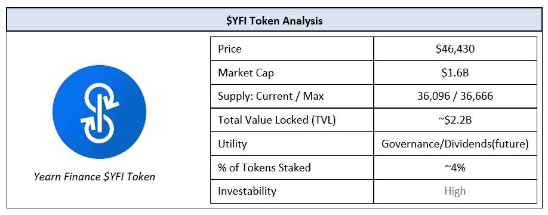
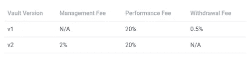
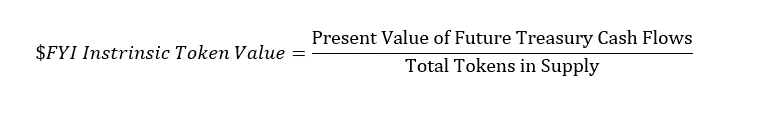
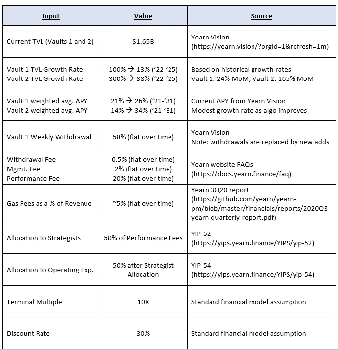
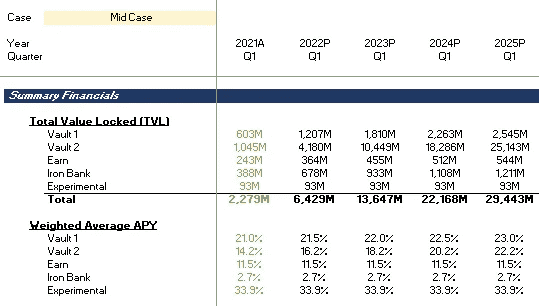
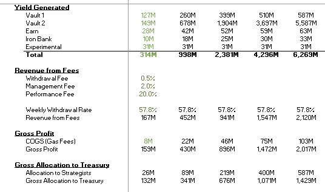
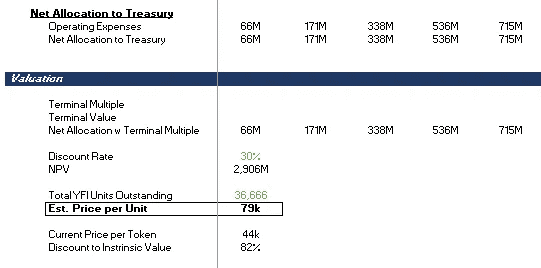
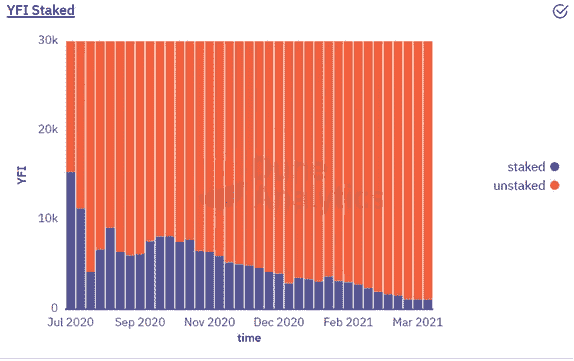

# 对渴望金融公司的$YFI 代币进行根本性的深入研究

> 原文：<https://medium.com/coinmonks/a-fundamental-deep-dive-into-yearn-finance-and-the-yfi-token-3127c4ffb9c4?source=collection_archive---------5----------------------->

## **总结**

向往金融是一个自动化的收益率聚合平台，在 2020 年 7 月推出后不到一年的时间里就成为了 DeFi 的重量级人物。通过最大限度地减少汽油费用和最大限度地提高产量，earning 使跨 DeFi 平台(如 Compound、Curve 和 Aave)的产量汇总过程变得更加简单。作为交换，渴望向其用户收取管理费和绩效费。在支付成本后，剩余的收益将存入该公司的金库。财政部基金目前被授权在公开市场上回购 YFI 美元，并将其重新分配给社区，以激励进一步的参与。过去，这些收益也曾用于向 YFI 代币持有者支付股息。目前，$YFI 令牌是基本的治理令牌，但是，一旦平台更加成熟，令牌有望在未来恢复分红。基于未来美国国债现金流的估计现值，我们预计 1 美元 YFI 币的价值至少是现在的两倍。

完整的模型可以在[这里](https://drive.google.com/file/d/1ngCBU-fqeSRudDQjKjk9Mjg9fuaTHPqh/view?usp=sharing)找到。

## **概述**

渴望金融是一个基于以太坊的收益率聚合平台，帮助用户通过各种 DeFi 协议借贷其加密货币来实现收益率最大化。它通过在 Compound、Curve 和 Aave 等平台上的各种收益率生成池之间转移其管理下的资产来实现这一点。向往的卖点是双重的:1)自动化产量最大化和天然气价格降低；2)易于使用。作为对这项服务的回报，渴望银行向储户收取绩效费，以及取款费或管理费，具体取决于所涉及的产品。

尽管还不到一年，但向往的成功率已经令人印象深刻。其产品目前的平均回报率在 25%至 35%之间，鉴于这些贷款协议的风险相对较低，这是很有吸引力的。

## **渴望金融如何运作？**

在向往的平台上，用户可以将闲置的加密货币存入各种由算法管理的投资工具，以赚取收益。目前有四类投资工具，其中有几个池:1)金库，2)收入，3)铁银行和 4)实验。除此之外，earning 还提供了一款名为 Zap 的产品，用户可以从单个接入点访问各种借贷平台，如 Compound、Curve 和 Aave。在这些产品中，渴望金库是目前唯一的渴望货币化的产品，这将是我们分析的重点。

有两种类型的渴望金库:金库 1 和金库 2。两者的主要区别在于收费。最近推出的 Vault 2 收取管理费而不是提取费，以便将渴望的激励与资本进入系统和退出系统联系起来。

Yearn Finance Vault Fees

这些金库里有各种各样的资产池，代表了一系列收益最大化的策略。其中大部分是由渴望的创始团队创建的，然而，社区成员可以提出他们自己的策略来添加到平台中。一旦天然气费用付清，剩余收入的 50%将分配给战略家，激励更多的社区参与。在剩余的收益中，50%用于团队工资和安全审计等运营支出，而剩余部分则进入国库。

这就是“渴望”的本土代币$YFI 的用武之地。代币持有者可以持有代币，对治理决策进行投票，直到最近，还可以获得一部分财政部收益作为股息。虽然最近在 YIP-56 中股息分配被推翻，资金被重新定向用于在公开市场上回购$YFI 代币，但一旦该平台更加成熟，该系统可能会回归股息分配机制。这意味着国库价值类似于我们为传统公司计算的企业价值，这使我们能够估计每一个$YFI 代币的内在价值。使这种方法看似合理的另一个因素是，所有~36k 令牌目前都有供应，并且都由社区成员拥有；与其他协议不同，没有为创始人和风险投资者预留令牌。

## **评估$YFI 代币**

为了评估$YFI 代币，我们想要得到的基本函数是财政部可能产生的所有未来现金流的现值除以代币的总数。该公式看起来像这样:

## **方法论**

为了估计未来国库现金流的现值，我们需要遵循 6 个简单的步骤:

1.提取金库 1 和金库 2 中的当前 TVL，并根据运行率增长进行预测

2.基于加权平均值计算年产量。当前池中的 APY

3.估计收费收入:

*a .基于最近提款率的金库 1 提款费*

*b .基于 TVL 的金库 2 管理费*

*c .基于年收益率的金库 1 和金库 2 绩效费*

4.去除汽油费以计算国库总收入

5.不包括分配给策略师的费用和运营费用，以估算国库净收益

6.基于 10 年预测+最终倍数和贴现率计算现值

## **关键假设**

## **结果**

基于这些参数，**YFI 币的估计价值约为 79k 美元(比当前每枚币 46k 美元的价格高出 71%)。值得注意的是，我们目前假设的 TVL 增长率相对较低，尤其是考虑到“渴望”仍处于起步阶段。Vault 2 的年增长率为 300%,仅上个月就增长了 165%,如果不算保守的话，这算不了什么。**

如果我们假设增长率更高，代币的价值可能高达每枚 30 万美元。DeFi 目前的累计 TVL 为 510 亿美元，可以合理地假设，一个新生的协议，如 indear(目前在 TVL 所有产品中约为 22 亿美元)最终会在这个不断增长的蛋糕中获得更大的份额。

下面是我们工作的总结。整个模型可在[这里](https://drive.google.com/file/d/1ngCBU-fqeSRudDQjKjk9Mjg9fuaTHPqh/view?usp=sharing)买到。

## **其他注意事项**

唯一的黄色信号是用于治理的代币(自 YIP-56 以来,＄YFI 代币的当前使用情况)的百分比随着时间的推移而减少。

从需求角度来看，这多少有些令人担忧，但事实上，财政部资金现在正被用于回购$YFI 代币。这确保了有意义的需求水平，因为美国国债储备规模庞大，而且还在增长。回购的代币将随着时间的推移重新分配给社区，社区成员可以选择将这些代币作为赌注。在未来，一旦稳定下来，我们可以期待回到原来的分裂系统，这将有助于$YFI 代币实现其股权式财产的全部潜力。

## **结论**

在不到一年的时间里，向往发展了强大的商业模式，成为 DeFi 领域的重量级人物。向往的内在价值在于其国库——这些储备目前正被用于在公开市场上回购$YFI 代币(对需求有利)，也可能被用于向$YFI 代币持有者支付股息，就像过去的情况一样。根据目前的运行率，并假设$YFI 代币持有人将在未来再次因“渴望”的成功而获得经济回报，我们估计“渴望”代币的价值可能至少是现在的两倍。

在 Twitter 上关注我们 [@ClearChainCap](https://twitter.com/ClearChainCap)