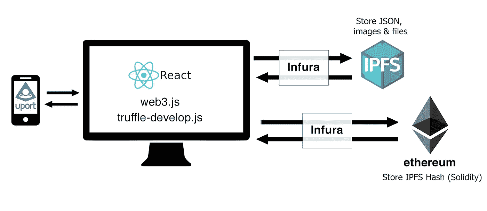
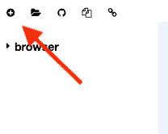
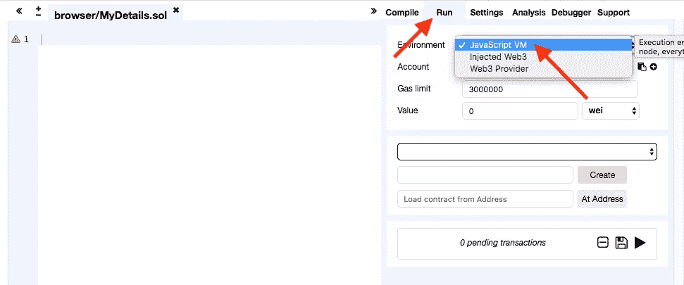
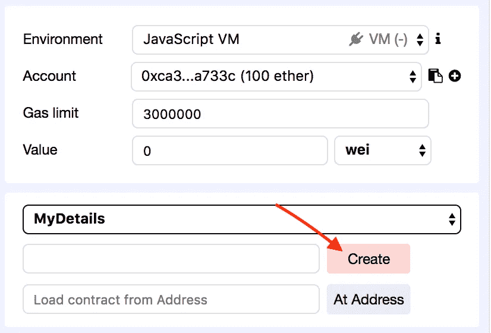
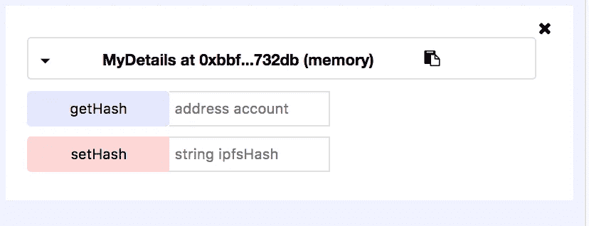

# 以太坊上构建全栈 DApp 的温和介绍—第 1 部分

> 原文：<https://medium.com/coinmonks/a-gentle-intro-to-building-a-full-stack-dapp-on-ethereum-part-1-c1aedb11fcd2?source=collection_archive---------0----------------------->


在本教程中，我们将构建一个简单的 dapp(分散式应用程序)。目标是介绍技术堆栈的所有部分，并展示它们是如何协同工作的。我们不会深入到任何单一的技术，而是覆盖刚刚够开始作为你自己的项目的基础。这个 dapp 将简单地存储和检索以太坊和 IPFS 上的用户输入文本，并使用 uPort 进行登录。

本教程分为两个部分:
**第一部分—** 编写智能契约，用于编译和迁移的 Solidity，Truffle 和一个用于我们前端的服务。
[**第二部分**](/@mwallaceboulder/a-gentle-intro-to-building-a-full-stack-dapp-on-ethereum-part-3-c48e99b4d3e8) —使用 React、uPort 和 IPFS 与智能合约集成。

我们将使用以下技术栈:
[React](https://reactjs.org/)-前端库
[Solidity](https://solidity.readthedocs.io/en/develop/)-用于构建运行在以太坊
[Truffle](http://truffleframework.com/)上的智能合约的语言-用于编译、迁移和测试智能合约的框架。
[IPFS](https://ipfs.io/)-分散存储
[支持](https://www.uport.me/) -身份管理、数字签名交易和轻松登录 dapps。

> [发现并回顾最佳区块链 api 和节点产品](https://coincodecap.com/category/blockchain-node-and-api)

React 的知识不是必需的，但最好有。我们将构建一个可以在任何前端框架中轻松使用的服务。



The dapp architecture

要跟进，在这里下载 dapp 回购:[https://github.com/zerostatic/dapp-starter-kit](https://github.com/zerostatic/dapp-starter-kit)

下载后，安装依赖项:

```
yarn install
```

要运行该应用程序:

```
yarn start
```

# 第一部分:

在第一部分中，我们将使用 Remix 在 Solidity 中编写一个智能契约。我们将使用 Truffle 进行编译和迁移，并创建一个前端服务，我们可以用它来与合同进行交互。


[坚固性](https://solidity.readthedocs.io/en/v0.4.20/)是用于编写运行在以太网网络上的智能合同的语言。我们的坚实智能合同将是非常基本的，只包含两个功能。一个保存 IPFS 散列和时间戳的函数，存储在用户地址下。另一个函数将返回特定用户地址的 IPFS 散列和时间戳。更多关于 [IPFS](https://ipfs.io/) 以后。

## 混音:

我们将使用在线工具 [Remix](https://remix.ethereum.org) 编写 Solidity 代码。Remix 是一个在线 IDE，它使得编写和调试 Solidity 变得非常容易。您可以在这里找到 Remix IDE:[https://remix.ethereum.org](https://remix.ethereum.org)

在 Remix 中，通过选择左上角的“加号”图标创建一个新文件。然后将文件命名为:MyDetails.sol。



Select for new file

接下来，在屏幕右侧，选择“运行”。然后在“环境”旁边选择“JavaScript 虚拟机”。这将允许您在浏览器中测试和运行智能合同。



首先，在代码中，我们需要告诉编译器使用哪个版本的 Solidity。将此添加到文件顶部:

```
pragma solidity ^0.4.18;
```

要创建合同类，请添加以下内容:

```
MyDetails {}
```

在类中，我们将添加两个映射。一个用于存储 IPF 散列，一个用于存储时间戳。在类定义中，添加以下两行:

```
mapping (address => string) ipfsHashes;
mapping (address => uint) timestamp;
```

什么是映射？映射可以被认为是哈希表。要定义映射，首先将类型设置为`mapping`。接下来，我们设置键和值类型。在我们的第一个映射中，键是一个**地址**，类型是一个**字符串:** `(address => string)` 换句话说:映射中的每个条目将在一个唯一的地址下存储一个字符串。最后，我们为映射设置了一个变量名:`ipfsHashes`

在第二个映射中，我们将把时间戳作为 uint(无符号整数)存储在用户地址下。

接下来是设置数据的功能:

```
function setHash(string ipfsHash) public {
     ipfsHashes[msg.sender] = ipfsHash;
     timestamp[msg.sender] = now;
}
```

该函数接收 ipfs 哈希字符串作为参数。然后，我们使用映射将 ipfs 哈希存储在用户地址下。此处显示:

```
ipfsHashes[msg.sender] = ipfsHash;
```

在 Solidity 中，`msg.sender`会自动设置为发送方的地址，因此我们可以将它用作映射的密钥，并将 ipfs 哈希存储为值。

函数中的第二行是:

```
timestamp[msg.sender] = now;
```

这里我们还使用用户地址作为密钥并设置值`now`，这将保存时间戳。

接下来是检索数据的函数:

```
function getHash(address account) public view returns(string, uint) {
     return (ipfsHashes[account], timestamp[account]);
}
```

该函数接受一个地址作为参数，并返回存储在该用户地址下的 ipfs 哈希和时间戳。

在 solidity 中，我们需要设置几个可见性关键字:`public`表示它可以从契约外部调用，`view`表示这个函数是只读的。

可靠性还要求您在这里定义返回类型，我们指定:`returns(string, uint)`，这意味着我们返回一个字符串和一个 uint(一个 ipfs 散列和时间戳)

以下是我们智能合约的完整代码:

我们现在可以通过选择“创建”来测试代码



然后在下面你会看到你的契约中的 getters 和 setters 列表:



继续在“setHash”旁边输入任意字符串，确保输入的值用引号括起来，以表示一个字符串。然后选择“setHash”。

接下来，在“gethash”旁边输入地址账号。*地址列在右上角“账户”旁边——选择复制图标获取地址。*点击“getHash ”,你应该会看到你设置 Hash 时输入的字符串。

既然合同已经完成。让我们看看如何将它集成到我们的项目中。


Truffle 是一个编译、迁移和测试合同的框架。它还可以处理部署到不同私有和公共网络的网络管理。

在项目文件中，打开`src/ethereum`处的目录。这是我们将用来编译和迁移 Solidity 智能合同的目录。以太坊目录已经包含了编译和迁移所需的所有目录。让我们看看这是如何做到的。首先，您需要对 Truffle 进行全局安装:

```
npm install -g truffle
```

目录:`build, contracts, migrations and test`是通过运行以下命令自动创建的:

```
truffle init
```

下面两个文件也是在`truffle init`运行时自动生成的:`contracts/Migrations.sol`和`migrations/1_initial_migration.js` Truffle 要求您拥有这个初始迁移合同，以便使用迁移特性。对于大多数项目，该合同将在第一次迁移时部署，不会再次更新。

现在来看看文件:`contracts/MyDetails.sol`这是我们上面用 Remix 创建的 Solidity 文件。为了标记迁移，我在`migrations/2_myDetails_migrations.js`添加了一个文件。这个文件的命名很重要。它以数字 2 开始，因为我们希望它在第一个契约之后编译。

以下是该文件的内容:

```
var Mydetails = artifacts.require("./MyDetails.sol");module.exports = function (deployer) {
   deployer.deploy(Mydetails);
};
```

这是一个标准的 Truffle 迁移样板文件，指向我们想要迁移的 Solidity 文件。

现在让我们来编辑合同。在终端中确保您的当前目录是:`src/ethereum`然后运行:

```
truffle compile
```

编译完成后，您将在目录:`build/contracts`中看到编译后的 json 文件，稍后我们将使用这些文件与契约进行交互。

接下来，我们将设置用于部署契约的配置文件。我们将部署到 Rinkeby 测试网络，因为这是 uPort 目前使用的网络。uPort 将很快在其他测试网络上可用，稍后将在主以太网上可用。

我们将使用 Infura 连接到 Rinkeby 网络。首先，去 Infura 注册:[https://infura.io/signup](https://infura.io/signup)注册后，你会收到一封电子邮件，里面有一系列与你的账户相关的 Infura 网址。复制为 Rinkeby 提供的 url。

打开文件`truffle.js`，配置已经设置好，如下所示:

```
var HDWalletProvider = require('truffle-hdwallet-provider');var mnemonic = 'candy maple cake sugar pudding cream honey rich smooth crumble sweet treat';module.exports = {
  rinkeby: {
    provider: new HDWalletProvider(mnemonic,
    'https://rinkeby.infura.io/XAmfM8SVSh5OkuiYMIBx',
    1),
    network_id: 5,
    gas: 6712388,
    gasPrice: 10000000
  },
 },
};
```

注意`truffle-hdwallet-provider`的导入，这是使用 Truffle 配置部署所必需的。这是使用命令安装的:

```
npm install --save truffle-hdwallet-provider
```

用注册 Infura 后收到的网址替换`rinkeby.infura`网址。

在编写本文时，配置文件中设置的 gas 和 gasPrice 是有效的，但是您可能需要针对将来的情况进行调整。

现在我们准备将智能合约迁移到 Rinkeby。在终端中输入:

```
truffle migrate --network rinkeby
```

迁移将需要 15 秒或更长时间。如果成功，我们就可以开始与合同互动了！

# 合同服务:

接下来，在项目目录中查看`/service`目录。里面是我已经创建的名为:`DetailService.js`的服务，我们可以用它来与契约进行交互。打开这个文件，我们来浏览一下。

首先，注意顶部的 web 导入

```
import { web3 } from "../util/Uport";
```

web3.js 是一个库的集合，它允许你与本地或远程以太坊节点交互。因为我们使用 uPort，所以我们将使用 web3 的 uPort 实现来进行契约交互。如果您想使用不同的提供者，如 [MetaMask](https://metamask.io/) 而不是 uPort，您可以在这里使用标准版本的[web 3](https://github.com/ethereum/web3.js/)。

下一次导入显示我们将使用`truffle-contract`,它是使用

```
npm install truffle-contract --save
```

Truffle contract 通过提供更好的控制流和使用承诺(即，在你保证交易已经被挖掘之前，交易不会完成)使与合同的交互变得容易。以及此处所列[的其他功能。](https://github.com/trufflesuite/truffle-contract)

接下来，我们将导入之前用 Truffle 创建的已编译的契约:

```
import MyDetails from '../ethereum/build/contracts/MyDetails.json';
```

然后我们配置 truffle-contract 并设置 web3 提供者:

```
const DetailsContract = contract(MyDetails);
DetailsContract.setProvider(web3.currentProvider);
```

第一个函数只是返回契约的一个实例:

```
const getInstance = async () => {
   const instance = await DetailsContract.deployed();
   return instance;
}
```

下一个函数将调用合同上的事务。这里我们传递一个地址和一个 IPFS 散列。散列作为一个参数被传递，地址被设置为`from`字段，我们的契约将它作为`msg.sender`接收。注意，函数名`setHash`与我们在 Solidity 契约中使用的名称相同。

```
export const setContractHash = async (account, hash) => {
   const instance = await getInstance();
   const items = await instance.setHash(hash, { from: account });
   return items;
}
```

第二个函数用于获取 IPFS 散列。在这里，我们传递将用于查找存储散列的地址:

```
export const getContractHash = async (account) => {
   const instance = await getInstance();
   const items = await instance.getHash(account);
   return items;
}
```

这就是我们服务所需要的。您可以在任何前端应用程序中使用该服务，但是对于本教程，我将向您展示如何使用 React。

[进入第二部分！](/@mwallaceboulder/a-gentle-intro-to-building-a-full-stack-dapp-on-ethereum-part-3-c48e99b4d3e8)

*此处表达的所有代码和观点**都是我自己的，而不是我雇主的观点。*

> 加入 Coinmonks [电报频道](https://t.me/coincodecap)和 [Youtube 频道](https://www.youtube.com/c/coinmonks/videos)获取每日[加密新闻](http://coincodecap.com/)

## 另外，阅读

*   [复制交易](/coinmonks/top-10-crypto-copy-trading-platforms-for-beginners-d0c37c7d698c) | [加密税务软件](/coinmonks/crypto-tax-software-ed4b4810e338)
*   [网格交易](https://coincodecap.com/grid-trading) | [加密硬件钱包](/coinmonks/the-best-cryptocurrency-hardware-wallets-of-2020-e28b1c124069)
*   [密码电报信号](http://Top 4 Telegram Channels for Crypto Traders) | [密码交易机器人](/coinmonks/crypto-trading-bot-c2ffce8acb2a)
*   [最佳加密交易所](/coinmonks/crypto-exchange-dd2f9d6f3769) | [印度最佳加密交易所](/coinmonks/bitcoin-exchange-in-india-7f1fe79715c9)
*   [币安 vs 比特邮票](https://coincodecap.com/binance-vs-bitstamp) | [比特熊猫 vs 比特币基地 vs Coinsbit](https://coincodecap.com/bitpanda-coinbase-coinsbit)
*   [如何购买 Ripple (XRP)](https://coincodecap.com/buy-ripple-india) | [非洲最好的加密交易所](https://coincodecap.com/crypto-exchange-africa)
*   [非洲最佳加密交易所](https://coincodecap.com/crypto-exchange-africa) | [胡交易所评论](https://coincodecap.com/hoo-exchange-review)
*   [eToro vs 罗宾汉](https://coincodecap.com/etoro-robinhood)|[MoonXBT vs Bybit vs Bityard](https://coincodecap.com/bybit-bityard-moonxbt)
*   [面向开发人员的最佳加密 API](/coinmonks/best-crypto-apis-for-developers-5efe3a597a9f)
*   最佳[密码借贷平台](/coinmonks/top-5-crypto-lending-platforms-in-2020-that-you-need-to-know-a1b675cec3fa)
*   [免费加密信号](/coinmonks/free-crypto-signals-48b25e61a8da) | [加密交易机器人](/coinmonks/crypto-trading-bot-c2ffce8acb2a)
*   杠杆代币的终极指南