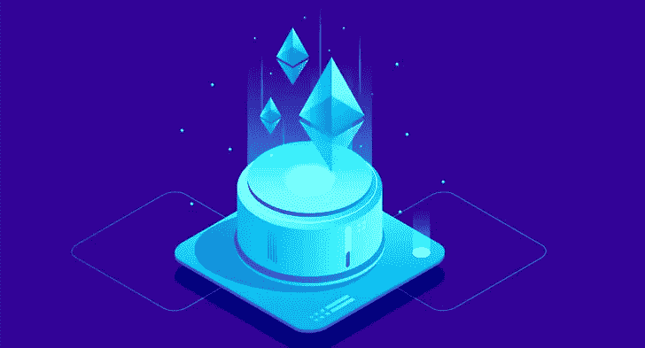
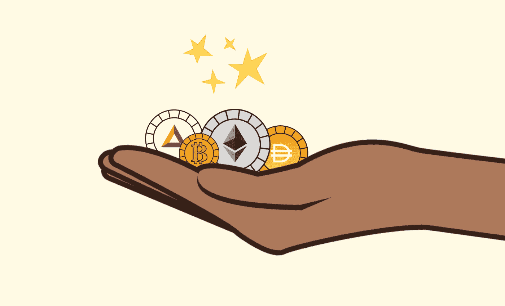
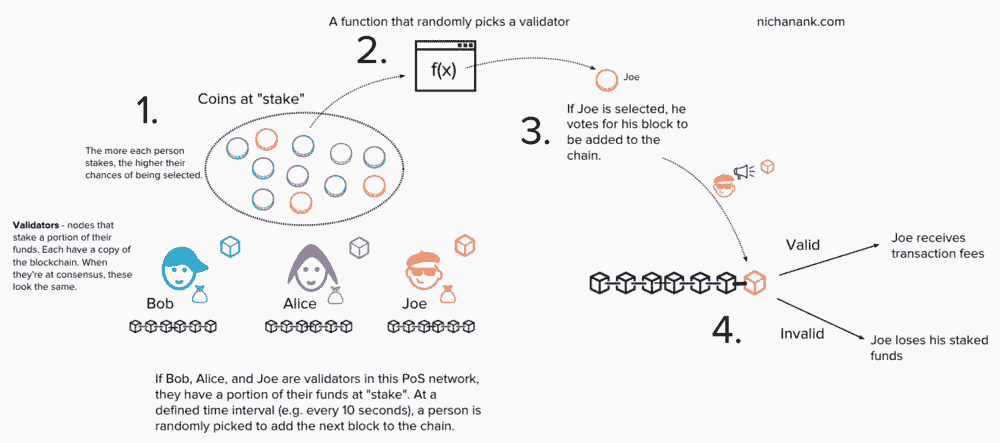
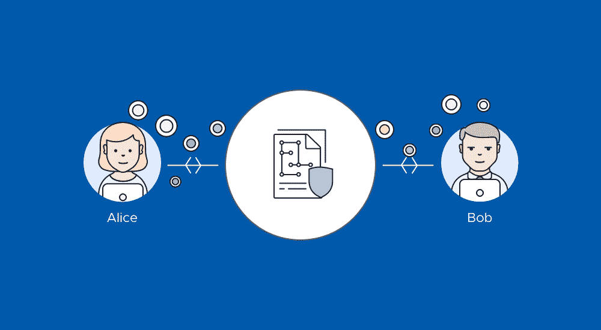
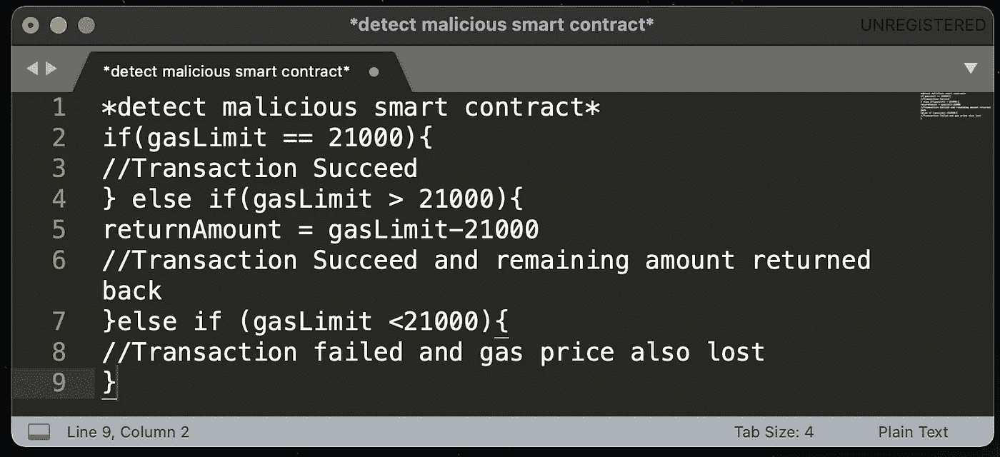

# 以太坊的要旨

> 原文：<https://medium.com/coinmonks/a-gist-of-ethereum-ec5eb145d18a?source=collection_archive---------6----------------------->

这些天来，你经常听到这个词。在过去的几十年里，每个人都对加密货币有很好的认识。正如我们所知，以太坊是一种价值 4613.85 美元的加密货币，令人惊讶的是，谁会为这种不存在的东西支付大约 4000 美元，即使你也感觉不到，但现实是，人们真的在投资它们，也在赚钱。

"*加密货币是一种数字形式的货币，它使用加密技术来保护生成单位、进行交易和验证货币所有权交换所涉及的过程*。*加密货币一般不由任何中央机构发行*、*，这使得它们在理论上不受政府干预或操纵。*

那么，怎么会有人相信这种未经政府或任何可信的中央权力机构授权的事情呢？

答案是……网络背后的共识算法。

2011 年，一位叫 QuantumMechanic 的 Bitcointalk 论坛用户提出了一项技术，他称之为“利害关系证明”。基本思想是利害关系证明使用选举过程，其中随机选择 1 个节点来验证下一个块。

股权证明没有矿工，而是有“验证者”，它不允许人们“开采”区块，而是“铸造”或“伪造”区块。

验证器不是完全随机选择的。要成为验证者，节点必须向网络中投入一定数量的硬币作为赌注。你可以把这当成保证金。赌注的大小决定了验证者被选中来伪造下一个块的机会。

示例— " *假设 Bob 向网络中存入 100 美元，而 Alice 存入 1000 美元。爱丽丝现在有 10 倍的机会被选中来铸造下一个积木。*”

这可能看起来不公平，因为它有利于富人，但实际上它更公平。如果选择一个节点来验证下一个块，他们将检查其中的所有事务是否确实有效。如果一切都检查完毕，该节点将在该块上签字，并将其添加到区块链中。作为回报，该节点接收与每笔交易相关联的费用。

好吧，但是我们如何信任网络上的其他验证者呢？

这就是赌注的来源。如果验证者批准欺诈交易，他们将损失一部分股份。只要赌注高于验证者从交易费用中得到的，我们就可以相信他们会正确地完成工作。因为如果不是这样，他们失去的钱会比他们得到的更多。这是一个财务激励因素，只要赌注高于所有交易费用的总和，这种激励就会持续下去。

如果一个节点不再是验证者，他的股份加上他得到的所有交易费用将在一段时间后被释放。

此外，假设您是任何公司的最大股东，您也希望确保公司的声誉在道德上保持良好，否则人们可能会失去对公司的信任，从而间接影响您所持股份的价值。

**那么以太币只是一种加密货币吗？它和比特币有什么不同？**

不，让以太网与比特币区别开来的主要因素是“智能合约”。

*智能合约是存储在区块链上的简单不变的程序，当满足预定条件时运行。它们通常用于自动执行协议，以便所有参与者可以就结果达成一致，而无需任何中介的参与或时间损失。*

**智能合同是如何工作的？**

智能合约基本上是简单的“如果/当…那么…”语句，它们被写入区块链的代码中。当预定条件得到满足和验证时，计算机网络执行这些动作。这些操作可能包括向相关方发放资金、注册车辆、发送通知或开罚单。

然后，当交易完成时，更新区块链。这意味着交易不可更改，只有获得许可的各方才能看到结果。

开发人员应该仔细编写智能合约，因为为了编译和部署智能合约，它会根据您在智能合约中执行的操作消耗一定量的气体。

每次部署任何智能合约时，发送方都会设置一个特定的金额，每当他们执行智能合约时，他都希望向验证方支付该金额。天然气价格越高，交易开采越快。

开发人员在编写智能合同时应该更加谨慎，如果有人试图在智能合同中添加恶意代码，可能会危及整个网络。油价也解决了这个问题。

交易可以消耗的最大气体量是由发送者设置的单位气体价格和交易气体限制(21，000 单位)的乘积。

> 总费用=发送方设定的每单位天然气价格*交易天然气限额。

结论——"*以太坊也是一个成长的平台。截至 2021 年 4 月，它是世界上第二大区块链。在未来几年，以太坊可能会变得比比特币更大，并被谷歌和脸书这样的大型组织所采用。这主要是因为它的应用范围更广。*”

> 加入 Coinmonks [电报频道](https://t.me/coincodecap)和 [Youtube 频道](https://www.youtube.com/c/coinmonks/videos)了解加密交易和投资

## 另外，阅读

*   [MoonXBT vs Bybit vs 币安](https://coincodecap.com/bybit-binance-moonxbt) | [Arbitrum:第二层解决方案](https://coincodecap.com/arbitrum)
*   [买 PancakeSwap(蛋糕)](https://coincodecap.com/buy-pancakeswap)|[matrix export Review](https://coincodecap.com/matrixport-review)
*   [最佳免费加密信号](https://coincodecap.com/free-crypto-signals) | [YoBit 评论](/coinmonks/yobit-review-175464162c62) | [Bitbns 评论](/coinmonks/bitbns-review-38256a07e161)
*   [OKEx 回顾](/coinmonks/okex-review-6b369304110f) | [Kucoin 交易机器人](/coinmonks/kucoin-trading-bot-automate-your-trades-8cf0ca2138e0) | [期货交易机器人](/coinmonks/futures-trading-bots-5a282ccee3f5)
*   [AscendEx Staking](https://coincodecap.com/ascendex-staking)|[Bot Ocean Review](https://coincodecap.com/bot-ocean-review)|[最佳比特币钱包](https://coincodecap.com/bitcoin-wallets-india)
*   [霍比评论](https://coincodecap.com/huobi-review) | [OKEx 保证金交易](https://coincodecap.com/okex-margin-trading) | [期货交易](https://coincodecap.com/futures-trading)
*   [比特币基地赌注](https://coincodecap.com/coinbase-staking) | [Hotbit 评论](/coinmonks/hotbit-review-cd5bec41dafb) | [KuCoin 评论](https://coincodecap.com/kucoin-review)
*   购买 Dogecoin 的 7 种最佳方式 | [ZebPay 评论](https://coincodecap.com/zebpay-review)
*   [iTop VPN 审查](https://coincodecap.com/itop-vpn-review) | [曼陀罗交易所审查](https://coincodecap.com/mandala-exchange-review)
*   [比特币基地 vs 瓦济克斯](https://coincodecap.com/coinbase-vs-wazirx) | [比特鲁点评](https://coincodecap.com/bitrue-review) | [波洛涅克斯 vs 比特克斯](https://coincodecap.com/poloniex-vs-bittrex)
*   [美国最佳加密交易机器人](https://coincodecap.com/crypto-trading-bots-in-the-us) | [经常性回顾](https://coincodecap.com/changelly-review)
*   [A-Ads 审查](https://coincodecap.com/a-ads-review) | [Bingbon 审查](https://coincodecap.com/bingbon-review) | [Mudrex 投资](https://coincodecap.com/mudrex-invest-review-the-best-way-to-invest-in-crypto)
*   [最好的卡达诺钱包](https://coincodecap.com/best-cardano-wallets) | [Bingbon 副本交易](https://coincodecap.com/bingbon-copy-trading)