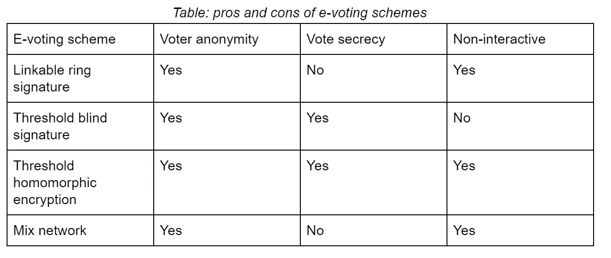

# 区块链政府一瞥

> 原文：<https://medium.com/coinmonks/a-glimpse-of-the-blockchain-governance-system-136ccc2a73cb?source=collection_archive---------0----------------------->

Copyright of Gravitas International

## *关注隐私和安全问题*

*免责声明:本文所表达的观点均为作者个人观点，不一定代表 DFINITY 基金会的官方立场。*

区块链代码库随着时间的推移而演变。为了更新区块链代码，各种利益集团，例如用户、核心开发者和全节点提供商(也称为比特币系统中的矿工)，需要就保留什么和改变什么达成共识。这并不容易，因为这些利益相关者的利益经常相互冲突。为了解决这些问题，每个区块链项目都有一个治理系统来协调参与者之间的冲突，并使他们的激励措施与区块链系统的良性发展保持一致。一般来说，区块链治理体系有两种类型:像比特币和以太坊这样的链外治理和像 Cosmos 和 DFINITY 这样的链上治理。区别在于投票是否在区块链账上进行和记录。

使用链外治理系统，核心开发者通过正式的改进建议(如比特币改进建议、以太坊改进建议)向官方存储库(如 Github)提交协议更新。用户和全节点提供商可以在社区论坛和社交媒体上表达他们的意见，如 slack channel、Telegram 和 Twitter。如果大多数利益团体同意协议更新，则这些更改将被编码到区块链协议中。如果他们不能达成共识，核心开发人员可以撤销这个提议，或者仍然执行协议变更。后者通常会导致硬分叉(例如，2016 年以太坊/以太坊经典的硬分叉和 2017 年比特币/比特币现金的硬分叉)，因为某些全节点提供商可能不会相应地采用协议变更。由于核心开发者和全节点提供商在决策方面比普通用户拥有更大的权力，链外治理系统受到了违反去中心化精神的批评。

一种更分散的治理形式，即链上治理，近年来随着区块链项目的发展而获得了发展势头。PoS 项目通常需要用标记来代表投票权和表决权。因此，用户可以在系统中使用本地令牌，并获得协议更新的投票权。与链外治理系统中的不确定辩论相比，链上治理系统具有更快的决策周转时间。此外，链上治理系统在投票规则被预先定义并提前传达给公众的意义上更加透明。决策制定不受集中实体的控制或解释。此外，由于投票规则嵌入在系统代码中，协议更新在批准后自动实现，这可以在很大程度上阻止硬分叉。

在下文中，我们在非常高的层次上解决链上治理系统的典型设计问题。

# 链上治理的设计

> 提议什么？

建议可以是任何相关的主题，如冻结被黑客攻击的令牌，参数变化，惩罚恶意的全节点提供商等。

> 怎么求婚？

要提交一个提议，需要标上治理系统所需的最小数量的令牌。为了鼓励高质量的提案，如果提案被采纳，股份将被退还并给予奖励(奖励可能来自新铸造的代币或基金会的捐赠)。否则，股份会退还，但不会获得奖励。如果提议被认为是垃圾邮件，则标记的令牌被削减。

> 哪个提议先被投票？

用户可以用他们的代币来支持各种提议。吸引最多支持者的提议被认为是最迫切需要投票表决的。在采纳提议时，将代币奖励分配给提议者(例如 50%)和背书人(例如 50%，与赌注代币的数量成比例)。请注意，主题不太相关的提案吸引的支持者更少，并在稍后阶段获得投票。因为只有在投票之后，被押的代币才被解锁给所有者，所以提议者和支持者面临他们的代币存款的机会成本。这种设计抑制了垃圾邮件提议的提交。或者，系统可以设置提案进入投票阶段所需的最低数量的标记(类似于“我们人民”白宫请愿)。

> 如何获得投票权并保留投票隐私？

为了获得治理系统中的投票权，用户需要在一定时期内将他们的令牌放在系统中。通过这样做，选民在游戏中有了利益，从而有了理性投票的动机。同态加密技术(技术细节见下一节)是保护投票隐私的主流方法之一。投票是加密的，因此只有拥有私人钥匙的选民才能检查自己的投票。投票期结束后，所有的选票将被汇总和统计。只有最终的结果被解密并向公众公开。

> 投票权/报酬是如何衡量的？

投票权随着赌注代币的数量和赌注期限的增加而增加。选民只有参与投票才能获得象征性的奖励。如果代币持有者不投票，赌注本身不会产生任何收益。投票奖励激励选民积极参与治理。

> 如何委托投票？

由于投票耗费时间/精力，并且需要特定领域的专业知识，选民可以将他们的投票委托给其他人(如密码专家、经济学家、关键意见领袖、开发人员、基金会等)，并随时撤回委托(所谓的流动民主)。

> 谁可以投票？

通用投票机构:任何在系统中下注的人都可以投自己的票或委托他人投票。

随机投票机构:每项提案随机选出一定比例的投票人(如 10%)。这样的设计便于并行的多重投票(可扩展的解决方案)。由于投票机构比普遍投票机构小，每次投票对结果的影响更大。所以，被选中的选民更有动力去投票，去认真投票。缺点是更容易在更小的选民群体内部串通。因此，选民选择的随机性对其成功至关重要。

一方面，投票人的数量应尽可能少，以减少所选投票人的投票成本(如研究提案所花费的时间和资源)。另一方面，应该有尽可能多的投票人，以确保投票结果具有代表性，并符合多数令牌持有者的利益。降低意外结果概率的一种方法是采用评估投票。如果投票结果接近(例如在 45%-55%的范围内)，则系统随机选择另一个投票者，例如 5x 个投票者，进行第二轮投票。最终结果取决于两轮投票。

> 如何解决投票权集中的问题？

在现实生活的投票中，财阀可以通过资助他们喜欢的候选人/傀儡和他们的竞选活动来操纵选举。一人一票机制容易受到这种金钱效应的影响。在新开发的技术面前，过去几个世纪设计的现行政治制度已经显示出虚弱和笨拙的迹象。剑桥分析公司丑闻是一个很好的例子，证明了通过瞄准社交媒体用户来影响投票结果的潜力。在区块链治理体系中实行一人一票，富裕的用户/投资者可以购买大量代币，并比现实生活中的一人一票更容易将投票导向自己喜欢的方向。

让投票权更加分散的一个方法是引入灵活的锁定期。用户可以锁定他们的令牌更长时间，以获得更多的投票权。例如，锁定 10 个代币 10 个月的用户可以获得与锁定 100 个代币 1 个月的用户(富裕用户)相同的投票权。长锁定期意味着投票人在游戏中有更多的利益，因此比那些锁定期较短的人更关心系统的长期发展。

另一种使投票权更加分散的方法是用一人一票制取代象征性的一票制。选民可以通过填写政府发放的身份证信息来注册投票账户。注册用户的投票权是未注册用户的 10 倍。也就是说，用户仍然可以选择匿名投票，无需注册账户。然而，与注册账户相比，投票权大打折扣。该系统使用零知识证明技术(在下一节中解释)来防止滥用用户的私人数据。投票权随着帐户中锁定的代币数量而非线性增加。例如，要获得一个单位的投票权，投票人需要在帐户中锁定一个令牌。为了获得十个单位的投票权，投票者需要锁定十个以上的代币(例如 100 个代币对应 10 个单位的投票权，即二次投票)。这样的设计降低了富有代币持有者的投票权。

例如，鲸鱼令牌持有者可以锁定其注册账户中的所有 100 个令牌，并获得 10 个单位的投票权(由于投票权是凹的，假设平方根)。或者，他可以创建 100 个未注册的帐户，每个帐户有 1 个令牌，并再次获得 10 个单位的投票权(未注册帐户的投票权减少了 10 倍)。与他在一个代币一票机制中获得的 100 个单位的投票权相比，富裕的代币持有者的投票权在这种设置中受到很大限制。

在下一节中，我们将重点讨论在线投票的安全性问题，重点是隐私。

# 保护隐私的电子投票

对区块链的投票属于电子投票的范畴(即电子投票)。在密码学文献中，安全电子投票是一个被充分研究的课题。一个先进的高风险电子投票系统需要考虑各种属性，如可验证性、隐私性、对虚假指控的鲁棒性(即，如果选举确实正确进行，则不可能提出选举不正确进行的证据)和可用性等[SR17]。在某些情况下，这些属性可能会相互冲突。

隐私，我们在这一节的重点，是电子投票系统最重要的属性之一，因为如果对手能够识别出投票人如何投票，投票系统可能会变得容易受到腐败和胁迫。因此，一个基本的电子投票方案应该保证其投票私密性和投票者匿名性。

人们提出了许多密码原语来解决电子投票中的隐私问题，如环签名、盲签名、门限同态加密和混合网等。这些技术的简要回顾如下

**戒指签名**

研究最广泛的匿名电子投票密码原语之一是可链接环签名。环签名是 Rivest，Shamir 和 Tauman [RST01]在 2001 年提出的，一次性可链接性[ES07]是后来作为改进加入的。

数字签名通常假定相关方可以通过公钥/私钥对来识别。环签名方案允许隐藏在随机选择的一组人(或公钥环)中的任何签名者生成环签名，而不暴露环中的哪个公钥负责签名生成。因此，它为真实签名者提供了匿名保护。然而，由于签名的消息是公开的，该方案不提供投票保密。

由于环签名隐藏了投票人的身份，投票人可能会多次尝试投票给某个特定的候选人，以增加自己喜欢的候选人赢得投票的几率。一次性可链接性属性旨在确保只要环中的一个特定密钥被使用两次，重复的签名将被链接并因此被判定为非法。

一次可链接环签名可以使用一种特殊的零知识证明来构造，如[GK15]所示，即成员证明。零知识证明是一种协议，允许证明者证明语句的正确性，而不暴露除语句本身之外的任何额外信息。例如，零知识范围证明方案[Lin19]允许证明者证明一个秘密整数属于一个范围，比如说[0，1]，而不透露它是哪个整数。换句话说，验证者在阅读证明后会确信秘密整数是二进制的，而不知道它是 0 还是 1。

**瞎签名**

另一个密切相关的原语是盲签名[C82，FOO92]，它需要一个由组管理器控制的注册阶段。投票包括投票者和管理者之间的交互，从而投票者可以获得管理者发出的不可追踪的空白选票，并以加密/盲形式投票。盲签名保证了投票者的隐私性、投票的保密性和一次性可追踪性。然而，在区块链环境中，需要使用门限盲签名方案来降低群管理者的集中权力。注意这里的“门限”是指使用门限密码技术用多个管理者代替一个群管理者，这样只要他们中的大多数保持诚实，投票者的匿名性和投票的保密性都可以得到保证。

**门限同态加密**

加密方案将明文消息转换为随机字符串，以保护其保密性。一旦消息被加密，在任何运算(例如求和)可以应用于底层消息之前，必须解密密文。但是，在某些应用程序场景中，执行操作的人可能不希望知道底层消息。例如，计票员只需要知道每张选票的总数，而不是每张选票是多少。同态加密是一种特殊的加密机制，它允许任何能够访问消息密文的人同态地执行所需的操作，这意味着对底层消息的操作可以在不解密的情况下执行。

如果每个投票人对特定候选人或声明的投票是使用同态加密来加密的，计票员将能够同态地生成最终投票计数的加密，而无需解密每个个人投票的密文。

注恶意投票者可以通过加密一个大的正数(或负数)而不是二进制投票来增加(或减少)自己喜欢的候选人(或其对手)的获胜(或失败)机会。因此，基于同态加密的电子投票通常伴随着一个零知识范围证明，它可以证明一个秘密数是二进制的，而不暴露确切的投票。另一个挑战是，任何拥有同态加密方案的秘密密钥的实体都能够解密所有的投票。因此，需要一种门限同态解密机制来将解密能力分散给一组实体。

**混网**

Mix network 使用几个独立的服务器来混洗加密选票的输入并输出明文选票。然而，人们必须假设这些混合服务器中至少有一个诚实地执行秘密排列，以保证投票者匿名。

更具体地说，mix 网络通常采用分层加密，在一系列公钥下对原始投票进行加密，每个公钥对应于一个中间 mix 节点。每个中间混合节点将接收多个密文，使用其秘密密钥去除一层加密，并在随机排列后将消息发送到下一个节点。因此，只要 mix 节点中至少有一个保持诚实，就可以在一定程度上保证投票者匿名性。但是，由于所有的投票都是以明文形式交付给计票员的，mix network 并不能保证投票的保密性。

下表展示了这些技术的优缺点。

# 讨论

区块链项目是复杂的系统，会随着时间的推移而演变。它们由规则和定义如何改变规则的规则来管理。在设计治理规则时，需要记住以下基本问题。什么定义了有效的投票人及其投票权？谁可以发起提案？投票提案的资格是什么？法定人数是多少？如何定义投票结果？如何改变投票规则？

最终，问题归结为核心原则:如何设计一个治理体系来确保区块链项目的长期繁荣发展。成功的秘诀是使大多数参与者的利益与项目的利益一致。

> *作者:*
> 
> **(yulinzurich @ Gmail . com)，目前在 DFINITY 领导代币经济学和治理体系的研究。他还担任华中科技大学附属经济学教授。玉林专攻货币理论、银行监管、加密货币、代币经济学和区块链治理体系。他拥有苏黎世联邦理工学院的量子计算硕士学位和经济学博士学位。榆林是欧洲中央银行系统的访问学者，并被邀请在世界各地的主要中央银行和会议上发表演讲。**
> 
> ***(LH @ sutersu . io)，目前担任*[*sutersu*](https://www.suterusu.io/)*项目 CTO。黄是一名训练有素的应用密码学家。黄分别在上海交通大学和佛罗里达大学获得应用密码学和隐私保护分布式系统的博士学位。他曾在瑞士联邦理工学院(EPFL)担任博士后研究员，然后在香港 ASTRI 担任副首席工程师。他发表了 20 多篇关于应用密码学和信息安全的论文* [*和 1000 多篇引文。*](https://scholar.google.com/citations?user=udEm4E8AAAAJ&hl=en)**

# **参考**

**里维斯特、罗纳德·l·阿迪·萨莫尔和耶尔·陶曼。“如何泄露秘密。”*密码学与信息安全理论及应用国际会议*。施普林格，柏林，海德堡，2001。**

**藤崎琴音，荣一郎，还有库塔鲁·铃木。"可追踪的戒指签名。"*公钥密码学国际研讨会*。施普林格，柏林，海德堡，2007。**

**d .乔姆。无法追踪的支付的盲签名。D. Chaum、R. Rivest 和 A. Sherman 编辑，CRYPTO '82，第 199-204 页。普雷南出版公司，1982 年。**

**[92]a .藤冈、t .冈本和 k .太田。一种实用的大规模选举秘密投票方案。在 AUSCRYPT 91，第 244-260 页。施普林格出版社，1992 年。LNCS 第 718 卷。**

**公园、苏诺和罗纳德·L·李维斯特。"迈向安全的二次投票"*公选*172.1–2(2017):151–175。**

**Groth，Jens 和 Markulf Kohlweiss。"多证合一:或者如何泄露秘密，花一枚硬币."密码技术理论与应用国际年会。施普林格，柏林，海德堡，2015。**

**林医生。苏特苏黄纸 1.0。[https://github.com/suterusu-team/Suter_yellowpaper](https://github.com/suterusu-team/Suter_yellowpaper)。**

> **[直接在您的收件箱中获得最佳软件交易](https://coincodecap.com/?utm_source=coinmonks)**

****