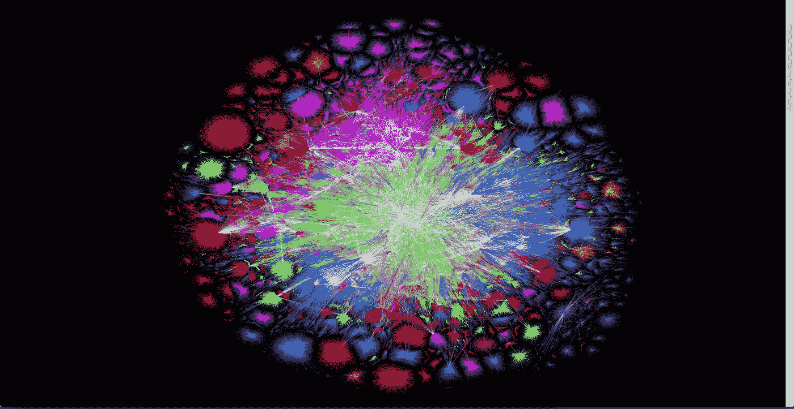
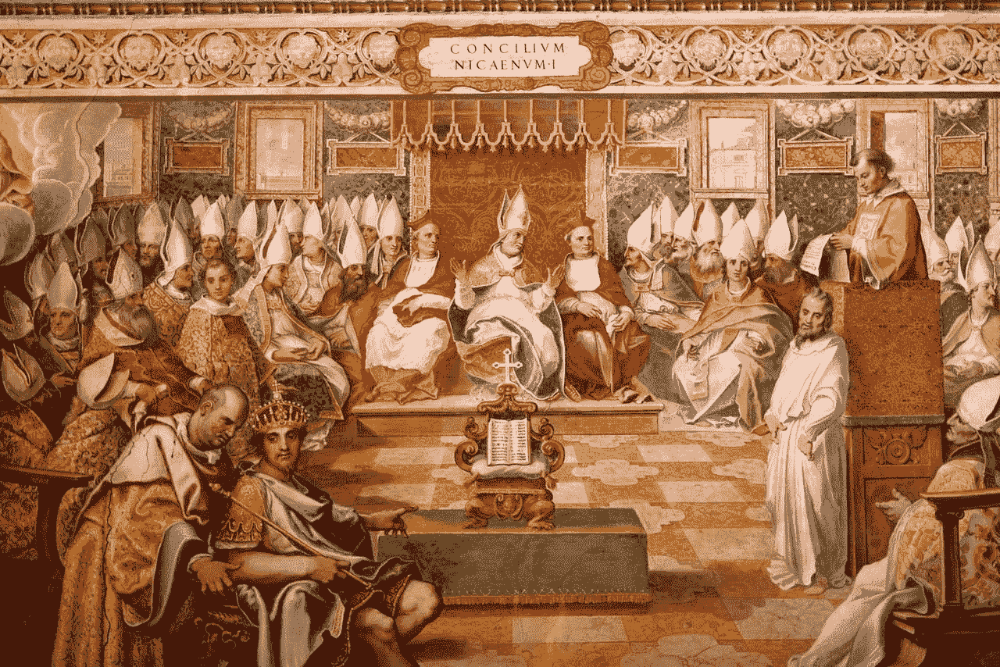
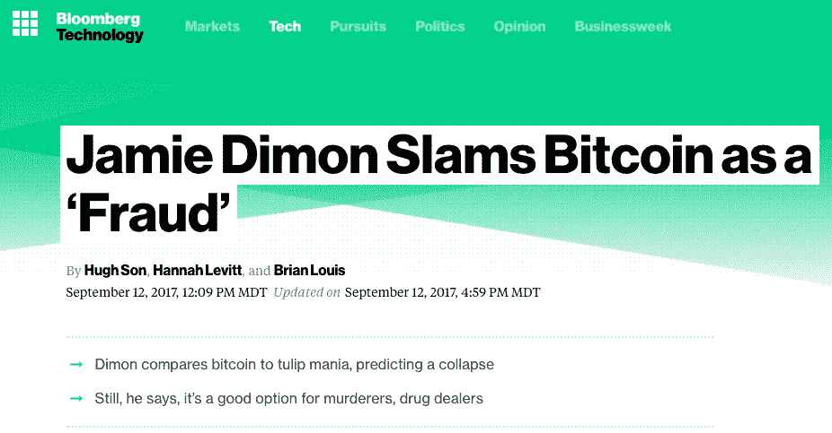
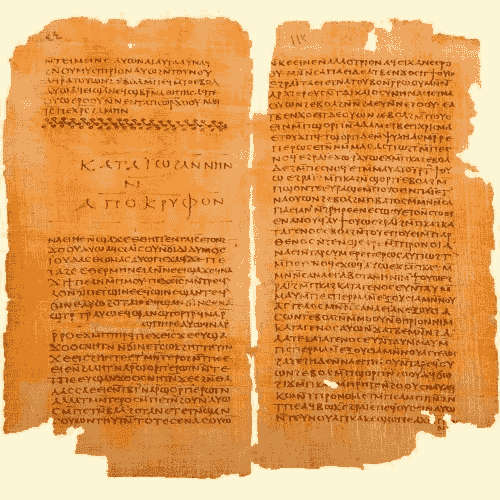
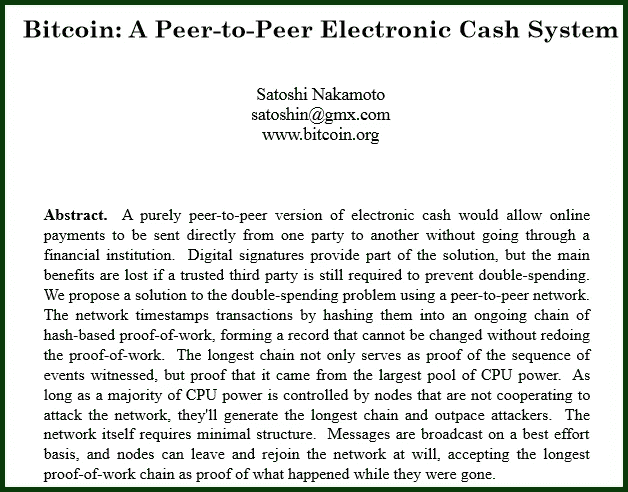
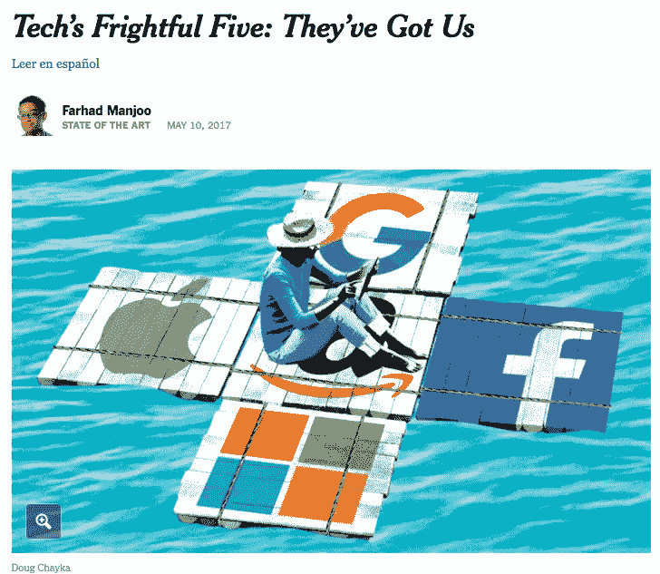
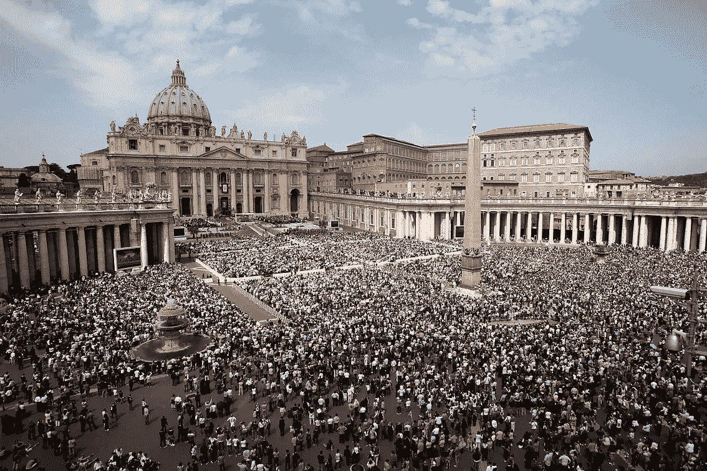
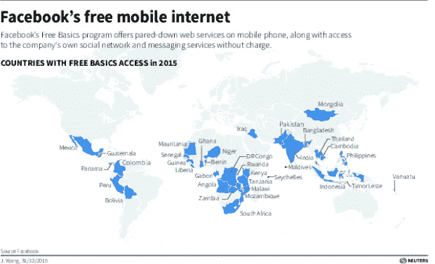

# 诺斯替派的互联网

> 原文：<https://medium.com/coinmonks/a-gnostic-internet-3a683dfd89fd?source=collection_archive---------1----------------------->

[THE INTERNET 2015 via the Opte Project](http://www.opte.org/about/)

这始于一个名为 [*公会*](http://guildblog.com) *的博客应用上的第一篇帖子，由去中心化互联网的先驱*[*block stack*](https://blockstack.org/)*提供支持。*

Blockstack 旨在从根本上改变我们作为数字公民在数字领域中的互动方式。在许多方面，Blockstack 和类似的倡议将互联网带回了它的初衷——帮助我们相互联系、分享知识和繁荣发展。

> Blockstack 的基本概念是创建一个数字环境，其中数字应用程序独立于您的数据而存在。

我通过神学框架解读 Blockstack 对互联网的看法。我没有公开的宗教信仰，但一直对技术如何影响我们当代生活的历史回声着迷。我发现当前权力下放的紧张局势类似于早期组织基督教信仰的斗争。

数字货币的市值最近超过了 2000 亿美元，是由一个假名实体介绍给我们的，这应该为从理性到精神的转变提供了足够的理由，比验证比特币交易所需的时间更短。

Gnosis [via the 1987 BBC Documentary Gnostics: Knowledge of the Heart](https://www.youtube.com/watch?v=t6RLWbOSvUw)

诺斯替主义可以被认为是基督教早期众多*中的一个。诺斯替主义的主要原则强调并集中于个人通过发现灵知或知识来实现拯救的能力和潜力。让我们称之为*真相数据库。**

*诺斯替派相信每一个人都有意识到上帝的能力。*

*用区块链的话来说，这意味着每个人都包含了挖掘*真相数据库*所需的所有*力量，我们所需要的只是一个特定的协议来管理我们的身体&精神行为以获得这个真相数据库。**

**这些教义与当时的统一和集权力量背道而驰，以组织耶稣基督的神秘教义。这些组织力量导致了一种精神上自上而下的官僚形式，后来扩展到许多层的中间人(教皇、红衣主教、主教、牧师、修女等)。)他承诺了一条通往真理的道路。**

**这个有组织的教会存在的前提是，个人是不完整的，需要一些第三方的支持来与 TruthDB 联系。**

**另一方面，诺斯替主义是基于个人预先存在的精神完整性，如果他们能够发展向内看的方式并发现真理 DB 又名精神 [*采矿*](https://bitcoin.org/en/glossary/mining) 就可以实现。我没有提到诺斯替派不太受欢迎的信仰，包括素食主义，女性精神平等的提升，以及对人类生殖的某种轻蔑。**

**因此，毫不奇怪，诺斯替主义被定为异端邪说，被西方历史上的主教、教皇和十字军积极消灭，因为它对上述精神官僚构成了生存威胁。**

****

**The Council of Nicea in 325 AD presided by the Roman Emperor Constantine, with the purpose of defining the nature of God for all of Christianity and eliminating confusion, controversy, and contention within the church — I see this [similar to a Hard Fork in crypto currency politics](https://bitcoin.org/en/glossary/hard-fork).**

**[Bishop of now Lyon, France — Irenaeus wrote “Against Heresies” in the 2nd century AD to argue against Gnostic beliefs and clarify the Biblical Canon.](https://en.wikipedia.org/wiki/On_the_Detection_and_Overthrow_of_the_So-Called_Gnosis)**

********

**[(L) Bishop Iraneus on the Gnostic Gospels](https://books.google.com/books?id=BWvxehGJ6Q0C&lpg=PT52&ots=IyuOex7KBJ&dq=irenaeus%20%22fraud%22%20gnostics&pg=PT52#v=onepage&q&f=false) (R) [A contemporary bishop of the financial church against the heresies of a decentralized currency.](https://www.bloomberg.com/news/articles/2017-09-12/jpmorgan-s-ceo-says-he-d-fire-traders-who-bet-on-fraud-bitcoin)**

# **原始发现**

**1945 年，一个埃及农场男孩在尼罗河的死水边发现了[纳格哈马迪*纸莎草纸*](https://en.wikipedia.org/wiki/Nag_Hammadi_library) ，这被认为是考古学上的重大发现。据称，手抄本包含了一些耶稣基督教导的最早记录，并形成了诺斯替福音的基础，它给来之不易的和钙化的圣经解释带来了许多问题。**

********

**(L) Gnostic gospels discovered at Nag Hammadi (R) Bitcoin Whitepaper discovered at metzdowd.com**

**2009 年题为“比特币:一个点对点的电子现金系统”的 hitepaper 是在类似的“数字河流”( digital rivers)的死水中发现的，这是一个名为 metzdowd.com 的赛博朋克邮件列表，它给我们今天所知的金融系统来之不易且日益僵化的解释带来了问题。**

# **教会互联网**

**在我和许多其他人眼里；亚马逊、苹果、脸书、谷歌、微软和民族国家越来越演变成梵蒂冈规模的巨型教堂的数字等价物。**

********

**[(L) Digital monopoles](https://www.nytimes.com/2017/05/10/technology/techs-frightful-five-theyve-got-us.html) ; (R) Spiritual Monopoly.**

**这些数字巨型教堂为我们提供了非常需要的数字服务，但依赖于我们交出我们的数字身份和个人数据，这些数据反过来被汇总和分析，以影响我们的偏好，并越来越多地影响我们对现实的看法。 [**(#Fakenews)**](https://twitter.com/hashtag/fakenews)**

**他们对我们掌握的越多，他们就越强大，就越能说服那些与我们无关的人。**(#**[**free basics**](https://www.nytimes.com/video/technology/100000005082185/how-facebook-is-changing-your-internet.html)**)****

********

**Digital Megachurch in context. H/T BusinessInsider + Reuters**

**这些*教皇、主教、牧师、修女和我们数字垄断的中间人*&大教堂通过数字手段编造光荣的救赎故事(*通常嵌入 cookiess 中，这些 cookie 会捕获你的个人数据并跟踪你的在线行为*)。很容易将这些与圣餐时分发的薄饼和圣餐面包相提并论，但我可能会夸大其词。**

********

**(L) Facebook cookies keeping tabs on you (R) Sacramental cookie that preserves faith through ritual. The comparison may be unfair but tempting. Apologies.**

**这些中间人还包括庞大的网络安全军事工业联合体，他们在动机和协调方面扮演的角色与十字军战士没有什么不同，我敢说*卡尔塞瓦斯、圣战者*以及类似的实体，他们通过保护我们免受外国黑客的攻击来掠夺我们的数字生活。**

**教会互联网中的数字拯救是通过在家长式的圆形监狱中和谐相处来实现的，这种监狱迫使我们与我们的数字统治者保持顺从的关系，这些统治者承诺保护我们的数字身份和个人数据，作为向我们提供 TruthDB 服务的条件。这不一定是互联网的工作方式。**

# **走向诺斯替的互联网**

> **互联网最初的愿景是任何人都可以上网，任何人都可以直接与他人交流。**
> 
> **- Ryan Shea BlockStack 联合创始人**

**如果我们的数字生活，就像我们的精神生活一样，与身份问题有着内在的联系，那么互联网的诺斯替版本提供了一种基于强调个人控制我们的数字身份和个人数据的数字生活。**

**via [Blockstack.org](https://blockstack.org/videos/reason-tv-blockstack-a-new-internet-that-brings-privacy-property-rights-to-cyberspace)**

**诺斯替互联网上的数字拯救意味着接受这样的认知:我们的身份和数据在我们的控制之下，我们可以参与一种叙事，确保与更大的小型服务提供商社区进行数字交流。**

**只有时间会告诉我们是否会看到另一个数字宗教裁判所，以消灭网络上诺斯替思想的复活，或者这一次，大型教会是否会淡出人们的视线，为我们提供共同繁荣的手段和目标。**

## ****从神学角度看待去中心化互联网的动机:****

*   **Union Square Ventures 合伙人 [Albert Wenger 的](https://www.youtube.com/watch?v=LgQT874KHuw)关于知识分散化的演讲使用了**动机 x 协调**框架来描述分散化知识结构的激励、机会和局限性。**
*   **[**伏尔泰的《私生子:西方的理性独裁》**和**加拿大哲学家约翰·拉尔斯顿·索尔写的《论平衡》**，这些都是我最早接触到的人文主义学派的作品。](http://www.johnralstonsaul.com/non-fiction-books/)**
*   **Sam Frank 的《硅谷的权力和偏执》，Harpers 杂志，2015 年 1 月。**
*   **[关于分散的地方街道维护**的想法**每个城市街道都被指定一个金融机构来控制和管理其自身的寿命。](/a-r-g-o/self-repairing-streets-using-smart-contracts-6b2b7461880e)**
*   **[Gaia.com 的**古文明**](https://www.gaia.com/series/ancient-civilizations)**
*   **BBC 1987 年的**灵知派:心灵的知识****
*   **丹·卡林的《凯尔特大屠杀》详细描述了高卢人的分权结构和罗马人的集权国家。**
*   **[维尔纳·赫尔佐格的《瞧吧:互联世界的遐想》](https://www.youtube.com/watch?v=Zc1tZ8JsZvg)**

> **[直接在您的收件箱中获得最佳软件交易](https://coincodecap.com/?utm_source=coinmonks)**

****