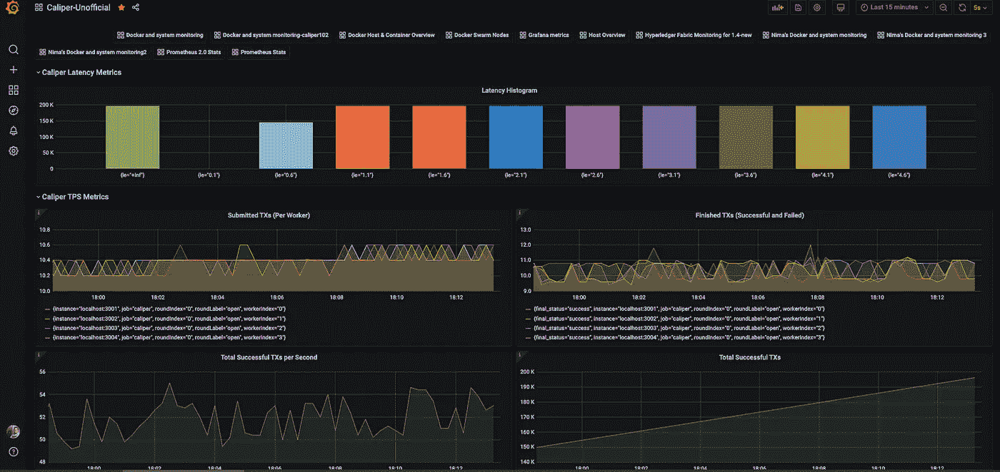

# 用于 Hyperledger Caliper 交易绩效指标的 Grafana 仪表板

> 原文：<https://medium.com/coinmonks/a-grafana-dashboard-for-hyperledger-caliper-transaction-performance-metrics-e74ee768ef0c?source=collection_archive---------1----------------------->

在之前的帖子中，我们看到了如何使用 Prometheus & Grafana 监控 Hyperledger Fabric Docker 容器。

[](/@nima.afraz/monitoring-hyperledger-fabric-docker-containers-with-prometheus-grafana-90916fb64318) [## 使用 Prometheus & Grafana 监控 Hyperledger 织物码头集装箱

### Hyperledger Fabric 应用程序由多个容器组成，这些容器包含具有不同角色的组件(例如…

medium.com](/@nima.afraz/monitoring-hyperledger-fabric-docker-containers-with-prometheus-grafana-90916fb64318) 

从那时起，Hyperledger Caliper 项目的开发人员引入了新的 [Prometheus](https://prometheus.io/) 观察器，允许暴露与基准交易相关的细粒度指标。
这些指标包括:

```
caliper_tx_submitted (counter)caliper_tx_finished (counter)caliper_tx_e2e_latency (histogram)
```

能够可视化这些指标将帮助您更好地理解和分析您的被测系统(SUT)在不同事务负载下的行为。

[](https://grafana.com/grafana/dashboards/13405) [## Hyperledger 卡尺(Grafana 的非官方仪表板

### Hyperledger Caliper 的非官方交易指标仪表板

grafana.com](https://grafana.com/grafana/dashboards/13405) 

您可以使用以下 Id 将此仪表板直接导入 Grafana:

```
13405
```

或者[下载 JSON](https://grafana.com/api/dashboards/13405/revisions/1/download)

秘诀一:

如果你像我一样在本地运行 Caliper(而不是使用 docker 镜像)，你必须让 Prometheus 知道在 Prometheus 配置文件中把网络改为主机模式( *network_mode: "host"* ):

```
/caliper-benchmarks/networks/prometheus-grafana/docker-compose-fabric.yaml
```

秘诀 2:

如果您计划为 Caliper 基准测试创建多个工作进程，您必须将它们作为 Prometheus 目标添加到以下文件中:

```
/networks/prometheus-grafana/prometheus/prometheus-fabric.yml
```

## 另外，阅读

*   最好的[密码交易机器人](/coinmonks/crypto-trading-bot-c2ffce8acb2a)
*   [Deribit Review](/coinmonks/deribit-review-options-fees-apis-and-testnet-2ca16c4bbdb2) |选项、费用、API 和 Testnet
*   [FTX 密码交易所评论](/coinmonks/ftx-crypto-exchange-review-53664ac1198f)
*   最好的比特币[硬件钱包](/coinmonks/the-best-cryptocurrency-hardware-wallets-of-2020-e28b1c124069?source=friends_link&sk=324dd9ff8556ab578d71e7ad7658ad7c)
*   [密码本交易平台](/coinmonks/top-10-crypto-copy-trading-platforms-for-beginners-d0c37c7d698c)
*   最好的[加密税务软件](/coinmonks/best-crypto-tax-tool-for-my-money-72d4b430816b)
*   [最佳加密交易平台](/coinmonks/the-best-crypto-trading-platforms-in-2020-the-definitive-guide-updated-c72f8b874555)
*   最佳[加密贷款平台](/coinmonks/top-5-crypto-lending-platforms-in-2020-that-you-need-to-know-a1b675cec3fa)
*   [莱杰 vs 特雷佐](/coinmonks/ledger-vs-trezor-best-hardware-wallet-to-secure-cryptocurrency-22c7a3fd391e)
*   [block fi vs Celsius](/coinmonks/blockfi-vs-celsius-vs-hodlnaut-8a1cc8c26630)vs Hodlnaut
*   [Bitsgap 评论](/coinmonks/bitsgap-review-a-crypto-trading-bot-that-makes-easy-money-a5d88a336df2)——一个轻松赚钱的加密交易机器人
*   [Quadency Review](/coinmonks/quadency-review-a-crypto-trading-automation-platform-3068eaa374e1) -专为专业人士打造的加密交易机器人
*   [PrimeXBT 审查](/coinmonks/primexbt-review-88e0815be858) |杠杆交易、费用和交易
*   [HaasOnline 评论](/coinmonks/haasonline-review-d8d1a3400419)享受九折优惠
*   Bitmex 的[保证金交易指南](/coinmonks/the-idiots-guide-to-margin-trading-on-bitmex-dbbd7742c6fc?source=friends_link&sk=7bfa99d2a181142510c8442c8ddb0786)
*   [eToro 评论](/coinmonks/etoro-review-78807ddeb33c) |交易股票、密码、交易所交易基金、差价合约和商品
*   [Bitmex 高级保证金交易指南](/coinmonks/bitmex-advanced-margin-trading-guide-2270c195ce25?source=friends_link&sk=1d986cca731f5084b9a2db4a4bc4a7ad)
*   [开发人员的最佳加密 API](/coinmonks/best-crypto-apis-for-developers-5efe3a597a9f)
*   [加密套利](/coinmonks/crypto-arbitrage-guide-how-to-make-money-as-a-beginner-62bfe5c868f6)指南:新手如何赚钱
*   顶级[比特币节点](https://blog.coincodecap.com/bitcoin-node-solutions)提供商
*   最佳[加密制图工具](/coinmonks/what-are-the-best-charting-platforms-for-cryptocurrency-trading-85aade584d80)
*   了解比特币的[最佳书籍有哪些？](/coinmonks/what-are-the-best-books-to-learn-bitcoin-409aeb9aff4b)

> [直接在您的收件箱中获得最佳软件交易](https://coincodecap.com?utm_source=coinmonks)

[](https://coincodecap.com?utm_source=coinmonks)